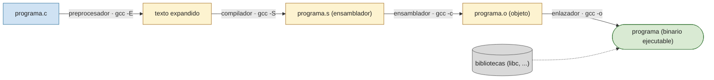

# P0 — Shell y herramientas

## Objetivo

Familiarizarse con el entorno de trabajo del curso: el sistema operativo Linux, el intérprete de comandos (shell) y el lenguaje C, incluyendo el ciclo de compilación y las herramientas de depuración y análisis que se usarán durante el semestre. 

## Comandos comunes

### Compresión

| Comando | Uso |
|---------|-----|
| `tar` | Empaqueta y comprime. Recomendado: `tar czfv <destino>.tar.gz <origen>` |
| `gzip` / `gunzip` | Comprime / descomprime un fichero |
| `zip` / `unzip` | Comprime / descomprime en formato ZIP |

### Procesos

| Comando | Uso |
|---------|-----|
| `ps` | Lista procesos en ejecución. Habitual: `ps axu | more` |
| `top` | Procesos ordenados por consumo de recursos |
| `kill` | Envía una señal a un proceso. `kill -9 <pid>` (incondicional), `kill -HUP <pid>` (reinicio) |
| `killall` | Como `kill`, pero por nombre a un conjunto de procesos |

### Ficheros y directorios

| Comando | Uso |
|---------|-----|
| `ls` | Lista contenido. `-l` (formato largo), `-a` (ocultos), `-R` (recursivo) |
| `cd [dir]` | Cambia de directorio. Sin argumento vuelve a `$HOME` |
| `pwd` | Imprime el directorio de trabajo actual |
| `cp [-r] <origen> <destino>` | Copia ficheros o directorios |
| `mv <origen> <destino>` | Mueve o renombra |
| `mkdir <dir>` | Crea un directorio |
| `rm [-r] [-f] [-i] <fichero>` | Borra ficheros o directorios |
| `rmdir <dir>` | Borra un directorio vacío |
| `chmod <modo> <fichero>` | Cambia permisos: `chmod 640 f` u `chmod g+r f` |
| `chown <usuario>.<grupo> <fichero>` | Cambia propietario y grupo |
| `touch [-c] <fichero>` | Actualiza la fecha o crea un fichero vacío |
| `ln -s <objetivo> <nombre_enlace>` | Crea un enlace simbólico |

### Tratamiento de ficheros de texto

`cat` (concatena y muestra), `more` / `less` (paginación), `file` (tipo de fichero), `wc` (cuenta líneas/palabras/caracteres), `sort` (ordena líneas), `head` / `tail` (primeras / últimas líneas, 10 por defecto), `grep <patrón>` (líneas que casan un patrón), `find` (busca ficheros), `diff` (diferencias), `man <comando>` (manual).

### Permisos de ficheros

Cada fichero tiene tres ternas de permisos (usuario, grupo, otros), cada una con lectura (`r`), escritura (`w`) y ejecución (`x`). En notación octal cada terna es un dígito: `rw- r-- ---` → `110 100 000` → `640`.

Forma simbólica: `chmod <u|g|o> <+|-> <r|w|x> <fichero>`, p. ej. `chmod g+r fichero.o`.

## Lenguaje C y ciclo de compilación

Editor (`nano`, `gedit`, `vi`…), compilador `gcc` y depurador (`gdb`, `ddd`).

```bash
gcc -Wall -Wextra -o programa programa.c        # compilación directa a binario
gcc -E programa.c            # solo preprocesador
gcc -S programa.c            # genera ensamblador (.s)
gcc -c programa.c            # genera objeto (.o), sin enlazar
gcc -o programa programa.o   # enlaza el objeto en un binario
```



## Herramientas

- **tmux** — multiplexor de terminales: varias terminales (paneles/ventanas) en una sola sesión, persistente aunque se cierre la conexión.
- **gdb** — depurador: puntos de ruptura (`break`), ejecución paso a paso (`next`, `step`), inspección de variables (`print`), pila de llamadas (`backtrace`).
- **strace** — traza las llamadas al sistema que ejecuta un programa: `strace ./programa`.

## Ejercicios propuestos

1. Escribir un fichero de bienvenida personalizado: al ejecutarse debe pedir el nombre del usuario y presentar en pantalla un mensaje de bienvenida dedicado a ese usuario.
2. Escribir un menú con cuatro opciones para elegir las cuatro operaciones básicas (suma, resta, multiplicación y división). Usar `switch`. Con cada opción se muestra un mensaje que indica la operación elegida.
3. Programa que imprima en pantalla, en orden decreciente, tres números enteros introducidos por teclado.
4. Un *centro numérico* es un número que separa la lista de enteros `1..N` en dos grupos cuyas sumas son iguales. El primer centro numérico es el 6, que separa `(1,2,3,4,5)` y `(7,8)`, ambos con suma 15. El segundo es el 35, que separa `1..34` y `36..49`, ambos con suma 595. Escribir un programa que halle los centros numéricos entre 1 y N, con N introducido por teclado y menor de 7000. Usar una función que compruebe si un número es centro numérico y otra que devuelva la suma de los números de cada grupo.
