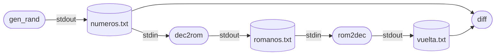
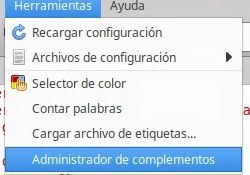
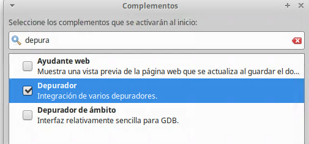
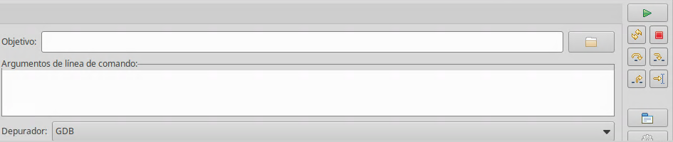
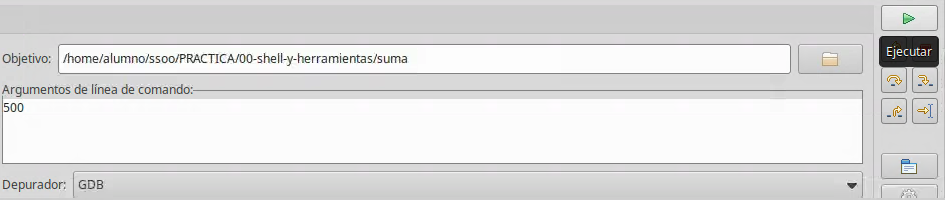
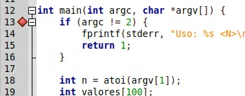
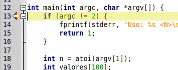
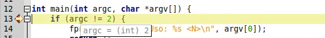
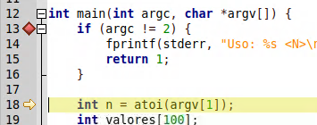

# P0 — Shell y herramientas

## Objetivo

Familiarizarse con el intérprete de comandos (shell) y el ciclo de un programa C — **editar, compilar, ejecutar y depurar**.

## Cómo abrir una terminal

La terminal es una ventana donde se escriben comandos, uno por línea, y se pulsa `Enter` para ejecutarlos.

- Atajo de teclado: `Ctrl+Alt+T` (puede variar).
- Icono **Terminal** en la barra de aplicaciones o en el menú de aplicaciones (categoría *Sistema* / *Accesorios*).
- Desde el explorador de archivos: clic derecho sobre una carpeta → *Abrir en un terminal*.
- Dentro de VS Code: menú *Terminal → Nuevo terminal*, o `` Ctrl+` ``.

### El prompt

Al abrirla aparece una línea, el *prompt*, que indica que la shell espera un comando:

```
usuario@equipo:~$
```

<details> <summary> significado del prompt </summary>

| Parte | Significado |
|-------|-------------|
| `usuario` | tu nombre de usuario (el mismo que devuelve el comando `whoami`) |
| `equipo` | nombre de la máquina o *hostname* (el de `hostname`) |
| `~` | directorio de trabajo actual; `~` es tu carpeta personal, `/home/usuario` |
| `$` | shell lista, usuario sin privilegios (`#` si fueras `root`) |
</details>

## Moverse por directorios y mirar ficheros

| Comando | Uso |
|---------|-----|
| `pwd` | imprime el directorio de trabajo actual (*print working directory*) |
| `ls` | lista el contenido del directorio. `ls -l` formato largo (permisos, tamaño, fecha), `ls -a` incluye ocultos, `ls -la` ambos |
| `cd <dir>` | cambia de directorio. `cd ..` sube uno, `cd` o `cd ~` va a tu carpeta personal, `cd -` vuelve al anterior |
| `cat <fichero>` | vuelca el contenido completo de un fichero en la terminal |

<details><summary> Otros comandos: </summary>

| Comando | Uso |
|---------|-----|
| `man <comando/funcion>` | manual del comando o función |
| `more <fichero>` | muestra el fichero **página a página**: `Espacio` avanza, `Enter` una línea, `q` sale |
| `less <fichero>` | como `more` pero también permite retroceder y buscar (`/patrón`); `q` sale |
| `head` / `tail` | primeras / últimas líneas (10 por defecto); `tail -f` sigue un fichero que crece |
| `clear` | limpia la pantalla (`Ctrl+L` hace lo mismo) |
</details>


**Atajos** importantes de la **shell**:

- **`Tab`**: autocompleta nombres de comandos y de ficheros. Doble `Tab` lista las opciones posibles.
- **`↑` / `↓`**: recorren los comandos anteriores. `history` los lista todos.
- **`Ctrl+C`**: interrumpe el programa en ejecución (le manda la señal `SIGINT`).
<details><summary> otros: </summary>

- **`Ctrl+Z`**: suspende el programa en ejecución (`SIGTSTP`) y devuelve el prompt; luego comandos `fg` lo reanuda en primer plano y `bg` en segundo plano.
- **`Ctrl+\`**: como `Ctrl+C` pero con `SIGQUIT`, que además genera un *coredump* para depurar.
</details>

## Procesos

Un programa en ejecución es un *proceso*, identificado por un número (PID).

<details> <summary> Comandos para procesos: </summary>

| Comando | Uso |
|---------|-----|
| `ps` | lista procesos. Habitual: `ps -u $USER` (solo los míos) |
| `pstree` | muestra en árbol (`pstree -p` añade el pid) |
| `top` | procesos en tiempo real; `q` sale |
| `kill <pid>` | manda `SIGTERM` (15): pide al proceso que termine. `kill -9 <pid>` manda `SIGKILL` (9), termina el proceso |
| `killall <nombre>` | como `kill` pero por nombre en vez de pid|
<!--| `jobs` / `fg` / `bg` | procesos lanzados en segundo plano con `&` desde esta terminal |-->
</details>

## Referencia rápida de comandos

### Ficheros y directorios

<details> <summary> Comandos: </summary>

| Comando | Uso |
|---------|-----|
| `cp [-r] <origen> <destino>` | copia ficheros o directorios (`-r` recursivo) |
| `mv <origen> <destino>` | mueve o renombra |
| `mkdir <dir>` | crea un directorio |
| `rm [-r] [-f] [-i] <fichero>` | borra ficheros o directorios |
| `rmdir <dir>` | borra un directorio vacío |
| `touch <fichero>` | crea un fichero vacío o actualiza su fecha |
| `chmod <modo> <fichero>` | cambia permisos: `chmod 640 f` u `chmod g+r f` |
| `chown <usuario>:<grupo> <fichero>` | cambia propietario y grupo |
| `ln -s <objetivo> <enlace>` | crea un enlace simbólico |
</details>

### Texto y búsqueda

<details> <summary> Comandos: </summary>

| Comando | Uso |
|---------|-----|
| `file <fichero>` | tipo de fichero |
| `wc` | cuenta líneas/palabras/caracteres |
| `sort` | ordena líneas |
| `grep <patrón>` | líneas que casan un patrón |
| `find` | busca ficheros |
| `diff` | diferencias entre dos ficheros |

```bash
file hola                    # -> "ELF 64-bit ... executable" (tras compilar hola.c, ver sección Compilar)
wc -l hola.c                 # número de líneas del fichero
grep printf hola.c           # líneas que contienen "printf"
grep -rn "int main" .        # búsqueda recursiva, con número de línea
find . -name "*.c"           # todos los .c bajo el directorio actual
sort primos.c                # ordena alfabéticamente las líneas del fichero
diff hola.c saluda.c         # diferencias línea a línea entre dos ficheros
```
</details>

### Compresión

<details> <summary> comandos: </summary>

| Comando | Uso |
|---------|-----|
| `zip` / `unzip` | comprime / descomprime en formato ZIP |
| `tar` | empaqueta y comprime: `tar czvf <destino>.tar.gz <origen>`; extrae: `tar xzvf <fichero>.tar.gz` |
| `gzip` / `gunzip` | comprime / descomprime un fichero |
</details>

### Permisos de ficheros

Cada fichero tiene tres permisos (usuario, grupo, otros), cada uno se puede fijar con lectura (`r`), escritura (`w`) y ejecución (`x`). Normalmente representado en octal, por ejemplo 777 es rwxrwxrwx lectura, escritura y ejecución para todos, 640 es rw-r----- el propietario lee y escribe, el grupo solo lee, el resto nada.

Se pueden consultar con `ls -al`.

- **usuario**: el propietario del fichero.
- **grupo**: un grupo de usuarios. Se consulta con `ls -l` (columna del grupo) o `groups`.
- **otros**: cualquier usuario .


<details> <summary> chmod para cambiar permisos </summary>

`chmod` se utiliza para cambiar los permisos de los ficheros `chmod <quién><operador><permiso> <fichero>`.

- **quién**: `u` (usuario/propietario), `g` (grupo), `o` (otros), `a` (todos)
- **operador**: `+` añade el permiso, `-` lo quita, `=` lo deja exactamente así (y quita el resto)
- **permiso**: `r`, `w`, `x`; se pueden combinar, p. ej. `rw`

```bash
chmod u+x programa      # añade ejecución al propietario (típico tras compilar o crear un script)
chmod go-w fichero.txt  # quita escritura a grupo y otros: solo el propietario podrá modificarlo
```

El bit de ejecución (`x`) es el que permite lanzar un binario con `./programa`.

`chmod` también acepta la notación **octal**: se suman los pesos de cada permiso (`r`=4, `w`=2, `x`=1) y el resultado forma un dígito por terna (usuario, grupo, otros), fijando los tres a la vez.

```bash
chmod 777 script.sh   # rwxrwxrwx: lectura, escritura y ejecución para todos (úsalo con cuidado)
chmod 640 datos.txt   # rw-r-----: el propietario lee y escribe, el grupo solo lee, el resto nada
```


</details>


Este sistema de permisos también se usa para directorios, tuberías con nombre ([`mkfifo`](../03-pipes-y-fifos/README.md)) o memoria compartida ([`shm_open`](../06-memoria-compartida-y-semaforos/README.md)). Se verá en esas prácticas.

## Editar archivos de código C

Un programa en C es texto plano en un fichero `.c`. Se puede escribir con cualquier editor.

<details>  <summary> Editores en la terminal </summary>

<!-- 
**`nano`** — el más sencillo; muestra los atajos en pantalla (`^` significa `Ctrl`):

```bash
nano hola.c
```

| Atajo | Acción |
|-------|--------|
| `Ctrl+O` | guardar (*write out*) |
| `Ctrl+X` | salir |
| `Ctrl+K` / `Ctrl+U` | cortar / pegar línea |
| `Ctrl+W` | buscar |

-->

**`vim`** — más potente y presente en cualquier máquina, pero tiene *modos*. Supervivencia mínima:

```bash
vim hola.c
```

| Tecla | Acción |
|-------|--------|
| `i` | entra en **modo inserción** (escribir texto) |
| `Esc` | vuelve a **modo normal** (para dar órdenes) |
| `:w` | guardar |
| `:q` | salir · `:q!` salir descartando cambios · `:wq` guardar y salir |
| `dd` / `yy` / `p` | borrar / copiar / pegar línea (en modo normal) |

</details>

### Editores gráficos

```bash
geany hola.c &     # editor ligero con resaltado y compilación para C
kate  hola.c &     # editor de KDE
code hola.c &        # visual code en un fichero
code . &            #visual code, carpeta actual es el proyecto
```

El `&` final lanza el editor en segundo plano para no bloquear la terminal.


### Fichero de ejemplo: [`hola.c`](hola.c)

```c
#include <stdio.h>

int main(void) {
    printf("Hola, Sistemas Operativos\n");
    return 0;
}
```

## Compilar

El compilador `gcc` transforma el `.c` en un binario ejecutable.

```bash
# 1. Mínima: solo el fuente. El binario se llama a.out
gcc hola.c

# 2. Estricta: nombra el binario y activa los avisos habituales
gcc hola.c -Wall -o hola

# 3. Para depurar: añade símbolos (-g) y desactiva optimizaciones (-O0)
gcc hola.c -Wall -g -O0 -o hola 
```

- `-o hola`: nombre del binario de salida (sin `-o`, el binario se llama `a.out`).
- `-Wall`: activa los avisos más habituales (variables sin usar, formatos de `printf`/`scanf` incorrectos, etc.).
- `-Wextra`: se puede añadir junto a `-Wall` para mostrar avisos adicionales (parámetros sin usar, comparaciones signed/unsigned...) y detectar aún más fallos en compilación.
- `-g`: incluye información  para el depurador (nombres de variables, números de línea) (ver [Depurar](#depurar)).
- `-O0`: sin optimizar, imprescindible para depurar paso a paso. `-O2` optimiza para producción pero reordena y elimina código.

## Ejecutar

El binario se lanza con `./` delante (la shell no busca ejecutables en `.` por seguridad):

```bash
$ ./hola
Hola, Sistemas Operativos
```

### Argumentos de línea de comandos: [`saluda.c`](saluda.c)

```c
#include <stdio.h>

int main(int argc, char *argv[]) {
    if (argc != 2) {
        fprintf(stderr, "Uso: %s <nombre>\n", argv[0]);
        return 1;
    }
    printf("Hola, %s\n", argv[1]);
    return 0;
}
```

```bash
$ gcc saluda.c -Wall -o saluda
$ ./saluda Ana
Hola, Ana
$ ./saluda
Uso: ./saluda <nombre>
```

### Redirección a (`>`) y de (`<`) ficheros


```bash
./programa  < datos.txt       # entrada estándar (stdin) desde un fichero, útil para no escribir por teclado las entradas de prueba
./saluda Ana > salida.txt     # salida estándar (stdout) a un fichero
./programa 2> errores.txt     # salida de error (stderr) a un fichero
```

### Ejemplo: [`dec2rom.c`](dec2rom.c) / [`rom2dec.c`](rom2dec.c) / [`gen_rand.c`](gen_rand.c)

`dec2rom` lee un entero por consola y escribe su número romano; `rom2dec` hace lo contrario. `gen_rand` genera números aleatorios según `argv`: `[1]` cuántos (16 por defecto), `[2]` máximo (3999), `[3]` mínimo (1).

Los compilamos:
```bash
gcc dec2rom.c -o dec2rom
gcc rom2dec.c -o rom2dec
gcc gen_rand.c -o gen_rand
```

Probamos `dec2rom` introduciendo el número por teclado (stdin): `Ctrl+D` termina la entrada, `Ctrl+C` cancela.

```bash
$ ./dec2rom
1994
MCMXCIV
```
`gen_rand` genera 1000 números y en vez de sacarlos por consola (stdou) los redirige al archivo `numeros.txt`. `dec2rom` convierte este archivo a `romanos.txt`, `rom2dec` los vuelve a convertir a decimal en `vuelta.txt`, y `diff` compara el fichero original con el de vuelta. Tras cada comando se puede inspeccionar el `.txt` correspondiente.

```bash
./gen_rand 1000 > numeros.txt           # 1000 aleatorios a numeros.txt
./dec2rom < numeros.txt > romanos.txt   # decimal -> romano
./rom2dec < romanos.txt > vuelta.txt    # romano -> decimal
diff numeros.txt vuelta.txt             # compara el original con la vuelta
```

Que `diff` no muestre nada significa que `numeros.txt` y `vuelta.txt` son idénticos: `dec2rom` y `rom2dec` funcionan.



<!-- 
### Código de salida
```bash
$ ./saluda Ana ; echo $?      # $? = código de salida del último comando (0 = éxito)
Hola, Ana
0
$ ./saluda ; echo $?
Uso: ./saluda <nombre>
1
```
-->

<!-- 
## Herramientas del curso

- **gdb** — depurador de C/C++ (sección anterior). VS Code y `ddd` son interfaces gráficas sobre él.
- **valgrind** — instrumenta el binario para detectar errores de memoria (lecturas/escrituras fuera de rango, uso de memoria sin inicializar, fugas de `malloc`).
- **strace** — muestra la secuencia de llamadas al sistema (`open`, `read`, `write`, `fork`…) que ejecuta un programa; imprescindible en los temas de procesos y ficheros.

- **tmux** — multiplexor de terminales: varias terminales (paneles y ventanas) en una sola sesión, que sigue viva aunque se cierre la conexión. Útil para tener a la vez el editor, la compilación y la ejecución.
-->

## Depurar

Depurar es ejecutar un programa  (p.ej paso a paso) para ver **dónde y por qué** falla. Requiere compilar con `-g`.

Hay tres formas de hacerlo con `gdb`:

- **En vivo**: se lanza el proceso desde `gdb` y se controla su ejecución (`Caso 1` a `Caso 3`).
- **Post-mortem (autopsia)**: el proceso ya se ha caído y ha dejado un **coredump** —un fichero con su memoria (pila, variables, registros) en el instante de morir—. Se abre ese fichero con `gdb` y se examina. *(De momento sin ejemplo: en las máquinas del laboratorio no se consiguen generar coredumps sin privilegios de root.)*
- **Adjuntándose a un proceso en marcha**: el programa se está ejecutando ahora mismo (típicamente colgado) y se engancha `gdb` (`Caso 5`).

### gdb — el depurador


<details> <summary> comandos: </summary>

| Comando (abreviatura) | Acción |
|-----------------------|--------|
| `run [args]` (`r`) | inicia el programa con esos argumentos; corre hasta un `break` o el final |
| `start [args]` | como `run` pero parará en el `main` |
| `next` (`n`) | ejecuta la línea actual **sin entrar** en las funciones |
| `step` (`s`) | ejecuta la línea actual **entrando** en las funciones |
| `continue` (`c`) | continua hasta el próximo `break` o el final |
| `print <expr>` (`p`) | muestra el valor de una variable o expresión: `print i`, `print valores[0]` |
| `list` (`l`) | muestra el código fuente alrededor de la línea actual |
| `backtrace` (`bt`) | pila de llamadas |
| `frame <N>` (`f`) | cambia al marco `N` de la pila (para inspeccionar sus variables) |
| `attach <pid>` | engancha gdb a un proceso que ya está corriendo; equivale a lanzar `gdb -p <pid>` |
| `detach` | suelta el proceso adjuntado; sigue ejecutándose por su cuenta |
| `break <línea\|función>` (`b`) | pone un punto de ruptura; `break main`, `break suma.c:18` |
| `info breakpoints` (`i b`) | lista los puntos de ruptura y su número |
| `delete [N]` (`d`) | borra el punto de ruptura `N`; sin número, borra todos. `disable`/`enable N` lo desactiva sin borrarlo |
| `info locals` | valor de todas las variables locales |
| `quit` (`q`) | salir de gdb |

</details>

Cada comando se puede escribir completo o con su abreviatura (`next` o `n`, `step` o `s`...). Pulsar `Enter` sin escribir nada repite el último comando: es habitual dar `n` una vez y luego solo `Enter` para ir avanzando línea a línea.


### Caso 1 — localizar la caída

Cuando un proceso "casca", `gdb` permite ver en qué línea fue, la pila de llamadas (`backtrace`) y el valor de las variables en ese instante. Analizamos dos fallos típicos, cada uno en su propio fichero:

#### División por cero: [`division_cero.c`](division_cero.c)

```bash
gcc division_cero.c -g -Wall -o division_cero
```

```bash
$ gdb ./division_cero
(gdb) run 10 0                 # ejecuta con argv = "10" "0"
Program received signal SIGFPE, Arithmetic exception.
0x0000555555555179 in main (argc=3, argv=0x7fffffffe2b8) at division_cero.c:17
17          int cociente = a / b;    # la división que casca
(gdb) backtrace
#0  main (argc=3, argv=...) at division_cero.c:17
(gdb) print a
$1 = 10
(gdb) print b
$2 = 0                         # ahí está: divide por 0
(gdb) quit
```

#### Puntero NULL: [`puntero_nulo.c`](puntero_nulo.c)

```bash
gcc puntero_nulo.c -g -Wall -o puntero_nulo
```

```bash
$ gdb ./puntero_nulo
(gdb) run
escribiendo en *p...
Program received signal SIGSEGV, Segmentation fault.
0x0000555555555149 in main () at puntero_nulo.c:11
11          *p = 42;            # escritura a través de un puntero NULL
(gdb) backtrace
#0  main () at puntero_nulo.c:11
(gdb) print p
$1 = (int *) 0x0                # p vale NULL
(gdb) quit
```


### Caso 2 — inspeccionar variables para explicar un resultado erróneo

### Fichero de ejemplo: [`suma.c`](suma.c)

Debería sumar los enteros `1..N`, pero tiene fallos: con `N` pequeño da un resultado absurdo y con `N` grande el programa casca.

```c
#include <stdio.h>
#include <stdlib.h>

int main(int argc, char *argv[]) {
    int n = atoi(argv[1]);
    int valores[100];

    for (int i = 1; i <= n; i++)
        valores[i] = i;

    long suma = 0;
    for (int i = 0; i < n; i++)
        suma += valores[i];

    printf("Suma 1..%d = %ld\n", n, suma);
    return 0;
}
```

```bash
$ gcc suma.c -g -Wall -o suma     # compila sin avisos...
$ ./suma 5
Suma 1..5 = 21855                             # ...pero el resultado es erróneo (debería ser 15)
$ ./suma 500
*** stack smashing detected ***: terminated
Aborted (core dumped)                         # y con N grande, se cae
```

```bash
$ gdb ./suma                 # abre el depurador con el binario
(gdb) break 25                 # pon un punto de ruptura en la línea 25 (el bucle de la suma)
(gdb) run 5                    # ejecuta con argv[1] = "5", como ./suma 5
Breakpoint 1, main (...) at suma.c:25    # gdb para al llegar a la línea 25
25          for (int i = 0; i < n; i++)    # línea donde está detenido, aún sin ejecutar
(gdb) print valores[0]         # imprime el primer elemento del array
$1 = 21845                     # nunca se le asignó nada - valor indeterminado
(gdb) print valores[1]         # el segundo elemento
$2 = 1                         # el primer bucle sí lo escribió (valores[1] = 1)
(gdb) print valores[5]         # el elemento de índice 5
$3 = 5                         # se escribió aquí, pero el bucle de suma no lo lee
(gdb) quit                     # salir del depurador
```

**Diagnóstico:** el primer bucle rellena `valores[1..n]` y el segundo suma `valores[0..n-1]`. Sobra `valores[0]` (basura) y falta `valores[n]`. Los índices de un array de C van de `0` a `n-1`.

**Corrección:**

```c
for (int i = 0; i < n; i++)
    valores[i] = i + 1;

long suma = 0;
for (int i = 0; i < n; i++)
    suma += valores[i];
```

### Caso 3 — ejecutar paso a paso en Geany

Sin buscar ningún fallo: ejecutar línea a línea y observar cómo cambian las variables. Aquí, en vez de `gdb` por terminal, se usa el depurador integrado en Geany (el modo gráfico de `gdb`, `-tui`, falla y duplica líneas).

**1. Activar el plugin** (una sola vez): `Herramientas` → `Administrador de complementos`, marcar **Depurador**.




**2. Elegir el binario y los argumentos.** Con `suma.c` compilado con `-g` (`gcc suma.c -g -Wall -o suma`), en el panel inferior, pestaña **Depurar**: en **Objetivo** se selecciona el binario (icono de carpeta) y, opcionalmente, se rellenan los **Argumentos de línea de comando**.




**3. Poner un punto de ruptura.** Clic en el margen gris a la derecha del número de línea: aparece un rombo rojo (aquí, en la línea 13).



**4. Ejecutar** con el botón ▶ de la columna de la derecha. El programa arranca y se detiene en el punto de ruptura: la línea queda resaltada en amarillo.



**5. Inspeccionar variables sin escribir nada:** basta con dejar el cursor encima de una para ver su valor en un tooltip.



**6. Avanzar.** El botón **Saltar** ejecuta la línea actual sin entrar en funciones (equivale a `next`). Aquí `argc == 2`, así que el cuerpo del `if` no se ejecuta y la línea actual salta directa a la 18.



El resto de botones de esa misma columna también tiene su propio tooltip (pasa el ratón por encima para verlo): **entrar en una función** (equivale a `step`), **detener**, **reiniciar**... El mismo botón ▶ que arrancó el programa, una vez parado en un punto de ruptura, sirve para **continuar** (equivale a `continue`).


<details><summary>Equivalencia con gdb</summary>

| En Geany | En gdb |
|----------|--------|
| Objetivo + Argumentos, luego ▶ (primera vez) | `run <args>` / `start <args>` |
| clic en el margen de una línea | `break <línea>` |
| ▶ estando parado en un punto de ruptura | `continue` |
| **Saltar** | `next` |
| **entrar en una función** | `step` |
| dejar el cursor sobre una variable | `print <variable>` |

</details>


### Caso 4 — autopsia de un coredump

> **No se ve en esta sesión.** En las máquinas del laboratorio no se ha conseguido generar un coredump.

<!--
 TODO: no se consigue generar coredumps en las máquinas del laboratorio de ninguna forma
(ni con ulimit -c unlimited); parece que hace falta privilegios de root o que IT cambie
la configuración del sistema. Descomentar si se soluciona.

Cuando el fallo ya ha ocurrido (por ejemplo, en la máquina de otra persona) se puede analizar el coredump que dejó, sin volver a ejecutar el programa.

Por defecto el sistema no escribe coredumps; hay que habilitarlos en la sesión de shell actual:

```bash
$ ulimit -c unlimited          # sin límite de tamaño para el coredump (por defecto: 0, desactivado)
$ ./suma 500
Segmentation fault (core dumped)
$ ls
core   suma   suma.c       # 'core' (a veces core.<pid>) es el volcado de memoria
```

Se abre pasando a `gdb` el binario y el coredump:

```bash
$ gdb ./suma core            # binario + coredump
Core was generated by './suma 500'.                   # qué orden lo produjo
Program terminated with signal SIGSEGV, Segmentation fault.
#0  0x0000555555555199 in main (argc=2, argv=...) at suma.c:22    # dónde murió
22              valores[i] = i;
(gdb) print i                  # ¿qué valor tenía i cuando el programa casco?
$1 = 108
(gdb) backtrace                # pila de llamadas en el momento del fallo
#0  main (argc=2, argv=...) at suma.c:22
(gdb) quit
```

No se puede `continue` ni `next`: el proceso ya no existe, solo su "cadáver". Sirve para `backtrace`, `print` e `info locals`.

> A veces los coredumps los recoge `systemd` en vez de dejar un fichero `core`. Se listan con `coredumpctl list` y se abren con `coredumpctl gdb suma`.
-->

### Caso 5 — depurar un proceso en marcha (necesita permiso root)

Se puede enganchar `gdb` al proceso mientras sigue vivo y ver qué está haciendo. Adjuntarse a un proceso ajeno requiere privilegios que no se dan por defecto; en un [GitHub Codespace](../../entornos_ejecucion.md#github-codespaces) tendrás permisos de root.

Fichero de ejemplo: [`primos.c`](primos.c). Debería imprimir los 5 primeros primos y terminar, pero se cuelga:

```bash
$ gcc primos.c -g -Wall -o primos
$ ./primos
2
3
                               # ...y aquí se queda para siempre
```

En **otra terminal** se busca el PID y se adjunta el depurador:

```bash
$ pgrep primos                 # averigua el PID del proceso
4242
$ sudo gdb -p 4242                  # engancha gdb al proceso 4242 (suele requerir sudo, ver nota)
...
es_primo (n=4) at primos.c:15
15              if (n % d == 0)     # gdb congela el proceso justo donde estaba
(gdb) backtrace                # ¿dónde está atascado?
#0  es_primo (n=4) at primos.c:15
#1  main () at primos.c:25
(gdb) frame 1                  # sube del marco de es_primo al main
#1  main () at primos.c:25
25              if (es_primo(candidato)) {
(gdb) print candidato          # ¿qué candidato está probando?
$1 = 4
(gdb) print encontrados        #¿cuántos ha encontrado?
$2 = 2                         # ya encontró 2 (número 2 y 3)
(gdb) continue                 # deja correr durante un rato más...
^C                             # Ctrl+C devuelve el control a gdb
(gdb) frame 1
(gdb) print candidato          # sigue en 4: el candidato no avanza
$3 = 4
(gdb) detach                   # suelta el proceso 
(gdb) quit
$ kill 4242                    # terminamos el proceso desde fuera
```

**Diagnóstico:** `candidato++` está **dentro** del `if (es_primo(...))`, así que solo avanza cuando el candidato es primo. Al llegar a `candidato = 4` (no primo) nunca se incrementa y el `while` itera eternamente.

**Corrección:** sacar el incremento fuera del `if`, para que se pruebe cada número una vez.

```c
while (encontrados < 5) {
    if (es_primo(candidato)) {
        printf("%d\n", candidato);
        encontrados++;
    }
    candidato++;
}
```

> **`Operation not permitted` al adjuntar.** Si `gdb -p` falla, usa `sudo gdb -p <pid>`

> Mientras `gdb` está adjuntado, el proceso queda **detenido**: no consume CPU ni avanza hasta que se hace `continue` o `detach`.

<!-- ToDo enseñar el gdb tui aquí, funciona muy bien. Averiguar por qué no funciona en bien el tui en clase, líneas duplicadas -->

<!-- 
## tmux — varios paneles en una terminal

`tmux` (*terminal multiplexer*) parte una sola terminal en varios **paneles** dentro de una **sesión**, que sigue viva aunque cierres la terminal. Por ejemplo sirve para tener a la vez el código en `gdb`, un panel que lo teledirige y otro para dar órdenes; no necesita entorno gráfico y funciona incluso desde SSH.

**No hace falta aprender a usar `tmux`**: algunas prácticas traen sesiones ya montadas en un fichero `sesion.conf`,

#### Ejemplo: [`tmux-demo/`](tmux-demo/)

`sesion.conf` tiene esta distribución:

```
+--------------------+--------------+
|                    |  auto 'n'    |  manda 'n' a gdb cada segundo
|    gdb -tui        +--------------+
|    (paso a paso)   |  killall demo|  escrito, SIN ejecutar
+--------------------+--------------+
```

- **Panel grande:** `gdb -tui ./demo`, parado en `main`. Recibe una `n` (*next*) cada segundo, así que el TUI avanza línea a línea solo.
- **Panel arriba-derecha:** el bucle que envía esa `n` al panel de `gdb`.
- **Panel abajo-derecha:** queda escrito `killall demo` **sin pulsar Enter**; lo ejecutas tú para cortar la demo.

```bash
cd PRACTICA/00-shell-y-herramientas/tmux-demo
gcc demo.c -g -O0 -Wall -o demo
tmux kill-server 2>/dev/null        # cierra las sesiones anteriores, sin mostrar errores
tmux -f sesion.conf attach          # arranca tmux con sesion.conf (que monta los paneles) y se conecta a la sesión
```

**Para salir:** pulsa `Ctrl-b` y luego `d` para desconectarte y después `tmux kill-server`.
-->

<!--  Valgrind es más útil para mallocs 
##  valgrind — errores de memoria

```bash
valgrind ./suma 5           # detecta accesos a memoria inválidos y fugas
```

`valgrind` sobre el `suma` original señala directamente `Invalid write of size 4` en la línea 22 y `Use of uninitialised value` en la suma.

-->

## strace — mostrar llamadas al sistema

`strace` muestra, llamada a llamada, lo que un proceso le pide al kernel; útil cuando el fallo está en una llamada al sistema (abrir un fichero, permisos, red...) y el código por sí solo no explica el porqué.

```c
//archivo lee.c
#include <stdio.h>

int main(void) {
    FILE *f = fopen("datos.txt", "r");
    int c = fgetc(f);
    printf("Primer caracter: %c\n", c);
    fclose(f);
    return 0;
}
```

`datos.txt` no existe, así que `fopen` devuelve `NULL`; el código no lo comprueba y usa ese puntero en `fgetc`, lo que provoca un segfault.

```bash
gcc lee.c -Wall -o lee
strace ./lee

```
Entre la salida (recortada), se ve el intento de apertura fallido y la señal que mata al proceso:

```
openat(AT_FDCWD, "datos.txt", O_RDONLY) = -1 ENOENT (No existe el fichero o el directorio)
...
--- SIGSEGV {si_signo=SIGSEGV, si_code=SEGV_MAPERR, si_addr=0x18} ---
+++ killed by SIGSEGV +++
```

La línea de `openat` explica el origen del fallo (el fichero no existe). Se puede filtrar por tipo de llamada, por ejemplo `strace -e trace=open,openat,read ./lee`.

Muchas llamadas al sistema devuelven `-1` si fallan y guardan el motivo en la variable `errno`; `strace` traduce ese valor a un nombre descripción. 

## AddressSanitizer (`-fsanitize=address`)

Instrumenta el binario para detectar un acceso a memoria inválido: fuera de un array, tras un `free`, etc.

Se añade solo al compilar, sin tocar el código:

```bash
gcc suma.c -g -Wall -fsanitize=address -o suma
./suma 500
```

Salida (resumida):

```
==12345==ERROR: AddressSanitizer: stack-buffer-overflow on address 0x7ffd12345680
WRITE of size 4 at 0x7ffd12345680 thread T0
    #0 0x... in main suma.c:22

Address 0x7ffd12345680 is located in stack of thread T0 at offset 432 in frame
    #0 0x... in main suma.c:18

  This frame has 1 object(s):
    [32, 432) 'valores' (line 19) <== Memory access at offset 432 is outside this variable

SUMMARY: AddressSanitizer: stack-buffer-overflow suma.c:22 in main
```

Señala directamente la línea 22 (`valores[i] = i`) y la variable `valores`, en el primer acceso fuera de rango. Se puede deducir la posición a la que se intenta acceder: `valores` ocupa el rango `[32, 432)` dentro del *frame* (400 bytes = 100 enteros de 4 bytes, cuadra con `valores[100]`), y el acceso que crea el error es en el offset `432` que es el índice 100 = (432 - 32) / 4 bytes por entero.

<details> <summary> Otros sanitizers </summary>

`-fsanitize=` acepta otros detectores; algunos se pueden combinar:

| Sanitizer | Detecta | Se combina con |
|-----------|---------|-----------------|
| `address` (ASan) | accesos fuera de rango en pila, heap y globales; use-after-free, use-after-return | `undefined` |
| `undefined` (UBSan) | comportamiento indefinido: división por cero, desbordamiento de enteros, desreferencia de NULL, desplazamientos inválidos... | `address` |
| `leak` (LSan) | fugas de memoria (`malloc` sin `free`); en Linux se activa solo con `address` | `address` |
| `thread` (TSan) | condiciones de carrera entre hilos | no combinable con `address` |

Habitual al depurar: `gcc programa.c -g -Wall -fsanitize=address,undefined -o programa`. `thread` necesita compilarse aparte (`-fsanitize=thread`, sin `address`).

Ralentizan la ejecución (ASan ~2x, TSan ~10-20x): bien para depurar y para las pruebas, no para la versión final.

</details>

<!-- 
## Ejercicios propuestos

1. **Editar.** Crea con un editor (a tu elección) un fichero `datos.c` que imprima, con dos `printf` distintos, tu nombre y tu titulación. Compílalo y ejecútalo.
2. **Compilar.** Sobre una copia de `hola.c`, introduce tres errores de una vez (quita un `;`, una comilla `"` y una llave `}`). Compila, copia los mensajes de `gcc` y explica qué significa cada uno; luego corrígelos y recompila.
3. **Ejecutar.** Modifica `saluda.c` para que acepte **varios** nombres y salude a todos (recorre `argv` de `1` a `argc-1`). Pruébalo con 0, 1 y 3 argumentos y comprueba el valor de `echo $?` en cada caso.
4. **Depurar.** Compila `suma.c` con `-g`, reproduce la caída con `./suma 500` bajo `gdb`, localiza la línea culpable con `backtrace` y `print i`, aplica la corrección y verifica que `./suma 5` imprime `15` y `./suma 500` imprime `125250`.
5. **Depurar.** Escribe un programa corto que desreferencie un puntero `NULL` o divida entre cero. Observa cómo `gdb` detiene la ejecución en la instrucción exacta e identifica la línea con `list` y `backtrace`. Repite el análisis con `valgrind`.
-->