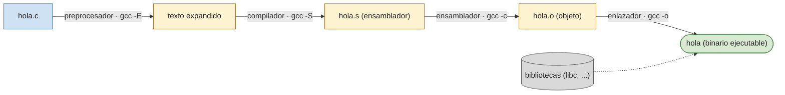

# P0 — Shell y herramientas

## Objetivo

Familiarizarse con el entorno de trabajo del curso: Linux, el intérprete de comandos (shell) y el ciclo completo del lenguaje C — **editar, compilar, ejecutar y depurar** — con las herramientas que se usarán durante el semestre.

## Cómo abrir una terminal

La terminal es una ventana donde se escriben comandos, uno por línea, y se pulsa <kbd>Enter</kbd> para ejecutarlos.

- Atajo de teclado: <kbd>Ctrl</kbd>+<kbd>Alt</kbd>+<kbd>T</kbd> (el habitual en GNOME; en otros escritorios puede variar).
- Icono **Terminal** en la barra de aplicaciones o en el menú de aplicaciones (categoría *Sistema* / *Accesorios*).
- Desde el explorador de archivos: clic derecho sobre una carpeta → *Abrir en un terminal*.
- Dentro de VS Code: menú *Terminal → Nuevo terminal*, o <kbd>Ctrl</kbd>+<kbd>`</kbd>.

### El prompt

Al abrirla aparece una línea parecida a esta, el *prompt*, que indica que la shell espera un comando:

```
usuario@equipo:~$
```

| Parte | Significado |
|-------|-------------|
| `usuario` | tu nombre de usuario (el mismo de `whoami`) |
| `equipo` | nombre de la máquina o *hostname* (el de `hostname`) |
| `~` | directorio de trabajo actual; `~` es tu carpeta personal, `/home/usuario` |
| `$` | shell lista, usuario sin privilegios (`#` si fueras `root`) |

## Moverse y mirar

Primeros comandos para orientarse en el sistema de ficheros:

| Comando | Uso |
|---------|-----|
| `pwd` | imprime el directorio de trabajo actual (*print working directory*) |
| `ls` | lista el contenido del directorio. `ls -l` formato largo (permisos, tamaño, fecha), `ls -a` incluye ocultos, `ls -la` ambos |
| `cd <dir>` | cambia de directorio. `cd ..` sube uno, `cd` o `cd ~` va a tu carpeta personal, `cd -` vuelve al anterior |
| `cat <fichero>` | vuelca el contenido completo de un fichero en la terminal |
| `more <fichero>` | muestra el fichero **página a página**: <kbd>Espacio</kbd> avanza, <kbd>Enter</kbd> una línea, `q` sale |
| `less <fichero>` | como `more` pero también permite retroceder y buscar (`/patrón`); `q` sale |
| `head` / `tail` | primeras / últimas líneas (10 por defecto); `tail -f` sigue un fichero que crece |
| `clear` | limpia la pantalla (<kbd>Ctrl</kbd>+<kbd>L</kbd> hace lo mismo) |
| `man <comando>` | manual del comando; se navega como `less`. También `<comando> --help` |

Comodidades de la shell que conviene usar desde el principio:

- **<kbd>Tab</kbd>**: autocompleta nombres de comandos y de ficheros. Doble <kbd>Tab</kbd> lista las opciones posibles.
- **<kbd>↑</kbd> / <kbd>↓</kbd>**: recorren los comandos anteriores. `history` los lista todos.
- **<kbd>Ctrl</kbd>+<kbd>C</kbd>**: interrumpe el programa en ejecución.
- **<kbd>Ctrl</kbd>+<kbd>D</kbd>**: marca fin de entrada (cierra la terminal si está vacía).

## Procesos

Un programa en ejecución es un *proceso*, identificado por un número (PID).

| Comando | Uso |
|---------|-----|
| `ps` | lista procesos. Habitual: `ps axu \| less` (todos, con detalle) |
| `top` / `htop` | procesos ordenados por consumo de CPU y memoria, en tiempo real; `q` sale |
| `kill <pid>` | envía una señal a un proceso. `kill -9 <pid>` lo termina de forma incondicional |
| `killall <nombre>` | como `kill` pero por nombre de programa |
| `jobs` / `fg` / `bg` | procesos lanzados en segundo plano con `&` desde esta terminal |

## Referencia rápida de comandos

### Ficheros y directorios

| Comando | Uso |
|---------|-----|
| `cp [-r] <origen> <destino>` | copia ficheros o directorios (`-r` recursivo) |
| `mv <origen> <destino>` | mueve o renombra |
| `mkdir <dir>` | crea un directorio |
| `rm [-r] [-f] [-i] <fichero>` | borra ficheros o directorios |
| `rmdir <dir>` | borra un directorio vacío |
| `touch <fichero>` | crea un fichero vacío o actualiza su fecha |
| `chmod <modo> <fichero>` | cambia permisos: `chmod 640 f` u `chmod g+r f` |
| `chown <usuario>:<grupo> <fichero>` | cambia propietario y grupo |
| `ln -s <objetivo> <enlace>` | crea un enlace simbólico |

### Texto y búsqueda

`file` (tipo de fichero), `wc` (cuenta líneas/palabras/caracteres), `sort` (ordena líneas), `grep <patrón>` (líneas que casan un patrón), `find` (busca ficheros), `diff` (diferencias entre dos ficheros).

### Compresión

| Comando | Uso |
|---------|-----|
| `tar` | empaqueta y comprime: `tar czvf <destino>.tar.gz <origen>`; extrae: `tar xzvf <fichero>.tar.gz` |
| `gzip` / `gunzip` | comprime / descomprime un fichero |
| `zip` / `unzip` | comprime / descomprime en formato ZIP |

### Permisos

Cada fichero tiene tres ternas de permisos (usuario, grupo, otros), cada una con lectura (`r`), escritura (`w`) y ejecución (`x`). En notación octal cada terna es un dígito: `rw- r-- ---` → `110 100 000` → `640`.

Forma simbólica: `chmod <u|g|o> <+|-> <r|w|x> <fichero>`, p. ej. `chmod g+r fichero.o`. El bit de ejecución (`x`) es el que permite lanzar un binario con `./programa`.

## Editar archivos de código

Un programa en C es texto plano en un fichero `.c`. Se puede escribir con cualquier editor.

### Editores en la terminal

**`nano`** — el más sencillo; muestra los atajos en pantalla (`^` significa <kbd>Ctrl</kbd>):

```bash
nano hola.c
```

| Atajo | Acción |
|-------|--------|
| <kbd>Ctrl</kbd>+<kbd>O</kbd> | guardar (*write out*) |
| <kbd>Ctrl</kbd>+<kbd>X</kbd> | salir |
| <kbd>Ctrl</kbd>+<kbd>K</kbd> / <kbd>Ctrl</kbd>+<kbd>U</kbd> | cortar / pegar línea |
| <kbd>Ctrl</kbd>+<kbd>W</kbd> | buscar |

**`vim`** — más potente y presente en cualquier máquina, pero tiene *modos*. Supervivencia mínima:

```bash
vim hola.c
```

| Tecla | Acción |
|-------|--------|
| `i` | entra en **modo inserción** (escribir texto) |
| <kbd>Esc</kbd> | vuelve a **modo normal** (para dar órdenes) |
| `:w` | guardar |
| `:q` | salir · `:q!` salir descartando cambios · `:wq` guardar y salir |
| `dd` / `yy` / `p` | borrar / copiar / pegar línea (en modo normal) |

### Editores gráficos

```bash
gedit hola.c &     # editor sencillo de GNOME
geany hola.c &     # editor ligero con resaltado y compilación para C
kate  hola.c &     # editor de KDE
```

El `&` final lanza el editor en segundo plano para no bloquear la terminal.

### VS Code

```bash
code hola.c        # abre un fichero
code .             # abre la carpeta actual como proyecto
```

Trae terminal integrada (<kbd>Ctrl</kbd>+<kbd>`</kbd>) y depurador gráfico sobre `gdb`. Es el editor recomendado para las prácticas largas.

### Fichero de ejemplo: [`hola.c`](hola.c)

```c
#include <stdio.h>

int main(void) {
    printf("Hola, Sistemas Operativos\n");
    return 0;
}
```

## Compilar

El compilador `gcc` transforma el `.c` en un binario ejecutable.

```bash
gcc -Wall -Wextra -o hola hola.c
```

- `-Wall -Wextra`: activan **todos los avisos**; úsalos siempre y corrige lo que señalen.
- `-o hola`: nombre del binario de salida (sin `-o`, el binario se llama `a.out`).
- `-g`: incluye información para el depurador (ver [Depurar](#depurar)).
- `-O2`: optimiza; para depurar es preferible `-O0` (por defecto).

El proceso interno tiene cuatro fases; normalmente se ejecutan de una vez, pero `gcc` puede parar en cada una:

```bash
gcc -E hola.c            # solo preprocesador (expande #include y #define)
gcc -S hola.c            # genera ensamblador (hola.s)
gcc -c hola.c            # genera objeto (hola.o), sin enlazar
gcc -o hola hola.o       # enlaza el objeto con las bibliotecas → binario
```



### Leer los errores del compilador

Si `hola.c` tuviera un `;` de menos antes del `return`:

```
$ gcc -Wall -Wextra -o hola hola.c
hola.c: In function 'main':
hola.c:4:34: error: expected ';' before 'return'
    4 |     printf("Hola, Sistemas Operativos\n")
      |                                  ^
      |                                  ;
    5 |     return 0;
      |     ~~~~~~
```

Se lee: **fichero : línea : columna : tipo** y mensaje. Corrige la primera línea que aparezca y vuelve a compilar; un error suele arrastrar otros.

## Ejecutar

El binario está en el directorio actual; se lanza con `./` delante (la shell no busca ejecutables en `.` por seguridad):

```bash
$ ./hola
Hola, Sistemas Operativos
```

### Argumentos de línea de comandos: [`saluda.c`](saluda.c)

```c
#include <stdio.h>

int main(int argc, char *argv[]) {
    if (argc != 2) {
        fprintf(stderr, "Uso: %s <nombre>\n", argv[0]);
        return 1;
    }
    printf("Hola, %s\n", argv[1]);
    return 0;
}
```

```bash
$ gcc -Wall -Wextra -o saluda saluda.c
$ ./saluda Ana
Hola, Ana
$ ./saluda
Uso: ./saluda <nombre>
```

`argc` es el número de palabras de la orden y `argv` el vector con ellas: `argv[0]` es el nombre del programa, `argv[1]` el primer argumento, etc.

### Código de salida y redirección

```bash
$ ./saluda Ana ; echo $?      # $? = código de salida del último comando (0 = éxito)
Hola, Ana
0
$ ./saluda ; echo $?
Uso: ./saluda <nombre>
1
```

```bash
./saluda Ana > salida.txt     # salida estándar (stdout) a un fichero
./programa  < datos.txt       # entrada estándar (stdin) desde un fichero
./programa 2> errores.txt     # salida de error (stderr) a un fichero
./programa  | less            # tubería: la salida alimenta a otro comando
```

## Depurar

Depurar es ejecutar el programa de forma controlada para ver **dónde y por qué** falla. Requiere compilar con `-g`.

### Fichero de ejemplo: [`depura.c`](depura.c)

Debería sumar los enteros `1..N`, pero tiene un fallo: con `N` pequeño da un resultado absurdo y con `N` grande el programa se cae.

```c
#include <stdio.h>
#include <stdlib.h>

int main(int argc, char *argv[]) {
    if (argc != 2) {
        fprintf(stderr, "Uso: %s <N>\n", argv[0]);
        return 1;
    }

    int n = atoi(argv[1]);
    int valores[100];

    for (int i = 1; i <= n; i++)
        valores[i] = i;

    long suma = 0;
    for (int i = 0; i < n; i++)
        suma += valores[i];

    printf("Suma 1..%d = %ld\n", n, suma);
    return 0;
}
```

*(los números de línea de abajo se refieren al fichero completo, que incluye el comentario de cabecera.)*

```bash
$ gcc -g -Wall -Wextra -o depura depura.c     # compila sin avisos...
$ ./depura 5
Suma 1..5 = 21855                             # ...pero el resultado es erróneo (debería ser 15)
$ ./depura 500
Segmentation fault (core dumped)              # y con N grande, se cae
```

### gdb — el depurador

| Comando (abreviatura) | Acción |
|-----------------------|--------|
| `run [args]` (`r`) | inicia el programa con esos argumentos |
| `break <línea\|función>` (`b`) | pone un punto de ruptura; `break main`, `break depura.c:18` |
| `next` (`n`) | ejecuta la línea actual **sin entrar** en las funciones |
| `step` (`s`) | ejecuta la línea actual **entrando** en las funciones |
| `continue` (`c`) | reanuda hasta el próximo `break` o el final |
| `print <expr>` (`p`) | muestra el valor de una variable o expresión: `print i`, `print valores[0]` |
| `list` (`l`) | muestra el código fuente alrededor de la línea actual |
| `backtrace` (`bt`) | pila de llamadas: qué función llamó a cuál hasta el punto actual |
| `info locals` | valor de todas las variables locales |
| `quit` (`q`) | salir de gdb |

### Sesión 1 — localizar la caída (segfault)

```
$ gdb ./depura
(gdb) run 500
Program received signal SIGSEGV, Segmentation fault.
0x0000555555555199 in main (argc=2, argv=0x7fffffffe2b8) at depura.c:22
22              valores[i] = i;
(gdb) print i
$1 = 108
(gdb) print n
$2 = 500
(gdb) backtrace
#0  main (argc=2, argv=0x7fffffffe2b8) at depura.c:22
(gdb) quit
```

`gdb` detiene el programa justo en la instrucción que provoca el fallo: la línea 22 escribe en `valores[i]` con `i = 108`, fuera del array `valores[100]` (índices válidos `0..99`).

### Sesión 2 — entender el resultado erróneo

```
$ gdb ./depura
(gdb) break 25                 # línea del segundo bucle (el de la suma)
(gdb) run 5
Breakpoint 1, main (...) at depura.c:25
25          for (int i = 0; i < n; i++)
(gdb) print valores[0]
$1 = 21845                     # nunca se le asignó nada: es basura de la pila
(gdb) print valores[1]
$2 = 1
(gdb) print valores[5]
$3 = 5                         # se escribió aquí, pero el bucle de suma no lo lee
(gdb) quit
```

**Diagnóstico:** el primer bucle rellena `valores[1..n]` y el segundo suma `valores[0..n-1]`. Sobra `valores[0]` (basura) y falta `valores[n]`. Los índices de un array de C van de `0` a `n-1`.

**Corrección:**

```c
for (int i = 0; i < n; i++)
    valores[i] = i + 1;

long suma = 0;
for (int i = 0; i < n; i++)
    suma += valores[i];
```

### Lanzar gdb con argumentos

```bash
gdb --args ./depura 500       # equivale a abrir gdb y luego 'run 500'
```

### Otras herramientas de diagnóstico

```bash
valgrind ./depura 5           # detecta accesos a memoria inválidos y fugas
strace ./hola                 # traza las llamadas al sistema que hace el programa
```

`valgrind` sobre el `depura.c` original señala directamente `Invalid write of size 4` en la línea 22 y `Use of uninitialised value` en la suma.

## Herramientas del curso

- **tmux** — multiplexor de terminales: varias terminales (paneles y ventanas) en una sola sesión, que sigue viva aunque se cierre la conexión. Útil para tener a la vez el editor, la compilación y la ejecución.
- **gdb** — depurador de C/C++ (sección anterior). VS Code y `ddd` son interfaces gráficas sobre él.
- **valgrind** — instrumenta el binario para detectar errores de memoria (lecturas/escrituras fuera de rango, uso de memoria sin inicializar, fugas de `malloc`).
- **strace** — muestra la secuencia de llamadas al sistema (`open`, `read`, `write`, `fork`…) que ejecuta un programa; imprescindible en los temas de procesos y ficheros.

## Ejercicios propuestos

1. **Editar.** Crea con un editor (a tu elección) un fichero `datos.c` que imprima, con dos `printf` distintos, tu nombre y tu titulación. Compílalo y ejecútalo.
2. **Compilar.** Sobre una copia de `hola.c`, introduce tres errores de una vez (quita un `;`, una comilla `"` y una llave `}`). Compila, copia los mensajes de `gcc` y explica qué significa cada uno; luego corrígelos y recompila.
3. **Ejecutar.** Modifica `saluda.c` para que acepte **varios** nombres y salude a todos (recorre `argv` de `1` a `argc-1`). Pruébalo con 0, 1 y 3 argumentos y comprueba el valor de `echo $?` en cada caso.
4. **Depurar.** Compila `depura.c` con `-g`, reproduce la caída con `./depura 500` bajo `gdb`, localiza la línea culpable con `backtrace` y `print i`, aplica la corrección y verifica que `./depura 5` imprime `15` y `./depura 500` imprime `125250`.
5. **Depurar.** Escribe un programa corto que desreferencie un puntero `NULL` o divida entre cero. Observa cómo `gdb` detiene la ejecución en la instrucción exacta e identifica la línea con `list` y `backtrace`. Repite el análisis con `valgrind`.
