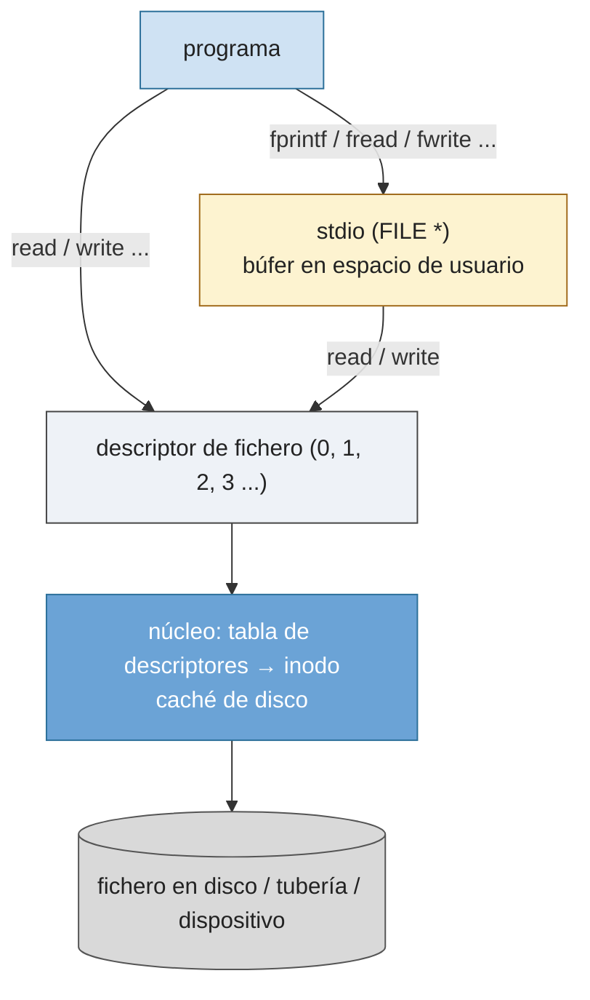

# P1 — Entrada y salida: consola, ficheros, file descriptors

## Descripción general

C ofrece dos niveles para trabajar con ficheros:

- **Biblioteca estándar (`stdio.h`)**: funciones que empiezan por `f` y trabajan con el tipo `FILE *`. Secuencia habitual: declarar un `FILE *`, abrir con `fopen`, operar (lectura/escritura), cerrar con `fclose`. Usa un búfer propio en espacio de usuario.
- **Llamadas al sistema (descriptores de fichero)**: se trabaja con *file descriptors* (enteros no negativos). Es más bajo nivel y compatible con tuberías, sockets, etc. Cada proceso arranca con tres descriptores abiertos: `0` = `STDIN_FILENO` (entrada), `1` = `STDOUT_FILENO` (salida), `2` = `STDERR_FILENO` (error).

> En este material se prioriza el nivel de *file descriptors* (`open`/`read`/`write`/ `close`), más cercano a las llamadas al sistema y coherente con la guía de estilo.



## E/S por consola (`#include <stdio.h>`)

| Función | Prototipo | Descripción |
|---------|-----------|-------------|
| `getchar` | `int getchar(void)` | Lee un carácter del teclado |
| `putchar` | `int putchar(int c)` | Imprime un carácter en pantalla |
| `gets` | `char *gets(char *cad)` | Lee una cadena (obsoleta e insegura; preferir `fgets`) |
| `puts` | `int puts(const char *cad)` | Escribe una cadena y un salto de línea |
| `scanf` | `int scanf(const char *formato, ...)` | Entrada con formato; devuelve nº de asignaciones con éxito |
| `printf` | `int printf(const char *formato, ...)` | Salida con formato; devuelve nº de caracteres escritos |

Especificadores de formato: `%d`/`%i` entero con signo, `%u` sin signo, `%o` octal, `%x`/`%X` hexadecimal, `%c` carácter, `%s` cadena, `%f` punto fijo, `%e`/`%E` científica, `%p` puntero, `%%` símbolo `%`. Escapes: `\n`, `\t`, `\a`, `\0`.

## E/S con `stdio` (`FILE *`)

### `fopen` / `fclose`

```c
#include <stdio.h>
FILE *fopen(const char *path, const char *mode);
int   fclose(FILE *stream);
```

- `path`: nombre (ruta completa) del fichero.
- `mode`: `r` (lectura, debe existir), `w` (escritura, crea/trunca), `a` (añadir al final, crea si no existe), `r+` (lectura+escritura, debe existir), `w+` (lectura+escritura, crea/trunca), `a+` (lectura+escritura al final).
- **Devuelve** (`fopen`): puntero `FILE *`, o `NULL` si hay error.
- **Devuelve** (`fclose`): `0` si se cierra correctamente, `EOF` si hay error.

```c
#include <stdio.h>
int main(void) {
    FILE *fp = fopen("fichero.txt", "r");
    if (fp == NULL) return 1;
    /* ... */
    fclose(fp);
    return 0;
}
```

### Control de posición

| Función | Prototipo | Descripción |
|---------|-----------|-------------|
| `feof` | `int feof(FILE *f)` | ≠0 si el cursor alcanzó el final del fichero |
| `ferror` | `int ferror(FILE *f)` | ≠0 si hubo error en una operación previa |
| `rewind` | `void rewind(FILE *f)` | Sitúa el cursor al principio del fichero |
| `fflush` | `int fflush(FILE *f)` | Vuelca el búfer de salida al fichero |
| `remove` | `int remove(const char *nombre)` | Elimina el fichero |

### Lectura

```c
int   fgetc(FILE *f);                                   /* un carácter; EOF al final o error */
char *fgets(char *buf, int tam, FILE *f);               /* una línea (hasta tam-1 o '\n') */
size_t fread(void *ptr, size_t tam, size_t nmemb, FILE *f);  /* nmemb registros de tam bytes */
int   fscanf(FILE *f, const char *formato, ...);        /* como scanf, desde fichero */
```

`fread` devuelve el número de **elementos** leídos (no bytes); usar `feof`/`ferror` para distinguir fin de fichero de error.

```c
#include <stdio.h>
int main(void) {
    FILE *archivo = fopen("prueba.txt", "r");
    if (archivo == NULL) { printf("Error de apertura.\n"); return 1; }
    for (char linea[100]; fgets(linea, sizeof linea, archivo) != NULL; )
        printf("%s", linea);
    fclose(archivo);
    return 0;
}
```

### Escritura

```c
int   fputc(int c, FILE *f);                             /* un carácter */
int   fputs(const char *buf, FILE *f);                   /* una cadena (sin '\n' ni '\0') */
size_t fwrite(const void *ptr, size_t tam, size_t nmemb, FILE *f);  /* nmemb registros */
int   fprintf(FILE *f, const char *formato, ...);        /* como printf, a fichero */
```

`fwrite` y `fread` se usan para registros de longitud constante (structs):

```c
typedef struct { char nombre[25]; int edad; float sueldo; } registro_t;
registro_t registro = {0};
/* escribir */ fwrite(&registro, sizeof registro, 1, fichero);
/* leer    */  fread(&registro, sizeof registro, 1, fichero);
```

## E/S con llamadas al sistema (descriptores de fichero)

### `open` / `creat`

```c
#include <sys/types.h>
#include <sys/stat.h>
#include <fcntl.h>
int open(const char *pathname, int flags);
int open(const char *pathname, int flags, mode_t mode);
int creat(const char *pathname, mode_t mode);   /* == open con O_WRONLY|O_CREAT|O_TRUNC */
```

- `flags`: uno de `O_RDONLY`, `O_WRONLY`, `O_RDWR`, combinable con OR (`|`) con `O_CREAT` (crea si no existe), `O_EXCL` (con `O_CREAT`, error si ya existe), `O_APPEND` (escribe siempre al final), `O_TRUNC` (trunca a 0).
- `mode`: permisos del fichero si se crea (p. ej. `S_IRUSR|S_IWUSR`, o `0644`).
- **Devuelve**: el descriptor (el entero libre más bajo), o `-1` y `errno` si hay error.

### `read` / `write` / `close` / `lseek` / `unlink`

```c
#include <unistd.h>
ssize_t read(int fd, void *buf, size_t count);
ssize_t write(int fd, const void *buf, size_t count);
int     close(int fd);
off_t   lseek(int fd, off_t offset, int whence);   /* whence: SEEK_SET | SEEK_CUR | SEEK_END */
int     unlink(const char *pathname);              /* <#include <unistd.h>> */
```

- `read`: **devuelve** el nº de bytes leídos, `0` al llegar al final del fichero, `-1` si hay error.
- `write`: **devuelve** el nº de bytes escritos, o `-1` si hay error.
- `close` / `unlink`: `0` si correcto, `-1` si error.
- `lseek`: nueva posición, o `-1` si error.

Errores típicos (`errno`, `<errno.h>`): `EACCES` (sin permiso), `ENOENT` (no existe), `EEXIST` (ya existe con `O_EXCL`), `ENOSPC` (sin espacio), `EBADF` (descriptor inválido). Mostrar el error con `perror("mensaje")` (`#include <stdio.h>`).

### Ejemplo: escritura y lectura por descriptores

```c
#include <sys/types.h>
#include <sys/stat.h>
#include <fcntl.h>
#include <unistd.h>
#include <string.h>

int main(void) {
    char ruta[] = "/tmp/prueba";
    char mensaje[] = "hola\n";
    char buffer[50];

    int fd = open(ruta, O_RDWR | O_CREAT, S_IRUSR | S_IWUSR);
    ssize_t n = write(fd, mensaje, strlen(mensaje));
    close(fd);

    fd = open(ruta, O_RDONLY);
    n  = read(fd, buffer, n);
    write(1, buffer, n);          /* 1 = STDOUT_FILENO */
    close(fd);
    return 0;
}
```

### Ejemplo: copia de fichero

```c
#include <stdio.h>
#include <unistd.h>
#include <sys/stat.h>
#include <fcntl.h>
#include <stdlib.h>

int main(int argc, char *argv[]) {
    char buffer[2048];
    if (argc != 3) { fprintf(stderr, "Se precisan 2 argumentos\n"); exit(1); }

    int fdold = open(argv[1], O_RDONLY);
    if (fdold == -1) { perror("open origen"); exit(1); }
    int fdnew = creat(argv[2], 0666);
    if (fdnew == -1) { perror("creat destino"); exit(1); }

    for (int cuenta; (cuenta = read(fdold, buffer, sizeof buffer)) > 0; )
        write(fdnew, buffer, cuenta);
    close(fdold); close(fdnew);
    return 0;
}
```

## Ejercicios propuestos

1. Programa que abra un fichero cuyo nombre se pase como argumento y escriba en él `"Hola mundo"` tras esperar 5 segundos.
2. Programa que abra un fichero cuyo nombre se pase como argumento, lea su contenido y lo imprima por pantalla.
3. Programa que cambie las vocales en minúscula de un fichero a mayúsculas.
