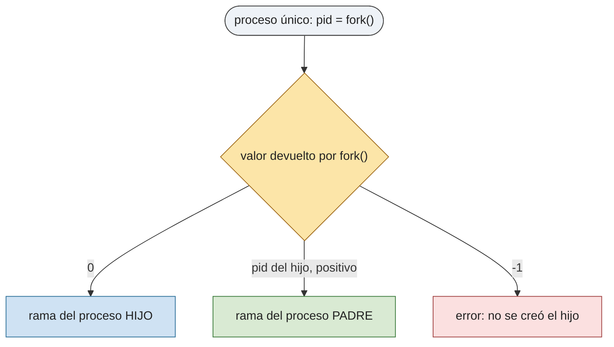

# P2 — Procesos e hilos

## Descripción general

Cada proceso tiene un identificador único en Linux, el *process id* (`pid`). Al proceso que solicita la creación de otro se le llama **padre** y al resultante **hijo**; los procesos forman un árbol (varios hijos, un solo padre). Un proceso consta de código, datos y pila.

Cuando un proceso termina debe haber finalizado ordenadamente sus hijos; si no, quedan **procesos zombie** (terminados pero cuyo estado de salida aún no ha sido recogido por el padre). Si el padre muere antes, los hijos quedan **huérfanos** y los adopta `init` (`pid` 1). Algo análogo ocurre con los hilos de un proceso.

## Comandos comunes

`ps` (lista de procesos), `top` (por consumo), `pstree` (árbol de procesos), `kill` / `killall` (envío de señales).

## Identificadores de proceso

```c
#include <sys/types.h>
#include <unistd.h>
pid_t getpid(void);    /* pid del proceso actual */
pid_t getppid(void);   /* pid del proceso padre */
uid_t getuid(void);    /* uid del usuario propietario */
```

`pid_t` y `uid_t` son enteros. Ejemplo:

```c
#include <stdio.h>
#include <sys/types.h>
#include <unistd.h>
int main(void) {
    printf("PID: %ld\n",  (long)getpid());
    printf("PPID: %ld\n", (long)getppid());
    printf("UID: %ld\n",  (long)getuid());
    return 0;
}
```

## Creación de procesos: `fork`

```c
#include <sys/types.h>
#include <unistd.h>
pid_t fork(void);
```

Crea un nuevo proceso como copia casi exacta del padre (espacio de direcciones, entorno, privilegios, tabla de descriptores de fichero). Ambos continúan en la instrucción siguiente al `fork`.

- **Devuelve** `0` en el hijo, el `pid` del hijo en el padre, y `-1` si hay error.
- **Herencia de descriptores**: padre e hijo comparten el mismo desplazamiento de fichero para los abiertos por el padre antes del `fork`.



```c
#include <stdio.h>
#include <sys/types.h>
#include <unistd.h>
#include <stdlib.h>
int main(void) {
    for (int i = 0; i < 5; i++) {
        int pid = fork();
        if (pid == -1) { perror("fork"); exit(-1); }
        if (pid == 0) {   /* hijo */
            printf("Hijo %d, padre %ld\n", i, (long)getppid());
            exit(0);
        }
    }
    return 0;
}
```

## Espera y terminación: `wait`, `waitpid`, `exit`

```c
#include <sys/types.h>
#include <sys/wait.h>
pid_t wait(int *status);
pid_t waitpid(pid_t pid, int *status, int options);

#include <stdlib.h>
void exit(int status);
```

- `wait` suspende al padre hasta que termine **cualquier** hijo; `waitpid` espera a uno concreto. `wait(&status)` ≡ `waitpid(-1, &status, 0)`.
- **Devuelven** el `pid` del hijo terminado, o `-1` si no hay hijos o hay error. Si el hijo ya había terminado, retornan de inmediato.
- Si `status` no es `NULL` guarda el estado de salida, inspeccionable con macros (`#include <sys/wait.h>`):

| Macro | Significado |
|-------|-------------|
| `WIFEXITED(status)` | cierto si el hijo terminó normalmente (`exit` / fin de `main`) |
| `WEXITSTATUS(status)` | código de salida (8 bits menos significativos); sólo si `WIFEXITED` |
| `WIFSIGNALED(status)` | cierto si el hijo terminó por una señal |
| `WTERMSIG(status)` | número de la señal que lo terminó; sólo si `WIFSIGNALED` |
| `WIFSTOPPED(status)` | cierto si el hijo fue detenido por una señal |
| `WSTOPSIG(status)` | señal que lo detuvo; sólo si `WIFSTOPPED` |
| `WIFCONTINUED(status)` | cierto si el hijo se reanudó |

Si el padre no está en `wait` cuando el hijo termina, el hijo se convierte en zombie.

```c
#include <sys/types.h>
#include <sys/wait.h>
#include <unistd.h>
#include <stdio.h>
#include <stdlib.h>
int main(void) {
    int status = 0;
    pid_t childpid = fork();
    if (childpid == -1) { perror("fork"); exit(1); }
    else if (childpid == 0) {
        printf("Hijo (%ld); espero 2 s y devuelvo 3\n", (long)getpid());
        sleep(2);
        exit(3);
    } else {
        while (childpid != wait(&status));
        printf("Padre (%ld): hijo devolvió STATUS=%d\n", (long)getpid(), status);
    }
    return 0;
}
```

## Sustitución de la imagen: familia `exec`

```c
#include <unistd.h>
int execl (const char *path, const char *arg0, ..., (char *)NULL);
int execlp(const char *file, const char *arg0, ..., (char *)NULL);
int execle(const char *path, const char *arg0, ..., (char *)NULL, char *const envp[]);
int execv (const char *path, char *const argv[]);
int execvp(const char *file, char *const argv[]);
int execve(const char *path, char *const argv[], char *const envp[]);
```

Sustituyen el código y los datos del proceso llamante por los del programa indicado; el `pid`, `ppid`, `pgid`, la tabla de descriptores y el directorio actual se conservan. Letras: **l** argumentos uno a uno terminados en `NULL`; **v** argumentos en un array terminado en `NULL`; **e** se pasa el entorno; **p** se busca el programa en `$PATH`.

- **Devuelve** `-1` sólo si hay error (si tiene éxito no retorna).

```c
#include <unistd.h>
#include <stdio.h>
#include <stdlib.h>
int main(void) {
    char *args[] = { "ps", "-aux", NULL };
    if (execvp("ps", args) < 0) { perror("exec"); exit(1); }
    return 0;   /* nunca se alcanza si exec tiene éxito */
}
```

## Hilos (POSIX threads)

```c
#include <pthread.h>
int pthread_create(pthread_t *tid, const pthread_attr_t *attr,
                   void *(*rutina)(void *), void *arg);
int pthread_join(pthread_t tid, void **retval);
void pthread_exit(void *retval);
```

Compilar con `-pthread`. Crear un hilo es más barato que crear un proceso, y terminar y cambiar entre hilos del mismo proceso también.

## Ejercicios propuestos

1. Analizar y describir el funcionamiento de los cuatro programas de ejemplo (`proc_01.c` a `proc_04.c`) suministrados.
2. Programa que cree cuatro procesos A, B, C y D de forma que A sea padre de B, B de C y C de D.

   ```mermaid
   flowchart LR
       A((A)) --> B((B)) --> C((C)) --> D((D))

       classDef p1 fill:#eef2f7,stroke:#2b6f99,color:#222;
       classDef p2 fill:#cfe2f3,stroke:#2b6f99,color:#222;
       classDef p3 fill:#9cc3e6,stroke:#2b6f99,color:#222;
       classDef p4 fill:#6ba3d6,stroke:#2b6f99,color:#ffffff;

       class A p1;
       class B p2;
       class C p3;
       class D p4;
   ```

3. Programa que cree un árbol de procesos de tres niveles de profundidad, de modo que cada rama tenga dos procesos.

   ```mermaid
   flowchart TD
       N1((nivel 1)) --> N2a((nivel 2))
       N1 --> N2b((nivel 2))
       N2a --> N3a((nivel 3))
       N2a --> N3b((nivel 3))
       N2b --> N3c((nivel 3))
       N2b --> N3d((nivel 3))

       classDef nivel1 fill:#1f3f66,stroke:#132840,color:#ffffff;
       classDef nivel2 fill:#6ba3d6,stroke:#2b6f99,color:#ffffff;
       classDef nivel3 fill:#cfe2f3,stroke:#2b6f99,color:#222;

       class N1 nivel1;
       class N2a,N2b nivel2;
       class N3a,N3b,N3c,N3d nivel3;
   ```
4. Programa `ejecutar` que lea de la entrada estándar el nombre de un programa y cree un proceso hijo para ejecutar dicho programa.
5. Como el ejercicio 2, pero creando cinco hijos y de forma que cada proceso termine ordenadamente 1 segundo después de hacerlo su hijo.
