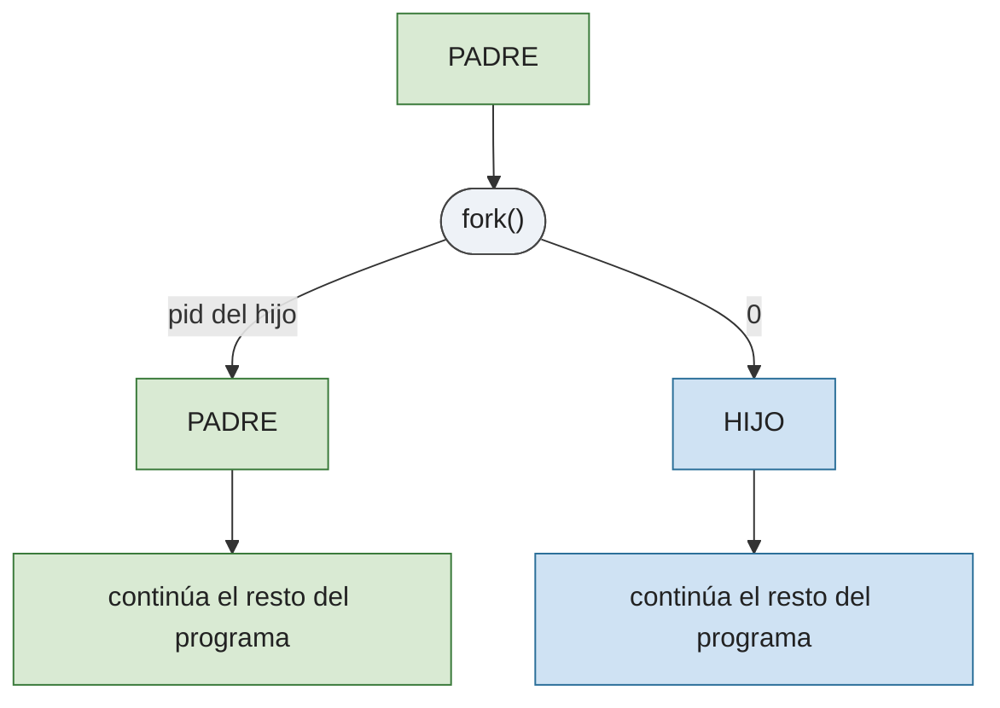
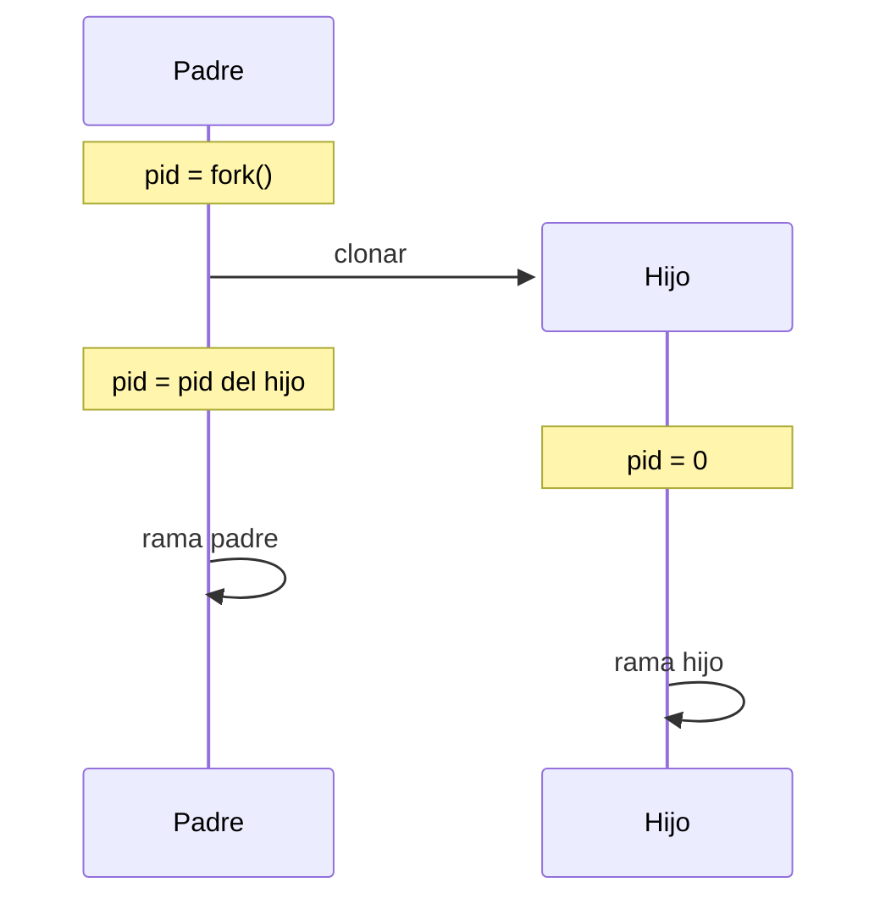

# P2 — Procesos

## Descripción general

Cada proceso tiene un identificador único en Linux, el *process id* (`pid`). Al proceso crea otro proceso se le llama **padre** y al resultante **hijo**; los procesos forman un árbol (varios hijos, un solo padre).

Cuando un proceso termina debe haber finalizado ordenadamente a sus hijos; si no, quedan **procesos zombie** (terminados pero cuyo estado de salida aún no ha sido recogido por el padre). Si el padre muere antes, los hijos quedan **huérfanos** y los adopta el proceso `init` (`pid` 1).

## Comandos comunes

`ps` (lista de procesos), `top` (por consumo), `pstree` (árbol de procesos), `kill` / `killall` (envío de señales).

Más comandos de gestión de procesos (`ps`, `pstree`, `top`, `kill`, `killall`) en [Procesos, práctica 00](../00-shell-y-herramientas/README.md#procesos).


## Identificadores de proceso

```c
#include <sys/types.h>
#include <unistd.h>
pid_t getpid(void);    /* pid del proceso actual */
pid_t getppid(void);   /* pid del proceso padre */
```

En Linux `pid_t` son `int` pero en otros sistemas podrían ser `long`. 

### Fichero de ejemplo: [`identificadores.c`](identificadores.c)

```c
#include <stdio.h>
#include <sys/types.h>
#include <unistd.h>
int main(void) {
    printf("PID: %d\n",  getpid());
    printf("PPID: %d\n", getppid());
    return 0;
}
```

## Creación de procesos: `fork`

```c
#include <sys/types.h>
#include <unistd.h>
pid_t fork(void);
```

Crea un nuevo proceso como copia exacta del padre (espacio de direcciones, entorno, privilegios, tabla de descriptores de fichero). Ambos continúan en la instrucción siguiente al `fork`, pero **devuelve** `0` en el hijo, y el `pid` del hijo en el padre, `-1` si hay error.






### Fichero de ejemplo: [`fork_varios_hijos.c`](fork_varios_hijos.c)

Crea 5 hijos y cada uno imprime su pid, y el de su padre (que debería coincidir):

```c
#include <stdio.h>
#include <sys/types.h>
#include <unistd.h>
#include <stdlib.h>
int main(void) {
    for (int i = 0; i < 5; i++) {
        int pid = fork();
        if (pid == 0) {   /* hijo */
            printf("Hijo %d, padre %d\n", getpid(), getppid());
            exit(0);
        }
    }
    return 0;
}
```

## Espera y terminación: `wait`, `waitpid`, `exit`

```c
#include <sys/types.h>
#include <sys/wait.h>
pid_t wait(int *status);
pid_t waitpid(pid_t pid, int *status, int options);

#include <stdlib.h>
void exit(int status);
```

- `wait` duerme al padre hasta que termine **cualquier** hijo; `waitpid` espera a un hijo en concreto. `wait(&status)` equivale a `waitpid(-1, &status, 0)`.
- **Devuelven** el `pid` del hijo terminado, o `-1` si no hay hijos o hay error. Si el hijo ya había terminado, retornan de inmediato.
- Si `status` no es `NULL` guarda el estado de salida, inspeccionable con macros (`#include <sys/wait.h>`):

<details> <summary> macros </summary>

| Macro | Significado |
|-------|-------------|
| `WIFEXITED(status)` | cierto si el hijo terminó normalmente (`exit` / fin de `main`) |
| `WEXITSTATUS(status)` | código de salida (8 bits menos significativos); sólo si `WIFEXITED` |
| `WIFSIGNALED(status)` | cierto si el hijo terminó por una señal |
| `WTERMSIG(status)` | número de la señal que lo terminó; sólo si `WIFSIGNALED` |
| `WIFSTOPPED(status)` | cierto si el hijo fue detenido por una señal |
| `WSTOPSIG(status)` | señal que lo detuvo; sólo si `WIFSTOPPED` |
| `WIFCONTINUED(status)` | cierto si el hijo se reanudó |

</details>

### Fichero de ejemplo: [`fork_wait_status.c`](fork_wait_status.c)

El padre entra en `wait` justo después del `fork`, así que recoge el estado del hijo cuando termina. Sirve para ver cómo se usa `wait` y cómo se lee `status`.

```c
#include <sys/types.h>
#include <sys/wait.h>
#include <unistd.h>
#include <stdio.h>
#include <stdlib.h>
int main(void) {
    int status = 0;
    pid_t childpid = fork();
    if (childpid == 0) { //hijo
        printf("Hijo (%d): espero 2s y termino(con 3) \n", getpid());
        sleep(2);
        exit(3);
    }
    //padre
    waitpid(childpid, &status, 0);
    printf("Padre (%d): hijo devolvió STATUS=%d\n", getpid(), status);
    return 0;
}
```

### Fichero de ejemplo: [`fork_zombie.c`](fork_zombie.c)

Si el padre tarda en llamar a `wait` y el hijo termina antes, el hijo se vuelve zombi:

```c
#include <sys/types.h>
#include <sys/wait.h>
#include <unistd.h>
#include <stdio.h>
#include <stdlib.h>
int main(void) {
    pid_t pid = fork();
    if (pid == 0) {
        printf("Hijo (%d): termino\n", getpid());
        exit(0);
    }
    printf("Padre (%d): duermo 30 s sin hacer wait; el hijo %d queda zombie\n", getpid(), pid);
    sleep(30);
    wait(NULL);
    return 0;
}
```
Mientras el padre duerme, abre otra terminal y pon:

```bash
ps -o stat,cmd -C zombie   # STAT = Z, CMD = <defunct>
top                         # también aparece con estado Z
```

Un zombie ya ha terminado, así que no se puede "matar" con `kill`: no hay proceso en ejecución al que enviar la señal, solo queda su entrada en la tabla de procesos (PCB). Para eliminarlo hay que:
- que el padre llame a `wait`/`waitpid` (lo recoge y desaparece), o
- terminar al padre: el zombie queda huérfano, lo adopta `init` (pid 1), que hace `wait` por él automáticamente.

## Ejecución de comandos: la familia `exec`

```c
#include <unistd.h>
int execlp(const char *file, const char *arg0, ..., (char *)NULL);
int execvp(const char *file, char *const argv[]);
```

Existen más variantes (`execl`, `execle`, `execv`, `execve`), que exigen indicar la ruta completa del programa en vez de buscarlo en `$PATH`, y/o permiten pasar el entorno explícitamente; no hacen falta para estas prácticas.

Llamar a `exec()` sustituyen el código y los datos del proceso llamante por los del programa indicado; el `pid`, `ppid`, `pgid`, la tabla de descriptores y el directorio actual se conservan. `execlp` recibe los argumentos uno a uno terminados en `NULL`; `execvp` los recibe en un array terminado en `NULL`. Ambas buscan el programa en `$PATH` (la `p` final), por eso no hace falta indicar la ruta completa.

- **Devuelve** `-1` sólo si hay error (si tiene éxito no retorna).

### Fichero de ejemplo: [`exec_ps.c`](exec_ps.c)

```c
#include <unistd.h>
#include <stdio.h>
#include <stdlib.h>
int main(void) {
    char *args[] = { "ps", "-aux", NULL };
    execvp(args[0], args);
    return 0;   /* nunca se alcanza si exec tiene éxito */
}
```

El mismo ejemplo con `execlp`, pasando los argumentos uno a uno en vez de en un array:

```c
#include <unistd.h>
int main(void) {
    execlp("ps", "ps", "-aux", NULL);
    return 0;   /* nunca se alcanza si exec tiene éxito */
}
```


## Ejercicios propuestos

Para terminar estos procesos y todos sus hijos a la vez utilizar [Ctrl+C, visto en comandos comunes](#comandos-comunes).

1. Compila y prueba el funcionamiento de los cinco programas de ejemplo suministrados: [`identificadores.c`](identificadores.c), [`fork_varios_hijos.c`](fork_varios_hijos.c), [`fork_wait_status.c`](fork_wait_status.c), [`fork_zombie.c`](fork_zombie.c) y [`exec_ps.c`](exec_ps.c).

2. Programa que cree cuatro procesos A, B, C y D de forma que A sea padre de B, B de C y C de D.

   ```mermaid
   flowchart LR
       A((A)) --> B((B)) --> C((C)) --> D((D))

       classDef p1 fill:#eef2f7,stroke:#2b6f99,color:#222;
       classDef p2 fill:#cfe2f3,stroke:#2b6f99,color:#222;
       classDef p3 fill:#9cc3e6,stroke:#2b6f99,color:#222;
       classDef p4 fill:#6ba3d6,stroke:#2b6f99,color:#0d2a3f;

       class A p1;
       class B p2;
       class C p3;
       class D p4;
   ```

3. Programa que cree un árbol de procesos de tres niveles de profundidad, con 2 procesos en cada rama.

   ```mermaid
   flowchart TD
       N1((nivel 1)) --> N2a((nivel 2))
       N1 --> N2b((nivel 2))
       N2a --> N3a((nivel 3))
       N2a --> N3b((nivel 3))
       N2b --> N3c((nivel 3))
       N2b --> N3d((nivel 3))

       classDef nivel1 fill:#1f3f66,stroke:#132840,color:#ffffff;
       classDef nivel2 fill:#6ba3d6,stroke:#2b6f99,color:#0d2a3f;
       classDef nivel3 fill:#cfe2f3,stroke:#2b6f99,color:#222;

       class N1 nivel1;
       class N2a,N2b nivel2;
       class N3a,N3b,N3c,N3d nivel3;
   ```

   Para comprobar que el árbol de procesos es el esperado, hay dos opciones. En el proceso raíz, antes del `wait`:

   **Opción 1:** el proceso raíz imprime su pid y se queda esperando una tecla; mientras tanto, desde otra terminal inspeccionas el árbol de procesos.

   ```c
   printf("PID raíz: %d, pulsa una tecla para terminar...\n", getpid());
   getchar();
   ```

   Desde otra terminal: `pstree -p <pid>` (el pid que acaba de imprimir).

   **Opción 2:** el proceso raíz se reemplaza a sí mismo con `pstree`:

   ```c
   //pasamos el pid a cadena 
   char pid_str[16];
   snprintf(pid_str, sizeof(pid_str), "%d", getpid());
   //ejecutamos pstree -p <pid>
   execlp("pstree", "pstree", "-p", pid_str, NULL);
   ```

4. Programa `microshell` que muestre el prompt `comando> ` y vaya leyendo de la entrada estándar el nombre de un programa, creando un hijo para ejecutarlo (con `exec`) cada vez; no hace falta que soporte argumentos. Termina al llegar a fin de fichero (`Ctrl+D`).

   Ejemplo de ejecución:

   ```
   comando> pwd
   /home/alumno/ssoo/PRACTICA/02-procesos
   comando> who
   alumno   tty1         2026-09-17 10:03
   comando> ls
   README.md  microshell.c  microshell
   comando> ...
   ```

   Hay muchas formas de leer línea a línea, esta es una de ellas:
   ```c
   #include <stdio.h>
   int main(void) {
       for (char linea[256]; ; ) {
           printf("comando> ");
           if (fscanf(stdin, "%255s", linea) != 1) break;
           printf("Leído: %s\n", linea);
       }
       return 0;
   }
   ```

5. Como el ejercicio 2, pero creando cinco hijos y de forma que cada proceso termine ordenadamente 1 segundo después de hacerlo su hijo.

   puedes usar `sleep`:

   ```c
   #include <unistd.h>
   unsigned int sleep(unsigned int segundos);
   ```

   Suspende el proceso durante los segundos indicados (o hasta que llega una señal). Cada proceso debe hacer `wait` sobre su hijo, luego `sleep(1)` y luego terminar.

   Ejemplo de salida (hay 1 segundo de diferencia entre cada línea):

   ```
   Terminado proceso 24109, hijo de 24108
   Terminado proceso 24108, hijo de 24107
   Terminado proceso 24107, hijo de 24106
   Terminado proceso 24106, hijo de 24105
   Terminado proceso 24105, hijo de 24104
   ```


