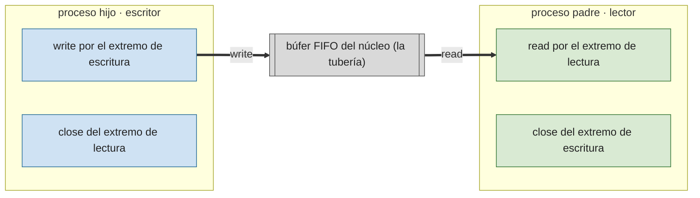

# P3 — Pipes y fifos

## Descripción general

Las **tuberías** (*pipes*) son un mecanismo de comunicación entre procesos por paso de mensajes: la salida de un proceso se convierte en la entrada de otro. El sistema operativo las implementa con un búfer y política FIFO.

- **Pipes** (tuberías sin nombre): sólo comunican procesos con un ancestro común (padre- hijo, hijo-hijo) y de forma unidireccional. Se crea la pipe **antes** del `fork` para que los hijos hereden sus descriptores.
- **FIFOs** (tuberías con nombre): son un fichero especial persistente; comunican procesos cualesquiera, sin parentesco.

Cada proceso cierra el descriptor (lectura o escritura) que no va a usar. Al leer se obtiene **EOF** cuando se han cerrado **todos** los descriptores de escritura de esa pipe. Si se escribe cuando el extremo lector está cerrado se genera `SIGPIPE`.

`read` y `write` son **bloqueantes** por defecto: leer de una pipe vacía bloquea hasta que haya datos; escribir en una pipe llena bloquea hasta que haya espacio. `PIPE_BUF` es el número máximo de bytes que se escriben atómicamente.

## Comandos comunes

`mkfifo <ruta>` (crea una FIFO desde la shell), `rm` (la borra), `ls -l` (una FIFO aparece con tipo `p`), el operador `|` de la shell (encadena la salida/entrada estándar de comandos).

## `pipe`

```c
#include <unistd.h>
int pipe(int filedescriptor[2]);
```

Crea la tubería: `filedescriptor[0]` es el extremo de **lectura** y `filedescriptor[1]` el de **escritura**. Lo escrito en `[1]` se lee en `[0]`.

- **Devuelve** `0` si correcto, `-1` y `errno` si hay error.

Tras `pipe` + `fork`, ambos procesos tienen los dos extremos abiertos; cada uno cierra el que no usa para que el flujo sea unidireccional y se detecte el EOF:



```c
#include <stdio.h>
#include <unistd.h>
#include <string.h>
#include <stdlib.h>

int main(void) {
    int tuberia[2];
    pipe(tuberia);
    if (fork() == 0) {                     /* hijo: escribe */
        char *cadena = "Hola mundo";
        close(tuberia[0]);
        write(tuberia[1], cadena, strlen(cadena) + 1);
        close(tuberia[1]);
        exit(0);
    } else {                               /* padre: lee */
        char buffer[100];
        close(tuberia[1]);
        read(tuberia[0], buffer, 100);
        printf("Mensaje leído: %s\n", buffer);
        close(tuberia[0]);
        exit(0);
    }
}
```

## `fcntl` — lectura/escritura no bloqueante

```c
#include <unistd.h>
#include <fcntl.h>
int fcntl(int fd, int cmd);
int fcntl(int fd, int cmd, long arg);
```

- `F_GETFL`: lee las banderas del descriptor.
- `F_SETFL`: fija las banderas de situación (`O_APPEND`, `O_NONBLOCK`, `O_ASYNC`, `O_DIRECT`).

```c
fcntl(mi_tuberia[0], F_SETFL, O_NONBLOCK);   /* lectura no bloqueante */
fcntl(mi_tuberia[1], F_SETFL, O_NONBLOCK);   /* escritura no bloqueante */
```

## `mkfifo` — tuberías con nombre

```c
#include <sys/types.h>
#include <sys/stat.h>
int mkfifo(const char *pathname, mode_t modo);
```

- `pathname`: ruta de la FIFO; `modo`: máscara de permisos.
- Apertura, cierre, borrado, lectura y escritura son como en ficheros (`open`, `close`, `unlink`, `read`, `write`).
- Apertura **bloqueante**: `open(fifo, O_WRONLY)` bloquea hasta que otro proceso la abra para lectura, y viceversa. Con `O_NONBLOCK`, un `open` de lectura retorna de inmediato y uno de sólo escritura da error si no hay lector.
- Es **persistente**: hay que eliminarla al terminar (`unlink` / `remove` / `rm`).

```c
#include <stdio.h>
#include <unistd.h>
#include <sys/stat.h>
#include <fcntl.h>
#define NOMBREFIFO "mififo"
#define TAM_BUF 100
int main(void) {
    char buffer[TAM_BUF];
    mkfifo(NOMBREFIFO, 0660);
    for (;;) {
        int fp = open(NOMBREFIFO, O_RDONLY);
        int nbytes = read(fp, buffer, TAM_BUF - 1);
        buffer[nbytes] = '\0';
        printf("Cadena recibida: %s\n", buffer);
        close(fp);
    }
    return 0;
}
```

## `select` — atención a varios canales

```c
#include <sys/select.h>
int select(int nfds, fd_set *readfds, fd_set *writefds,
           fd_set *errorfds, struct timeval *timeout);
```

Indica qué descriptores están listos para lectura, escritura o han producido un error. Si ninguno lo está, bloquea hasta que venza `timeout` (si es `NULL`, bloquea indefinidamente).

- `nfds`: el descriptor más alto a vigilar **más uno**.
- `readfds` / `writefds` / `errorfds`: conjuntos de descriptores.
- Al retornar, modifica los conjuntos para indicar cuáles tienen actividad → hay que reinicializarlos antes de cada llamada.

Macros para manejar los `fd_set`: `FD_ZERO(&s)` (vacía), `FD_SET(fd, &s)` (añade), `FD_CLR(fd, &s)` (quita), `FD_ISSET(fd, &s)` (comprueba tras `select`).

```c
fd_set lectura;
FD_ZERO(&lectura);
FD_SET(fd1, &lectura);
FD_SET(fd2, &lectura);
select(maximo + 1, &lectura, NULL, NULL, NULL);
if (FD_ISSET(fd1, &lectura)) { /* ... */ }
```

## Redirección a la E/S estándar: `dup` / `dup2`

```c
#include <unistd.h>
int dup(int oldfd);           /* duplica sobre el primer descriptor libre */
int dup2(int oldfd, int newfd); /* duplica sobre newfd (lo cierra antes si estaba abierto) */
```

- **Devuelven** el nuevo descriptor, o `-1` si hay error.

```c
if (fork() == 0) {                    /* hijo */
    close(STDIN_FILENO);
    dup2(fd[0], STDIN_FILENO);        /* la entrada estándar viene de la pipe */
    close(fd[0]);
    execvp(/* ... */);
    exit(1);
}
```

## Ejercicios propuestos

1. Programa que cree dos procesos que se comuniquen por tuberías e intercambien diez mensajes. El primer proceso construye un mensaje con un contador de secuencia y su `PID`; lo envía al otro, que lo lee, incrementa la secuencia e introduce su `PID`. Al completar los diez mensajes ambos procesos concluyen ordenadamente con un mensaje de despedida.

   ```c
   typedef struct { int secuencia, pid_emisor; } mensaje_t;
   ```

2. Dos programas **independientes** que hagan lo mismo que el ejercicio 1, pero comunicándose mediante una tubería con nombre (FIFO).
3. Como el ejercicio 1, pero empleando lecturas no bloqueantes y la función `select`.
4. Programa en C que calcule la sucesión de Fibonacci (`f0 = 0`, `f1 = 1`, `fn = fn-1 + fn-2`) empleando **tres procesos** P1, P2 y P3 con sus mecanismos de comunicación, según el esquema siguiente. P3 va imprimiendo en pantalla los valores obtenidos separados por comas (`0, 1, 1, 2, 3, 5, 8, 13, 21`) al paso de un segundo.

   <svg xmlns="http://www.w3.org/2000/svg" viewBox="0 0 640 260" font-family="sans-serif" font-size="12" role="img" aria-label="P1 y P2 envían sus valores por pipe a P3, que los combina e imprime la sucesión de Fibonacci por la salida estándar">
     <defs>
       <marker id="arrP03b" markerWidth="8" markerHeight="8" refX="6" refY="4" orient="auto"><path d="M0,0 L8,4 L0,8 z" fill="#333"/></marker>
     </defs>
     <circle cx="100" cy="60" r="30" fill="#dbeafe" stroke="#333"/>
     <text x="100" y="65" text-anchor="middle">P1</text>
     <circle cx="100" cy="200" r="30" fill="#dbeafe" stroke="#333"/>
     <text x="100" y="205" text-anchor="middle">P2</text>
     <circle cx="340" cy="130" r="30" fill="#dbeafe" stroke="#333"/>
     <text x="340" y="135" text-anchor="middle">P3</text>
     <rect x="420" y="105" width="200" height="50" rx="6" fill="#fff7ed" stroke="#333"/>
     <text x="520" y="134" text-anchor="middle" font-size="10">0, 1, 1, 2, 3, 5, 8, 13, 21</text>
     <line x1="122" y1="82" x2="316" y2="118" stroke="#333" stroke-width="1.5" marker-end="url(#arrP03b)"/>
     <text x="200" y="90" text-anchor="middle" font-size="10">pipe</text>
     <line x1="122" y1="178" x2="316" y2="142" stroke="#333" stroke-width="1.5" marker-end="url(#arrP03b)"/>
     <text x="200" y="178" text-anchor="middle" font-size="10">pipe</text>
     <line x1="370" y1="130" x2="416" y2="130" stroke="#333" stroke-width="1.5" marker-end="url(#arrP03b)"/>
     <text x="393" y="120" text-anchor="middle" font-size="9">stdout</text>
     <line x1="100" y1="170" x2="100" y2="90" stroke="#333" stroke-width="1.2" stroke-dasharray="4,3" marker-end="url(#arrP03b)"/>
     <text x="60" y="130" text-anchor="middle" font-size="9">(realimentación</text>
     <text x="60" y="142" text-anchor="middle" font-size="9">opcional P2→P1)</text>
   </svg>
