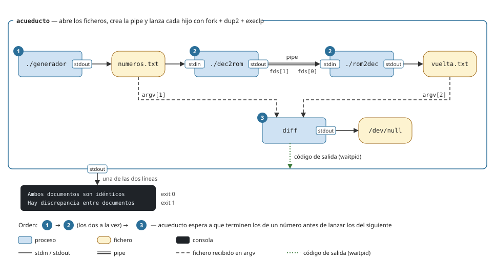

# P5 — Acueducto: ejercicio de procesos y pipes

## Descripción general

Escribir `acueducto.c`, un programa que lanza tres programas ya hechos, redirige sus entradas y salidas a ficheros, los conecta con una tubería y comprueba con el comando `diff` que los números se convierten correctamente de decimal a romano y de romano a decimal.

## Arquitectura



## Programas dados

Se compilan y se usan tal cual, sin modificarlos. Usan la entrada y la salida estándar y no saben nada de ficheros ni de tuberías, así que `acueducto` tiene que redirigírselas con `open` y `dup2` en cada hijo, entre el `fork` y el `execlp`.

- [`generador.c`](generador.c): escribe 1000 números aleatorios entre 1 y 3999, uno por línea.
- [`dec2rom.c`](dec2rom.c): lee números decimales y escribe su número romano, uno por línea.
- [`rom2dec.c`](rom2dec.c): lee números romanos y escribe su valor decimal, uno por línea.

Encadenados desde la shell hacen lo mismo que tiene que hacer `acueducto`:

```bash
./generador > numeros.txt                            # genera los números
./dec2rom < numeros.txt | ./rom2dec > vuelta.txt     # decimal -> romano -> decimal
diff numeros.txt vuelta.txt > /dev/null; echo $?     # 0: iguales, 1: distintos
```

## Qué debe hacer `acueducto.c`

1. Lanzar `generador` con su salida redirigida a `numeros.txt` y esperar a que termine.
2. Crear una pipe y lanzar `dec2rom`, con la entrada desde `numeros.txt` y la salida hacia la pipe, y `rom2dec`, con la entrada desde la pipe y la salida hacia `vuelta.txt`. Esperar a que terminen los dos.
3. Lanzar `diff numeros.txt vuelta.txt` con su salida redirigida a `/dev/null` y esperar a que termine.
4. Según el código de salida de `diff`, escribir por la salida estándar una de estas dos líneas y terminar:

| `diff` devuelve | `acueducto` escribe | `acueducto` termina con |
|---|---|---|
| `0` | `Ambos documentos son idénticos` | `0` |
| otro valor | `Hay discrepancia entre documentos` | `1` |

### Requisitos

- Cada programa se lanza con `fork` + `execlp` y se espera con `waitpid`. No se puede usar `system()`, `popen()` ni lanzar una shell (`sh -c`).
- `numeros.txt` y `vuelta.txt` se crean si no existen y se sobrescriben si existen.
- Los programas que se dan se lanzan con su  ./, `execlp("./dec2rom", "dec2rom", NULL)`; `diff` está en el `PATH` y no necesita `./`.
<!-- - Debe compilar sin *warnings* con `-Wall`. -->

## Compilación y ejecución

```bash
gcc -Wall -o generador generador.c
gcc -Wall -o dec2rom dec2rom.c
gcc -Wall -o rom2dec rom2dec.c
gcc -Wall -o acueducto acueducto.c
./acueducto
```

## Pasos sugeridos

Cada paso amplía el anterior. `acueducto` genera un `numeros.txt` nuevo en cada ejecución, así que las comprobaciones se hacen justo después de ejecutarlo.

1. **`generador` → `numeros.txt`.**
   *Debe salir:* nada por pantalla.
   *Prueba:* abre `numeros.txt` (con el editor o con `less numeros.txt`) y comprueba que tiene números, uno por línea. También se puede comprobar con comandos:

   ```
   $ rm -f numeros.txt; ./acueducto            # borra el fichero anterior y ejecuta: debe volver a crearlo
   $ wc -l numeros.txt                         # cuenta las líneas: debe haber 1000
   1000 numeros.txt
   $ head -3 numeros.txt                       # muestra las 3 primeras líneas: cambian en cada ejecución
   1994
   58
   2711
   ```

2. **`dec2rom` leyendo de `numeros.txt`**, de momento con su salida en pantalla.
   *Debe salir:* 1000 números romanos, uno por línea.
   *Prueba:*

   ```
   $ ./acueducto | wc -l                       # cuenta las líneas que acueducto escribe por pantalla: debe haber 1000
   1000
   $ ./acueducto > romanos.txt                 # guarda en romanos.txt lo que acueducto escribe por pantalla
   $ ./dec2rom < numeros.txt | diff - romanos.txt    # convierte numeros.txt desde la shell y lo compara con romanos.txt (- es la entrada estándar): no debe mostrar nada
   $ echo $?                                   # código de salida del último comando (diff): 0 = iguales
   0
   ```

   Si a veces salen menos de 1000 líneas o `diff` muestra diferencias, `dec2rom` empieza a leer antes de que `generador` haya terminado de escribir.

3. **Pipe y `rom2dec` → `vuelta.txt`.**
   *Debe salir:* nada por pantalla, y `acueducto` debe terminar solo.
   *Prueba:*

   ```
   $ ./acueducto                               # si se queda colgado, ver más abajo
   $ wc -l vuelta.txt                          # cuenta las líneas: debe haber 1000
   1000 vuelta.txt
   $ diff numeros.txt vuelta.txt; echo $?      # compara los dos ficheros (no debe mostrar nada) y muestra el código de salida de diff: 0 = iguales
   0
   ```

   Si `acueducto` se queda colgado, `rom2dec` está esperando un fin de fichero que no llega porque algún proceso mantiene abierto el extremo de escritura de la pipe. Desde otra terminal:

   ```bash
   pstree -p $(pgrep -o acueducto)    # pgrep -o da el pid de acueducto; pstree muestra los hijos que siguen vivos, con su pid
   ls -l /proc/<pid>/fd               # descriptores abiertos del proceso <pid> (uno de los de pstree): busca los que apuntan a pipe:[...]
   ```

4. **`diff` y resultado.**
   *Debe salir:*

   ```
   $ ./acueducto; echo $?                      # ejecuta acueducto y muestra su código de salida
   Ambos documentos son idénticos
   0
   ```

   Al ejecutarlo varias veces seguidas debe salir siempre lo mismo y los ficheros deben seguir teniendo 1000 líneas:

   ```
   $ for i in 1 2 3; do ./acueducto; done      # ejecuta acueducto 3 veces seguidas
   Ambos documentos son idénticos
   Ambos documentos son idénticos
   Ambos documentos son idénticos
   $ wc -l numeros.txt vuelta.txt              # cuenta las líneas de cada fichero: 1000 en los dos
    1000 numeros.txt
    1000 vuelta.txt
    2000 total
   ```

   Si falla a partir de la segunda ejecución, algún fichero conserva restos de la anterior porque no se vacía al abrirlo.

## Validar con `strace`

Cada línea de la traza empieza por el pid del proceso que hace la llamada. Uso básico de `strace` en [P0](../00-shell-y-herramientas/#strace--mostrar-llamadas-al-sistema).

```bash
strace -f -o traza.txt -e trace=%process,pipe,pipe2,openat,dup2,close ./acueducto   # -f: sigue también a los hijos; -o: guarda la traza en traza.txt; -e: solo esas llamadas (%process = clone, execve, wait4, exit...)
less traza.txt                                                                      # muestra la traza (q para salir)
```

### Cómo leer la traza

- Lo línea anterior al primer `clone` es el arranque de `acueducto` (carga de bibliotecas) y se puede ignorar.
- Cada `clone(...) = 5001` es un `fork`: el valor devuelto es el pid del hijo.
- De cada hijo interesa lo que hace entre su creación y su `execve`, que son las redirecciones. Lo que viene después del `execve` ya es el programa lanzado, cargando sus bibliotecas.
- `<unfinished ...>` y `<... resumed>` marcan una llamada que se ha quedado bloqueada (por ejemplo un `wait4`) mientras otros procesos seguían.
- Los pids y los números de descriptor cambian en cada ejecución. Según la versión, la pipe aparece como `pipe(...)` o `pipe2(..., 0)`.

Ejemplo (recortado) del paso 1:

```
5000  clone(child_stack=NULL, flags=CLONE_CHILD_CLEARTID|CLONE_CHILD_SETTID|SIGCHLD, child_tidptr=0x7f3a1c5d7a10) = 5001
5000  wait4(5001,  <unfinished ...>
5001  openat(AT_FDCWD, "numeros.txt", O_WRONLY|O_CREAT|O_TRUNC, 0644) = 3
5001  dup2(3, 1)                        = 1
5001  close(3)                          = 0
5001  execve("./generador", ["generador"], 0x7ffd2c1a8e58 /* 26 vars */) = 0
...
5001  exit_group(0)                     = ?
5001  +++ exited with 0 +++
5000  <... wait4 resumed>NULL, 0, NULL) = 5001
```

### Qué comprobar en la traza completa

- `acueducto` hace cuatro `clone` y hay cuatro `execve` que terminan en `= 0`: `./generador`, `./dec2rom`, `./rom2dec` y `diff`. Antes del de `diff` aparecen varios `execve(...) = -1 ENOENT`: es `execlp` probando los directorios del `PATH` hasta encontrarlo.
- El `wait4` de `generador` termina antes del `clone` de `dec2rom`.
- Cada hijo, antes de su `execve`, hace los `dup2` sobre 0 y/o 1 que le tocan y cierra los descriptores mayores que 2: el programa lanzado solo debe tener abiertos 0, 1 y 2.
- `acueducto` cierra los dos extremos de la pipe antes de esperar a `dec2rom` y `rom2dec`.
- Los `wait4` de `dec2rom` y `rom2dec` terminan antes del `clone` de `diff`.
- El `wait4` de `diff` muestra `[{WIFEXITED(s) && WEXITSTATUS(s) == 0}]` (o `== 1`) y `acueducto` termina con `exit_group(0)` (o `1`).

## Llamadas al sistema útiles

`open(2)`, `close(2)` ([P1](../01-entrada-salida-y-ficheros/)); `fork(2)`, `execlp(3)`, `waitpid(2)` con `WIFEXITED` y `WEXITSTATUS` ([P2](../02-procesos/)); `pipe(2)`, `dup2(2)` ([P3](../03-pipes-y-fifos/)). Herramientas: `diff`, `strace`, `pstree`, `pgrep` ([P0](../00-shell-y-herramientas/)).
