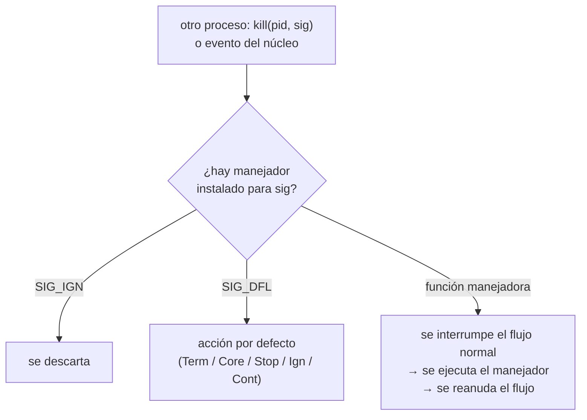

# P4 — Señales

## Descripción general

Una **señal** (*signal*) es una forma limitada de comunicación entre procesos en sistemas
POSIX: una notificación asíncrona (interrupción software) enviada a un proceso para
avisarle de un evento. Al recibirla, el sistema operativo interrumpe la ejecución normal
del proceso y ejecuta el **manejador** (*handler*) instalado para esa señal; si no hay,
se aplica la **acción por defecto**.

Ejemplos conocidos: `Ctrl-C` en la shell envía `SIGINT` (termina el proceso), `Ctrl-Z`
envía `SIGTSTP` (lo detiene), el comando `kill` envía señales.

Las señales `SIGKILL` y `SIGSTOP` **no** pueden capturarse, bloquearse ni ignorarse.
Como son asíncronas, puede llegar otra señal mientras se ejecuta un manejador; las
funciones usadas dentro de un manejador deben ser **reentrantes / async-signal-safe**
(`malloc` y `free` no lo son).



## Comandos comunes

```
kill -s <nombre_señal> <pid> ...     kill -SIGUSR1 1234
kill -<número_señal>   <pid> ...     kill -9 1234
kill -l [estado]                      # lista los nombres de señal
killall <nombre_proceso>
```

## Señales relevantes

| Señal | Valor | Acción por defecto | Explicación |
|-------|-------|--------------------|-------------|
| `SIGINT`  | 2  | Term | Interrupción de teclado (`Ctrl-C`) |
| `SIGQUIT` | 3  | Core | Quit de teclado |
| `SIGILL`  | 4  | Core | Instrucción ilegal |
| `SIGFPE`  | 8  | Core | Excepción en coma flotante / división por cero |
| `SIGKILL` | 9  | Term | Destrucción inmediata (no capturable) |
| `SIGSEGV` | 11 | Core | Referencia de memoria inválida |
| `SIGPIPE` | 13 | Term | Escritura en pipe sin lectores |
| `SIGALRM` | 14 | Term | Temporizador de `alarm(2)` |
| `SIGTERM` | 15 | Term | Terminación (por defecto de `kill`) |
| `SIGUSR1` | 10 | Term | Definida por el usuario 1 |
| `SIGUSR2` | 12 | Term | Definida por el usuario 2 |
| `SIGCHLD` | 17 | Ign  | Hijo detenido o terminado |
| `SIGCONT` | 18 | Cont | Continúa si estaba parado |
| `SIGSTOP` | 19 | Stop | Detiene el proceso (no capturable) |
| `SIGTSTP` | 20 | Stop | Stop de teclado (`Ctrl-Z`) |
| `SIGHUP`  | 1  | Term | Cierre del terminal |

Acciones por defecto: **Term** (terminar), **Ign** (ignorar), **Core** (terminar +
volcado de memoria), **Stop** (detener), **Cont** (continuar).
Más información: `man 7 signal`.

## Envío de señales: `kill`

```c
#include <sys/types.h>
#include <signal.h>
int kill(pid_t pid, int sig);
```

Envía la señal `sig` a un proceso o grupo:

- `pid > 0`: al proceso `pid`.
- `pid == 0`: a todos los procesos del grupo del proceso actual.
- `pid == -1`: a todos los procesos salvo `init`.
- `pid < -1`: a todos los del grupo `-pid`.
- `sig == 0`: no envía nada, sólo comprueba errores.
- **Devuelve** `0` si correcto, `-1` y `errno` si hay error. No se puede señalar a `init`
  (pid 1).

Relacionadas: `raise(int sig)` (se la envía a sí mismo), `alarm(unsigned s)` (programa
un `SIGALRM` dentro de `s` segundos).

## Captura de señales: `signal`

```c
#include <signal.h>
typedef void (*sighandler_t)(int);
sighandler_t signal(int signum, sighandler_t handler);
```

`handler` puede ser `SIG_IGN` (ignorar), `SIG_DFL` (acción por defecto) o un puntero a
función manejadora `void f(int signum)`. Se instala **una sola vez**; no hay que
reinstalarlo tras cada señal.

- **Devuelve** el manejador anterior, o `SIG_ERR` si hay error.

## Captura avanzada: `sigaction` y máscaras

```c
#include <signal.h>
int sigaction(int signum, const struct sigaction *act, struct sigaction *oldact);
int sigprocmask(int how, const sigset_t *set, sigset_t *oldset);
int sigpending(sigset_t *set);
int sigsuspend(const sigset_t *mask);

struct sigaction {
    void     (*sa_handler)(int);
    void     (*sa_sigaction)(int, siginfo_t *, void *);
    sigset_t   sa_mask;      /* señales bloqueadas durante el manejador */
    int        sa_flags;
};
```

- `signum`: cualquier señal salvo `SIGKILL` y `SIGSTOP`.
- `sa_handler`: `SIG_DFL`, `SIG_IGN` o puntero a manejador.
- `sa_mask`: señales que se bloquean mientras se ejecuta el manejador.
- `sa_flags` (OR de): `SA_NOCLDSTOP` (con `SIGCHLD`, no notificar paradas de hijos),
  `SA_RESETHAND` / `SA_ONESHOT` (restaura la acción por defecto tras invocar el
  manejador), `SA_NODEFER` / `SA_NOMASK` (no bloquea la propia señal en el manejador),
  `SA_ONSTACK` (pila alternativa).

Conjuntos de señales: `sigemptyset`, `sigfillset`, `sigaddset`, `sigdelset`.
`sigprocmask(how, ...)` con `how` = `SIG_BLOCK` / `SIG_UNBLOCK` / `SIG_SETMASK`.

## Espera de señales

```c
#include <unistd.h>
unsigned int sleep(unsigned int segundos);   /* espera o hasta recibir una señal */
int pause(void);                             /* bloquea hasta recibir una señal */
int sigsuspend(const sigset_t *mask);        /* sustituye la máscara y espera, atómico */
```

En variables compartidas con el manejador, usar `volatile sig_atomic_t`.

## Ejercicios propuestos

1. Programa que cree dos procesos que se comuniquen por señales intercambiando diez
   mensajes: el primero envía `SIGUSR1` al segundo y este le devuelve `SIGUSR2`. Al
   completar los diez mensajes (diez señales) ambos procesos concluyen ordenadamente
   imprimiendo un mensaje de despedida.

   ```mermaid
   sequenceDiagram
       participant P1 as Proceso 1
       participant P2 as Proceso 2
       loop 10 veces
           P1->>P2: SIGUSR1
           P2->>P1: SIGUSR2
       end
       Note over P1,P2: mensaje de despedida y fin ordenado
   ```

2. Programa que cree dos procesos. Uno simula un **contador** que incrementa una variable
   cada segundo; se pone en marcha y se para cada vez que recibe `SIGUSR1` (e imprime el
   valor del contador), y lo reinicia al recibir `SIGUSR2`. El otro proceso (**gestor**)
   envía `SIGUSR1` al contador cuando se teclea `1` y `SIGUSR2` cuando se teclea `2`. La
   ejecución concluye ordenadamente al finalizar el gestor (`Ctrl-C` o `0` por teclado),
   lo que implica terminar primero el contador y después el gestor.

   ```mermaid
   sequenceDiagram
       actor U as Teclado
       participant G as Gestor
       participant C as Contador
       U->>G: teclea 1
       G->>C: SIGUSR1 (arranca/para e imprime el contador)
       U->>G: teclea 2
       G->>C: SIGUSR2 (reinicia el contador)
       U->>G: Ctrl-C o teclea 0
       G->>C: terminar
       Note over G,C: primero termina el contador, después el gestor
   ```
