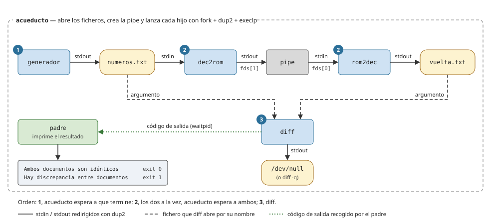
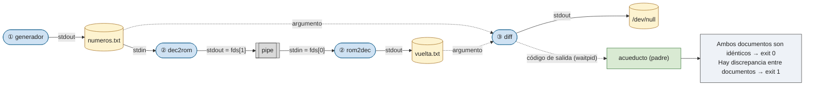

# P5 — Acueducto: ejercicio de procesos y pipes

## Descripción general

Escribir `acueducto.c`, un programa que lanza tres programas ya hechos, los conecta mediante ficheros y una tubería, y comprueba con `diff` que los números llegan al final sin alterarse. Se practica `fork`, `execlp` y `waitpid` ([P2](../02-procesos/)) junto con `pipe` y `dup2` ([P3](../03-pipes-y-fifos/)).

Los números siguen este camino:

```
generador --> numeros.txt --> dec2rom --pipe--> rom2dec --> vuelta.txt
```

## Arquitectura

<!-- Opción A: SVG -->


<!-- Opción B: mermaid -->


`acueducto` es el padre de los cuatro procesos: abre los ficheros, crea la pipe y hace las redirecciones en cada hijo antes de su `execlp`. El orden es: primero `generador` (1); cuando termina, `dec2rom` y `rom2dec` a la vez (2); cuando terminan los dos, `diff` (3).

## Programas dados

Se compilan y se usan tal cual, sin modificarlos. Leen de la entrada estándar y escriben en la salida estándar: no saben nada de ficheros ni de tuberías.

- [`generador.c`](generador.c): escribe 1000 números aleatorios entre 1 y 3999, uno por línea.
- [`dec2rom.c`](dec2rom.c): lee números decimales y escribe su número romano, uno por línea.
- [`rom2dec.c`](rom2dec.c): lee números romanos y escribe su valor decimal, uno por línea.

Encadenados desde la shell hacen lo mismo que tiene que hacer `acueducto`:

```bash
./generador > numeros.txt
./dec2rom < numeros.txt | ./rom2dec > vuelta.txt
diff numeros.txt vuelta.txt > /dev/null; echo $?     # 0: iguales, 1: distintos
```

## Qué debe hacer `acueducto.c`

1. Lanzar `generador` con su salida estándar redirigida a `numeros.txt` y esperar a que termine.
2. Crear una pipe y lanzar `dec2rom` (entrada: `numeros.txt`; salida: la pipe) y `rom2dec` (entrada: la pipe; salida: `vuelta.txt`). Esperar a que terminen los dos.
3. Lanzar `diff numeros.txt vuelta.txt` sin que se vean las diferencias y esperar a que termine.
4. Según el código de salida de `diff`, escribir por la salida estándar una de estas dos líneas y terminar:

| `diff` devuelve | `acueducto` escribe | `acueducto` termina con |
|---|---|---|
| `0` | `Ambos documentos son idénticos` | `0` |
| otro valor | `Hay discrepancia entre documentos` | `1` |

Requisitos:

- Cada programa se lanza con `fork` + `execlp` y se espera con `waitpid`. No se puede usar `system()`, `popen()` ni lanzar una shell (`sh -c`).
- Las redirecciones las hace `acueducto` en cada hijo, entre el `fork` y el `execlp`, con `open` y `dup2`.
- `numeros.txt` y `vuelta.txt` se crean si no existen y se sobrescriben si existen.
- La salida de `diff` no debe verse: redirígela a `/dev/null` o lanza `diff -q` (con `-q`, si los ficheros difieren, `diff` escribe una única línea avisándolo).
- El directorio actual no está en el `PATH`, así que los programas dados se lanzan con su ruta: `execlp("./dec2rom", "dec2rom", NULL)`. `diff` sí está en el `PATH`.
- Compila sin *warnings* con `-Wall`.

## Compilación y ejecución

```bash
gcc -Wall -o generador generador.c
gcc -Wall -o dec2rom dec2rom.c
gcc -Wall -o rom2dec rom2dec.c
gcc -Wall -o acueducto acueducto.c
./acueducto
```

## Pasos sugeridos

Cada paso amplía el anterior. `acueducto` genera un `numeros.txt` nuevo en cada ejecución, así que las comprobaciones se hacen justo después de ejecutarlo.

1. **`generador` → `numeros.txt`.**
   *Debe salir:* nada por pantalla.
   *Prueba:*

   ```
   $ rm -f numeros.txt; ./acueducto
   $ wc -l numeros.txt
   1000 numeros.txt
   $ sort -n numeros.txt | sed -n '1p;$p'      # mínimo y máximo
   3
   3996
   ```

   El mínimo debe ser ≥ 1, el máximo ≤ 3999, y cada ejecución genera números distintos (`head -3 numeros.txt`).

2. **`dec2rom` leyendo de `numeros.txt`**, de momento con su salida en pantalla.
   *Debe salir:* 1000 números romanos, uno por línea.
   *Prueba:*

   ```
   $ ./acueducto | wc -l
   1000
   $ ./acueducto > romanos.txt; ./dec2rom < numeros.txt | diff - romanos.txt; echo $?
   0
   ```

   Si a veces salen menos de 1000 líneas o `diff` muestra diferencias, `dec2rom` empieza a leer antes de que `generador` haya terminado de escribir.

3. **Pipe y `rom2dec` → `vuelta.txt`.**
   *Debe salir:* nada por pantalla, y `acueducto` debe terminar solo.
   *Prueba:*

   ```
   $ ./acueducto
   $ wc -l vuelta.txt
   1000 vuelta.txt
   $ diff numeros.txt vuelta.txt; echo $?
   0
   ```

   Si `acueducto` se queda colgado, `rom2dec` está esperando un fin de fichero que no llega porque algún proceso mantiene abierto el extremo de escritura de la pipe. Desde otra terminal:

   ```bash
   pstree -p $(pgrep -o acueducto)    # qué hijos siguen vivos
   ls -l /proc/<pid>/fd                # descriptores abiertos de ese proceso: busca pipe:[...]
   ```

4. **`diff` y resultado.**
   *Debe salir:*

   ```
   $ ./acueducto; echo $?
   Ambos documentos son idénticos
   0
   ```

   Lo mismo tras `rm -f numeros.txt vuelta.txt`.
   *Prueba del otro caso:* sustituye temporalmente `./rom2dec` por `cat` en su `execlp`, así `vuelta.txt` contendrá números romanos:

   ```
   $ ./acueducto; echo $?
   Hay discrepancia entre documentos
   1
   ```

   No debe aparecer ninguna línea de `diff` (con `-q`, solo la que avisa de que difieren).

## Validar con `strace`

`strace -f` sigue también a los hijos. Con `-o` la traza se guarda en un fichero y cada línea empieza por el pid del proceso que hace la llamada ([P0](../00-shell-y-herramientas/#strace--mostrar-llamadas-al-sistema)):

```bash
strace -f -o traza.txt -e trace=%process,pipe,pipe2,openat,dup2,close ./acueducto
less traza.txt
```

Cómo leerla:

- Lo anterior al primer `clone` es el arranque de `acueducto` (carga de bibliotecas) y se puede ignorar.
- Cada `clone(...) = 5001` es un `fork`: el valor devuelto es el pid del hijo.
- De cada hijo interesa lo que hace entre su creación y su `execve`, que son las redirecciones. Lo que viene después del `execve` ya es el programa lanzado, cargando sus bibliotecas.
- `<unfinished ...>` y `<... resumed>` marcan una llamada que se ha quedado bloqueada (por ejemplo un `wait4`) mientras otros procesos seguían.
- Los pids y los números de descriptor cambian en cada ejecución. Según la versión, la pipe aparece como `pipe(...)` o `pipe2(..., 0)`.

Ejemplo (recortado) del paso 1, con `acueducto` = 5000 y `generador` = 5001:

```
5000  clone(child_stack=NULL, flags=CLONE_CHILD_CLEARTID|CLONE_CHILD_SETTID|SIGCHLD, child_tidptr=0x7f3a1c5d7a10) = 5001
5000  wait4(5001,  <unfinished ...>
5001  openat(AT_FDCWD, "numeros.txt", O_WRONLY|O_CREAT|O_TRUNC, 0644) = 3
5001  dup2(3, 1)                        = 1
5001  close(3)                          = 0
5001  execve("./generador", ["generador"], 0x7ffd2c1a8e58 /* 26 vars */) = 0
...
5001  exit_group(0)                     = ?
5001  +++ exited with 0 +++
5000  <... wait4 resumed>NULL, 0, NULL) = 5001
```

Qué comprobar en la traza completa:

- `acueducto` hace cuatro `clone` y hay cuatro `execve` que terminan en `= 0`: `./generador`, `./dec2rom`, `./rom2dec` y `diff`. Antes del de `diff` aparecen varios `execve(...) = -1 ENOENT`: es `execlp` probando los directorios del `PATH` hasta encontrarlo.
- El `wait4` de `generador` termina antes del `clone` de `dec2rom`.
- Cada hijo, antes de su `execve`, hace los `dup2` sobre 0 y/o 1 que le tocan y cierra los descriptores mayores que 2: el programa lanzado solo debe tener abiertos 0, 1 y 2.
- `acueducto` cierra los dos extremos de la pipe antes de esperar a `dec2rom` y `rom2dec`.
- Los `wait4` de `dec2rom` y `rom2dec` terminan antes del `clone` de `diff`.
- El `wait4` de `diff` muestra `[{WIFEXITED(s) && WEXITSTATUS(s) == 0}]` (o `== 1`) y `acueducto` termina con `exit_group(0)` (o `1`).

## Llamadas al sistema útiles

`open(2)`, `close(2)` ([P1](../01-entrada-salida-y-ficheros/)); `fork(2)`, `execlp(3)`, `waitpid(2)` con `WIFEXITED` y `WEXITSTATUS` ([P2](../02-procesos/)); `pipe(2)`, `dup2(2)` ([P3](../03-pipes-y-fifos/)). Herramientas: `diff`, `strace`, `pstree`, `pgrep` ([P0](../00-shell-y-herramientas/)).
