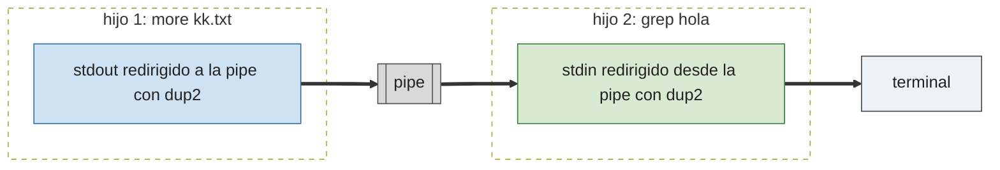

# P5 — Minishell

## Descripción general

Construir una shell (intérprete de comandos) usando las llamadas al sistema de gestión de procesos vistas en prácticas anteriores: `fork` y `wait` ([P2](../02-procesos/)), `pipe` y `dup2` ([P3](../03-pipes-y-fifos/)) y `signal` ([P4](../04-senales/)). La shell debe ejecutar cualquier comando del sistema, con tuberías (`|`) y redirección de entrada y salida (`<`, `>`, `>>`).

> Esta práctica va **antes** que memoria compartida y semáforos (P6).

## Especificaciones

- **Comandos con argumentos**: `minishell> cp -r sources backup`
- **Tubería** `|`: `more kk.txt | grep hola` — se crean dos procesos (uno ejecuta `more`, otro `grep`) intercomunicados por una pipe: la salida del primero se escribe en la tubería y la entrada del segundo se lee de ella.
- **Redirección de salida** `> fichero`: `ls -al > kk.txt` (sobrescribe).
- **Anexión a fichero** `>> fichero`: como `>` pero añade al final, sin sobrescribir.
- **Redirección de entrada** `< fichero`: `wc -l < kk.txt`.
- **Redirección simultánea** de entrada y salida, en cualquier orden.
- **Prompt** personalizado: `minishell> `
- La ejecución concluye al introducir `exit` o pulsar `Ctrl-C`.
- Los comandos se leen **siempre de teclado**, de forma interactiva; no hace falta soportar leerlos de un fichero de script.

Tubería `more kk.txt | grep hola` — cada comando es un hijo; `dup2` conecta sus descriptores estándar a la pipe:



Redirección `orden < entrada > salida` — se abre el fichero y se duplica sobre el descriptor 0 ó 1 antes del `execvp`:


## Construcción paso a paso

La shell se monta por capas: primero leer una línea, luego ejecutarla como comando sin argumentos, luego con argumentos, luego con redirecciones. Cada paso amplía el anterior; al final todo se encapsula en una única función `ejecuta()`.

### 1. Leer una línea de teclado

```c
#include <stdio.h>
#include <string.h>
#define MAX_LINEA 256

int lee_linea(char *linea, int tam) {
    if (fgets(linea, tam, stdin) == NULL) return 0;    /* fin de fichero, Ctrl-D */
    linea[strcspn(linea, "\n")] = '\0';                /* quita el salto de línea final */
    return 1;
}

int main(void) {
    for (char linea[MAX_LINEA]; lee_linea(linea, MAX_LINEA); ) {
        printf("Leído: [%s]\n", linea);
    }
    printf("fin de entrada\n");
    return 0;
}
```

`fgets` deja el `\n` final dentro de la cadena (si cupo en el buffer); `strcspn(linea, "\n")` busca la posición del primer `\n` y ahí se corta la cadena con un `\0`.

Ejemplo de ejecución:

```
$ ./paso1
hola
Leído: [hola]
ls -al
Leído: [ls -al]
^D
fin de entrada
```

### 2. Crear un hijo que ejecute el comando (sin argumentos)

Se combina el bucle anterior con `fork` + `execvp`, tratando de momento toda la línea como el nombre de un único programa sin argumentos:

```c
#include <stdio.h>
#include <string.h>
#include <unistd.h>
#include <sys/wait.h>
#define MAX_LINEA 256

int main(void) {
    for (char linea[MAX_LINEA]; fgets(linea, MAX_LINEA, stdin) != NULL; ) {
        linea[strcspn(linea, "\n")] = '\0';

        pid_t pid = fork();
        if (pid == 0) {                              /* hijo */
            char *argv[] = { linea, NULL };
            execvp(argv[0], argv);
            perror("execvp");
            _exit(1);
        }
        waitpid(pid, NULL, 0);                        /* padre: espera a que termine */
    }
    return 0;
}
```

Ejemplo de ejecución:

```
$ ./paso2
pwd
/home/alumno/ssoo/PRACTICA/05-minishell
fecha
execvp: No such file or directory
date
lun 21 sep 2026 10:15:03 CEST
^D
$
```

### 3. Comandos con varios argumentos: `str_split`

`execvp` necesita un array `argv[]` con un puntero por palabra (terminado en `NULL`), no la línea completa. Hace falta trocear la línea por los espacios:

```c
#include <string.h>
#define MAX_ARGS 32

int str_split(const char *str, char *argv[], int max_args) {
    static char copia[MAX_LINEA];      /* copia interna: strtok modifica la cadena */
    strncpy(copia, str, MAX_LINEA - 1);
    copia[MAX_LINEA - 1] = '\0';

    int argc = 0;
    for (char *token = strtok(copia, " \t"); token != NULL && argc < max_args - 1; token = strtok(NULL, " \t")) {
        argv[argc++] = token;
    }
    argv[argc] = NULL;
    return argc;
}
```

- `copia` es `static` para que siga viva después de que `str_split` retorne: `argv[]` guarda punteros *dentro* de `copia`, así que tiene que sobrevivir a la llamada. Cada llamada a `str_split` sobrescribe la copia anterior, así que hay que usar el `argv[]` resultante antes de volver a llamarla.
- **Devuelve** el número de fragmentos encontrados (`argc`); si la línea está vacía, `0`.

Uso en el bucle del paso 2, sustituyendo el `argv` fijo:

```c
char *argv[MAX_ARGS];
if (str_split(linea, argv, MAX_ARGS) == 0) continue;   /* línea vacía */

pid_t pid = fork();
if (pid == 0) {
    execvp(argv[0], argv);
    perror("execvp");
    _exit(1);
}
waitpid(pid, NULL, 0);
```

Ejemplo de ejecución:

```
$ ./paso3
ls -al
total 24
drwxr-xr-x 2 alumno alumno 4096 sep 21 10:00 .
drwxr-xr-x 9 alumno alumno 4096 sep 21 09:58 ..
-rw-r--r-- 1 alumno alumno  612 sep 21 10:00 minishell.c
cp -r sources backup
who
alumno   tty1         2026-09-21 10:03
^D
$
```

### 4. Redirecciones de entrada y salida

Antes del `execvp`, si hace falta redirigir, se abre el fichero y se duplica sobre el descriptor 0 (entrada) o 1 (salida) con `dup2`. Ejemplo fijo, redirigiendo la salida de `ls -al` a un fichero:

```c
#include <fcntl.h>
#include <unistd.h>

int fichero = open("salida.txt", O_WRONLY | O_CREAT | O_TRUNC, 0644);
pid_t pid = fork();
if (pid == 0) {                            /* hijo */
    dup2(fichero, STDOUT_FILENO);          /* STDOUT_FILENO pasa a apuntar a "salida.txt" */
    close(fichero);
    char *argv[] = { "ls", "-al", NULL };
    execvp(argv[0], argv);
    perror("execvp");
    _exit(1);
}
close(fichero);                            /* el padre no necesita este descriptor */
waitpid(pid, NULL, 0);
```

Para `<` es igual pero con `O_RDONLY` y `dup2(fichero, STDIN_FILENO)`; para `>>` se cambia `O_TRUNC` por `O_APPEND`.

Ejemplo de ejecución:

```
$ ./paso4
$ cat salida.txt
total 24
drwxr-xr-x 2 alumno alumno 4096 sep 21 10:00 .
drwxr-xr-x 9 alumno alumno 4096 sep 21 09:58 ..
-rw-r--r-- 1 alumno alumno  612 sep 21 10:00 minishell.c
```

## La función `ejecuta`

Los cuatro pasos anteriores se encapsulan en una única función: crea el hijo, redirige entrada y/o salida si se le pide, trocea el comando y lo ejecuta.

```c
#include <stdio.h>
#include <stdlib.h>
#include <string.h>
#include <unistd.h>
#include <fcntl.h>
#include <sys/wait.h>
#define MAX_LINEA 256
#define MAX_ARGS 32

int str_split(const char *str, char *argv[], int max_args) {
    static char copia[MAX_LINEA];
    strncpy(copia, str, MAX_LINEA - 1);
    copia[MAX_LINEA - 1] = '\0';

    int argc = 0;
    for (char *token = strtok(copia, " \t"); token != NULL && argc < max_args - 1; token = strtok(NULL, " \t")) {
        argv[argc++] = token;
    }
    argv[argc] = NULL;
    return argc;
}

/* Ejecuta 'comando' en un proceso hijo.
 * fd_input:  descriptor a duplicar sobre la entrada estándar, o -1 para no redirigir.
 * fd_output: descriptor a duplicar sobre la salida estándar, o -1 para no redirigir.
 * Devuelve el pid del hijo creado, o -1 si hay algún error. No espera a que termine. */
int ejecuta(const char *comando, int fd_input, int fd_output) {
    char *argv[MAX_ARGS];
    if (str_split(comando, argv, MAX_ARGS) == 0) return -1;   /* línea vacía */

    pid_t pid = fork();
    if (pid < 0) return -1;

    if (pid == 0) {                            /* hijo */
        if (fd_input != -1) {
            dup2(fd_input, STDIN_FILENO);
            close(fd_input);
        }
        if (fd_output != -1) {
            dup2(fd_output, STDOUT_FILENO);
            close(fd_output);
        }
        execvp(argv[0], argv);
        perror("execvp");
        _exit(1);
    }
    return pid;                                /* padre */
}
```

El padre es responsable de esperar al pid devuelto (`waitpid`) y de cerrar, después de llamar a `ejecuta`, cualquier descriptor de pipe que le haya pasado (el hijo ya se queda con su copia via `dup2`).

Uso directo, sin redirección:

```c
int pid = ejecuta("ls -al", -1, -1);
waitpid(pid, NULL, 0);
```

Uso con redirección de salida:

```c
int fichero = open("salida.txt", O_WRONLY | O_CREAT | O_TRUNC, 0644);
int pid = ejecuta("ls -al", -1, fichero);
close(fichero);                    /* el padre ya no lo necesita */
waitpid(pid, NULL, 0);
```

## Llamadas al sistema útiles

`fork(2)`, `execvp(3)`, `wait(2)`/`waitpid(2)`, `open(2)`, `close(2)`, `dup2(2)`, `pipe(2)`, `signal(2)`. Ver las prácticas [P2](../02-procesos/), [P3](../03-pipes-y-fifos/) y [P4](../04-senales/) para sus descripciones detalladas.

## Entrega de la práctica

El comprimido a entregar debe incluir el `Makefile` y todos los `.c`/`.h` necesarios para crear `minishell` (en un único `minishell.c`, sin repartir el programa en varios ficheros `.c`). La acción por defecto de `make` debe crear el ejecutable de la shell; también debe responder a `make prueba`, que compila y ejecuta un caso de prueba sencillo (por ejemplo, el ejercicio 1). Para la corrección se borran los ejecutables, se hace `touch` a los fuentes y se recompila.

## Ejercicios propuestos

1. Usando **directamente** la función `ejecuta()` ya dada (sin bucle de lectura ni parseo de línea), escribe un programa que monte a mano la tubería equivalente a `ls -al | grep alumno | wc`: tres procesos y dos pipes.

   Pista: hace falta una `pipe()` por cada `|`; en el padre, cerrar cada extremo de pipe justo después de habérselo pasado al hijo correspondiente (si no, `wc` nunca ve el fin de fichero y se queda esperando):

   ```c
   int pipe1[2], pipe2[2];
   pipe(pipe1);
   pipe(pipe2);

   int pid1 = ejecuta("ls -al", -1, pipe1[1]);
   close(pipe1[1]);

   int pid2 = ejecuta("grep alumno", pipe1[0], pipe2[1]);
   close(pipe1[0]);
   close(pipe2[1]);

   int pid3 = /* completar: wc lee de pipe2[0], sin redirigir la salida */;
   close(pipe2[0]);

   waitpid(pid1, NULL, 0);
   waitpid(pid2, NULL, 0);
   waitpid(pid3, NULL, 0);
   ```

   Ejemplo de ejecución:

   ```
   $ ./ejercicio1
         3      15      98
   ```

2. **Minishell, paso 1 — bucle y ejecución simple.** Bucle con el prompt `minishell> ` que lee una línea con `lee_linea` y, para cada una, llama a `ejecuta(linea, -1, -1)` y espera con `waitpid` a que termine antes de pedir la siguiente. Todavía sin tuberías ni redirecciones. Termina si la línea es `exit` o al llegar a fin de fichero (`Ctrl-D`).

   Ejemplo de ejecución:

   ```
   $ ./minishell
   minishell> ls -al
   total 24
   drwxr-xr-x 2 alumno alumno 4096 sep 21 10:00 .
   -rw-r--r-- 1 alumno alumno  612 sep 21 10:00 minishell.c
   minishell> whoami
   alumno
   minishell> exit
   $
   ```

3. **Minishell, paso 2 — redirecciones.** Antes de llamar a `ejecuta`, busca en la línea los símbolos `<`, `>` o `>>`. Si aparecen, separa el nombre del fichero del resto del comando, ábrelo con las *flags* adecuadas (`O_RDONLY`; `O_WRONLY | O_CREAT | O_TRUNC`; `O_WRONLY | O_CREAT | O_APPEND`) y pasa ese descriptor a `ejecuta` en vez de `-1`. Si no hay redirección, sigue pasando `-1`.

   Ejemplo de ejecución:

   ```
   minishell> ls -al > listado.txt
   minishell> wc -l < listado.txt
   5
   minishell> echo otra línea >> listado.txt
   ```

4. **Minishell, paso 3 — una tubería.** Si la línea contiene `|`, divide el texto en comando izquierdo y comando derecho (por ejemplo con `strstr` o `strtok` sobre una copia de la línea), crea una `pipe()` y llama dos veces a `ejecuta`: la primera con `fd_output` apuntando a la escritura de la pipe, la segunda con `fd_input` apuntando a su lectura. No olvides cerrar ambos extremos en el padre después de pasarlos. Combínalo con las redirecciones del ejercicio anterior si aparecen en el primer o el último tramo.

   Ejemplo de ejecución:

   ```
   minishell> ls -al | grep minishell
   -rwxr-xr-x 1 alumno alumno 16840 sep 21 10:05 minishell
   -rw-r--r-- 1 alumno alumno   612 sep 21 10:00 minishell.c
   minishell> cat listado.txt | wc -l > cuenta.txt
   ```

5. **Minishell, paso 4 (ampliación) — varias tuberías.** Generaliza el ejercicio anterior para que la línea pueda tener un número cualquiera de `|`, como en el ejercicio 1 pero parseando la línea en vez de escribir cada `ejecuta` a mano.

   Ejemplo de ejecución:

   ```
   minishell> ls -al | grep alumno | wc
         3      15      98
   ```

6. **Minishell, paso 5 — `Ctrl-C`.** Sin más, `Ctrl-C` mata a la minishell (acción por defecto de `SIGINT`). Instala un manejador (ver [P4](../04-senales/)) para que la shell lo ignore y siga pidiendo comandos en vez de terminar.
