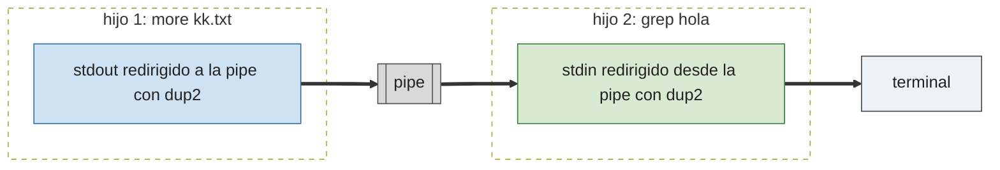

# P5 — Minishell

## Descripción general

Construir una shell (intérprete de comandos) usando procesos: `fork` y `wait` ([P2](../02-procesos/)) y tuberías `pipe` y `dup2` ([P3](../03-pipes-y-fifos/)). La shell debe ejecutar comandos del sistema, con tuberías (`|`) y redirección de entrada y salida (`<`, `>`).


## Especificaciones

- **Comandos con argumentos**: `minishell> cp -r sources backup`
- **Tubería** `|`: `more kk.txt | grep hola` — se crean dos procesos (uno ejecuta `more`, otro `grep`) intercomunicados por una pipe: la salida del primero se redirije a la tubería[1] y la entrada del segundo lee de la tubería[0].
- **Redirección de salida** `> fichero`: `ls -al > kk.txt` (sobrescribe).
- **Redirección de entrada** `< fichero`: `wc -l < kk.txt`.
- **Redirección simultánea** de entrada y salida, en cualquier orden.
- **Prompt** personalizado: `minishell> `
- La ejecución concluye al introducir `exit` o pulsar `Ctrl-C`.

Tubería `more kk.txt | grep hola` — cada comando es un hijo; `dup2` conecta sus descriptores estándar a la pipe:



Redirección `orden < entrada > salida` — se abre el fichero y se duplica sobre el descriptor 0 ó 1 antes del `execvp`:


## Construcción paso a paso

La shell se monta por capas: primero leer una línea, luego ejecutarla como comando sin argumentos, luego con argumentos, luego con redirecciones. Cada paso amplía el anterior; al final todo se encapsula en una única función `ejecuta()`.

### 1. Leer una línea de teclado

```c
#include <stdio.h>
#include <string.h>
#define MAX_LINEA 256

int main(void) {
    for (char linea[MAX_LINEA]; fgets(linea, MAX_LINEA, stdin) != NULL; ) {
        linea[strcspn(linea, "\n")] = '\0'; //quitar salto de línea
        printf("Leído: [%s]\n", linea);
    }
    printf("fin de entrada\n");
    return 0;
}
```

`fgets` deja el `\n` final dentro de la cadena (si cupo en el buffer); `strcspn(linea, "\n")` busca la posición del primer `\n` y ahí se termina la cadena con un `\0`.

Ejemplo de ejecución:

```
$ ./paso1
hola
Leído: [hola]
ls -al
Leído: [ls -al]
^D
fin de entrada
```

### 2. Crear un hijo que ejecute el comando

Se combina el bucle anterior con `fork` + `execvp`, tratando de momento toda la línea como el nombre de un único programa sin argumentos:

```c
#include <stdio.h>
#include <string.h>
#include <unistd.h>
#include <sys/wait.h>
#define MAX_LINEA 256

int main(void) {
    for (char linea[MAX_LINEA]; fgets(linea, MAX_LINEA, stdin) != NULL; ) {
        linea[strcspn(linea, "\n")] = '\0';
        pid_t pid = fork();
        if (pid == 0) {  //hijo
            execlp(linea, linea, NULL);
            exit(1);
        }
        waitpid(pid, NULL, 0); //padre espera al hijo
    }
    return 0;
}
```

Ejemplo de ejecución:

```
$ ./paso2
pwd
/home/alumno/ssoo/PRACTICA/05-minishell
fecha
execvp: No such file or directory
date
lun 21 sep 2026 10:15:03 CEST
^D
$
```

### 3. Comandos con varios argumentos: `str_split`

`execvp` necesita un array `argv[]` con un puntero por palabra (terminado en `NULL`). Hace falta trocear la línea:

```c
int str_split(char *str, char *palabras[], int max_palabras) {
    int argc = 0;
    int dentro_palabra = 0;
    for (int i = 0; str[i] != '\0'; i++) {
        if (str[i] == ' ' || str[i] == '\t') {
            str[i] = '\0';
            dentro_palabra = 0;
        } else if (!dentro_palabra) {
            if (argc < max_palabras - 1) 
                palabras[argc++] = &str[i];
            dentro_palabra = 1;
        }
    }
    palabras[argc] = NULL;
    return argc;
}
```

- Modifica `str` directamente: cada espacio o tabulador se sustituye por `'\0'`. `palabras[]` guarda los punteros a donde empieza cada palabra.
- **Devuelve** el número de palabras encontradas.
- Como modifica `str` en el sitio, no vale pasarle una cadena literal (`str_split("ls -al", ...)` daría fallo de segmentación); tiene que ser un array modificable, como `linea`.

Uso en el bucle del paso 2, sustituyendo el `argv` fijo:

```c
pid_t pid = fork();
if (pid == 0) {
    char *palabras[MAX_ARGS];
    str_split(linea, palabras, MAX_ARGS);
    execvp(palabras[0], palabras);
    exit(1);
}
waitpid(pid, NULL, 0);
```

Ejemplo de ejecución:

```
$ ./paso3
ls -al
total 24
drwxr-xr-x 2 alumno alumno 4096 sep 21 10:00 .
drwxr-xr-x 9 alumno alumno 4096 sep 21 09:58 ..
-rw-r--r-- 1 alumno alumno  612 sep 21 10:00 minishell.c
cp -r sources backup
who
alumno   tty1         2026-09-21 10:03
^D
$
```

### 4. Redirecciones de entrada y salida

Antes del `execvp`, si hace falta redirigir, se abre el fichero y se duplica sobre el descriptor 0 (entrada) o 1 (salida) con `dup2`. Ejemplo fijo, redirigiendo la salida de `ls -al` a un fichero:

```c
#include <fcntl.h>
#include <unistd.h>

//abre el fichero para escritura, creándolo y vaciándolo si existe.
int fichero = open("salida.txt", O_WRONLY | O_CREAT | O_TRUNC, 0644);
pid_t pid = fork();
if (pid == 0) {                            /* hijo */
    dup2(fichero, STDOUT_FILENO);
    execlp("ls", "ls", "-al", NULL);
    exit(1);
}
close(fichero);
waitpid(pid, NULL, 0);
```

Ejemplo de ejecución:

```
$ ./paso4
$ cat salida.txt
total 24
drwxr-xr-x 2 alumno alumno 4096 sep 21 10:00 .
drwxr-xr-x 9 alumno alumno 4096 sep 21 09:58 ..
-rw-r--r-- 1 alumno alumno  612 sep 21 10:00 minishell.c
```

Ejemplo con `<`, contando las líneas de `salida.txt` (el fichero generado arriba) con `wc -l`:

```c
int fichero = open("salida.txt", O_RDONLY);
pid_t pid = fork();
if (pid == 0) {                            /* hijo */
    dup2(fichero, STDIN_FILENO);
    execlp("wc", "wc", "-l", NULL);
    exit(1);
}
close(fichero);
waitpid(pid, NULL, 0);
```

Ejemplo de ejecución:

```
$ ./paso4b
4
```

## La función `ejecuta`

El paso 4 se generaliza en una función que crea el hijo, redirige entrada y/o salida si se le pide, y ejecuta el comando ya troceado en `palabras[]` (el troceado con `str_split` se hace una sola vez, antes de llamar a `ejecuta`, y sirve tanto para un comando suelto como para cada tramo de una tubería):

```c
#include <stdio.h>
#include <stdlib.h>
#include <string.h>
#include <unistd.h>
#include <fcntl.h>
#include <sys/wait.h>
#define MAX_LINEA 256
#define MAX_ARGS 32

int str_split(char *str, char *palabras[], int max_palabras) {
    int argc = 0;
    int dentro_palabra = 0;
    for (int i = 0; str[i] != '\0'; i++) {
        if (str[i] == ' ' || str[i] == '\t') {
            str[i] = '\0';
            dentro_palabra = 0;
        } else if (!dentro_palabra) {
            if (argc < max_palabras - 1) palabras[argc++] = &str[i];
            dentro_palabra = 1;
        }
    }
    palabras[argc] = NULL;
    return argc;
}

/* Ejecuta el comando ya troceado en palabras[] (terminado en NULL) en un hijo.
 * fd_input:  descriptor a duplicar sobre la entrada estándar (STDIN_FILENO o 0 si no hay que redirigir).
 * fd_output: descriptor a duplicar sobre la salida estándar (STDOUT_FILENO o 1 si no hay que redirigir).
 * Devuelve el pid del hijo creado, o -1 si hay algún error. */
int ejecuta(char *palabras[], int fd_input, int fd_output) {
    pid_t pid = fork();
    if (pid < 0) return -1;

    if (pid == 0) {                            /* hijo */
        dup2(fd_input, STDIN_FILENO);          /* si fd_input ya es STDIN_FILENO, dup2 no hace nada */
        dup2(fd_output, STDOUT_FILENO);
        execvp(palabras[0], palabras);
        exit(1);
    }
    return pid;                                /* padre */
}
```

Uso directo, sin redirección:

```c
char comando[] = "ls -al";
char *palabras[MAX_ARGS];
str_split(comando, palabras, MAX_ARGS);

int pid = ejecuta(palabras, STDIN_FILENO, STDOUT_FILENO);
waitpid(pid, NULL, 0);
```

Uso con redirección de salida:

```c
char comando[] = "ls -al";
char *palabras[MAX_ARGS];
str_split(comando, palabras, MAX_ARGS);

int fichero = open("salida.txt", O_WRONLY | O_CREAT | O_TRUNC, 0644);
int pid = ejecuta(palabras, STDIN_FILENO, fichero);
close(fichero);
waitpid(pid, NULL, 0);
```

## Ejercicios propuestos

1. Usando **directamente** la función `ejecuta()` ya dada (sin bucle de lectura ni parseo de línea), escribe un programa que haga lo equivalente a `ls -al | grep alumno | wc`: tres procesos y dos pipes.

   Pista: hace falta una `pipe()` por cada `|`; en el padre, cerrar cada extremo de pipe justo después de habérselo pasado al hijo correspondiente (si no, `wc` nunca ve el fin de fichero y se queda esperando):

   ```c
   char *cmd1[] = { "ls", "-al", NULL };
   char *cmd2[] = { "grep", "alumno", NULL };
   char *cmd3[] = { "wc", NULL };

   int pipe1[2], pipe2[2];
   pipe(pipe1);
   pipe(pipe2);

   int pid1 = ejecuta(cmd1, STDIN_FILENO, pipe1[1]);
   close(pipe1[1]);

   int pid2 = ejecuta(cmd2, pipe1[0], pipe2[1]);
   close(pipe1[0]);
   close(pipe2[1]);

   int pid3 = ejecuta(cmd3, pipe2[0], STDOUT_FILENO);
   close(pipe2[0]);

   waitpid(pid1, NULL, 0);
   waitpid(pid2, NULL, 0);
   waitpid(pid3, NULL, 0);
   ```

   Ejemplo de ejecución:

   ```
   $ ./ejercicio1
         3      15      98
   ```

2. **Minishell, paso 1 — bucle y ejecución simple.** Bucle con el prompt `minishell> ` que lee una línea (como en el paso 1), la trocea con `str_split` y llama a `ejecuta(palabras, STDIN_FILENO, STDOUT_FILENO)`, esperando con `waitpid` a que termine antes de pedir la siguiente. Todavía sin tuberías ni redirecciones. Termina si la línea es `exit` o al llegar a fin de fichero (`Ctrl-D`).

   Ejemplo de ejecución:

   ```
   $ ./minishell
   minishell> ls -al
   total 24
   drwxr-xr-x 2 alumno alumno 4096 sep 21 10:00 .
   -rw-r--r-- 1 alumno alumno  612 sep 21 10:00 minishell.c
   minishell> whoami
   alumno
   minishell> exit
   $
   ```

3. **Minishell, paso 2 — una sola redirección.** Ya tienes `palabras[]` y su número de elementos `n` (lo que devuelve `str_split`). Recorre `palabras[0..n)` buscando `"<"` o `">"`: al encontrar uno, abre con `open` el fichero indicado en la palabra *siguiente* con las *flags* adecuadas (`O_RDONLY`; `O_WRONLY | O_CREAT | O_TRUNC`), guarda el descriptor en `fd_input` o `fd_output`, y pon `NULL` justo en la posición donde estaba el símbolo. Así `palabras[]` queda cortado ahí mismo y sirve directamente como `argv` para `ejecuta`, sin tocar el resto del array:

   ```c
   int fd_input = STDIN_FILENO, fd_output = STDOUT_FILENO;
   int n = str_split(linea, palabras, MAX_ARGS);

   for (int i = 0; i < n; i++) {
       if (strcmp(palabras[i], "<") == 0) {
           fd_input = open(palabras[i + 1], O_RDONLY);
           palabras[i] = NULL;
       } else if (strcmp(palabras[i], ">") == 0) {
           fd_output = open(palabras[i + 1], O_WRONLY | O_CREAT | O_TRUNC, 0644);
           palabras[i] = NULL;
       }
   }

   int pid = ejecuta(palabras, fd_input, fd_output);
   waitpid(pid, NULL, 0);
   if (fd_input != STDIN_FILENO) close(fd_input);
   if (fd_output != STDOUT_FILENO) close(fd_output);
   ```

   Ejemplo de ejecución:

   ```
   minishell> ls -al > listado.txt
   minishell> wc -l < listado.txt
   5
   ```

4. **Minishell, paso 3 — una sola tubería.** Busca el índice de `"|"` dentro de `palabras[]`. Pon `NULL` ahí: eso parte el array en dos, el propio `palabras` y `&palabras[idx + 1]`. Crea una `pipe()` y llama dos veces a `ejecuta`: la primera con `fd_output` apuntando a la escritura de la pipe, la segunda con `fd_input` apuntando a su lectura. No olvides cerrar ambos extremos en el padre después de pasarlos.

   Ejemplo de ejecución:

   ```
   minishell> ls -al | grep minishell
   -rwxr-xr-x 1 alumno alumno 16840 sep 21 10:05 minishell
   -rw-r--r-- 1 alumno alumno   612 sep 21 10:00 minishell.c
   minishell> who | grep alumno
   alumno   tty1         2026-09-21 10:03
   minishell> ls | wc -l
   3
   ```

5. **Minishell, paso 4 — varias tuberías.** Generaliza el ejercicio anterior para que `palabras[]` pueda tener varios `"|"`. No hace falta localizar todos los `|` de golpe: basta con buscar el *siguiente* a partir del tramo actual, ejecutar ese tramo, y repetir con el resto del array hasta que no quede ningún `|`.

   ```c
   int fd_input = STDIN_FILENO;

   for (int idx_tramo = 0; ; ) {
       int idx = -1;
       //buscar el siguiente |
       for (int i = idx_tramo; palabras[i] != NULL; i++) {
           if (strcmp(palabras[i], "|") == 0) { idx = i; break; }
       }
       if (idx == -1) { //no hemos encontrado |, era el último tramo
           ejecuta(&palabras[idx_tramo], fd_input, STDOUT_FILENO);
           if (fd_input != STDIN_FILENO) close(fd_input);
           break;
       }

       palabras[idx] = NULL; //cortar el tramo donde estaba |
       int fds[2];
       pipe(fds);
       ejecuta(&palabras[idx_tramo], fd_input, fds[1]);
       close(fds[1]);
       if (fd_input != STDIN_FILENO) close(fd_input);

       fd_input = fds[0]; //será el input para el siguiente comando
       idx_tramo = idx + 1; //avanzar al siguiente tramo
   }

   while (wait(NULL) > 0) ; // esperamos a todos los hijos
   ```

   Ejemplo de ejecución:

   ```
   minishell> ls -al | grep alumno | wc
         3      15      98
   minishell> cat listado.txt | sort | uniq
   alumno
   backup
   sources
   minishell> ls | sort | grep .c | wc -l
   1
   ```

6. **Minishell, paso 5 (ampliación) — redirecciones en cada tramo.** Combina el ejercicio anterior con el paso 2: aplica a cada uno de los tramos la misma búsqueda de `"<"` y `">"` dentro de su propio trozo de `palabras[]`.

   Pista: el bucle de búsqueda de redirecciones del ejercicio 3 se puede aplicar tal cual a cada tramo, justo antes de llamar a `ejecuta` para ese tramo.

   Ejemplo de ejecución:

   ```
   minishell> cat < listado.txt | wc -l > cuenta.txt
   minishell> ls -al | grep alumno > salida.txt
   ```
