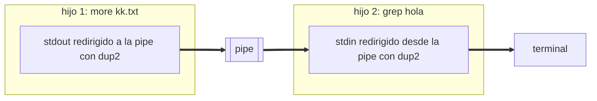

# P5 — Minishell

## Descripción general

Construir una shell (intérprete de comandos) usando las llamadas al sistema de manejo de
procesos (`fork`, `wait`, `exec`, `dup2`, `pipe`, `signal`, `open`, `close`) que permita
ejecutar cualquier comando del sistema, con tuberías (`|`) y redirección de entrada y
salida (`<`, `>`, `>>`). Pone en contexto los conceptos de las prácticas anteriores.

> Esta práctica va **antes** que memoria compartida y semáforos (P6).

## Especificaciones

- **Comandos con argumentos**: `minishell\> cp -r sources backup`
- **Tubería** `|`: `more kk.txt | grep hola` — se crean dos procesos (uno ejecuta `more`,
  otro `grep`) intercomunicados por una pipe: la salida del primero se escribe en la
  tubería y la entrada del segundo se lee de ella.
- **Redirección de salida** `> fichero`: `ls -al > kk.txt` (sobrescribe).
- **Anexión a fichero** `>> fichero`: como `>` pero añade al final, sin sobrescribir.
- **Redirección de entrada** `< fichero`: `wc -l < kk.txt`.
- **Redirección simultánea** de entrada y salida, en cualquier orden.
- **Prompt** personalizado: `minishell\>`
- La ejecución concluye al introducir `exit` o pulsar `Ctrl-C`.

Tubería `more kk.txt | grep hola` — cada comando es un hijo; `dup2` conecta sus
descriptores estándar a la pipe:



Redirección `orden < entrada > salida` — se abre el fichero y se duplica sobre el
descriptor 0 ó 1 antes del `execvp`:


## Biblioteca `fragmenta`

Se proporciona una pequeña biblioteca (`fragmenta.o` + `fragmenta.h`) para trocear la
línea de comandos en el array que necesita `execvp`.

```
FRAGMENTA(3)

NOMBRE
      fragmenta, borrarg — utilidades para trocear cadenas.

SINOPSIS
      #include "fragmenta.h"
      char **fragmenta(const char *cadena);
      void   borrarg(char **arg);

DESCRIPCIÓN
      fragmenta():  crea un array de char* con tantos elementos como fragmentos
                    encuentre en 'cadena' más uno; el último vale siempre NULL
                    (y es el único), y sirve para marcar el final del array. Cada
                    elemento apunta a un fragmento de 'cadena', en el mismo orden.
                    Los fragmentos se separan por uno o más espacios y pueden
                    terminar en fin de línea; los espacios sobrantes se descartan.
      borrarg():    libera la memoria asociada a 'arg' y a cada char* que apunta,
                    hasta el que vale NULL.

VALOR DEVUELTO
      fragmenta() devuelve el puntero al array creado, o NULL si no puede.
```

## Llamadas al sistema útiles

`fork(2)`, `execvp(3)`, `wait(2)`, `open(2)`, `close(2)`, `dup2(2)`, `pipe(2)`,
`signal(2)`. Ver las prácticas [P2](../02-procesos-e-hilos/), [P3](../03-pipes-y-fifos/)
y [P4](../04-senales/) para sus descripciones detalladas.

Esquema básico de ejecución de un comando:

```c
if ((pid = fork()) == 0) {          /* hijo */
    /* aplicar redirecciones con open + dup2 */
    execvp(argv[0], argv);
    perror("execvp");
    exit(1);
} else {                            /* padre */
    waitpid(pid, &status, 0);
}
```

## Entrega de la práctica

El comprimido a entregar debe incluir el `Makefile`, la biblioteca `fragmenta` (fuentes y
cabecera) y todos los `.c` y `.h` necesarios para crear `minishell`. La acción por defecto
de `make` debe crear el ejecutable de la shell; también debe responder a `make fragmenta`
y `make prueba`. Para la corrección se borran los ejecutables, se hace `touch` a los
fuentes y se recompila.

## Descripción (manual)

```
MSH(3)

NOMBRE
      minishell — Mini Shell

SINOPSIS
      msh

DESCRIPCIÓN
      Ejecución de comandos con un número indeterminado de argumentos.
      Redirección de la salida estándar a fichero mediante >.
      Redirección de la entrada estándar desde fichero mediante <.
      Redirección simultánea de entrada y salida, en cualquier orden.
```

## Ejercicio

Implementar `minishell` conforme a las especificaciones anteriores: bucle de lectura de
línea, troceado con `fragmenta`, comandos internos (`exit`), ejecución de externos con
`fork` + `execvp` + `wait`, redirecciones (`<`, `>`, `>>`) con `open` + `dup2`, tuberías
(`|`) con `pipe` + `dup2`, y manejo de `SIGINT`.
