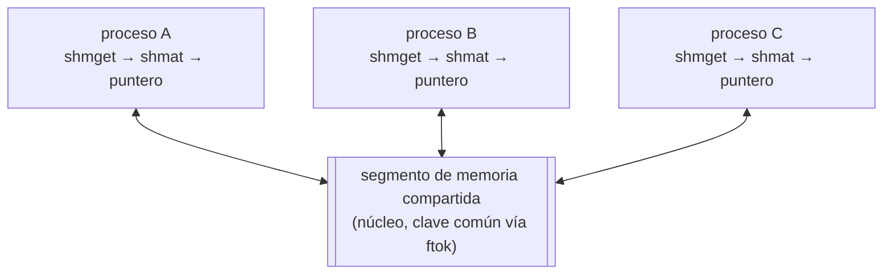
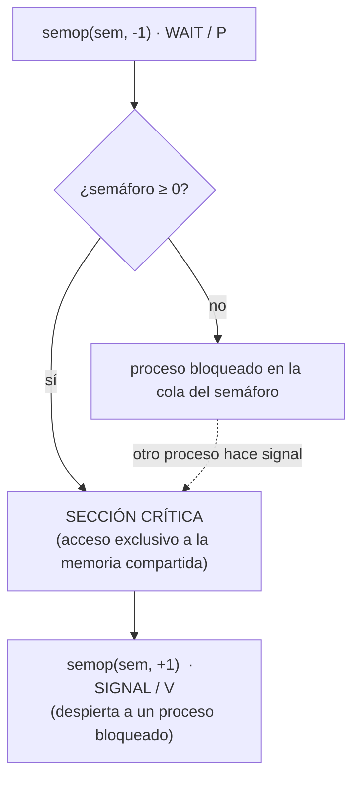

# P6 — Memoria compartida y semáforos

## Descripción general

La **memoria compartida** permite que dos o más procesos accedan a una misma zona de
memoria. Es el mecanismo IPC más rápido: una vez conectados los procesos trabajan
directamente con el puntero, sin más llamadas al sistema ni interacción con el núcleo. A
cambio, hay que garantizar el acceso en exclusiva para evitar inconsistencias.

Los **semáforos** son una herramienta de sincronización: permiten el acceso a un recurso
a un proceso y lo deniegan a los demás hasta que aquel concluya. Sus operaciones son
atómicas. Un semáforo debe garantizar exclusión mutua (un solo proceso en la sección
crítica), que un proceso fuera de su sección crítica no bloquee a otros y que el que está
en ella no bloquee para siempre al resto.

- **Binarios** (0/1): a 1 permiten el acceso a la sección crítica, a 0 lo bloquean.
  Útiles para exclusión mutua.
- **N-arios** (0..N): permiten que hasta N procesos trabajen concurrentemente en una
  tarea no crítica (p. ej. varios lectores).

Esta práctica usa la interfaz **System V IPC**. Los semáforos y la memoria compartida
**sobreviven a la muerte de los procesos que los crean**: hay que liberarlos siempre.

## Comandos comunes

`ipcs` (lista los recursos IPC: memoria compartida, semáforos, colas de mensajes),
`ipcrm` (elimina un recurso IPC por id), `lsipc`.

## Clave común: `ftok`

```c
#include <sys/types.h>
#include <sys/ipc.h>
key_t ftok(const char *path, int proj_id);
```

Convierte una ruta de fichero existente y un entero en una `key_t` (un `long`). Todos los
procesos que comparten el recurso deben usar el **mismo fichero y el mismo entero**.
Alternativa: `IPC_PRIVATE` como clave (el creador debe comunicar el id resultante).

## Memoria compartida

Varios procesos vinculan (`shmat`) el mismo segmento y obtienen un puntero a la misma
zona física; a partir de ahí trabajan con memoria normal, sin llamadas al sistema:



### `shmget` — crear / obtener

```c
#include <sys/ipc.h>
#include <sys/shm.h>
int shmget(key_t key, int size, int shmflg);
```

- `key`: clave (de `ftok` o `IPC_PRIVATE`).
- `size`: tamaño del segmento en bytes.
- `shmflg`: OR de permisos (`0640`, `SHM_R`, `SHM_W`) y opciones: `IPC_CREAT` (crea si no
  existe), `IPC_EXCL` (con `IPC_CREAT`, falla si ya existe).
- **Devuelve** el identificador del segmento, o `-1` y `errno` (`EEXIST` = ya existía).

```c
int shmid = shmget(IPC_PRIVATE, sizeof(int),
                   IPC_CREAT | IPC_EXCL | S_IRUSR | S_IWUSR);
if (shmid == -1) perror("shmget");
```

### `shmat` — vincular

```c
#include <sys/shm.h>
void *shmat(int shmid, const void *shmaddr, int shmflg);
```

Asocia el segmento al espacio del proceso. `shmaddr` normalmente `NULL` (lo elige el SO,
igual dirección lógica en todos los procesos). `shmflg & SHM_RDONLY` para sólo lectura.

- **Devuelve** la dirección de comienzo del segmento, o `(void *) -1` y `errno` si hay error.

```c
int *entero = (int *) shmat(shmid, NULL, 0);
if (entero == (int *) -1) { perror("shmat"); return -1; }
*entero = 10;
```

### `shmdt` — desvincular

```c
#include <sys/shm.h>
int shmdt(const void *shmaddr);
```

Desvincula el segmento del proceso. **Devuelve** `0` o `-1` y `errno`.

### `shmctl` — control / eliminación

```c
#include <sys/shm.h>
int shmctl(int shmid, int cmd, struct shmid_ds *buff);
```

- `cmd`: `IPC_STAT` (lee la estructura de control), `IPC_SET` (actualiza uid/gid/mode),
  `IPC_RMID` (elimina el segmento; efectivo cuando el último proceso lo desvincula),
  `SHM_LOCK` / `SHM_UNLOCK`.
- **Devuelve** `0` o `-1` y `errno`.

```c
if (shmctl(shmid, IPC_RMID, NULL) == -1) perror("shmctl IPC_RMID");
```

## Semáforos

Un semáforo binario protege la sección crítica (p. ej. la escritura en la memoria
compartida): `semop(-1)` para entrar, `semop(+1)` para salir.



### `semget` — obtener un array de semáforos

```c
#include <sys/types.h>
#include <sys/ipc.h>
#include <sys/sem.h>
int semget(key_t key, int nsems, int semflg);
```

- `nsems`: número de semáforos del array.
- `semflg`: permisos en octal (`0640`) OR `IPC_CREAT`.
- **Devuelve** el identificador del array, o `-1` y `errno`.

### `semctl` — inicialización y control

```c
#include <sys/types.h>
#include <sys/ipc.h>
#include <sys/sem.h>
int semctl(int semid, int semnum, int cmd, ... /* union semun arg */);

union semun {
    int             val;
    struct semid_ds *buf;
    unsigned short  *array;
};
```

- `semnum`: índice del semáforo dentro del array (empieza en 0).
- `cmd`: `SETVAL` (fija el valor a `arg.val`), `GETVAL` (devuelve el valor actual),
  `IPC_RMID` (elimina el conjunto; `semnum` se ignora).
- **Devuelve** según el comando, o `-1` y `errno`.

```c
union semun arg;
arg.val = 1;                          /* valor inicial: "verde" */
semctl(id_semaforo, 0, SETVAL, arg);  /* semáforo 0 del array = 1 */
```

### `semop` — operaciones wait / signal

```c
#include <sys/types.h>
#include <sys/ipc.h>
#include <sys/sem.h>
int semop(int semid, struct sembuf *sops, unsigned nsops);

struct sembuf {
    unsigned short sem_num;   /* índice del semáforo */
    short          sem_op;    /* -1 = wait, +1 = signal */
    short          sem_flg;   /* 0, IPC_NOWAIT, SEM_UNDO */
};
```

- `sem_op` negativo = operación **wait**: si el semáforo se volvería negativo, el proceso
  se bloquea hasta que otro lo incremente. `sem_op` positivo = operación **signal**: suma
  ese valor. Las operaciones de `sops` se realizan de forma atómica.
- **Devuelve** `0` o `-1` y `errno`.

```c
struct sembuf accion;
accion.sem_num = 0;
accion.sem_flg = 0;

accion.sem_op = -1;  semop(id_semaforo, &accion, 1);   /* WAIT: entrar en sección crítica */
/* ... sección crítica sobre la memoria compartida ... */
accion.sem_op =  1;  semop(id_semaforo, &accion, 1);   /* SIGNAL: salir */
```

### Eliminación

```c
semctl(id_semaforo, 0, IPC_RMID);   /* elimina el grupo semafórico */
```

## Ejercicios propuestos

1. Programa `memoria clave tamano` que cree una zona de memoria compartida de enteros del
   tamaño indicado, con la clave indicada, y permanezca en ejecución hasta que se pulse
   `Ctrl-C`; al recibir la señal libera la memoria compartida y finaliza ordenadamente.
2. Programa `escribir clave posicion valor` que acceda a la memoria compartida
   identificada por `clave` y actualice el entero `posicion`-ésimo al valor `valor`.
   Tener en cuenta que el acceso puede entrar en conflicto con otras lecturas/escrituras
   en curso.
3. Programa `leer clave posicion` que acceda a la memoria compartida `clave`, obtenga el
   entero `posicion`-ésimo y lo imprima por pantalla (con las mismas precauciones de
   concurrencia).
4. Programa `inicializar clave valor tamano` que inicialice toda la memoria compartida
   con `valor` (con las mismas precauciones de concurrencia).
