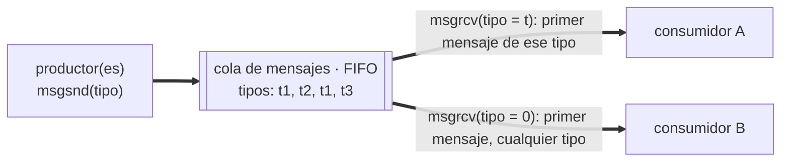

# P7 — Colas de mensajes

## Descripción general

En la comunicación por **colas de mensajes**, los procesos introducen mensajes que se
almacenan en la cola; al extraer un mensaje se obtiene el primero que se introdujo (FIFO)
y se borra de la cola. Cada mensaje va identificado por un **tipo** (un `long`), lo que
permite a los procesos retirar mensajes selectivamente según su tipo.

Esta práctica usa la interfaz **System V IPC**. Como la memoria compartida y los
semáforos, la cola **persiste** aunque terminen los procesos: hay que liberarla.



## Comandos comunes

`ipcs -q` (lista colas de mensajes), `ipcrm -q <id>` (elimina una cola), `lsipc`.

## Clave común: `ftok`

```c
#include <sys/types.h>
#include <sys/ipc.h>
key_t ftok(const char *path, int proj_id);
```

Todos los procesos que comparten la cola deben pasar el mismo fichero (existente y
accesible) y el mismo entero para obtener la misma clave.

## `msgget` — crear / obtener la cola

```c
#include <sys/types.h>
#include <sys/ipc.h>
#include <sys/msg.h>
int msgget(key_t key, int msgflg);
```

- `msgflg`: 9 bits de permisos en octal (`0666`) OR `IPC_CREAT` (crea la cola si no
  existe; si no se indica y no existe, error).
- **Devuelve** el identificador de la cola (si ya existía, el suyo), o `-1` y `errno`.

En resumen: `msgget(clave, 0666 | IPC_CREAT)`.

## Estructura del mensaje

El mensaje **debe** ser una estructura cuyo primer campo sea un `long` con el tipo:

```c
typedef struct {
    int    id_mensaje;
    double dato_numerico;
    char   contenido[10];
} mensaje_t;

typedef struct {
    long      mtype;     /* tipo de mensaje: entero positivo */
    mensaje_t mensaje;   /* carga útil: cualquier cosa */
} msgbuf_t;
```

## `msgsnd` — encolar un mensaje

```c
int msgsnd(int msqid, const void *msgp, size_t msgsz, int msgflg);
```

- `msgp`: puntero a la estructura del mensaje (cast a `msgbuf_t *`).
- `msgsz`: tamaño **en bytes de la carga útil, sin contar el `long`**
  (`sizeof(msgbuf_t) - sizeof(long)`).
- `msgflg`: `0` (bloquea hasta poder enviar; típicamente si la cola está llena) o
  `IPC_NOWAIT` (retorna de inmediato con error si no puede enviar).
- **Devuelve** `0` o `-1` y `errno`.

## `msgrcv` — desencolar un mensaje

```c
ssize_t msgrcv(int msqid, void *msgp, size_t msgsz, long msgtyp, int msgflg);
```

- `msgtyp`: tipo de mensaje a retirar. `> 0` un tipo concreto; `0` cualquier tipo.
- `msgflg`: `0` (bloquea hasta que haya un mensaje del tipo pedido) o `IPC_NOWAIT`
  (error inmediato si no lo hay).
- **Devuelve** el nº de bytes recibidos en la carga útil, o `-1` y `errno`.

## `msgctl` — control / liberación

```c
int msgctl(int msqid, int cmd, struct msqid_ds *buf);
```

Para liberar la cola: `cmd = IPC_RMID`, `buf = NULL`.

- **Devuelve** `0` o `-1` y `errno`.

## Ejemplo de uso

```c
#include <stdio.h>
#include <stdlib.h>
#include <string.h>
#include <sys/types.h>
#include <sys/ipc.h>
#include <sys/msg.h>

typedef struct { int id_mensaje; double dato_numerico; char contenido[10]; } mensaje_t;
typedef struct { long mtype; mensaje_t mensaje; } msgbuf_t;

int main(void) {
    key_t clave = ftok("/etc", 22);
    if (clave == (key_t) -1) exit(-1);

    int id_cola = msgget(clave, 0600 | IPC_CREAT);
    if (id_cola == -1) exit(-2);

    size_t carga = sizeof(msgbuf_t) - sizeof(long);
    msgbuf_t m = {0};

    m.mtype = 2;
    m.mensaje.id_mensaje = 1;
    m.mensaje.dato_numerico = 11.3;
    strcpy(m.mensaje.contenido, "Mensaje");
    msgsnd(id_cola, &m, carga, IPC_NOWAIT);

    msgrcv(id_cola, &m, carga, 2, 0);
    printf("ID: %d  Dato: %f  Contenido: %s\n",
           m.mensaje.id_mensaje, m.mensaje.dato_numerico, m.mensaje.contenido);

    msgctl(id_cola, IPC_RMID, NULL);
    return 0;
}
```

## Ejercicios propuestos

1. Dos programas que simulen el comportamiento productor/consumidor: uno produce mensajes
   que consume el otro (hasta un total de diez), usando una cola de mensajes. El tiempo
   que cada proceso emplea en producir o consumir un mensaje se pasa como argumento.

   ```
   productor  clave_cola periodo
   consumidor clave_cola periodo
   ```

2. Programa que cree cinco instancias del productor del ejercicio anterior, primero con
   igual periodo de producción y luego con periodos distintos, y evalúe qué ocurre en
   cada caso.
