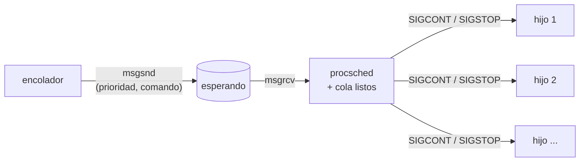

# P8 — Planificador de procesos

## Descripción general

Programar un planificador de procesos a nivel de usuario (`procsched`), apoyándonos en llamadas al sistema, y probarlo con distintos conjuntos de procesos.

- `procsched` recibe por una **cola de mensajes** (*esperando*) las peticiones de programas a ejecutar junto a su **prioridad** (1, 2 o 3).
- Por cada petición crea el proceso **pausado** y lo guarda en su cola de *listos*.
- Según las **políticas de planificación**, decide qué proceso de *listos* pasa a ejecución y durante cuánto tiempo.
- Para detener y reanudar procesos usa señales (`SIGSTOP` / `SIGCONT`), y para los turnos un temporizador (`ualarm` → `SIGALRM`).
- Un segundo programa, `encolador`, lee de teclado o de un fichero los programas a ejecutar y sus prioridades, y los manda a la cola *esperando* de `procsched`.

`procsched` solo tiene un hijo en ejecución; a los demás los mantiene parados.

## Arquitectura



- ***esperando***: cola de mensajes (permisos `0600`). El `mtype` es la prioridad (1–3) de una petición, o `4` para los [comandos especiales](#comandos-especiales-para-procsched). `procsched` lee con `msgtyp = -4`, que saca primero el `mtype` más bajo: los urgentes pasan delante y los comandos van detrás de las peticiones.
- ***listos***: una cola propia de `procsched` que se puede recorrer, implementada en [`cola.h`](cola.h).

Lo común a `procsched` y `encolador` va en `procsched.h`:

```c
// procsched.h
#define RUTA_CLAVE    "/etc"   //para ftok(RUTA_CLAVE, ID_PROJ)
#define ID_PROJ       22

#define MAX_COMANDO   256 //longitud máxima de una línea

#define TURNO_MS      15   // duración por defecto de un turno (niveles 2 y 3)
#define LATENCIA_MS   33   // espera máxima por defecto de los interactivos (nivel 2)

#define MTYPE_COMANDO 4    // mtype de los comandos especiales (mayor que cualquier prioridad)

typedef struct {
    long mtype;                 // prioridad (1, 2 o 3) o MTYPE_COMANDO=4
    char comando[MAX_COMANDO];  // "programa arg1 arg2 ...", o el comando: "turno 50"
} peticion_t;
```

`cola.h` define `proceso_t` (pid, prioridad, comando y `ultimo_ms`, el instante en que salió de CPU) y una cola sobre un array con `cola_encolar` (al final), `cola_desencolar` (de cualquier posición) y `COLA_FOR_EACH` para recorrerla. Primero se recorre para elegir y después se desencola:

```c
cola_t listos = { .n = 0 };
cola_encolar(&listos, p);

proceso_t *elegido = NULL;
COLA_FOR_EACH(&listos, q) {                      // recorrerla para elegir
    if (q->prioridad == 2 && (elegido == NULL || q->ultimo_ms < elegido->ultimo_ms)) {
        elegido = q;                             // el de nivel 2 que más lleva sin ejecutarse
    }
}
if (elegido != NULL) {
    proceso_t actual = cola_desencolar(&listos, elegido);   // fuera del bucle
    ...
}
```

### Bucle de `procsched`

1. **Admitir peticiones**: `msgrcv` sobre *esperando* con `IPC_NOWAIT`. Si es una petición, crea el hijo pausado (ver [Crear el hijo pausado](#crear-el-hijo-pausado)) y lo mete en *listos*; si es un comando, lo aplica.
2. **Planificar**: elige un proceso de *listos* según las [políticas](#políticas-de-planificación), fija una alarma `ualarm`, le manda `SIGCONT` al proceso elegido y espera con `pause()`.
3. **Desalojar**. `pause()` retorna por una de estas señales:
   - `SIGALRM`: se ha acabado el turno.
   - `SIGCHLD`: el hijo en ejecución ha terminado.

   Después actúa según el estado del hijo en ejecución:
   - si terminó (`waitpid(pid, &estado, WNOHANG) > 0`), cancela el temporizador con `ualarm(0, 0)` e imprime en consola `TERMINA` ver [registro](#registro-y-estadísticas).
   - si es de nivel 1, el planificador vuelve a `pause()` y el proceso de nivel 1 sigue ejecutándose.
   - si no, le manda `SIGSTOP` y lo mete al final de *listos*.

Si *listos* está vacía, `procsched` se bloqueará en `msgrcv` (sin `IPC_NOWAIT`) hasta que llegue algo. No hay que hacer nada especial.

Con `Ctrl-C` o el comando `fin`, `procsched` termina ordenadamente: mata a los hijos con `SIGKILL`, borra la cola (`msgctl` con `IPC_RMID`) y muestra las estadísticas.

## Políticas de planificación

| Prioridad | Tipo | Cuándo se ejecuta | Turno |
|---|---|---|---|
| 1 | urgente | En cuanto acaba el turno en curso (como mucho `turno_ms` después de llegar). Si hay varios, por orden de llegada. | hasta que termina |
| 2 | interactivo | Cuando lleva `>= latencia_ms` (33 ms por defecto) sin ejecutarse. Primero el que más lleve. | `turno_ms` |
| 3 | cálculo | Cuando todos los de nivel 2 llevan menos de `latencia_ms` sin ejecutarse. Round Robin. | `turno_ms` |

En el paso 2, `procsched` recorre *listos* y elige así:

1. ¿Hay alguno de nivel 1? → el primero, hasta que termine.
2. ¿Algún nivel 2 lleva `>= latencia_ms` sin ejecutarse? → el que más lleve.
3. ¿Hay alguno de nivel 3? → el primero.
4. ¿Hay alguno de nivel 2? → el que más lleve sin ejecutarse.

## Crear el hijo pausado

El hijo no debe hacer `execvp` hasta que `procsched` lo ponga en ejecución por primera vez. Poner un proceso en ejecución quedaría así:

```c
void despertar(int senal) {}

...
pid_t pid = fork();
if (pid == 0) {
    signal(SIGCONT, despertar);
    pause();                        // espera al primer SIGCONT de procsched
    execvp(args[0], args); 
    exit(127);
}
// rama padre: meter el proceso en listos
```

Para trocear `comando` en `args` puedes reutilizar `str_split` de [P5](../05-minishell/).

<!--
> **Condición de carrera.** Si el `SIGCONT` llega **antes** de que el hijo haya llegado a `pause()`, se pierde y el hijo se queda dormido para siempre. En la práctica es raro, porque `procsched` no lo reanuda hasta que le toca, pero es posible. La solución correcta es que el padre **bloquee** `SIGCONT` con `sigprocmask` antes del `fork`. El hijo hereda la máscara, instala el manejador y espera con `sigsuspend` (que desbloquea y espera de forma atómica). Después vuelve a desbloquear `SIGCONT` antes del `execvp`.
-->

## Señales en `procsched`

- **Manejadores vacíos**: `pause()` solo retorna si se ejecuta un manejador, así que `procsched` atiende a `SIGALRM` y `SIGCHLD` con un manejador vacío. El qué ha pasado no se deduce de la señal, sino del estado con `waitpid`.
- **`SIGCHLD` se usa con `SA_NOCLDSTOP`**: si no, cada `SIGSTOP` y `SIGCONT` que manda `procsched` generaría un `SIGCHLD` que lo despierta sin motivo (ver [P4](../04-senales/#captura-avanzada-sigaction)).
- **`msgrcv` interrumpido**: si llega una señal durante un `msgrcv` bloqueante, devuelve `-1` con `errno == EINTR`. No es un error: hay que repetirlo.

<!--
- **Carrera entre `ualarm` y `pause`**: con turnos de pocos ms, el `SIGALRM` o el `SIGCHLD` pueden llegar **antes** de que `procsched` llegue a `pause()`. En ese caso se pierde el aviso y el planificador se queda colgado. Para evitarlo, bloquea esas señales con `sigprocmask` antes de `ualarm`/`SIGCONT` y espera con `sigsuspend` en lugar de `pause`.
-->

### Temporizador: `ualarm`

```c
#include <unistd.h>
useconds_t ualarm(useconds_t usecs, useconds_t interval);
```

Como `alarm`, pero en **microsegundos** (`usecs < 1000000`). Con `interval = 0` avisa una sola vez; `ualarm(0, 0)` cancela. Un turno de 15 ms es `ualarm(15 * 1000, 0)`.

### Medir el tiempo

Para obtener el tiempo actual en milisegundos utilizar:

```c
#include <time.h>

long ahora_ms(void) {
    struct timespec t;
    clock_gettime(CLOCK_MONOTONIC, &t);
    return t.tv_sec * 1000 + t.tv_nsec / 1000000;
}
```

## Registro y estadísticas

`procsched` escribe por consola cuando entra un proceso nuevo, se recibe un comando, la entrada de un proceso urgente y un proceso que termina. Además en

```
NUEVO    pid 4312 (2) ./arkanoid 0 0
URGENTE  pid 4320 (1) ./factoriza 1000000016000000063
TERMINA  pid 4320 (1) ./factoriza 1000000016000000063
COMANDO  turno 50
```

También cuando recibe el comando stats o antes de terminar muestra estadísticas por nivel:

| Métrica | Qué mide |
|---|---|
| CPU | % del tiempo que han estado en ejecución los procesos de este nivel |
| Espera media | tiempo medio que espera un proceso del nivel desde que llega o desde su último turno hasta que vuelve a entrar en CPU |

Y en global, el tiempo total y los **cambios de contexto** (cada `SIGCONT` a un proceso distinto del anterior).

```
=== procsched: 12840 ms, 2154 cambios de contexto ===
nivel   CPU   espera media
  1     4 %      2 ms
  2    23 %     31 ms
  3    73 %     95 ms
```

<!-- 
### Opcional: interfaz de `procsched`

En lugar del registro, una pantalla que se redibuja cada ~100 ms con los procesos de *listos* y el que está en ejecución: pid, prioridad, comando, hace cuánto se ejecutó por última vez, y el turno y la latencia actuales. Basta con `printf` y secuencias de escape ANSI:

```c
printf("\033[H\033[2J");          // cursor arriba a la izquierda y borrar pantalla
printf("\033[%d;%dH", fila, col); // mover el cursor
printf("\033[31m%s\033[0m", s);   // texto en rojo (32 verde, 33 amarillo...) y volver al color normal
```
-->

## `encolador`

```
encolador [fichero]
```

Lee líneas del teclado (hasta `Ctrl-D`) o de un [fichero de ejecución](#ficheros-de-ejecución-txt) y las manda a la cola de mensajes *esperando*, que abre con `ftok(RUTA_CLAVE, ID_PROJ)`.

## Ficheros de ejecución (`.txt`)

Describen qué procesos se lanzan, con qué prioridad y cuándo. Cada línea es:

| Línea | Qué hace |
|---|---|
| `# ...` | Comentario: se ignora. |
| `prioridad programa arg1 ...` | Petición: se encola con `msgsnd`; `mtype = prioridad`. |
| `espera ms` | Espera `ms` milisegundos antes de procesar la siguiente línea. |
| `turno ms`, `latencia ms`, `estadisticas`, `fin` | Comandos especiales. se mandan con `mtype=4` |

```
# Este archivo pide lanzar 2 procesos de cálculo; espera 3 s y manda un proceso urgente
3 ./buddhabrot 0 0
3 ./raytracer 340 0
espera 3000
1 ./factoriza 1000000016000000063
```

### Comandos especiales para `procsched`

Se mandan a *esperando* como las peticiones, pero con `mtype = MTYPE_COMANDO` (4).

| Comando | Efecto |
|---|---|
| `turno ms` | Cambia TURNO_MS a `ms` milisegundos (1–999). |
| `latencia ms` | Cambia la espera máxima de los procesos interactivos. Más baja: interactivos más fluidos, pero menos CPU para el cálculo con más overhead de cambios de proceso. |
| `estadisticas` | Imprime las estadísticas. |
| `fin` | Termina `procsched` ordenadamente, al igual que `Ctrl-C`. |

Con un set en marcha, se pueden mandar más comandos desde otro `encolador` con o sin fichero.

Para terminar uno de los procesos, `kill <pid>` (el pid aparece en la línea `NUEVO`). Si el proceso está parado en *listos*, el `SIGTERM` queda pendiente y no muere hasta que `procsched` le vuelve a dar turno; con `kill -9` muere al instante.

## Programas de prueba

`make` compila todos los `.c` de la carpeta, incluidos `procsched.c` y `encolador.c` (necesita `libx11-dev`). Los programas con ventana X11 reciben su posición de forma opcional (`programa [x y]`, por defecto 0 0) y usan 300×200, para una rejilla de 3×3 en 1024×720: `x` ∈ {0, 340, 680}, `y` ∈ {0, 240, 480}. Esto es para que puedas ver todos los procesos a la vez.

| Programa | Tipo previsto | Qué se ve | Título |
|---|---|---|---|
| `mandelbrot [x y [fotogramas]]` | cálculo / urgente | Mandelbrot que gira y hace zoom; en inanición se congela. Con `fotogramas` especificado, termina y guarda el último en `mandelbrot_AAAAMMDD_HHMMSS.ppm`. | fps |
| `buddhabrot [x y]` | cálculo | La imagen se revela al acumular órbitas. | miles de muestras |
| `raytracer [x y]` | cálculo | Esferas con sombras; cada píxel sale en cuanto está calculado. | fotograma |
| `arkanoid [x y]` | interactivo | Pala con el ratón, pelota a 60 fps. Con lag va a cámara lenta y a saltos. | fps |
| `pintar [x y]` | interactivo | Estela que sigue al ratón. Con lag se queda atrás. | fps |
| `factoriza n` | urgente | Sin ventana. Factoriza `n` (64 bits) por división por tentativa e imprime el tiempo de CPU y el real. | — |

La prioridad la decide la petición, no el programa.

Conjuntos de prueba (cada fichero explica en sus comentarios qué observar):

| Fichero | Qué valida |
|---|---|
| [`set1-roundrobin.txt`](set1-roundrobin.txt) | Reparto equitativo de la CPU en el nivel 3 |
| [`set2-latencia.txt`](set2-latencia.txt) | Latencia de los interactivos con muchos procesos de cálculo |
| [`set3-saturacion-urgente.txt`](set3-saturacion-urgente.txt) | Inanición del nivel 3 con demasiados interactivos, y expulsión por urgentes |

```bash
make
taskset -c 0 ./procsched          # lanza procsched y sus hijos solo en el núcleo 0
./encolador set1-roundrobin.txt   # en otra terminal
```

> **Un solo núcleo.** `taskset -c 0` fija `procsched` y sus hijos a un núcleo; si no, se ejecutarían en paralelo en varios núcleos y no se vería la planificación.

## Ejercicios propuestos

1. **Reparto en el nivel 3.** Lanza `mandelbrot`, `buddhabrot` y `raytracer` a mano de uno en uno, sin `procsched`, y apunta durante 10 s el valor de su título (fps, miles de muestras, fotogramas). Después lanza el set 1 (cuatro procesos de nivel 3) y apunta lo mismo. ¿Recibe cada uno aproximadamente 1/4 de su ritmo en solitario?

2. **Urgentes.** Lanza el set 3 y observa que cuando entra (`mandelbrot` urgente) y (`factoriza` urgente). el resto de ventanas se congelan. El tiempo que `factoriza` pasa en la CPU debe ser parecido a cuando se ejecuta por separado, al ser prioridad 1 se le da toda la CPU.

Después lanza el set 1 y, desde otro `encolador`, manda `3 ./factoriza 1000000016000000063` (factoriza pero con la menor prioridad posible). ¿Cuánto tiempo tarda en ejecutarse ahora?

3. **Latencia de los interactivos.** Lanza el set 2 y mira los fps en el título de `arkanoid` y `pintar`. ¿Llegan a 30 fps (un fotograma cada 33 ms)? Si no, explica por qué (pista: un proceso de nivel 3 puede empezar su turno de 15 ms justo antes de que un interactivo llegue a 33 ms de espera). Manda `latencia 18` (33 − 15) y comprueba si ahora llegan a 30 fps. ¿Qué les pasa a los de cálculo?

4. **Inanición.** Lanza el set 3 y observa la fase 1 (cuatro interactivos, turno de 15 ms): los de cálculo de nivel 3 se congelan. 
   - Manda `turno 5`. ¿Vuelven a moverse los de cálculo? ¿Cuántos interactivos podría haber con `turno 5` antes de que se congelen?
   - Vuelve a `turno 15` y busca el valor más pequeño de `latencia ms` con el que los de cálculo vuelven a moverse.

5. **Tamaño del turno.** Con el set 2 en marcha, manda desde otro `encolador` `turno 1`, `turno 15` y `turno 200`, y unos segundos después de cada uno, `estadisticas`. Compara los cambios de contexto y los fps de `arkanoid`. ¿Qué inconveniente tiene un turno muy pequeño? ¿Y uno muy grande?

## Llamadas al sistema útiles

`fork(2)`, `execvp(3)`, `waitpid(2)` ([P2](../02-procesos/)); `kill(2)`, `signal(2)`, `sigaction(2)`, `pause(2)` ([P4](../04-senales/)); `msgget(2)`, `msgsnd(2)`, `msgrcv(2)`, `msgctl(2)` ([P7](../07-colas-de-mensajes/)). Nuevas en esta práctica: `ualarm(3)` y `clock_gettime(2)`.
