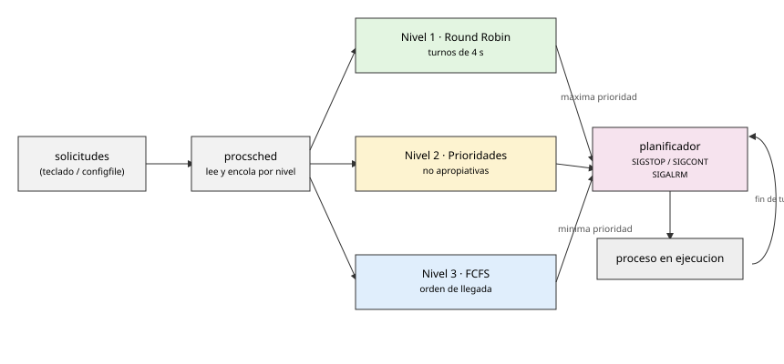

# P8 — Planificador de procesos

## Descripción general

Construir un planificador (*scheduler*) de procesos **a alto nivel, basado en señales**, que implementa un sistema de colas de **tres niveles NO APROPIATIVOS**:

- **Nivel 1** (mayor prioridad): política **Round Robin** con turnos de 4 segundos.
- **Nivel 2**: política de **prioridades** no apropiativas (menor valor = mayor prioridad).
- **Nivel 3** (menor prioridad): política **FCFS** (*first come first served*).

Los procesos de nivel 1 se atienden con la mayor celeridad; los de nivel 3, los últimos. El planificador se apoya en señales para detener y reanudar los procesos gobernados (`SIGSTOP` / `SIGCONT`) y en un temporizador (`SIGALRM` / `alarm`) para los turnos.

## Arquitectura

`procsched` se construye con la ayuda de una **cola de mensajes**:

1. Un proceso recibe las solicitudes de ejecución (por teclado o por fichero de configuración; con teclado, EOF con `Ctrl-D`).
2. Crea la cola de mensajes (y la elimina ordenadamente al final), construye la estructura de datos de cada proceso y la encola en la cola que corresponda a su nivel.
3. Crea un segundo proceso encargado de la planificación.
4. Libera todos los recursos (procesos y colas) cuando el usuario indica la finalización (`Ctrl-C`).



## Manual

```
PROCSCHED(1)

NOMBRE
      procsched — scheduler de procesos a nivel de usuario

SINOPSIS
      procsched [configfile]

DESCRIPCIÓN
      procsched crea las colas de mensajes y el planificador, lanza los procesos
      configurados y va encolando las peticiones conforme las recibe. El
      planificador ejecuta los procesos encolados atendiendo a la prioridad de
      cada nivel (máxima prioridad = nivel más bajo).

      configfile es opcional; si no se indica, la configuración se lee de la
      entrada estándar con el mismo formato.

      Formato del fichero de configuración: una línea por programa a ejecutar:

          nivel prioridad nombreprograma argumento1 argumento2 ...

          nivel:     1 (Round Robin, turnos de 4 s), 2 (prioridades no
                     apropiativas) o 3 (FCFS). Los tres niveles son NO apropiativos.
          prioridad: sólo se tiene en cuenta para los procesos de nivel 2; en el
                     resto se ignora.
          nombreprograma argumento1 ...: programa y sus argumentos (número
                     indeterminado, distinto por programa).

      procsched no finaliza hasta que el usuario pulsa Ctrl-C, momento en el que
      termina ordenadamente liberando todos los recursos y muestra por pantalla:
      el número de procesos concluidos con éxito (diferenciando cuántos por
      prioridades, cuántos por FCFS y cuántos por Round Robin), el número de
      cambios de contexto producidos y el número total de procesos finalizados.

VALOR DEVUELTO
      A su finalización, procsched indica el número de procesos concluidos con
      éxito (por política), el número de cambios de contexto y el número total de
      procesos finalizados.
```

## Llamadas al sistema útiles

`kill(1)`, `sigaction(2)`, `signal(2)`, `sleep(2)`/`sleep(3)`, `pause(2)`, `alarm(2)`, `execvp(3)`, `fork(2)`, `wait(2)`. Ver [P2](../02-procesos/), [P4](../04-senales/) y [P7](../07-colas-de-mensajes/) para sus descripciones.