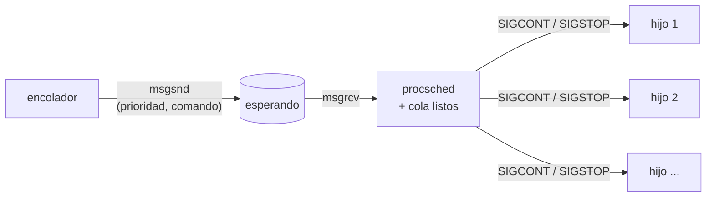

# P8 — Planificador de procesos

## Descripción general

Programar un planificador de procesos a nivel de usuario (`procsched`), apoyándonos en llamadas al sistema, y probarlo con distintos conjuntos de procesos.

- `procsched` recibe por una **cola de mensajes** (*esperando*) las peticiones de programas a ejecutar junto a su **prioridad** (1, 2 o 3).
- Por cada petición, crea un proceso **pausado** y lo guarda en su cola (`cola.h`) de procesos *listos*.
- Según las **políticas de planificación**, decide qué proceso de *listos* pasa a ejecución y durante cuánto tiempo.
- Para detener y reanudar procesos usa señales (`SIGSTOP` / `SIGCONT`), y para los turnos un temporizador (`ualarm()` → `SIGALRM`).
- Un segundo programa, `encolador`, lee de teclado o de un fichero los programas a ejecutar y sus prioridades, y los manda a la cola *esperando*.

`procsched` solo mantiene un hijo (proceso) en ejecución; a los demás los mantiene parados.

## Arquitectura


```mermaid
flowchart LR
    E[encolador] -- "msgsnd<br>(prioridad, comando)" --> Q1[(esperando)]
    Q1 -- msgrcv --> P[procsched<br>+ cola listos]
    P -- "SIGCONT / SIGSTOP" --> H1[hijo 1]
    P -- "SIGCONT / SIGSTOP" --> H2[hijo 2]
    P -- "SIGCONT / SIGSTOP" --> H3[hijo ...]
```

- ***esperando***: cola de mensajes (permisos `0600`). El `mtype` es la prioridad (1–3), o `4` para los [comandos especiales](#comandos-especiales-para-procsched). `procsched` lee con `msgtyp = -4`, que saca primero el `mtype` más bajo.
- ***listos***: una cola propia de `procsched` que se puede recorrer, implementada en [`cola.h`](cola.h).

Lo común a `procsched` y `encolador` va en `procsched.h`:

```c
// procsched.h
#define RUTA_CLAVE    "/etc"   //para ftok(RUTA_CLAVE, ID_PROJ)
#define ID_PROJ       22

#define MAX_COMANDO   256 //longitud máxima de un comando

#define TURNO_MS      15   // duración por defecto de un turno (niveles 2 y 3)
#define LATENCIA_MS   33   // espera máxima por defecto de los interactivos (nivel 2)

#define MTYPE_COMANDO 4    // mtype de los comandos especiales

typedef struct {
    long mtype;                 // prioridad (1, 2 o 3) o 4 para comandos especiales
    char comando[MAX_COMANDO];  // "programa arg1 arg2 ...", o el comando: "turno 50"
} peticion_t;
```

`cola.h` define `proceso_t` (pid, prioridad, comando y `ultimo_ms` - el instante en que salió de CPU) y una cola sobre un array con `cola_encolar` (al final), `cola_desencolar` (de cualquier posición) y `COLA_FOR_EACH` para recorrerla. Primero se recorre para elegir y después se desencola:

```c
cola_t listos;
cola_iniciar(&listos);
cola_encolar(&listos, p);

proceso_t *elegido = NULL;
COLA_FOR_EACH(&listos, q) { // recorrerla para elegir
    if (q->prioridad == 2 && (elegido == NULL || q->ultimo_ms < elegido->ultimo_ms)) {
        elegido = q;                             // el de nivel 2 que más lleva sin ejecutarse
    }
}
if (elegido != NULL) {
    proceso_t actual = cola_desencolar(&listos, elegido);   // fuera del bucle
    ...
}
```

### Bucle de `procsched`

1. **Admitir peticiones**: `msgrcv` sobre *esperando* con `IPC_NOWAIT`, repetido hasta que devuelva `-1` (no quedan mensajes), para admitir todas las pendientes. Si es una petición, crea el hijo pausado (ver [Crear el hijo pausado](#crear-el-hijo-pausado)) y lo mete en *listos*; si es un comando, lo aplica. Si *listos* está vacía, no hay nada que planificar por lo que hace un `msgrcv` bloqueante (sin `IPC_NOWAIT`) que espera hasta que llegue algo.

2. **Planificar**: elige un proceso de *listos* según las [políticas](#políticas-de-planificación), fija una alarma `ualarm` para el turno, le manda `SIGCONT` al proceso elegido y espera con `pause()`.

3. **Desalojar**. `pause()` retorna por una de estas señales:
   - `SIGALRM`: se ha acabado el turno.
   - `SIGCHLD`: el hijo en ejecución ha terminado.

   Después actúa según el estado del hijo en ejecución:
   - si terminó (`waitpid(pid, &estado, WNOHANG) > 0`), cancela el temporizador con `ualarm(0, 0)` e imprime en consola `TERMINA` ver [registro](#registro-y-estadísticas).
   - si es de nivel 1, el planificador vuelve a `pause()` y el proceso de nivel 1 sigue ejecutándose.
   - si no, le manda `SIGSTOP` y lo mete al final de *listos*.

Con `Ctrl-C` o el comando `fin`, `procsched` termina ordenadamente: mata a los hijos con `SIGKILL`, borra la cola (`msgctl` con `IPC_RMID`) y muestra las estadísticas.

## Políticas de planificación

| Prioridad | Tipo | Cuándo se ejecuta | Turno |
|---|---|---|---|
| 1 | urgente | En cuanto acaba el turno en curso (como mucho `turno_ms` después de llegar). Si hay varios, por orden de llegada. | hasta que termina |
| 2 | interactivo | Cuando lleva `>= latencia_ms` (33 ms por defecto) sin ejecutarse. Primero el que más lleve. | `turno_ms` |
| 3 | cálculo | Cuando todos los de nivel 2 llevan menos de `latencia_ms` sin ejecutarse. Round Robin. | `turno_ms` |

En el paso 2, `procsched` recorre *listos* y elige así:

1. El primero que vea de nivel 1.
2. ¿Algún nivel 2 lleva `>= latencia_ms` sin ejecutarse? → el que más lleve.
3. ¿Hay alguno de nivel 3? → el primero.
4. ¿Hay alguno de nivel 2? → el que más lleve sin ejecutarse.

## Crear el hijo pausado

El hijo no debe hacer `execvp` hasta que `procsched` lo ponga en ejecución por primera vez. Poner un proceso en ejecución quedaría así:

```c
void despertar(int senal) {}

...
pid_t pid = fork();
if (pid == 0) {
    signal(SIGCONT, despertar);
    pause();        // espera SIGCONT de procsched
    execvp(args[0], args); 
    exit(127);
}
// rama padre: meter el proceso en listos
```

Para trocear `comando` en `args` puedes reutilizar `str_split` de [P5](../05-minishell/).

<!--
> **Condición de carrera.** Si el `SIGCONT` llega **antes** de que el hijo haya llegado a `pause()`, se pierde y el hijo se queda dormido para siempre. En la práctica es raro, porque `procsched` no lo reanuda hasta que le toca, pero es posible. La solución correcta es que el padre **bloquee** `SIGCONT` con `sigprocmask` antes del `fork`. El hijo hereda la máscara, instala el manejador y espera con `sigsuspend` (que desbloquea y espera de forma atómica). Después vuelve a desbloquear `SIGCONT` antes del `execvp`.
-->

## Señales en `procsched`

- **Manejadores vacíos**: `pause()` solo retorna si se ejecuta un manejador, así que `procsched` atiende a `SIGALRM` y `SIGCHLD` con un manejador vacío.
- **`SIGCHLD` se usa con `SA_NOCLDSTOP`**: si no, cada `SIGSTOP` y `SIGCONT` que manda `procsched` a los hijos generarían un `SIGCHLD` que despierta al planificador sin motivo (ver [P4](../04-senales/#captura-avanzada-sigaction)).
- **`msgrcv` interrumpido**: si llega una señal durante un `msgrcv` bloqueante, devuelve `-1` con `errno == EINTR`. No es un error: hay que repetir `msgrcv`.

<!--
- **Carrera entre `ualarm` y `pause`**: con turnos de pocos ms, el `SIGALRM` o el `SIGCHLD` pueden llegar **antes** de que `procsched` llegue a `pause()`. En ese caso se pierde el aviso y el planificador se queda colgado. Para evitarlo, bloquea esas señales con `sigprocmask` antes de `ualarm`/`SIGCONT` y espera con `sigsuspend` en lugar de `pause`.
-->

### Temporizador: `ualarm`

```c
#include <unistd.h>
useconds_t ualarm(useconds_t usecs, useconds_t interval);
```

Como `alarm`, pero en **microsegundos** (`usecs < 1000000`). Con `interval = 0` avisa una sola vez; `ualarm(0, 0)` cancela la alarma. Un turno de 15 ms se puede fijar con `ualarm(15 * 1000, 0)`.

### Medir el tiempo

Para obtener el tiempo actual en milisegundos utilizar:

```c
#include <time.h>

long ahora_ms(void) {
    struct timespec t;
    clock_gettime(CLOCK_MONOTONIC, &t);
    return t.tv_sec * 1000 + t.tv_nsec / 1000000;
}
```

## Registro y estadísticas

`procsched` escribe por consola cuando entra un proceso nuevo, se recibe un comando y un proceso que termina:

```
NUEVO    pid 4312 (2) ./arkanoid 0 0
URGENTE  pid 4320 (1) ./factoriza 1000000016000000063
TERMINA  pid 4320 (1) ./factoriza 1000000016000000063
COMANDO  turno 50
```

También cuando recibe el comando stats o antes de terminar muestra estadísticas por nivel de prioridad:

| Métrica | Qué mide |
|---|---|
| CPU | % del tiempo que han estado en ejecución los procesos de este nivel |
| Espera media | tiempo medio que espera un proceso del nivel desde que llega o desde su último turno hasta que vuelve a entrar en CPU |

Y en global, el tiempo total y los **cambios de contexto** (cada `SIGCONT` a un proceso distinto del anterior).

Ejemplo de estadísticas:

```
=== procsched: 12840 ms, 2154 cambios de contexto ===
nivel   CPU   espera media
  1     4 %      2 ms
  2    23 %     31 ms
  3    73 %     95 ms
```

<!-- 
### Opcional: interfaz de `procsched`

En lugar del registro, una pantalla que se redibuja cada ~100 ms con los procesos de *listos* y el que está en ejecución: pid, prioridad, comando, hace cuánto se ejecutó por última vez, y el turno y la latencia actuales. Basta con `printf` y secuencias de escape ANSI:

```c
printf("\033[H\033[2J");          // cursor arriba a la izquierda y borrar pantalla
printf("\033[%d;%dH", fila, col); // mover el cursor
printf("\033[31m%s\033[0m", s);   // texto en rojo (32 verde, 33 amarillo...) y volver al color normal
```
-->

## `encolador`

```
encolador [fichero]
```

Lee líneas del teclado (hasta `Ctrl-D`) o de un [fichero de ejecución](#ficheros-de-ejecución-txt) y las manda a la cola de mensajes *esperando*, que abre con `ftok(RUTA_CLAVE, ID_PROJ)`.


## Ficheros de ejecución (`.txt`)

Describen qué procesos se lanzan, con qué prioridad y cuándo. Cada línea es:

| Línea | Qué hace |
|---|---|
| `# ...` | Comentario: se ignora. |
| `prioridad programa arg1 ...` | Petición: se encola con `msgsnd`; `mtype = prioridad` (1–3). |
| `espera ms` | Espera `ms` milisegundos antes de procesar la siguiente línea. |
| `4 turno ms`, `4 latencia ms`, `4 estadisticas`, `4 fin` | Comandos especiales: llevan prioridad 4 y se mandan igual que una petición (`mtype = 4`). |

```
# Este archivo pide lanzar 2 procesos de cálculo; espera 3 s y manda un proceso urgente
3 ./buddhabrot 0 0
3 ./raytracer 340 0
espera 3000
1 ./factoriza 1000000016000000063
```

### Comandos especiales para `procsched`

En el `encolador` se escriben con un 4 delante (`4 turno 50`), así que se mandan a *esperando* como una petición más: `mtype = MTYPE_COMANDO` (4) y `comando = "turno 50"`.

| Comando | Efecto |
|---|---|
| `turno ms` | Cambia TURNO_MS a `ms` milisegundos (1–999). |
| `latencia ms` | Cambia la espera máxima de los procesos interactivos. Más baja: interactivos más fluidos, pero menos CPU para el cálculo con más overhead de cambios de proceso. |
| `estadisticas` | Imprime las estadísticas. |
| `fin` | Termina `procsched` ordenadamente, al igual que `Ctrl-C`. |

Con un set en marcha, se pueden mandar más comandos desde otro `encolador` con o sin fichero.

Para terminar uno de los procesos, `kill <pid>` (el pid aparece en la línea `NUEVO`). Si el proceso está parado en *listos*, el `SIGTERM` queda pendiente y no muere hasta que `procsched` le vuelve a dar turno; con `kill -9` muere al instante.

## Pasos sugeridos

1. **`procsched.c` y la cola *esperando*.** `procsched` crea la cola (`ftok` + `msgget` con `IPC_CREAT | 0600`) y en un bucle hace `msgrcv` bloqueante e imprime `mtype` y `comando` de lo que llega. Con `Ctrl-C`, borra la cola y termina (`IPC_RMID`).
   *Prueba:* `ipcs -q` muestra la cola mientras se ejecuta y no la muestra después de terminar.

2. **`encolador` desde teclado.** Lee líneas con `fgets` (ver [P5](../05-minishell/#1-leer-una-línea-de-teclado)), separa la prioridad del resto y hace `msgsnd`.
   *Prueba:* lo que escribes en el `encolador` aparece en la consola de `procsched`.

3. **`encolador` desde fichero.** Se lee igual, con `fgets` sobre el `FILE *` de `fopen` (ver [P1](../01-entrada-salida-y-ficheros/#lectura)). Hay que ignorar los `#` e implementar `espera ms` (`usleep`). Los comandos especiales ya llevan el 4 delante, así que se mandan como cualquier petición.
   *Prueba:* `./encolador set1-roundrobin.txt` y en `procsched` salen las líneas en orden, con sus pausas.

4. **Hijos pausados en *listos*.** En vez de imprimir la petición, `procsched` crea el hijo pausado (`fork` + `str_split` + `pause` + `execvp`), lo mete en *listos* con `cola_encolar` e imprime `NUEVO`.
   *Prueba:* `ps -o pid,stat,cmd` muestra los hijos dormidos y sin ventana.

5. **Ponerlos todos en ejecución.** Sin planificar todavía: manda `SIGCONT` a todos los de *listos*.
   *Prueba:* se abren todas las ventanas y funcionan a la vez, como si no existiera `procsched`.

6. **Round Robin simple, sin prioridades.** Se implementa el [bucle de `procsched`](#bucle-de-procsched). Un ejemplo puede ser:

   ```
   repetir siempre:
       // 1. admitir peticiones
       si listos está vacía:
           msgrcv(esperando, 0) // bloqueante
           si devuelve -1: repetir 
       si no: 
           msgrcv(esperando, IPC_NOWAIT) 
       si se ha leído mensaje:
            crear hijo pausado y encolarlo en listos

       // 2. planificar
       actual = desencolar el primero de listos
       ualarm(TURNO_MS * 1000, 0)
       kill(actual.pid, SIGCONT)
       pause()

       // 3. desalojar
       kill(actual.pid, SIGSTOP)
       encolar actual al final de listos
   ```

   Hace falta poner los manejadores vacíos para `SIGALRM` y `SIGCHLD` (este con `SA_NOCLDSTOP`).
   *Prueba:* con `TURNO_MS=999` y el set 1, las ventanas se actualizarán una a una, durante 1 segundo.

7. **Procesos que terminan.** Tras el `pause()` de planificar, haz `waitpid(pid, &estado, WNOHANG)` para saber si el proceso había terminado o simplemente se le había acabado el turno. Si ha terminado: cancela alarma `ualarm(0, 0)`, imprime `TERMINA` y no se reencola.
   *Prueba:* `mandelbrot 0 0 50` termina y los demás procesos siguen su turno.

8. **Nivel 1 (urgentes).** En la elección, primero los de nivel 1. Si el que está en ejecución es de nivel 1, no se para: se vuelve a `pause()`. Imprimir `URGENTE`.
   *Prueba:* set 3, fase del `factoriza`: el resto se congela hasta que acaba.

9. **Niveles 2 y 3.** Guardar en `ultimo_ms` el instante de llegada al crear el proceso y el de salida al desalojarlo (`ahora_ms()`). En *planificar*, en vez de desencolar el primero de *listos*, recorrerla con `COLA_FOR_EACH` y elegir el siguiente proceso según las 4 reglas de [políticas de planificación](#políticas-de-planificación).
   *Prueba:* set 2, `arkanoid` y `pintar` se ven fluidos aún con los procesos de cálculo de fondo.

10. **Comandos especiales.** `turno`, `latencia` y `fin` (imprimiendo `COMANDO`).
    *Prueba:* `4 turno 200` desde otro `encolador` se nota a simple vista en los procesos interactivos.

11. **Terminación ordenada.** `Ctrl-C` y `fin` hacen lo mismo: `SIGKILL` a los hijos e `IPC_RMID` en la cola.
    *Prueba:* no quedan procesos (`ps`) ni colas (`ipcs -q`).

12. **Estadísticas.** Acumular por nivel de prioridad el tiempo en CPU y el tiempo de espera (desde `ultimo_ms` hasta que se le manda el `SIGCONT`), y contar los cambios de contexto. Mostrarlas con `estadisticas` y al terminar.

## Programas de prueba

`make` compila todos los `.c` de la carpeta, incluidos `procsched.c` y `encolador.c` (necesita `libx11-dev`). Los programas con ventana X11 reciben su posición de forma opcional (`programa [x y]`, por defecto 0 0) y tienen un tamaño 300×200. Esto es para poder ponerlas que se vean varias a la vez.

| Programa | Tipo previsto | Qué se ve | Título |
|---|---|---|---|
| `mandelbrot [x y [fotogramas]]` | cálculo / urgente | Mandelbrot que gira y hace zoom; en inanición se congela. Con `fotogramas` especificado, termina y guarda el último en `mandelbrot_AAAAMMDD_HHMMSS.ppm`. | fps |
| `buddhabrot [x y]` | cálculo | La imagen se revela al acumular órbitas. | miles de muestras |
| `raytracer [x y]` | cálculo | Esferas con sombras; cada píxel sale en cuanto está calculado. | fotograma |
| `arkanoid [x y]` | interactivo | Pala con el ratón, pelota a 60 fps. Con lag va a cámara lenta y a saltos. | fps |
| `pintar [x y]` | interactivo | Estela que sigue al ratón. Con lag se queda atrás. | fps |
| `factoriza n` | urgente | Sin ventana. Factoriza `n` (64 bits) por división por tentativa e imprime el tiempo de CPU y el real. | — |

La prioridad la decide la petición, no el programa.

Conjuntos de prueba (cada fichero explica en sus comentarios qué observar):

| Fichero | Qué valida |
|---|---|
| [`set1-roundrobin.txt`](set1-roundrobin.txt) | Reparto equitativo de la CPU en el nivel 3 |
| [`set2-latencia.txt`](set2-latencia.txt) | Latencia de los interactivos con muchos procesos de cálculo |
| [`set3-saturacion-urgente.txt`](set3-saturacion-urgente.txt) | Inanición del nivel 3 con demasiados interactivos, y expulsión por urgentes |

```bash
make
taskset -c 0 ./procsched          # lanza procsched y sus hijos solo en el núcleo 0
./encolador set1-roundrobin.txt   # en otra terminal
```

> **Un solo núcleo.** `taskset -c 0` fija `procsched` y sus hijos a un núcleo; si no, se ejecutarían en paralelo en varios núcleos y no se vería la planificación.

## Ejercicios propuestos

1. **Reparto en el nivel 3.** Lanza `mandelbrot`, `buddhabrot` y `raytracer` a mano de uno en uno, sin `procsched`, y apunta durante 10 s el valor de su título (fps, miles de muestras, fotogramas). Después lanza el set 1 (cuatro procesos de nivel 3) y apunta lo mismo. ¿Recibe cada uno aproximadamente 1/4 de su ritmo en solitario?

2. **Urgentes.** Lanza el set 3 y observa que cuando entra (`mandelbrot` urgente) y (`factoriza` urgente). el resto de ventanas se congelan. El tiempo que `factoriza` pasa en la CPU debe ser parecido a cuando se ejecuta por separado, al ser prioridad 1 se le da toda la CPU.

Después lanza el set 1 y, desde otro `encolador`, manda `3 ./factoriza 1000000016000000063` (factoriza pero con la menor prioridad posible). ¿Cuánto tiempo tarda en ejecutarse ahora?

3. **Latencia de los interactivos.** Lanza el set 2 y mira los fps en el título de `arkanoid` y `pintar`. ¿Llegan a 30 fps (un fotograma cada 33 ms)? Si no, explica por qué (pista: un proceso de nivel 3 puede empezar su turno de 15 ms justo antes de que un interactivo llegue a 33 ms de espera). Manda `4 latencia 18` (33 − 15) y comprueba si ahora llegan a 30 fps. ¿Qué les pasa a los de cálculo?

4. **Inanición.** Lanza el set 3 y observa la fase 1 (cuatro interactivos, turno de 15 ms): los de cálculo de nivel 3 se congelan. 
   - Manda `4 turno 5`. ¿Vuelven a moverse los de cálculo? ¿Cuántos interactivos podría haber con `turno 5` antes de que se congelen?
   - Vuelve a `4 turno 15` y busca el valor más pequeño de `4 latencia ms` con el que los de cálculo vuelven a moverse.

5. **Tamaño del turno.** Con el set 2 en marcha, manda desde otro `encolador` `4 turno 1`, `4 turno 15` y `4 turno 200`, y unos segundos después de cada uno, `4 estadisticas`. Compara los cambios de contexto y los fps de `arkanoid`. ¿Qué inconveniente tiene un turno muy pequeño? ¿Y uno muy grande?

## Llamadas al sistema útiles

`fork(2)`, `execvp(3)`, `waitpid(2)` ([P2](../02-procesos/)); `kill(2)`, `signal(2)`, `sigaction(2)`, `pause(2)` ([P4](../04-senales/)); `msgget(2)`, `msgsnd(2)`, `msgrcv(2)`, `msgctl(2)` ([P7](../07-colas-de-mensajes/)). Nuevas en esta práctica: `ualarm(3)` y `clock_gettime(2)`.
