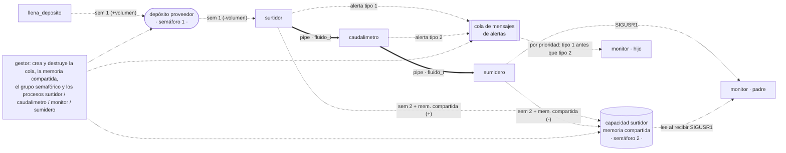

# P9 — Sistema concurrente

Construcción de un pequeño sistema concurrente.
**Entrega evaluable** (curso 2025/26: 12/12/2025).

## Descripción general

Construir un **simulador de un sistema hidráulico** mediante procesos, mecanismos de
comunicación entre procesos y llamadas al sistema, integrando todo lo aprendido en las
prácticas anteriores.

Restricciones:

- **No** se permiten esperas activas en ningún caso.
- Los programas **no** pueden usar variables globales.
- Seis programas en ficheros independientes que interactúan entre sí.
- Se valoran especialmente la concisión, claridad, simplicidad y eficiencia del código.

## Estructuras de datos

```c
typedef struct {
    long tipo;
    int  pid;
    char texto[100];
} mensaje_t;

typedef struct {
    int contador, caudal;
} fluido_t;
```

## Componentes

El simulador representa el flujo de fluido a lo largo de un sistema hidráulico. Línea
continua = flujo de fluido por tuberías (`pipe`); línea discontinua = alertas, señales
y gestión de recursos.



### `gestor clave periodo volumen umbral`

Crea y destruye toda la infraestructura. Crea: una **cola de mensajes** para las alertas,
una **memoria compartida** con la capacidad del surtidor (un entero de litros,
inicializado a 0) y un **grupo semafórico con dos semáforos** (semáforo 1: volumen
disponible en el depósito del proveedor; semáforo 2: exclusión mutua para la memoria
compartida). Crea los procesos `surtidor` (args `clave periodo volumen`), `caudalimetro`
(`clave umbral`), `monitor` (`clave`) y `sumidero` (`clave pid_monitor`), interconectando
con **dos tuberías** las E/S estándar `surtidor → caudalimetro → sumidero`. Luego espera
(sin espera activa) la señal `SIGINT` (`Ctrl-C`); al recibirla elimina ordenadamente la
cola de mensajes, la memoria compartida, el grupo semafórico y los cuatro procesos.

### `llena_deposito clave tiempo volumen`

Espera `tiempo` segundos, accede al semáforo 1 (nivel del depósito del proveedor) y lo
incrementa en `volumen` litros. Luego termina.

### `surtidor clave periodo volumen`

Cada `periodo` segundos: espera; si es posible, descuenta `volumen` litros del semáforo 1
(depósito del proveedor); escribe en su salida estándar un `fluido_t` con el caudal
traspasado y el número de descarga (`contador`, que se incrementa con cada traspaso). A
continuación bloquea el semáforo 2, incrementa en `volumen` la memoria compartida
(capacidad del surtidor) y libera el semáforo 2.
Si no puede suministrar el volumen indicado, envía a la cola de alertas un
`mensaje_t` con `tipo = 1`, su `pid` y el texto
`"Problema de suministro en el surtidor PID, caudal insuficiente"`.

### `caudalimetro clave umbral`

Lee continuamente de la entrada estándar `fluido_t`, espera un segundo, imprime por
pantalla el caudal que circula, reenvía el `fluido_t` por su salida estándar y
comprueba si el caudal supera `umbral`. Si lo supera, encola en la cola de alertas un
`mensaje_t` con `tipo = 2` y el texto `"Problema de caudal excesivo en PID"`.

### `sumidero clave pid_monitor`

Lee continuamente de la entrada estándar `fluido_t`. Por cada lectura: espera dos
segundos, bloquea el semáforo 2, decrementa la memoria compartida (capacidad del
surtidor) en el caudal del `fluido_t`, libera el semáforo 2, envía `SIGUSR1` al
proceso `pid_monitor` y continúa esperando nuevos mensajes.

### `monitor clave`

Realiza dos tareas en paralelo (crea un proceso hijo):

- **Padre**: espera continuamente `SIGUSR1`; al recibirla bloquea el semáforo 2, imprime
  `"Presentes XXX litros en el surtidor"`, libera el semáforo 2 y vuelve a esperar.
- **Hijo**: lee e imprime continuamente los mensajes de la cola de alertas atendiendo a
  su prioridad (los de `tipo 1` son más prioritarios que los de `tipo 2`).

## Llamadas al sistema útiles

De prácticas anteriores: `fork`, `execvp`, `wait` ([P2](../02-procesos-e-hilos/));
`pipe`, `dup2` ([P3](../03-pipes-y-fifos/)); `kill`, `sigaction`, `pause`
([P4](../04-senales/)); `shmget`/`shmat`/`shmdt`/`shmctl`, `semget`/`semctl`/`semop`
([P6](../06-memoria-compartida-y-semaforos/)); `msgget`/`msgsnd`/`msgrcv`/`msgctl`
([P7](../07-colas-de-mensajes/)).

## Entrega

El comprimido debe incluir los seis programas, el `Makefile` que compila todos ellos, y
todos los `.c` y `.h` necesarios. `make` sin argumentos debe crear los seis ejecutables.
Para la corrección se borran los ejecutables, se hace `touch` a los fuentes y se
recompila con el `Makefile`.

## Consulta

- Teoría: [`TEORIA/05`](../../TEORIA/05-concurrencia-y-sincronizacion/) y temas de IPC
  [`TEORIA/07`](../../TEORIA/07-ipc-pipes-y-fifos/)–[`TEORIA/10`](../../TEORIA/10-memoria-compartida-y-mutex/).
