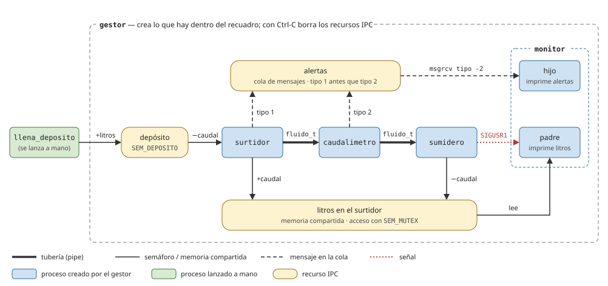

# P9 — Sistema concurrente

## Descripción general

Construir un **simulador de un sistema hidráulico** con varios procesos que se comunican mediante tuberías, semáforos, memoria compartida, colas de mensajes y señales.

Los litros de fluido salen desde depósito de un proveedor, lo bombea el `surtidor`, pasa por el `caudalimetro`, que lo mide, y acaba en el `sumidero`. El `monitor` muestra cuántos litros hay en el surtidor y las alertas que envían los demás. El `gestor` lo crea todo y termina al pulsar `Ctrl-C`; `llena_deposito`, que se lanza a mano, añade litros al depósito.

## Arquitectura

<!-- Opción A: SVG -->


- ***litros en el surtidor***: memoria compartida con un `int` que empieza a 0. Son los litros que han salido del depósito y aún no han llegado al sumidero: `surtidor` los suma, `sumidero` los resta y `monitor` los muestra.

- ***mutex***: semáforo `SEM_MUTEX`, empieza a 1. Da exclusión mutua sobre la memoria compartida: todo acceso a *litros en el surtidor* va entre un *acquire* y un *release* de este semáforo.

- ***depósito***: semáforo `SEM_DEPOSITO` usado como contador de los litros que hay en el depósito del proveedor. Empieza a 0: `llena_deposito` le suma litros y `surtidor` se los resta.

- ***alertas***: cola de mensajes con `mensaje_t`. Tipo 1: problema de suministro (más prioritario). Tipo 2: caudal excesivo.

- **Tuberías**: dos `pipe` conectan la entrada y la salida estándar de `surtidor → caudalimetro → sumidero`, igual que `surtidor | caudalimetro | sumidero` en la shell. Por ellas viajan estructuras `fluido_t`.

Los dos semáforos (mutex y depósito) forman un único grupo (`semget` con `nsems = 2`): `SEM_DEPOSITO` es el índice 0 y `SEM_MUTEX` el 1. Todos los programas obtienen los recursos con `ftok(RUTA_CLAVE, ID_PROJ)`, como en [P8](../08-planificador-de-procesos/#arquitectura).

Lo común a todos los programas va en `hidraulico.h`:

```c
// hidraulico.h
#define RUTA_CLAVE    "/etc"   // para ftok(RUTA_CLAVE, ID_PROJ)
#define ID_PROJ       22

#define SEM_DEPOSITO  0        // semáforo: litros en el depósito del proveedor
#define SEM_MUTEX     1        // semáforo: exclusión mutua de la memoria compartida

#define ALERTA_SUMINISTRO 1    // tipos de mensaje de la cola de alertas
#define ALERTA_CAUDAL     2

typedef struct {
    long tipo;        // ALERTA_SUMINISTRO o ALERTA_CAUDAL
    int  pid;         // pid del proceso que manda la alerta
    char texto[100];
} mensaje_t;

typedef struct {
    int contador;     // número de descarga: 1, 2, 3...
    int caudal;       // litros de esta descarga
} fluido_t;
```

## Programas

### `gestor periodo caudal_max umbral`

1. Crea los IPC: la cola *alertas*, la memoria compartida (un `int` a 0) y el grupo de dos semáforos (`SEM_DEPOSITO` a 0 y `SEM_MUTEX` a 1).
2. Crea los procesos con `fork` + `execlp`, en este orden:
   - `monitor`. Va primero porque el sumidero necesita su pid.
   - `surtidor periodo caudal_max`, con la salida estándar hacia la tubería 1.
   - `caudalimetro umbral`, con la entrada estándar desde la tubería 1 y la salida estándar hacia la tubería 2.
   - `sumidero pid_monitor`, con la entrada estándar desde la tubería 2. El pid se pasa como texto (`sprintf`).
3. Espera a `Ctrl-C` con `pause()`; entonces borra la cola, la memoria compartida, los semáforos, y termina.

No hace falta matar ni esperar a los hijos: `Ctrl-C` no manda `SIGINT` solo al gestor, sino a todo el grupo de procesos en primer plano de la terminal (el gestor, sus hijos y el hijo del monitor). Los hijos terminan por la acción por defecto de `SIGINT`: aunque el gestor la capture, `execlp` restablece la acción por defecto de las señales capturadas.

### `llena_deposito tiempo volumen`

Espera `tiempo` segundos, suma `volumen` litros al depósito (`semop` sobre `SEM_DEPOSITO` con `sem_op = +volumen`) y termina. No lo crea el gestor: se lanza a mano desde otra terminal, tantas veces como se quiera.

### `surtidor periodo caudal_max`

Cada `periodo` segundos:

1. Elige un caudal al azar entre 1 y `caudal_max`.
2. Intenta restar el caudal del semáforo **depósito** sin bloquearse (ver [Restar varios litros de un semáforo](#restar-varios-litros-de-un-semáforo)).
3. Si no hay litros suficientes, manda a *alertas* un mensaje de tipo 1 con su pid y el texto `Problema de suministro en el surtidor PID, caudal insuficiente` (con su pid en lugar de `PID`).
4. Si había litros suficientes, hace una descarga:
   - Suma el caudal a la memoria compartida *litros en el surtidor*, entre un *acquire* y un *release* de `SEM_MUTEX`.
   - Escribe un `fluido_t` por la salida estándar, que el gestor ha redirigido a la tubería que va al `caudalimetro`. fluido_t contiene el caudal y el número de descarga (`contador`).
   - `contador` cuenta las descargas hechas: la primera es la 1 y aumenta en 1 con cada descarga. Los intentos fallidos del paso 3 no cuentan.

### `caudalimetro umbral`

Por cada `fluido_t` que lee de la entrada estándar:

1. Espera un segundo.
2. Muestra la descarga por la salida de error, p. ej. `Caudalímetro: descarga 3, 7 litros` (ver [Tuberías](#tuberías-datos-binarios-y-mensajes-por-pantalla)).
3. Escribe el `fluido_t` por la salida estándar.
4. Si el caudal supera `umbral`, manda a *alertas* un mensaje de tipo 2 con el texto `Problema de caudal excesivo en PID` (siendo PID su pid)

### `sumidero pid_monitor`

Por cada `fluido_t` que lee de la entrada estándar:

1. Espera dos segundos.
2. Resta el caudal de la memoria compartida *litros en el surtidor*, entre un *acquire* y un *release* de `SEM_MUTEX`.
3. Manda `SIGUSR1` al monitor (`pid_monitor`).

### `monitor`

Hace dos tareas a la vez, así que se divide en dos procesos con `fork`:

- **Padre** (el proceso cuyo pid recibe el sumidero): espera `SIGUSR1` con `pause()`. Cada vez que llega, lee *litros en el surtidor* (con `SEM_MUTEX`) e imprime en consola `Presentes XXX litros en el surtidor`.
- **Hijo**: lee la cola *alertas* en un bucle e imprime cada mensaje como `ALERTA tipo: texto`. Las de tipo 1 salen antes que las de tipo 2 (ver [Alertas por prioridad](#alertas-por-prioridad)).

## Detalles de implementación

### Tuberías: datos binarios y mensajes por pantalla

- `fluido_t` se escribe y lee en binario, con `write(STDOUT_FILENO, &f, sizeof(f))` y `read(STDIN_FILENO, &f, sizeof(f))`, no con `printf`/`scanf`.
- La salida estándar de `surtidor` y `caudalimetro` es una tubería: lo que tengan que mostrar por pantalla se manda a la salida de error (`fprintf(stderr, ...)`), que sigue saliendo por la terminal.

### Restar varios litros de un semáforo

En [P6](../06-memoria-compartida-y-semaforos/#acquire--semop) `sem_op` vale `-1` o `+1`, pero admite cualquier valor: `+n` suma `n`, y `-n` espera a que el semáforo valga al menos `n` y entonces le resta `n`. Con `IPC_NOWAIT`, devuelve `-1` en vez de esperar:

```c
struct sembuf op = { .sem_num = SEM_DEPOSITO, .sem_op = -caudal, .sem_flg = IPC_NOWAIT };
if ( semop(id_sem, &op, 1) == -1 ) {
    // no hay litros suficientes: alerta de tipo 1
}else{
    // se ha podido restar el caudal
}
```

### Alertas por prioridad

`msgrcv` con `msgtyp` negativo retira el primer mensaje del **tipo más bajo**. Con `msgtyp = -2`, las alertas de tipo 1 salen antes que las de tipo 2 aunque hayan llegado después.

### Caudal al azar

El `surtidor` llama a `srand(time(NULL) ^ getpid())` al empezar (mezcla la hora y el pid) y luego a `int caudal = rand() % caudal_max + 1;` para cada descarga.

## Pasos sugeridos

Hasta el paso 6, el `gestor` solo crea y borra los recursos: se deja en marcha en una terminal y el resto de programas se prueban a mano desde otras terminales.

1. **`hidraulico.h` y recursos del `gestor`.** Crea la cola, la memoria compartida y los semáforos con sus valores iniciales, espera con `pause()`, cuando llega `Ctrl-C` los borra y termina.
   *Prueba:* `ipcs` muestra los tres recursos mientras el gestor se ejecuta y ninguno después.

2. **`llena_deposito`.**
   *Prueba:* tras `./llena_deposito 1 50`, `ipcs -s -i <semid>` muestra el semáforo 0 a 50.

3. **`surtidor`**. Lanzado a mano con `./surtidor 1 10`, lo que escribe es binario, así que en la terminal salen caracteres raros. Para verlo como números: `./surtidor 1 10 | od -An -i -w8` (cada línea es un `fluido_t`: contador y caudal; ver [`od`](../00-shell-y-herramientas/#ver-datos-binarios-od)).
   *Prueba:* el semáforo 0 baja cada segundo (`ipcs -s -i <semid>`) y, cuando no quedan litros suficientes, las alertas se acumulan en la cola (`ipcs -q`).

4. **`monitor`**, lanzado a mano: `./monitor`.
   *Prueba:* muestra las alertas acumuladas en el paso 3, y si ejecutas en otra terminal `kill -USR1 $(pgrep -o monitor)` le hace imprimir `Presentes N litros en el surtidor` (ver [`pgrep`](../00-shell-y-herramientas/#procesos)).

5. **`caudalimetro` y `sumidero`**, conectados con tuberías desde la shell y con el monitor del paso 4 en ejecución. Si el depósito está vacío puedes llamar a `./llena_deposito 0 100`:

   ```bash
   ./surtidor 2 10 | ./caudalimetro 8 | ./sumidero $(pgrep -o monitor)
   ```

   La shell lanza estos 3 procesos y las enlaza con dos tuberías, como hará después el gestor. El surtidor descarga cada 2 s hasta 10 litros, el caudalímetro los mide con umbral 8, y el sumidero avisa al monitor tras cada descarga (pgrep se usa para sacar su pid).

   *Prueba:*
   - En esta terminal, el caudalímetro muestra cada descarga (`Caudalímetro: descarga 1, 6 litros`). El surtidor y el sumidero no escriben nada en ella.
   - En la terminal donde se está ejecutando el monitor sale `Presentes N litros en el surtidor` porque el sumidero le manda SIGUSR1 cuando recibe una descarga. El monitor también mostrará `ALERTA 2: ...` cuando el caudal pasa de 8 (o `ALERTA 1: ...` si el depósito se vacía).

6. **`gestor` completo**: lanza el monitor, crea las tuberías, las redirige y lanza los otros tres procesos (`fork`, `dup2`, `execlp`). Antes de probarlo, termina todo lo lanzado en los pasos anteriores y comprueba que no queda ningún recurso del simulador:

   ```bash
   pkill -INT -x 'gestor|monitor|surtidor|caudalimetro|sumidero|llena_deposito'  
   pgrep -l -x 'gestor|monitor|surtidor|caudalimetro|sumidero|llena_deposito'    # no debe mostrar nada
   ipcs                                    # no debe quedar nada del simulador
   ipcrm -Q <key> -M <key> -S <key>        # solo si queda algo: <key> es la columna key de ipcs
   ```

   *Prueba:* `./gestor 2 10 8` da la misma salida que el paso 5, y `pstree -p $(pgrep -o gestor)` muestra al gestor con cuatro hijos y al monitor con el suyo (los pids serán distintos):

   ```
   gestor(4310)─┬─caudalimetro(4313)
                ├─monitor(4311)───monitor(4315)
                ├─sumidero(4314)
                └─surtidor(4312)
   ```

7. **Terminación.**
   *Prueba:* tras `Ctrl-C`, `ps` no muestra ningún proceso del simulador e `ipcs` ningún recurso.

## Ejemplo de ejecución

En una terminal se lanza el gestor y, justo después, en otra, `./llena_deposito 3 40` (40 litros a los 3 s):

```
$ ./gestor 2 10 8
ALERTA 1: Problema de suministro en el surtidor 4312, caudal insuficiente
Caudalímetro: descarga 1, 6 litros
Caudalímetro: descarga 2, 9 litros
ALERTA 2: Problema de caudal excesivo en 4313
Presentes 9 litros en el surtidor
Caudalímetro: descarga 3, 3 litros
Presentes 3 litros en el surtidor
Caudalímetro: descarga 4, 10 litros
ALERTA 2: Problema de caudal excesivo en 4313
Presentes 10 litros en el surtidor
Caudalímetro: descarga 5, 7 litros
Presentes 7 litros en el surtidor
ALERTA 1: Problema de suministro en el surtidor 4312, caudal insuficiente
Presentes 0 litros en el surtidor
^C
$
```

El surtidor intenta la primera descarga a los 2 s, antes de que llegue el agua (alerta de tipo 1). Con los 40 litros hace cinco descargas (6 + 9 + 3 + 10 + 7 = 35) y en la sexta pide 8, pero solo quedan 5 (otra alerta de tipo 1). Las descargas de 9 y 10 litros superan el umbral de 8 (alertas de tipo 2). Los caudales son aleatorios, así que cada ejecución es distinta.

## Llamadas al sistema útiles

`read(2)`, `write(2)` ([P1](../01-entrada-salida-y-ficheros/)); `fork(2)`, `execlp(3)` ([P2](../02-procesos/)); `pipe(2)`, `dup2(2)` ([P3](../03-pipes-y-fifos/)); `signal(2)`, `kill(2)`, `pause(2)`, `sleep(3)` ([P4](../04-senales/)); `ftok(3)`, `shmget(2)`, `shmat(2)`, `shmctl(2)`, `semget(2)`, `semctl(2)`, `semop(2)` ([P6](../06-memoria-compartida-y-semaforos/)); `msgget(2)`, `msgsnd(2)`, `msgrcv(2)`, `msgctl(2)` ([P7](../07-colas-de-mensajes/)). Nuevas en esta práctica: `rand(3)`, `srand(3)` y `time(2)`.
