# Tema 1: Introducción a los sistemas operativos y conceptos básicos

1.1 Definición de sistema operativo · 1.2 Componentes del sistema operativo · 1.3 Conceptos básicos de los sistemas operativos · 1.4 Características de los sistemas operativos · 1.5 Estructuras de los sistemas operativos · 1.6 Clases de sistemas operativos.

---

## 1.1 Definición de sistema operativo

- **H. M. Deitel**: el sistema operativo es un programa que controla la ejecución de los programas de aplicación.
- **W. Stallings**: los sistemas operativos son, ante todo, administradores de recursos.
- **Silberschatz‑Peterson‑Galvin**: el programa más fundamental de todo el sistema es el sistema operativo, que controla todos los recursos del computador.
- **A. Tanenbaum**: un sistema operativo es un programa que actúa como intermediario entre el usuario y el hardware del computador.

**Mi definición:** Uno de los códigos más complejos del mundo (junto con un motor de videojuegos, un compilador, una base de datos o un navegador). Gestiona el hardware del ordenador (procesador, memoria, gráficos, disco, red y otros dispositivos) para que el usuario pueda ejecutar sus procesos (compiladores, editores, navegadores, reproductor multimedia o videojuegos) de forma eficiente, segura e intuitiva. El sistema operativo se encarga de compartir y coordinar los recursos para hacer creer a los procesos que tienen todos el ordenador para sí mismos, facilitando su programación, depuración y distribución.


El sistema operativo se ocupa de:

```mermaid
flowchart TD
    SO((Sistema operativo))

    CP[Control de procesos] --> SO
    CR[Gestión de memoria] --> SO
    PL[Planificación] --> SO
    SV[Servicios] --> SO

    CP --- CP1[Crear y terminar procesos]
    CP --- CP2[Sincronización y comunicación entre procesos]
    CP --- CP3[Manejo de interbloqueos]

    CR --- CR1[Asignar y liberar memoria]
    CR --- CR2[Memoria virtual y paginación]
    CR --- CR3[Protección y aislamiento entre procesos]
    
    PL --- PL1[Reparto de la CPU entre procesos]
    PL --- PL2[Políticas de planificación]
    PL --- PL3[Cambio de contexto]

    SV --- SV1[Llamadas al sistema]
    SV --- SV2[Sistema de archivos]
    SV --- SV3[Gestión de E/S y controladores]
    SV --- SV4[Red y comunicaciones]
    SV --- SV5[Seguridad y protección]
    SV --- SV6[Interfaz de usuario: shell y GUI]

    classDef core fill:#cfe2f3,stroke:#2b6f99,color:#000;
    classDef func fill:#eef2f7,stroke:#555,color:#000;
    classDef leaf fill:#f7f7f7,stroke:#999,color:#000;
    class SO core;
    class CP,CR,PL,SV func;
    class CP1,CP2,CP3,CR1,CR2,CR3,PL1,PL2,PL3,SV1,SV2,SV3,SV4,SV5,SV6 leaf;
```

Aunque tengan tamaño físico y función diferentes, un smartwatch, un móvil, un servidor, un automóvil, un robot industrial, un avión o un satélite son dispositivos que tienen un software base para que administre sus recursos y conecte las aplicaciones con el hardware. Tienen un Sistema Operativo.

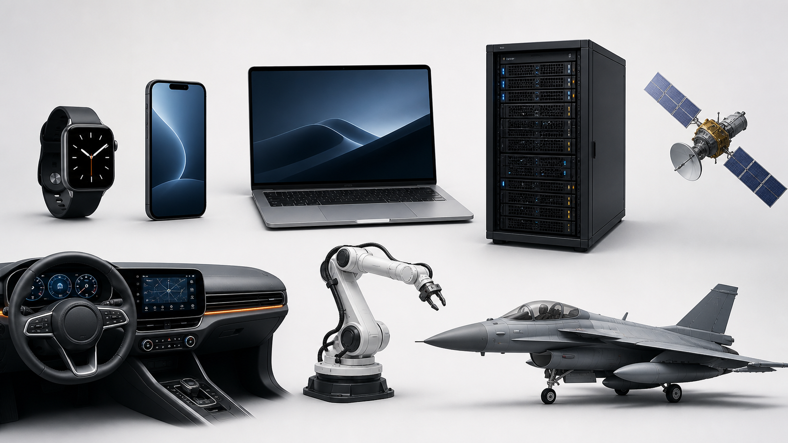

*Aunque cambien radicalmente de tamaño y función, todos estos dispositivos necesitan software que administre sus recursos y conecte las aplicaciones con el hardware. Ilustración generada para estos apuntes.*

## 1.2 Componentes del sistema operativo

El software de un computador se organiza en capas sobre el hardware. El sistema operativo se sitúa entre el hardware y el resto del software (compiladores, ensambladores, utilidades y aplicaciones):

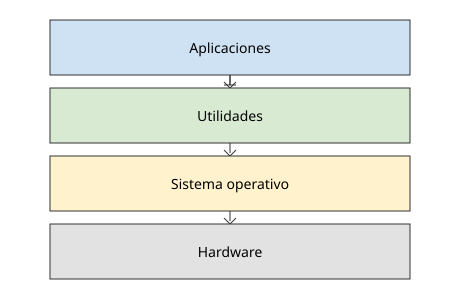

Por debajo del sistema operativo hay una máquina física que sigue la **arquitectura de Von Neumann**.

### Arquitectura de Von Neumann

En ella se basan los ordenadores actuales: la máquina tiene un conjunto **fijo** de componentes electrónicos cuyas acciones están determinadas por un **programa variable**.

La alternativa es la **arquitectura Harvard**, que separa físicamente la memoria de instrucciones de la de datos, con buses independientes. No se suele considerar en sistemas operativos porque casi todos los ordenadores de propósito general son Von Neumann (memoria única para código y datos, lo que permite cargar programas como simples datos); Harvard queda relegada a microcontroladores y a las cachés internas de la CPU, transparentes para el sistema operativo.

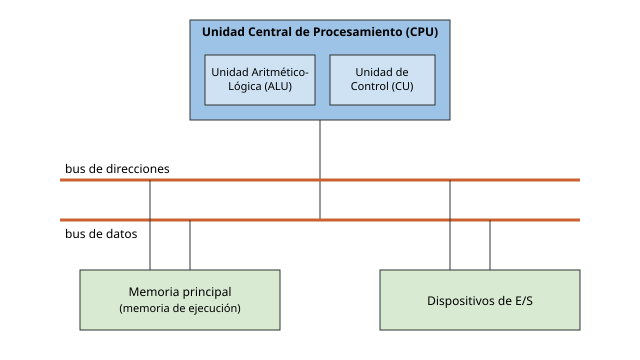

### Unidad de Control (CU)

Se encarga de obtener y ejecutar las instrucciones de la memoria principal. Está constituida por:

- unidad de obtención,
- unidad de decodificación,
- unidad funcional,
- contador de programa (**PC**),
- registro de instrucción (**IR**).

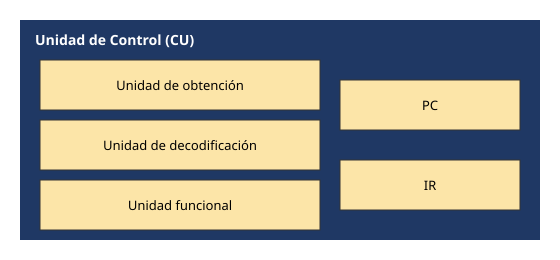

La ejecución de un fragmento de código de alto nivel se traduce a instrucciones máquina que operan sobre registros (`R1`, `R2`, …, `Rn`), la unidad funcional y los registros de estado, intercambiando datos con la memoria primaria:

```asm
; Código en lenguaje ensamblador para  a = b + c;
load     R3, b        ; Copiar el valor de b desde la memoria a R3
load     R4, c        ; Copiar el valor de c desde la memoria a R4
add      R3, R4       ; Colocar la suma en R3
store    R3, a        ; Almacenar la suma en la celda de memoria a

; Código en lenguaje ensamblador para  d = a - 100
load     R4, =100     ; Cargar el valor 100 en R4
subtract R3, R4       ; Colocar la resta en R3
store    R3, d        ; Almacenar el resultado en la celda de memoria d
```

Ruta de datos: los registros aportan el operando izquierdo y derecho a la unidad funcional, que deja el resultado en los registros de estado; los registros intercambian datos con la memoria primaria.

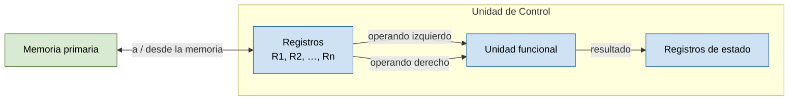

### Memoria Principal (PM)

- Contiene los programas (conjuntos de instrucciones) y sus datos (variables) que la CPU manipula.
- La unidad de acceso es la **palabra**, formada por celdas de 8 bits (**bytes**).
- Los ordenadores actuales tienen longitudes de palabra de 64 bits, frente a los más antiguos de 8, 16 o 32 bits.
- El acceso a la memoria se realiza mediante tres registros especiales (no son visibles para el programa, a diferencia de `R1`, `R2`…). Cada uno se conecta a un bus:
  - **MAR** — registro de direcciones de memoria (*memory address register*): guarda la dirección de la celda a la que se accede. Va por el bus de direcciones (CPU → memoria).
  - **MDR** — registro de datos de memoria (*memory data register*): guarda el dato leído de la memoria o el que se va a escribir en ella. Va por el bus de datos (bidireccional).
  - **CMD** — registro de órdenes (*command register*): indica la operación (lectura o escritura) y las señales de sincronización. Va por el bus de control.
- Así, una lectura consiste en poner la dirección en MAR y «lectura» en CMD; la memoria deja el contenido de esa celda en MDR. Una escritura pone dirección en MAR, dato en MDR y «escritura» en CMD.

### Objetivos de un sistema operativo

- **Comodidad**: hace más fácil y seguro utilizar los recursos de un ordenador.
- **Eficiencia**: aprovecha los recursos del ordenador, sin desperdiciar CPU, memoria ni dispositivos.
- **Capacidad de evolución**: su construcción debe permitir el desarrollo e introducción de nuevas funciones del sistema sin interferir en su mantenimiento.

### Dispositivos de E/S

- **Operación de entrada**: transfieren información de entrada, a través del bus de datos, a los registros de la CPU, para que ésta la almacene en la memoria principal.
  - *Teclado*: al pulsar una tecla, su controlador deja el código de la tecla en un registro; ese código viaja por el bus de datos a un registro de la CPU, que lo escribe en el buffer de teclado en la memoria principal para que lo lea el proceso.
  - *Sensor de temperatura (sistema empotrado)*: el conversor analógico‑digital del sensor deja el valor medido en un registro de su controlador; la CPU lo lee por el bus de datos y lo guarda en la memoria principal para procesarlo.
- **Operación de salida**: la CPU obtiene información de la memoria principal y la coloca en sus registros para volcarla sobre un dispositivo de salida con ayuda del bus de datos.
  - *Pantalla*: la CPU toma de la memoria principal los datos del framebuffer, los pasa a sus registros y los vuelca por el bus de datos al controlador gráfico, que los envía al monitor.
  - *Impresora*: la CPU lee de la memoria principal el texto o la imagen a imprimir, lo coloca en sus registros y lo transfiere por el bus de datos al controlador de la impresora.

## 1.3 Conceptos básicos de los sistemas operativos

### Ejecución de instrucciones

La ejecución de instrucciones consiste en repetir el proceso:

1. Leer instrucciones de la memoria principal (una cada vez).
2. Ejecutar la instrucción.

El **ciclo de instrucción** esta formado por el ciclo de búsqueda, el ciclo de decodificación y el ciclo de ejecución:

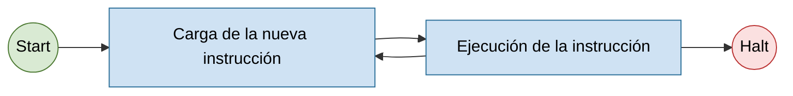

Las instrucciones máquina son de unos pocos tipos: **transferencia** (copian datos entre memoria y registros, `load`/`store`), **aritmético‑lógicas** (operan sobre registros, `add`, `subtract`, `and`), **saltos incondicionales** (cambian el `PC` para continuar en otra dirección, `jump`) y **saltos condicionales** (saltan solo si se cumple una condición sobre los registros de estado, `jump if zero`). Con estos bloques —mover datos, calcular y bifurcar— se construyen los bucles y condicionales de cualquier programa.

### Interrupciones

Las interrupciones permiten **detener el orden normal de ejecución** para atender un evento y luego reanudarlo. Sus finalidades principales son:

- **Evitar la espera activa**: la CPU lanza una operación de E/S al disco duro y sigue trabajando; el disco duro avisa con una interrupción cuando termina, en lugar de que la CPU lo espere en bucle hasta que encuentra la información.
- **Devolver el control al sistema operativo**: permite al SO recuperar la CPU periódicamente para repartirla entre procesos (multiprogramación) y evitar que un proceso la monopolice.
- **Atender errores y eventos urgentes**: excepciones como la división por cero o un fallo de hardware se tratan de inmediato, sin esperar a que el programa las compruebe.

**Clases de interrupciones:**

| Clase | Ejemplos |
|-------|----------|
| Programa | desbordamiento (*overflow*), división por cero, instrucción ilegal, referencia de programa fuera de límites… |
| Tiempo | *timer* del procesador |
| E/S | al completarse una operación de E/S |
| Fallos de hardware | error de paridad de memoria |

**Procesamiento de una interrupción:**

1. Una fuente de interrupción activa una señal de interrupción hacia la CPU (poner un pin en HIGH).
2. La CPU termina la ejecución de la instrucción en curso.
3. La CPU comprueba qué interrupción está activada (máscaras) y si debe atenderla (prioridades).
4. La CPU guarda el contexto del programa interrumpido (registros, incluido el PC) en la pila.
5. Carga en el PC la dirección de comienzo de la rutina de servicio de la interrupción.
6. Se ejecuta la rutina de servicio, que atiende la causa concreta de la interrupción (por ejemplo, leer el estado de un dispositivo de E/S y completar la operación, o tratar el error).
7. Se recupera el contexto del programa desde la pila.
8. Se retoma la ejecución del programa en el punto en el que se había detenido.

El ciclo de instrucción con comprobación de interrupciones queda así:

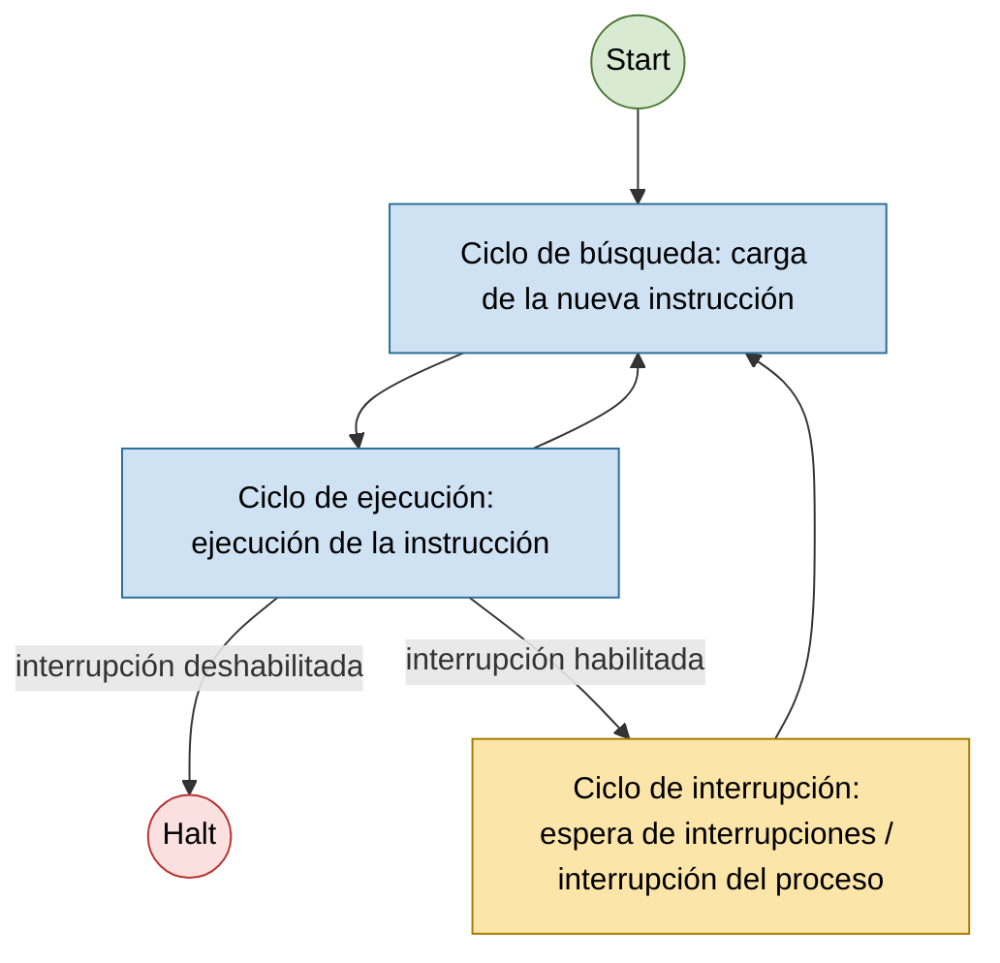

Las interrupciones permiten que un proceso inicie una operación en un dispositivo, el sistema operativo ponga en ejecución otro trabajo mientras el primero espera, y vuelva al primero cuando el dispositivo anuncia que ha terminado:

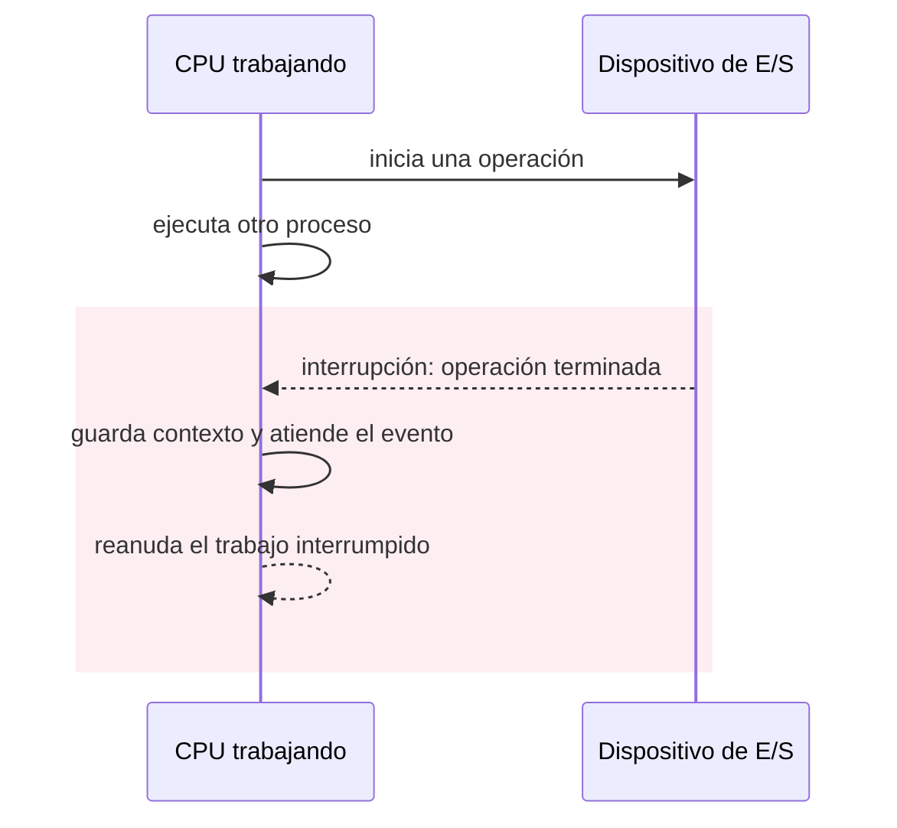

*Una interrupción permite que el procesador haga otro trabajo mientras espera a un dispositivo y recupere la operación cuando este anuncia que ha terminado.*

**Interrupciones simultáneas.** Cuando se producen varias interrupciones a la vez se puede:

- **Deshabilitar interrupciones**: se manejan una detrás de otra. Puede no ser suficiente para sistemas que requieran tiempo real (RTOS).
- **Niveles de prioridad**: permiten el procesamiento anidado de interrupciones.

### Jerarquía de memoria

De más rápida y pequeña (arriba) a más lenta y grande (abajo):

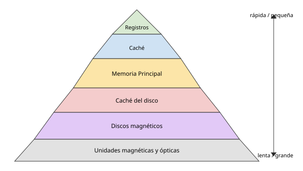

*Cuanto más cerca está la memoria de la CPU, más rápida es, pero menor es su capacidad.*

Esta pirámide existe por **coste**: la memoria rápida (SRAM de registros y cachés) usa 6 transistores por bit y ocupa mucho silicio. Como no se puede tener toda la memoria rápida, se pone poca cerca de la CPU y mucha lejos. Las **cachés** funcionan porque los accesos a memoria siguen patrones predecibles (**localidad**): si se usa un dato, es muy probable que se vuelva a usar pronto (temporal) y que se usen los datos vecinos (espacial). La caché guarda automáticamente esas zonas «calientes», de modo que la mayoría de accesos se resuelven en L1/L2 sin bajar a la RAM.

| Nivel | Latencia típica | Capacidad | Precio aprox. |
|-------|-----------------|-----------|---------------|
| Registros | < 1 ns (acceso inmediato) | ~1–2 KB por núcleo | carísima por byte |
| Caché L1 | ~1 ns (~4 ciclos) | 32–64 KB por núcleo | ~1000 €/GB (estimado, SRAM) |
| Caché L2 | ~3–5 ns (~12–15 ciclos) | 256 KB–2 MB por núcleo | ~1000 €/GB (estimado, SRAM) |
| RAM DDR4 | ~60–90 ns (~200–300 ciclos) | 8–128 GB | ~2–4 €/GB |


## 1.4 Características de los sistemas operativos

### Funciones y servicios de un sistema operativo

- **Herramientas de desarrollo**: editores, compiladores, depuradores de código.
- **Ejecución de código**: carga de instrucciones y datos en memoria, inicialización de los dispositivos de E/S y ficheros…
- **Acceso a los dispositivos de E/S**: el sistema operativo hace transparentes al usuario las peculiaridades de cada dispositivo y transforma las órdenes `read`/`write` del usuario en las instrucciones particulares de cada dispositivo.
- **Acceso controlado a los ficheros**: apertura y cierre de ficheros en el dispositivo de almacenamiento y operaciones de lectura y escritura sobre ellos.
- **Acceso al sistema**: resuelve los conflictos de uso de los recursos y protege el acceso a datos o ficheros no autorizados.
- **Detección de errores y respuesta**: informa al usuario de los errores producidos (de memoria, de fallo en un dispositivo…) minimizando su impacto sobre el usuario y sobre los programas en ejecución.
- **Monitorización y estadísticas de uso**: recoge información sobre el consumo de recursos, la disponibilidad del sistema, etc.

## 1.5 Estructuras de los sistemas operativos

Visión general: en su forma más básica, el sistema operativo es un **conjunto de funciones** (en C, procedimientos) que implementan sus tareas: `fork()` para crear un proceso, `read()` para leer de un fichero, `kmalloc()` para reservar memoria del núcleo, `schedule()` para elegir el siguiente proceso, etc.

- Cada función tiene una **cabecera fija** con sus parámetros y su valor de retorno (por ejemplo, `read(fd, buffer, n)` devuelve el número de bytes leídos).
- Una función del núcleo puede llamar directamente a cualquier otra: `sys_read` llama al gestor del sistema de archivos, que a su vez llama al *driver* del disco.
- Cada archivo `.c` del núcleo se compila por separado y el enlazador une todos los `.o` en un único binario (`vmlinux` en Linux).
- Los programas de usuario no llaman a esas funciones del sistema operativo directamente: usan **llamadas al sistema**, que colocan los parámetros en registros o en la pila y provocan una interrupción software para entrar al núcleo. Al terminar, el control vuelve al programa del usuario. Así el sistema operativo puede controlar cada llamada al sistema y hace imposible (en teoría) que un proceso de usuario rompa el sistema operativo.

Comparativa de estructuras (usuario / núcleo):

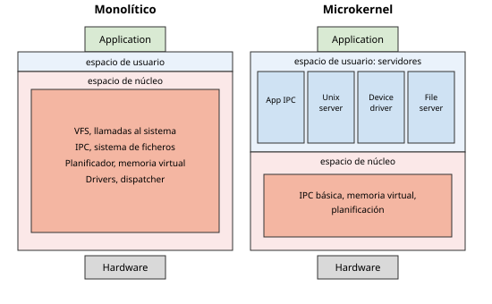

### Sistemas monolíticos

Todo el sistema operativo es **un único binario que se ejecuta en espacio de núcleo**. El programa de usuario solo interviene al principio: hace una llamada al sistema (`read()`, `fork()`…) que salta al núcleo. Dentro del núcleo, el código se organiza en 3 capas (todas son código del núcleo, no del usuario):

- Una **rutina despachadora** (*dispatcher*): recibe la llamada al sistema, mira su número y salta a la función de servicio correspondiente.
- Un conjunto de **funciones de servicio**: una por cada llamada al sistema (`sys_read`, `sys_fork`…); son las que hacen el trabajo.
- Un conjunto de **funciones de utilidad**: código auxiliar compartido que usan las funciones de servicio (copiar datos entre usuario y núcleo, manejar listas de procesos, bloques de disco…).

- **Ventaja**: **eficiencia**. Todos los módulos comparten el mismo espacio de memoria y se llaman entre sí con una simple llamada a función (unos pocos nanosegundos); no hay cambios de contexto ni copias de datos entre servicios.
- **Desventaja**: **fragilidad y complejidad**. Todo corre con máximos privilegios y sin aislamiento, un fallo en cualquier módulo (por ejemplo un *driver*) tumba el sistema entero: *kernel panic* en Linux, pantallazo azul en Windows. El código fuente de Linux ronda los **30 millones de líneas de código** (la mayoría, controladores de dispositivos), lo que hace muy difícil garantizar que todo funcione bien junto.

Ejemplos: núcleos tipo Unix (Linux, Syllable, Unix, BSD —FreeBSD, NetBSD, OpenBSD—, Solaris), núcleos tipo DOS (DR‑DOS, MS‑DOS, familia Microsoft Windows 9x —95, 98, 98SE, Me—), núcleos de Mac OS hasta Mac OS 8.6, OpenVMS.

### Sistemas de microkernels

Un **microkernel** es un tipo de núcleo que provee un conjunto de llamadas al sistema **mínimas** para implementar servicios básicos: espacios de direcciones, comunicación entre procesos y planificación básica. El resto de servicios (gestión de memoria, sistema de archivos, operaciones de E/S…) se ejecutan como **procesos servidores en el espacio de usuario**. 

- **Ventaja**: **robustez**. Cada servicio corre en su propio proceso aislado, con privilegios mínimos; si el *driver* de red o el sistema de archivos se cuelga, el microkernel puede reiniciar ese servidor sin arrastrar al resto del sistema. También reduce la complejidad de cada pieza, mejora la portabilidad y facilita el desarrollo de *drivers*.
- **Desventaja**: **rendimiento** (al menos históricamente). Lo que en un monolítico es una llamada a función, aquí es un mensaje entre procesos (IPC): cambio de contexto, copia de datos y vuelta. Una operación sencilla puede cruzar varias veces la frontera usuario/núcleo. Los microkernels modernos (L4, seL4) han recortado esa penalización.

Ejemplos: AIX, AmigaOS, Amoeba, Minix, Hurd, L4, Netkernel, RaOS, RadiOS, ChorusOS, QNX (BlackBerry), SO3, Symbian.

### Sistemas híbridos

Son microkernels que mantienen algo de código **no esencial** en espacio de núcleo para que se ejecute más rápido de lo que lo haría en espacio de usuario. El paso de mensajes entre un proceso de usuario y un servidor que vive en otro proceso obliga a cambiar de contexto y copiar datos varias veces; si ese servidor está muy solicitado (gráficos, red, sistema de archivos), moverlo dentro del núcleo elimina ese coste a cambio de perder parte del aislamiento.

- **Windows NT** (y sus descendientes 2000, XP, 10, 11): el diseño original de NT era casi un microkernel, pero desde NT 4.0 el subsistema gráfico (GDI, gestor de ventanas) se movió al núcleo (`win32k.sys`) por rendimiento. También ejecutan en modo núcleo el sistema de archivos y la pila de red.
- **XNU** (macOS, iOS): combina el microkernel **Mach** (gestión de tareas, memoria y mensajes) con un componente **BSD** monolítico (procesos POSIX, red, VFS) y los *drivers* de **I/O Kit**, todo en el mismo espacio de núcleo.

Ejemplos: Microsoft Windows NT, XNU/Darwin (usado en macOS), DragonFlyBSD, ReactOS.


## 1.6 Clases de sistemas operativos

Tipos: primeros sistemas · sistemas por lotes · multiprogramación · sistemas de tiempo compartido · sistemas de ordenadores personales · sistemas paralelos‑multiprocesadores · sistemas distribuidos · sistemas de tiempo real · sistemas empotrados · máquinas virtuales.

### Primeros sistemas

Antes de los sistemas operativos, preparar un programa para su ejecución podía implicar configurar físicamente la máquina. En la imagen, Jean Bartik y Frances Spence preparan ENIAC para una demostración en 1946.

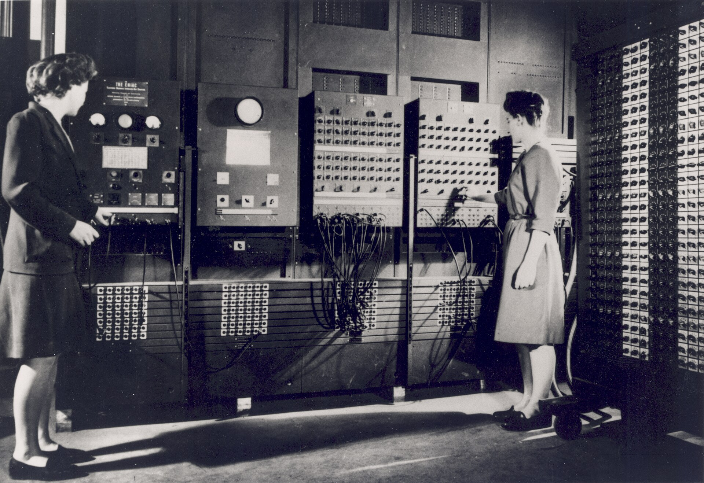

<sub>Fuente: fotografía del U.S. Army, 1946; dominio público. [Ficha y licencia en Wikimedia Commons](https://commons.wikimedia.org/wiki/File:Two_women_operating_ENIAC_(full_resolution).jpg).</sub>

- **Caracterización**: gran tamaño; ejecución desde el panel de control.
- **Organización del trabajo**: programador = operador del sistema; un solo usuario en cada momento (tiempo asignado, reserva); operaciones de carga manual del programa en memoria (instrucción tras instrucción), establecer inicio, activar ejecución y vigilar ejecución.
- **Mejoras**: físicas (lectores de tarjetas, impresoras, cintas magnéticas); reutilización de código (bibliotecas de funciones comunes); ensambladores, compiladores y cargadores; *drivers* o subrutinas especiales para cada dispositivo de E/S.
- **Desventajas**: la CPU pasa parada la mayor parte del tiempo. Solo trabaja durante la ejecución del programa; el resto del turno se va en tareas manuales en las que la máquina espera: montar las cintas o tarjetas, poner los interruptores del panel, cargar el programa en memoria instrucción a instrucción y retirar los resultados. Además, un solo error (una instrucción mal tecleada, una tarjeta descolocada) obliga a repetir toda la preparación desde el principio. Si un programa termina antes de lo esperado, la máquina no hace nada (no carga el siguiente).

### Sistemas por lotes

- **Organización del trabajo**: agrupando trabajos en **lotes**; secuenciado automático de trabajos mediante transferencia automática de control de un trabajo al siguiente ⇒ **monitor residente**.
- **Monitor residente**: un pequeño programa que **está siempre en memoria** (de ahí "residente") y actúa como sistema operativo mínimo. Cuando un trabajo termina o falla, retoma el control, lo anota y carga el siguiente trabajo sin intervención del operador. Ejemplos: FMS (*Fortran Monitor System*) e IBSYS en los IBM 7090/7094.
- **Tarjetas de control**: dentro del mazo de tarjetas, además de tarjetas de programas y de datos, van unas tarjetas especiales (empiezan por `$` o `//`) que le dicen al monitor qué hacer. 
  Este "lenguaje de tarjetas de control" es el antepasado de los *scripts* de shell actuales; IBM lo llamó **JCL** (*Job Control Language*).
- **Organización de la memoria**: la memoria se parte en dos. En la zona baja vive el monitor  (el intérprete de tarjetas de control, el cargador, el secuenciador de trabajos y los *drivers* de la lectora de tarjetas y la impresora); el resto queda para el programa de usuario en ejecución.
- **Ventaja**: eliminación del tiempo de preparación y del secuenciado manual de trabajos.

En los sistemas de procesamiento por lotes, los trabajos y sus datos se preparaban en tarjetas perforadas y se entregaban para su ejecución; el usuario no interactuaba con el programa mientras la computadora procesaba el lote.

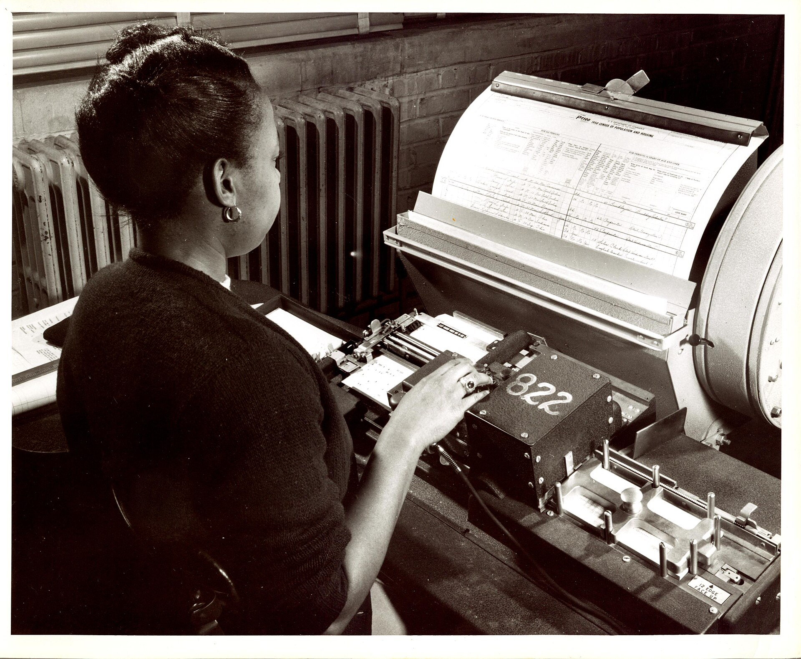

<sub>Fuente: U.S. Census Bureau, década de 1950; dominio público. [Ficha y licencia en Wikimedia Commons](https://commons.wikimedia.org/wiki/File:Keypunch_operator_1950_census_IBM_016.jpg).</sub>

#### El problema de la lentitud de la E/S

Aun con el monitor residente, la CPU seguía desaprovechada: leer una tarjeta o imprimir una línea es **miles de veces más lento** que ejecutar instrucciones, así que la CPU pasaba la mayor parte del tiempo esperando a la lectora o a la impresora. Se abordó de tres formas:

- **Operaciones *off‑line***: en lugar de que el ordenador central leyera las tarjetas directamente, una máquina auxiliar barata (un IBM 1401) copiaba el mazo de tarjetas a una **cinta magnética**; el ordenador central (un IBM 7094) leía de la cinta, mucho más rápida, y escribía los resultados en otra cinta que luego otra máquina auxiliar volcaba a la impresora. El ordenador central solo dialoga con dispositivos rápidos.
- **Búferes** (*buffering*): mientras la CPU procesa el registro actual, el controlador va leyendo por adelantado el siguiente a una zona de memoria intermedia (el búfer). Cuando la CPU lo pide, ya está ahí. Solapa E/S de un trabajo con el cálculo de ese mismo trabajo.
- ***Spooling*** (*Simultaneous Peripheral Operations On-Line*): el disco actúa como un búfer enorme. Mientras se ejecuta el trabajo A, el sistema ya está leyendo del lector las tarjetas del trabajo B al disco y enviando a la impresora los resultados del trabajo Z. Como el disco permite acceso directo, además habilita **elegir** qué trabajo del disco ejecutar a continuación (planificación de trabajos). Es el mismo mecanismo que hoy usa la **cola de impresión**  - puedes mandar documentos a imprimir desde varios ordenadores, pero no necesitas esperar a que se impriman, la impresora ira procesando la cola independientemente a su ritmo; puedes consultar la cola, la posición de tus documentos y cancelarlos.

### Sistemas multiprogramados

- **Planificación de trabajos**: el sistema operativo escoge el siguiente trabajo a ejecutar para mejorar el aprovechamiento de la CPU.
- La multiprogramación aumenta el aprovechamiento de la CPU: siempre hay varios trabajos en memoria y el sistema operativo escoge cuál se ejecuta, de forma que siempre haya un trabajo en ejecución.
- **Características**: si un proceso se bloquea esperando por la E/S, la CPU ejecuta instrucciones de otro proceso; ejecución entrelazada de procesos (**concurrencia**); mayor rendimiento, se finalizan más trabajos en menos tiempo.
- **Mayor complejidad**: planificación de la CPU (qué proceso elegir al quedar libre); planificación de dispositivos (conflictos por acceso simultáneo a la E/S); gestión de memoria (decisiones de carga entre varios trabajos listos); situaciones de **interbloqueo** entre procesos por los recursos; protección.

**Monoprogramado vs multiprogramado** (uso de CPU y E/S a lo largo del tiempo): en el sistema monoprogramado la CPU queda ociosa mientras la Tarea 1 hace E/S; en el multiprogramado, la Tarea 2 aprovecha la CPU mientras la Tarea 1 está en E/S, y viceversa.

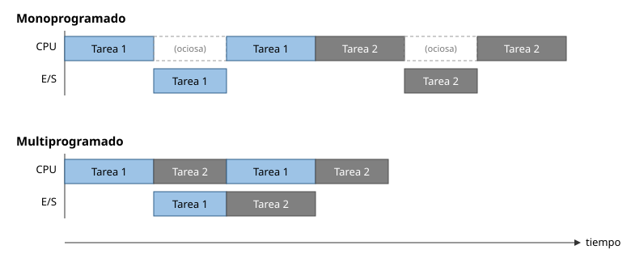

### Sistemas de tiempo compartido

- El usuario no puede interactuar con el trabajo durante su ejecución; la depuración de programas es estática.
- **Solución**: sistemas multitarea (interactivos), más apropiados para trabajos de muchas acciones cortas en los que **cada orden depende del resultado de la anterior**, así que el usuario tiene que ver la respuesta antes de decidir el siguiente paso ⇒ interesa un tiempo de respuesta corto. En un sistema por lotes habría que anticipar todo el flujo en el mazo de tarjetas y esperar horas para ver el primer error.
- **Desventaja**: baja la productividad de la CPU.
- **Ventajas**: interacción usuario‑sistema; sensación de que cada usuario tiene su ordenador particular.
- **Mayor complejidad**: gestión y protección de memoria (varios trabajos simultáneos); memoria virtual (intercambio entre memoria y disco); sistema de archivos en línea; planificación de CPU (ejecución concurrente); mecanismos de sincronización y comunicación (evitando interbloqueos).

### Sistemas con varios procesadores

Los dos tipos siguientes usan varios procesadores, y se distinguen por cómo de **acoplados** están:

- **Fuertemente acoplados** (sistemas paralelos): los procesadores comparten memoria y reloj; se comunican leyendo y escribiendo las mismas posiciones de memoria, que es muy rápido. Están dentro de la misma máquina.
- **Débilmente acoplados** (sistemas distribuidos): cada procesador es un ordenador completo con su propia memoria y su propio reloj; solo se comunican enviándose mensajes por la red, mucho más lento y sujeto a fallos.

### Sistemas paralelos

- Varios procesadores **dentro de un mismo computador**, compartiendo el bus, el reloj, la memoria y los periféricos (fuertemente acoplados).
- Ejemplos: cualquier PC o móvil actual (CPU de varios núcleos), un servidor con dos zócalos de procesador, una GPU (miles de núcleos para el mismo cálculo).
- **Ventajas**: ejecución simultánea de varias instrucciones; más rendimiento; se comparten periféricos y alimentación; tolerancia a fallos (si un procesador falla, el sistema sigue más despacio en vez de pararse).
- **Desventaja**: sincronización entre procesos que tocan los mismos datos.
- **Tipos de multiprocesamiento**: **simétrico** (SMP: todos los procesadores son iguales y ejecutan la misma copia del sistema operativo; lo normal hoy) y **asimétrico** (a cada procesador se le asigna una tarea fija).

### Sistemas distribuidos

- **Características**: el cómputo se reparte entre varios ordenadores conectados por una red; cada uno tiene su memoria y su reloj (**débilmente acoplados**); pueden ser de distinto tipo (heterogéneos); escala hasta millones de nodos (internet).
- Ejemplos: un clúster de cálculo, la infraestructura de Google o Amazon, una red *peer-to-peer* (BitTorrent), una cadena de bloques, el propio internet.
- **Ventajas**: recursos compartidos (archivos, impresoras, bases de datos remotas); reparto de la carga de trabajo; fiabilidad por redundancia (si cae un nodo, otros siguen); comunicación entre usuarios.
- **Desventajas**: programar la comunicación es complejo al no haber memoria común; la red puede fallar, perder mensajes o ser lenta; nodos heterogéneos.

### Sistemas de tiempo real

Para ejecución de tareas que han de completarse en un plazo prefijado (control industrial, robótica…). En un sistema de tiempo real no basta con obtener el resultado correcto: debe obtenerse antes de que venza su plazo. Dos ejemplos concretos:

- **Airbag de un coche**: el acelerómetro detecta una deceleración brusca y la centralita tiene que decidir y disparar el inflado en unos **15–30 ms**. Un resultado correcto pero 50 ms tarde es inútil: el ocupante ya ha golpeado el volante.
- **Control de vuelo de un dron**: el lazo de estabilización lee la unidad inercial (giróscopo + acelerómetro) y recalcula la potencia de cada motor **cada 1–2 ms** (500–1000 Hz). Si una iteración se retrasa, el dron se desestabiliza y cae.

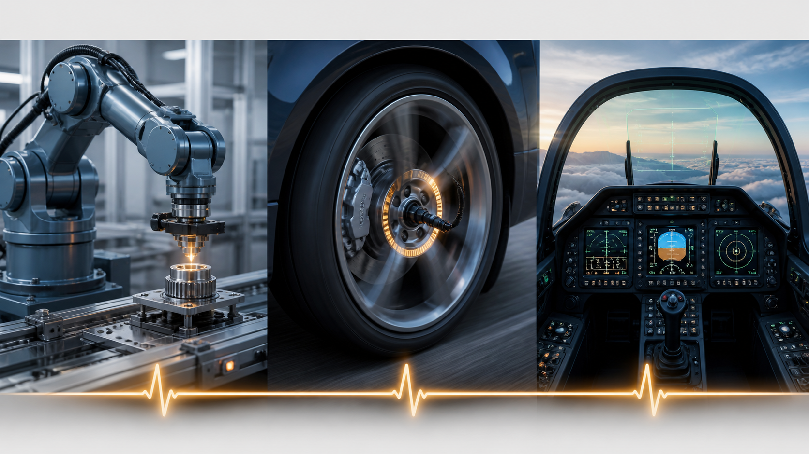

*En un sistema de tiempo real no basta con obtener el resultado correcto: debe obtenerse antes de que venza su plazo. Ilustración generada para estos apuntes.*

**¿Con qué software se construyen?** Según lo exigente que sea el sistema:

- **Sin sistema operativo** (*bare metal*): el programa se ejecuta directamente sobre el microcontrolador, normalmente como un bucle infinito que lee sensores y actúa, más rutinas de interrupción para los eventos urgentes. Es lo más habitual en dispositivos sencillos (un mando a distancia, el airbag, un termostato): sin planificador ni capas intermedias, el comportamiento es totalmente predecible y el código cabe en pocos KB. A cambio, todo el trabajo de coordinar tareas recae en el programador y cuando las cosas fallan, hay pocas utilidades para depurar.
- **RTOS ligero**: cuando hay varias tareas concurrentes con plazos distintos, se usa un *kernel* de tiempo real mínimo. **FreeRTOS** (open source, de Amazon) es el más extendido: ocupa unos pocos KB y aporta solo lo esencial —planificador expulsivo por prioridades, semáforos, colas y temporizadores—, sin sistema de archivos ni protección de memoria. Se usa en electrodomésticos, *wearables* y dispositivos IoT.
- **RTOS certificado**: para aviónica, automoción o sistemas militares donde un fallo cuesta vidas se emplean RTOS con garantías formales y certificación (DO‑178C, etc.). **QNX** (microkernel, hoy de BlackBerry) domina la electrónica del automóvil y se ha usado en aviónica y en sistemas de defensa. En aviones de combate se usan RTOS de esta familia.

### Sistemas empotrados

Un sistema empotrado es un ordenador que forma parte de un aparato y se dedica a controlarlo, sin que el usuario lo perciba como "un ordenador". A diferencia de un PC o un móvil (que ejecutan cualquier programa que instale el usuario), un sistema empotrado ejecuta **un único programa fijo**, grabado de fábrica.

- **Funciones dedicadas**: hace una sola tarea (regular una temperatura, leer un mando, mover un motor), no es de propósito general.
- **Precio y consumo de energía reducidos**: se fabrican por millones y muchos funcionan con pila o batería durante años, así que llevan el microcontrolador más pequeño y barato que sirva (a veces de céntimos y unos pocos KB de memoria). Para ahorrar, el micro pasa casi todo el tiempo en **modo reposo** (*sleep*), con el reloj de la CPU parado y consumos de microamperios; una interrupción externa (*wake-up*: pulsar un botón, un temporizador, la llegada de un dato por radio) lo **despierta**, atiende el evento en unos milisegundos y vuelve a dormir. Al dormir se pierde el contenido de casi todo, pero una pequeña zona de RAM *retenida* y los registros de reloj de tiempo real siguen alimentados, de modo que al despertar el programa sabe qué hora es y en qué estado se quedó.
- **Fiabilidad y autonomía**: deben funcionar sin mantenimiento ni reinicios, a menudo en sitios inaccesibles.

Ejemplos: el termostato de una caldera, la centralita que controla la inyección de un motor, el controlador de una lavadora, un router doméstico, un satélite pequeño (CubeSat), el mando de un garaje.

### Máquinas virtuales / contenedores

- Se emula un ordenador, pudiendo ejecutar programas como si fuese una máquina real.
- Los procesos que ejecutan están limitados por los recursos y abstracciones que la máquina virtual proporciona, y están **confinados** en ella.
- Permiten la convivencia de múltiples sistemas operativos sobre otros sistemas operativos.

Las máquinas virtuales reproducen un sistema completo (cada una con su propio SO invitado sobre un hipervisor); los contenedores comparten el núcleo del anfitrión y solo aíslan la aplicación y sus dependencias.

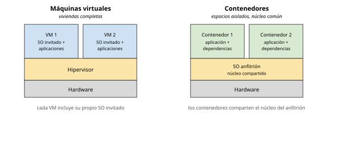

*La virtualización permite ejecutar varios entornos aislados sobre una misma máquina física. Las máquinas virtuales reproducen un sistema completo; los contenedores comparten el núcleo.*

### Cronologías (timelines)

Diagramas históricos de familias de sistemas operativos: Windows ([timeline de Microsoft](https://en.wikipedia.org/wiki/List_of_Microsoft_Windows_versions)), Macintosh, Android e [iOS](https://www.lifewire.com/ios-versions-4147730).

---

## Anexo: introducción histórica de los computadores

### Charles Babbage

- Máquina de Diferencias (1822).
- Primera referencia al concepto de programa almacenado en el computador (1836).
- Primera máquina de propósito general (máquina analítica).

Muchos historiadores consideran a Babbage y a su socia, la matemática británica **Augusta Ada Byron** (siglo XIX), los verdaderos inventores de la computadora digital moderna. La tecnología de la época no permitía llevar a la práctica sus conceptos, pero la **máquina analítica** ya tenía muchas características de un ordenador moderno: flujo de entrada mediante tarjetas perforadas, memoria para los datos, procesador para las operaciones matemáticas e impresora para el registro permanente. Era automática, no precisaba operador.

### De los analógicos a los electrónicos

- Los primeros **ordenadores analógicos** se construyeron a principios del siglo XX; hacían los cálculos mediante ejes y engranajes giratorios y evaluaban aproximaciones numéricas de ecuaciones difíciles. En las guerras mundiales se usaron para predecir trayectorias de torpedos y para el manejo a distancia de bombas.
- En **1939** John Atanasoff y Clifford Berry construyeron un prototipo de máquina electrónica en el Iowa State College (el **ABC**, Atanasoff‑Berry Computer).
- El **ENIAC** (*Electronic Numerical Integrator And Computer*, 1945) se basaba en gran medida en el ABC; contenía 18.000 válvulas de vacío y procesaba varios cientos de multiplicaciones por minuto, pero su programa estaba conectado al procesador y debía modificarse manualmente.
- Durante la II Guerra Mundial, un equipo de Bletchley Park (norte de Londres) creó el **Colossus**, considerado el primer ordenador digital totalmente electrónico. En diciembre de 1943 era operativo (incorporaba 1.500 válvulas) y el equipo dirigido por **Alan Turing** lo usó para descodificar los mensajes cifrados por la máquina **Enigma** alemana.
- La mayoría de los computadores actuales siguen la **arquitectura de Von Neumann**. El sucesor del ENIAC, el **EDVAC**, incorporaba almacenamiento de programa en memoria, lo que liberaba al ordenador de la velocidad del lector de cinta de papel y permitía resolver problemas sin volver a cablear la máquina. **John von Neumann** (Budapest 1903 – Washington D.C. 1957).

### Generaciones

- **Transistor** (finales de la década de 1950): elementos lógicos más pequeños, rápidos y versátiles que las válvulas, con menos consumo y mayor vida útil ⇒ ordenadores de **segunda generación**; fabricación más barata. **UNIVAC** (*Universal Automatic Computer*): línea de ordenadores de programa almacenado; el **UNIVAC I** fue la primera computadora electrónica de propósito general vendida comercialmente en EE. UU.
- **Circuito integrado (CI)** (finales de la década de 1960): varios transistores en un único sustrato de silicio; reducción de precio, tamaño y porcentajes de error.
- **Microprocesador** (mediados de la década de 1970): integración a gran escala (**LSI**, *Large Scale Integrated*) y muy gran escala (**VLSI**, *Very Large Scale Integrated*), con miles de transistores en un único sustrato. Inicio de la multiprogramación.
- **Cuarta generación** (actual): sustitución de las memorias de núcleos magnéticos por chips de silicio; microminiaturización de los circuitos; el tamaño reducido del microprocesador hizo posible el **ordenador personal (PC)**; integración del ordenador en las telecomunicaciones.

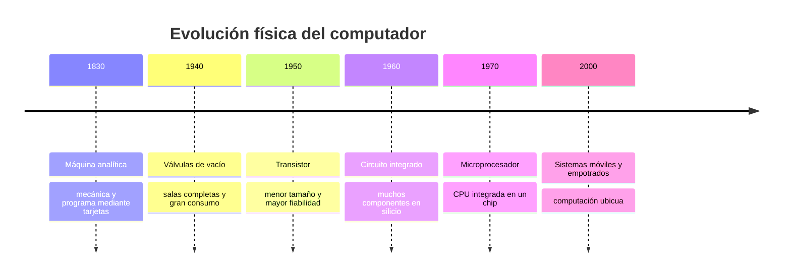

*La reducción del tamaño y del consumo transformó computadores que ocupaban salas enteras en sistemas empotrados presentes en objetos cotidianos.*

### Cronología de los sistemas operativos

| Periodo | Tipo de sistema | Novedades técnicas | Problemas / limitaciones | Sistemas representativos |
|---------|-----------------|--------------------|--------------------------|--------------------------|
| **1940‑1950** | Sin sistema operativo; procesamiento en serie | El programador maneja el hardware directamente desde el panel de programación (interruptores y displays) y con lector de tarjetas e impresora | Reserva manual de la máquina, CPU muy desaprovechada, trabajos abortados sin control, mucho **tiempo de preparación** (montar cintas/tarjetas, cargar el compilador y el programa) | ENIAC, EDSAC, IAS |
| **1950‑1960** | Por lotes (*batch*) | Programa **monitor** residente que encadena trabajos automáticamente; **protección de memoria**, **instrucciones privilegiadas**, **interrupciones**, temporizador. Luego: multiprogramación, interrupciones de E/S, **DMA** | Sin interacción con el trabajo en ejecución; depuración estática (a partir de vuelcos de memoria); un trabajo largo bloquea a los demás | FMS, IBSYS (IBM 7090/7094); OS/360 |
| **1960‑1970** | Tiempo compartido | Varios usuarios comparten la CPU por turnos (*time slice*); terminales interactivos; memoria virtual; sistema de archivos en línea | Menor rendimiento de CPU por los cambios de contexto; mayor complejidad (protección entre usuarios, planificación, sincronización) | **CTSS** y **Multics** (MIT), **UNIX** (Bell, 1970) |
| **1970‑1980** | Distribuidos y en red | Varios ordenadores conectados por red que cooperan mediante **paso de mensajes**; reparto de carga, recursos compartidos, redundancia | Programar la comunicación es complejo al no haber memoria común; la red es lenta y poco fiable; nodos heterogéneos | ARPANET, Xerox PARC (Ethernet); más tarde Novell NetWare, redes UNIX (TCP/IP) |
| **1980‑1990** | Tiempo real y empotrados | La corrección depende también del **instante** de entrega: determinismo, responsividad, tolerancia a fallos. Empotrados: hardware mínimo, ensamblador o C, bajo consumo | Recursos muy escasos; difícil garantizar los plazos; poca portabilidad; herramientas de desarrollo limitadas | VxWorks, QNX, VRTX, pSOS |
| **1990‑2000** | Ordenador personal y software libre | GUI de uso masivo; redes domésticas; **Linux** (Torvalds, 1991) = núcleo tipo Unix + herramientas **GNU** (Stallman, 1983): código abierto, portable, sin dependencia de un fabricante | Fragmentación y problemas de compatibilidad de controladores; curva de aprendizaje | **Windows 3.x/9x/NT**, **Mac OS**, **Linux**, distintos UNIX comerciales (Solaris, AIX, HP‑UX) |
| **2000‑** | Dispositivos móviles y computación ubicua | Diseño para batería y conectividad inalámbrica; pantalla táctil; tiendas de aplicaciones; organización en capas (**kernel**, ***middleware***, entorno de ejecución con APIs, interfaz de usuario) | Autonomía de la batería, seguridad y privacidad, diversidad de dispositivos | **Android** (núcleo Linux), **iOS** (núcleo Darwin/XNU); antes Symbian, BlackBerry OS, Windows Phone |


---

## Material gráfico

Las figuras de este tema están integradas en el texto y catalogadas en [`TEORIA/IMAGENES.md`](../IMAGENES.md). Queda como **material fotográfico** adicional (no reproducible), a criterio del profesor: retratos y fotos históricas (Charles Babbage, ENIAC, Colossus, John von Neumann, UNIVAC I) y las cronologías (*timelines*) de familias de sistemas operativos, enlazadas a Wikipedia en la sección «Cronologías».

---

## Material extra

Tres demostraciones para ejecutar en una máquina Linux y ver en vivo los conceptos del tema (varios procesos en ejecución y aislamiento de memoria, ciclo de compilación y código máquina): [`material-extra/material_extra.md`](material-extra/material_extra.md).
