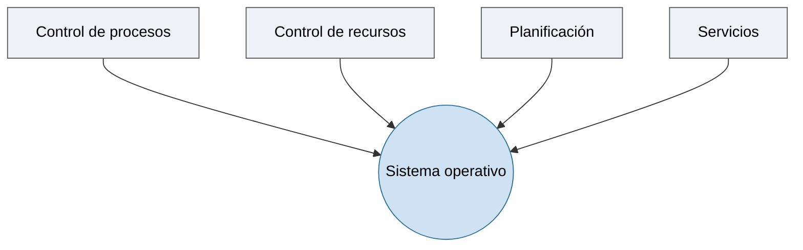
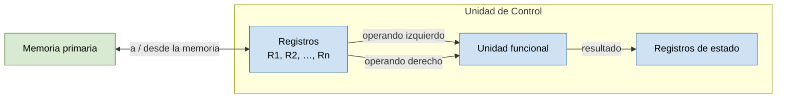
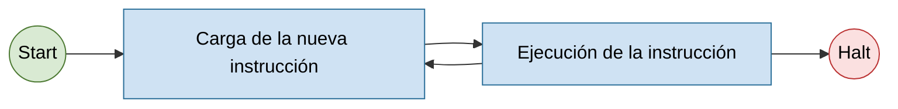
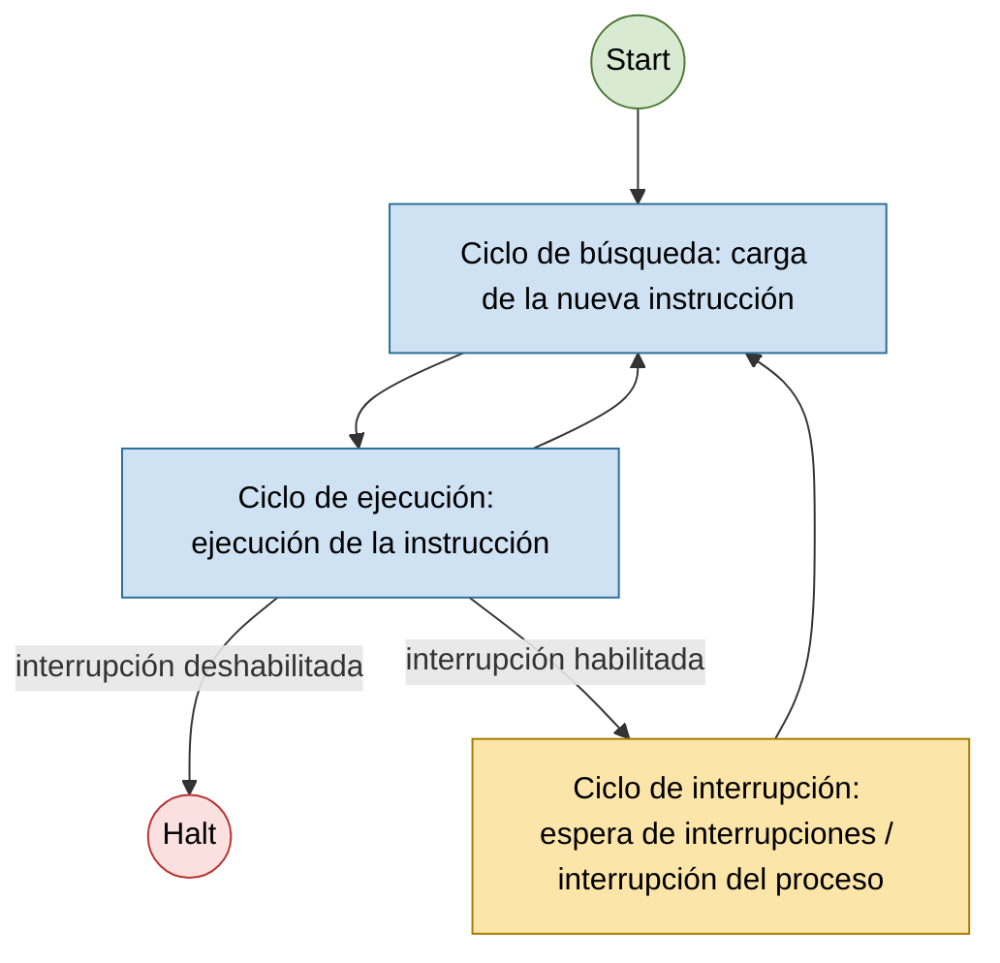
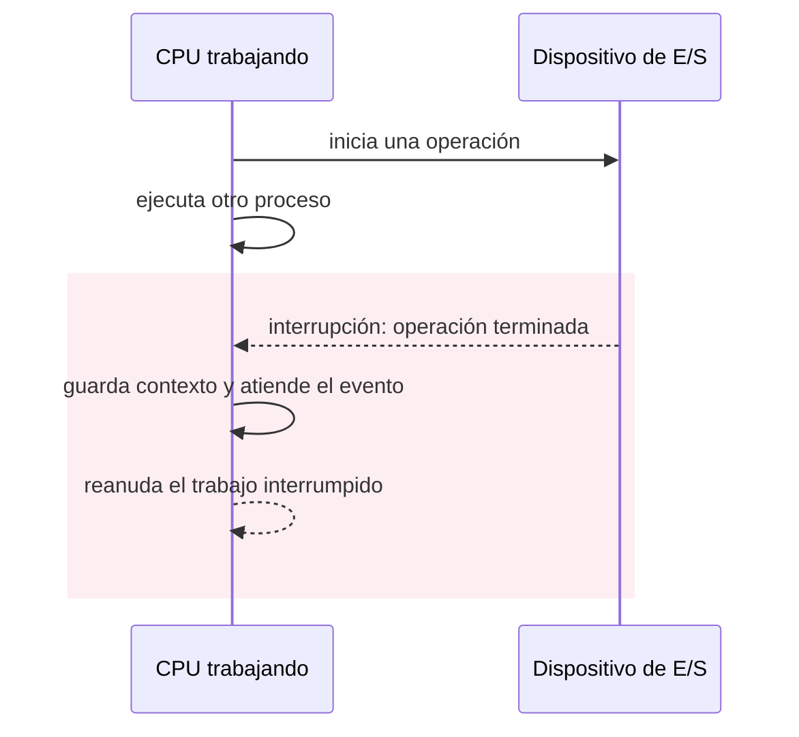
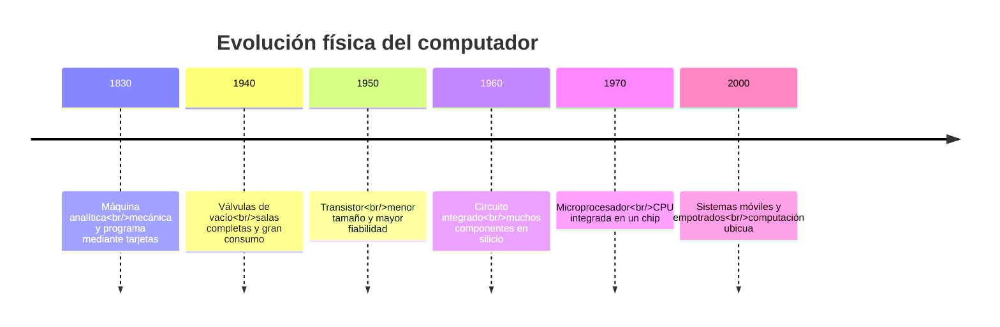

# Tema 1: Introducción a los sistemas operativos y conceptos básicos

1.1 Definición de sistema operativo · 1.2 Componentes del sistema operativo · 1.3 Conceptos básicos de los sistemas operativos · 1.4 Características de los sistemas operativos · 1.5 Estructuras de los sistemas operativos · 1.6 Clases de sistemas operativos.

---

## 1.1 Definición de sistema operativo

Distintos autores lo definen desde ángulos complementarios:

- **H. M. Deitel**: el sistema operativo es un programa que controla la ejecución de los programas de aplicación.
- **W. Stallings**: los sistemas operativos son, ante todo, administradores de recursos.
- **Silberschatz‑Peterson‑Galvin**: el programa más fundamental de todo el sistema es el sistema operativo, que controla todos los recursos del computador.
- **A. Tanenbaum**: un sistema operativo es un programa que actúa como intermediario entre el usuario y el hardware del computador.

**Definición de trabajo:** un sistema operativo es un programa *software* que controla la ejecución de los programas de aplicación y actúa como interfaz entre el usuario de un ordenador y el hardware del mismo.

Visto como conjunto de funciones, el sistema operativo se ocupa de:



## 1.2 Componentes del sistema operativo

El software de un computador se organiza en capas sobre el hardware. El sistema operativo se sitúa entre el hardware y el resto del software (compiladores, ensambladores, utilidades y aplicaciones):

<svg xmlns="http://www.w3.org/2000/svg" viewBox="0 0 460 300" font-family="sans-serif" font-size="14" role="img" aria-label="Capas de software: aplicaciones, utilidades, sistema operativo y hardware apilados">
  <rect width="460" height="300" fill="#ffffff"/>
  <rect x="50" y="20" width="360" height="55" fill="#cfe2f3" stroke="#333"/>
  <text x="230" y="53" text-anchor="middle">Aplicaciones</text>
  <path d="M 230 75 L 230 85 L 224 85 M 230 85 L 236 85" stroke="#333" fill="none"/>
  <line x1="230" y1="75" x2="230" y2="85" stroke="#333"/>
  <path d="M 224 82 L 230 88 L 236 82" fill="none" stroke="#333"/>
  <rect x="50" y="88" width="360" height="55" fill="#d9ead3" stroke="#333"/>
  <text x="230" y="121" text-anchor="middle">Utilidades</text>
  <line x1="230" y1="143" x2="230" y2="153" stroke="#333"/>
  <path d="M 224 150 L 230 156 L 236 150" fill="none" stroke="#333"/>
  <rect x="50" y="156" width="360" height="55" fill="#fff2cc" stroke="#333"/>
  <text x="230" y="189" text-anchor="middle">Sistema operativo</text>
  <line x1="230" y1="211" x2="230" y2="221" stroke="#333"/>
  <path d="M 224 218 L 230 224 L 236 218" fill="none" stroke="#333"/>
  <rect x="50" y="224" width="360" height="55" fill="#e2e2e2" stroke="#333"/>
  <text x="230" y="257" text-anchor="middle">Hardware</text>
</svg>

Por debajo del sistema operativo hay una máquina física que sigue la **arquitectura de Von Neumann**.

### Arquitectura de Von Neumann

En ella se basan los ordenadores actuales: la máquina tiene un conjunto **fijo** de componentes electrónicos cuyas acciones están determinadas por un **programa variable**.

<svg xmlns="http://www.w3.org/2000/svg" viewBox="0 0 640 360" font-family="sans-serif" font-size="13" role="img" aria-label="Arquitectura de Von Neumann: CPU conectada por bus de direcciones y de datos a la memoria principal y a los dispositivos de E/S">
  <rect width="640" height="360" fill="#ffffff"/>
  <rect x="190" y="20" width="260" height="100" fill="#9dc3e6" stroke="#333"/>
  <text x="320" y="36" text-anchor="middle" font-weight="bold" font-size="12">Unidad Central de Procesamiento (CPU)</text>
  <rect x="205" y="55" width="110" height="50" fill="#cfe2f3" stroke="#333"/>
  <text x="260" y="76" text-anchor="middle" font-size="11">Unidad Aritmético-</text>
  <text x="260" y="90" text-anchor="middle" font-size="11">Lógica (ALU)</text>
  <rect x="330" y="55" width="105" height="50" fill="#cfe2f3" stroke="#333"/>
  <text x="382" y="76" text-anchor="middle" font-size="11">Unidad de</text>
  <text x="382" y="90" text-anchor="middle" font-size="11">Control (CU)</text>
  <line x1="320" y1="120" x2="320" y2="220" stroke="#333"/>
  <line x1="60" y1="180" x2="580" y2="180" stroke="#c9622f" stroke-width="3"/>
  <text x="65" y="173" font-size="12">bus de direcciones</text>
  <line x1="60" y1="220" x2="580" y2="220" stroke="#c9622f" stroke-width="3"/>
  <text x="65" y="238" font-size="12">bus de datos</text>
  <line x1="150" y1="180" x2="150" y2="270" stroke="#333"/>
  <line x1="190" y1="220" x2="190" y2="270" stroke="#333"/>
  <line x1="450" y1="180" x2="450" y2="270" stroke="#333"/>
  <line x1="490" y1="220" x2="490" y2="270" stroke="#333"/>
  <rect x="80" y="270" width="200" height="60" fill="#d9ead3" stroke="#333"/>
  <text x="180" y="296" text-anchor="middle" font-size="12">Memoria principal</text>
  <text x="180" y="312" text-anchor="middle" font-size="11">(memoria de ejecución)</text>
  <rect x="380" y="270" width="200" height="60" fill="#d9ead3" stroke="#333"/>
  <text x="480" y="305" text-anchor="middle" font-size="12">Dispositivos de E/S</text>
</svg>

### Unidad de Control (CU)

Se encarga de obtener y ejecutar las instrucciones contenidas en la memoria principal. Está constituida por:

- unidad de obtención,
- unidad de decodificación,
- unidad funcional,
- contador de programa (**PC**),
- registro de instrucción (**IR**).

<svg xmlns="http://www.w3.org/2000/svg" viewBox="0 0 560 260" font-family="sans-serif" font-size="13" role="img" aria-label="Componentes de la Unidad de Control: unidad de obtención, de decodificación, funcional, PC e IR">
  <rect width="560" height="260" fill="#ffffff"/>
  <rect x="20" y="20" width="520" height="220" fill="#1f3864"/>
  <text x="35" y="45" fill="#ffffff" font-weight="bold" font-size="14">Unidad de Control (CU)</text>
  <rect x="40" y="60" width="280" height="50" fill="#fce5a8" stroke="#333"/>
  <text x="180" y="90" text-anchor="middle">Unidad de obtención</text>
  <rect x="40" y="120" width="280" height="50" fill="#fce5a8" stroke="#333"/>
  <text x="180" y="150" text-anchor="middle">Unidad de decodificación</text>
  <rect x="40" y="180" width="280" height="50" fill="#fce5a8" stroke="#333"/>
  <text x="180" y="210" text-anchor="middle">Unidad funcional</text>
  <rect x="340" y="80" width="180" height="50" fill="#fce5a8" stroke="#333"/>
  <text x="430" y="110" text-anchor="middle">PC</text>
  <rect x="340" y="160" width="180" height="50" fill="#fce5a8" stroke="#333"/>
  <text x="430" y="190" text-anchor="middle">IR</text>
</svg>

La ejecución de un fragmento de código de alto nivel se traduce a instrucciones máquina que operan sobre registros (`R1`, `R2`, …, `Rn`), la unidad funcional y los registros de estado, intercambiando datos con la memoria primaria:

```asm
; Código en lenguaje ensamblador para  a = b + c;
load     R3, b        ; Copiar el valor de b desde la memoria a R3
load     R4, c        ; Copiar el valor de c desde la memoria a R4
add      R3, R4       ; Colocar la suma en R3
store    R3, a        ; Almacenar la suma en la celda de memoria a

; Código en lenguaje ensamblador para  d = a - 100
load     R4, =100     ; Cargar el valor 100 en R4
subtract R3, R4       ; Colocar la resta en R3
store    R3, d        ; Almacenar el resultado en la celda de memoria d
```

Ruta de datos: los registros aportan el operando izquierdo y el operando derecho a la unidad funcional, que deja el resultado en los registros de estado; los registros intercambian datos con la memoria primaria.



### Memoria Principal (PM)

- Almacena los programas (conjuntos de instrucciones) y los datos que está manipulando la CPU.
- Almacena la información en formato binario (aritmética en base 2).
- La unidad de acceso es la **palabra**, formada por celdas de 8 bits (**bytes**).
- Los ordenadores actuales tienen longitudes de palabra de 64 bits, frente a los más antiguos de 8, 16 o 32 bits.
- Posee tres registros especiales:
  - **MAR** — registro de direcciones de memoria (*memory address register*).
  - **MDR** — registro de datos de memoria (*memory data register*).
  - **CMD** — registro de órdenes (*command register*).

### Objetivos de un sistema operativo

- **Comodidad**: hace más fácil el manejo de un ordenador.
- **Eficiencia**: permite usar eficientemente todos los recursos del ordenador.
- **Capacidad de evolución**: su construcción debe permitir el desarrollo e introducción de nuevas funciones del sistema sin interferir en su mantenimiento.

### Dispositivos de E/S

- **Operación de entrada**: transfieren información de entrada, a través del bus de datos, a los registros de la CPU, para que ésta la almacene en la memoria principal.
- **Operación de salida**: la CPU obtiene información de la memoria principal y la coloca en sus registros para volcarla sobre un dispositivo de salida con ayuda del bus de datos.

## 1.3 Conceptos básicos de los sistemas operativos

### Ejecución de instrucciones

La ejecución de instrucciones consiste en repetir el proceso:

1. Leer instrucciones de la memoria principal (una cada vez).
2. Ejecutar la instrucción.

El proceso para ejecutar completamente una instrucción se denomina **ciclo de instrucción**, formado por el ciclo de búsqueda, el ciclo de decodificación y el ciclo de ejecución:



### Interrupciones

Las interrupciones permiten **detener el procesamiento normal de las instrucciones**. Su finalidad es mejorar la eficiencia del funcionamiento de las comunicaciones y de los dispositivos de E/S.

**Clases de interrupciones:**

| Clase | Ejemplos |
|-------|----------|
| Programa | desbordamiento (*overflow*), división por cero, instrucción ilegal, referencia de programa fuera de límites… |
| Tiempo | *timer* del procesador |
| E/S | al completarse una operación de E/S |
| Fallos de hardware | error de paridad de memoria |

**Procesamiento de una interrupción:**

1. Un circuito lanza una señal de interrupción al procesador.
2. El procesador termina la ejecución de la instrucción en curso antes de responder.
3. El procesador comprueba las interrupciones y determina que existe una activada.
4. El procesador se prepara para transferir el control a la rutina de interrupción; guarda la información necesaria del programa para retomarlo en el punto en el que se detuvo.
5. Carga el PC con la dirección de comienzo de la rutina de servicio.
6. Guarda el resto de la información de programa antes de empezar la rutina de servicio.
7. Se procesa la interrupción: se lee el estado del dispositivo de E/S y se completa la operación.
8. Se restaura el contexto del programa.
9. Se retoma la ejecución de la instrucción del programa en el punto en el que se había detenido.

El ciclo de instrucción con comprobación de interrupciones queda así:



**Interrupciones simultáneas.** Cuando se producen varias interrupciones a la vez se puede:

- **Deshabilitar interrupciones**: se manejan una detrás de otra. Puede no ser suficiente para sistemas con fuertes requisitos de tiempo.
- **Niveles de prioridad**: permiten el procesamiento anidado de interrupciones.

### Jerarquía de memoria

De más rápida y pequeña (arriba) a más lenta y grande (abajo):

<svg xmlns="http://www.w3.org/2000/svg" viewBox="0 0 620 350" font-family="sans-serif" font-size="12" role="img" aria-label="Pirámide de la jerarquía de memoria, de registros arriba a unidades magnéticas y ópticas abajo">
  <rect width="620" height="350" fill="#ffffff"/>
  <polygon points="280,20 330,70 230,70" fill="#d9ead3" stroke="#333"/>
  <text x="280" y="60" text-anchor="middle" font-size="11">Registros</text>
  <polygon points="230,70 330,70 370,120 190,120" fill="#cfe2f3" stroke="#333"/>
  <text x="280" y="102" text-anchor="middle" font-size="11">Caché</text>
  <polygon points="190,120 370,120 410,180 150,180" fill="#fce5a8" stroke="#333"/>
  <text x="280" y="155" text-anchor="middle" font-size="12">Memoria Principal</text>
  <polygon points="150,180 410,180 450,230 110,230" fill="#f4cccc" stroke="#333"/>
  <text x="280" y="210" text-anchor="middle" font-size="12">Caché del disco</text>
  <polygon points="110,230 450,230 490,285 70,285" fill="#e2c9f7" stroke="#333"/>
  <text x="280" y="262" text-anchor="middle" font-size="12">Discos magnéticos</text>
  <polygon points="70,285 490,285 530,330 30,330" fill="#e2e2e2" stroke="#333"/>
  <text x="280" y="312" text-anchor="middle" font-size="12">Unidades magnéticas y ópticas</text>
  <line x1="560" y1="30" x2="560" y2="320" stroke="#333"/>
  <path d="M 554 38 L 560 30 L 566 38" fill="#333"/>
  <path d="M 554 312 L 560 320 L 566 312" fill="#333"/>
  <text x="600" y="35" text-anchor="end" font-size="11">rápida / pequeña</text>
  <text x="600" y="322" text-anchor="end" font-size="11">lenta / grande</text>
</svg>

## 1.4 Características de los sistemas operativos

### Funciones y servicios de un sistema operativo

- **Creación de programas**: editores, compiladores, depuradores de código.
- **Ejecución de código**: carga de instrucciones y datos en memoria, inicialización de los dispositivos de E/S y ficheros…
- **Acceso a los dispositivos de E/S**: el sistema operativo hace transparentes al usuario las peculiaridades de cada dispositivo y transforma las órdenes `read`/`write` del usuario en las instrucciones particulares de cada dispositivo.
- **Acceso controlado a los ficheros**: apertura y cierre de ficheros en el dispositivo de almacenamiento y operaciones de lectura y escritura sobre ellos.
- **Acceso al sistema**: resuelve los conflictos de uso de los recursos y protege el acceso a datos o ficheros no autorizados.
- **Detección de errores y respuesta**: informa al usuario de los errores producidos (de memoria, de fallo en un dispositivo…) minimizando su impacto sobre el usuario y sobre los programas en ejecución.
- **Información y facturación**: recoge información estadística sobre el consumo de recursos, la disponibilidad del sistema, etc.

## 1.5 Estructuras de los sistemas operativos

Visión general: el sistema operativo es una **colección de procedimientos**.

- Cada procedimiento del sistema tiene una interfaz de entrada y salida definida.
- Cada procedimiento puede llamar a cualquier otro.
- El sistema operativo resulta de la compilación individual y el enlazado de los procedimientos.
- Los servicios se solicitan mediante **llamadas al sistema**, colocando los parámetros en lugares bien definidos. Cuando la llamada al sistema termina, el control vuelve al programa del usuario.

Comparativa de estructuras (usuario / núcleo):

<svg xmlns="http://www.w3.org/2000/svg" viewBox="0 0 800 340" font-family="sans-serif" font-size="11" role="img" aria-label="Comparativa de estructuras: monolítico, microkernel e híbrido, con espacio de usuario y espacio de núcleo">
  <rect width="800" height="340" fill="#ffffff"/>
  <!-- Monolítico -->
  <text x="140" y="15" text-anchor="middle" font-weight="bold" font-size="13">Monolítico</text>
  <rect x="95" y="30" width="90" height="28" fill="#d9ead3" stroke="#333"/>
  <text x="140" y="48" text-anchor="middle">Application</text>
  <rect x="20" y="58" width="240" height="22" fill="#eaf2fb" stroke="#333"/>
  <text x="140" y="73" text-anchor="middle" font-size="10">espacio de usuario</text>
  <rect x="20" y="80" width="240" height="200" fill="#fbe8e8" stroke="#333"/>
  <text x="140" y="94" text-anchor="middle" font-size="10">espacio de núcleo</text>
  <rect x="35" y="100" width="210" height="160" fill="#f4b6a2" stroke="#333"/>
  <text x="140" y="150" text-anchor="middle" font-size="10">VFS, llamadas al sistema</text>
  <text x="140" y="168" text-anchor="middle" font-size="10">IPC, sistema de ficheros</text>
  <text x="140" y="186" text-anchor="middle" font-size="10">Planificador, memoria virtual</text>
  <text x="140" y="204" text-anchor="middle" font-size="10">Drivers, dispatcher</text>
  <rect x="95" y="286" width="90" height="26" fill="#d9d9d9" stroke="#333"/>
  <text x="140" y="303" text-anchor="middle">Hardware</text>
  <!-- Microkernel -->
  <text x="400" y="15" text-anchor="middle" font-weight="bold" font-size="13">Microkernel</text>
  <rect x="355" y="30" width="90" height="28" fill="#d9ead3" stroke="#333"/>
  <text x="400" y="48" text-anchor="middle">Application</text>
  <rect x="280" y="58" width="240" height="112" fill="#eaf2fb" stroke="#333"/>
  <text x="400" y="72" text-anchor="middle" font-size="10">espacio de usuario: servidores</text>
  <rect x="288" y="80" width="52" height="80" fill="#cfe2f3" stroke="#333"/>
  <text x="314" y="115" text-anchor="middle" font-size="9">App IPC</text>
  <rect x="344" y="80" width="52" height="80" fill="#cfe2f3" stroke="#333"/>
  <text x="370" y="112" text-anchor="middle" font-size="9">Unix</text>
  <text x="370" y="124" text-anchor="middle" font-size="9">server</text>
  <rect x="400" y="80" width="52" height="80" fill="#cfe2f3" stroke="#333"/>
  <text x="426" y="112" text-anchor="middle" font-size="9">Device</text>
  <text x="426" y="124" text-anchor="middle" font-size="9">driver</text>
  <rect x="456" y="80" width="52" height="80" fill="#cfe2f3" stroke="#333"/>
  <text x="482" y="112" text-anchor="middle" font-size="9">File</text>
  <text x="482" y="124" text-anchor="middle" font-size="9">server</text>
  <rect x="280" y="170" width="240" height="110" fill="#fbe8e8" stroke="#333"/>
  <text x="400" y="184" text-anchor="middle" font-size="10">espacio de núcleo</text>
  <rect x="295" y="195" width="210" height="70" fill="#f4b6a2" stroke="#333"/>
  <text x="400" y="222" text-anchor="middle" font-size="10">IPC básica, memoria virtual,</text>
  <text x="400" y="238" text-anchor="middle" font-size="10">planificación</text>
  <rect x="355" y="286" width="90" height="26" fill="#d9d9d9" stroke="#333"/>
  <text x="400" y="303" text-anchor="middle">Hardware</text>
  <!-- Híbrido -->
  <text x="660" y="15" text-anchor="middle" font-weight="bold" font-size="13">Híbrido</text>
  <rect x="615" y="30" width="90" height="28" fill="#d9ead3" stroke="#333"/>
  <text x="660" y="48" text-anchor="middle">Application</text>
  <rect x="540" y="58" width="240" height="22" fill="#eaf2fb" stroke="#333"/>
  <text x="660" y="73" text-anchor="middle" font-size="10">espacio de usuario</text>
  <rect x="540" y="80" width="240" height="200" fill="#fbe8e8" stroke="#333"/>
  <text x="660" y="94" text-anchor="middle" font-size="10">espacio de núcleo</text>
  <rect x="555" y="100" width="210" height="110" fill="#f4b6a2" stroke="#333"/>
  <text x="660" y="150" text-anchor="middle" font-size="10">IPC básica, memoria virtual,</text>
  <text x="660" y="166" text-anchor="middle" font-size="10">planificación</text>
  <rect x="555" y="220" width="210" height="40" fill="#e69138" stroke="#333"/>
  <text x="660" y="236" text-anchor="middle" font-size="9" fill="#fff">file server, Unix server</text>
  <text x="660" y="250" text-anchor="middle" font-size="9" fill="#fff">(en núcleo por rendimiento)</text>
  <rect x="615" y="286" width="90" height="26" fill="#d9d9d9" stroke="#333"/>
  <text x="660" y="303" text-anchor="middle">Hardware</text>
</svg>

### Sistemas monolíticos

Se describen en 3 partes principales:

- Un **programa principal** que invoca el procedimiento de servicio solicitado.
- Un conjunto de **procedimientos de servicio** que llevan a cabo las llamadas al sistema.
- Un conjunto de **procedimientos de utilidades** que ayudan a los procedimientos de servicio.

Ejemplos: núcleos tipo Unix (Linux, Syllable, Unix, BSD —FreeBSD, NetBSD, OpenBSD—, Solaris), núcleos tipo DOS (DR‑DOS, MS‑DOS, familia Microsoft Windows 9x —95, 98, 98SE, Me—), núcleos de Mac OS hasta Mac OS 8.6, OpenVMS.

### Sistemas de microkernels

Un **microkernel** es un tipo de núcleo que provee un conjunto de primitivas o llamadas al sistema **mínimas** para implementar servicios básicos: espacios de direcciones, comunicación entre procesos y planificación básica. El resto de servicios (gestión de memoria, sistema de archivos, operaciones de E/S…) se ejecutan como **procesos servidores en el espacio de usuario**. También se conoce como **arquitectura de Plug‑in**, porque permite crear aplicaciones extensibles añadiendo pequeños *plugins*.

- **Ventajas**: reducción de la complejidad; descentralización de los fallos; facilita la portabilidad entre plataformas; facilidad en el desarrollo de *drivers*.
- **Desventaja**: complejidad en la sincronización de todos los módulos que componen el microkernel y su acceso a la memoria.

Ejemplos: AIX, AmigaOS, Amoeba, Minix, Hurd, L4, Netkernel, RaOS, RadiOS, ChorusOS, QNX (BlackBerry), SO3, Symbian.

### Sistemas híbridos

Son microkernels que mantienen algo de código **no esencial** en espacio de núcleo para que se ejecute más rápido de lo que lo haría en espacio de usuario. Emplean conceptos y mecanismos tanto del diseño monolítico como del microkernel: del microkernel mantienen el paso de mensajes y la migración de código no esencial al espacio de usuario, pero conservan cierto código no esencial en el núcleo por razones de rendimiento (como el monolítico).

Ejemplos: Microsoft Windows NT, XNU/Darwin (usado en Mac OS X), DragonFlyBSD, ReactOS.

## 1.6 Clases de sistemas operativos

Tipos: primeros sistemas · sistemas por lotes · multiprogramación · sistemas de tiempo compartido · sistemas de ordenadores personales · sistemas paralelos‑multiprocesadores · sistemas distribuidos · sistemas de tiempo real · sistemas empotrados · máquinas virtuales.

### Primeros sistemas

- **Caracterización**: gran tamaño; ejecución desde el panel de control.
- **Organización del trabajo**: programador = operador del sistema; un solo usuario en cada momento (tiempo asignado, reserva); operaciones de carga manual del programa en memoria (instrucción tras instrucción), establecer inicio, activar ejecución y vigilar ejecución.
- **Mejoras**: físicas (lectores de tarjetas, impresoras, cintas magnéticas); reutilización de código (bibliotecas de funciones comunes); ensambladores, compiladores y cargadores; *drivers* o subrutinas especiales para cada dispositivo de E/S.
- **Desventajas**: la máquina está parada mucho tiempo por el modo de trabajo; un error implica comenzar de nuevo.

### Sistemas por lotes

- **Organización del trabajo**: operador especialista que minimiza tiempos de preparación; reducción de tiempos agrupando trabajos en **lotes**; secuenciado automático de trabajos mediante transferencia automática de control de un trabajo al siguiente ⇒ **monitor residente**.
- **Monitor residente**: realiza automáticamente el control de la finalización de tareas, el tratamiento de errores y la carga y ejecución automática de la siguiente tarea.
- **Tarjetas de control**: para que el monitor residente sepa qué programa ejecutar (se distinguen por `$` de las tarjetas de instrucciones).
- **Organización de la memoria para un monitor residente**: cargador, secuenciado de trabajos, intérprete de tarjetas, y *drivers* para el cargador y el intérprete.
- **Ventaja**: eliminación del tiempo de preparación y del secuenciado manual de trabajos.
- **El problema de la E/S**: la E/S es muy lenta comparada con la CPU ⇒ la CPU queda ociosa mucho tiempo. Solución: tecnología de discos, que permite:
  - **Operaciones off‑line**: independencia con el dispositivo; la CPU dialoga solo con dispositivos rápidos.
  - **Uso de búferes**: las transferencias de E/S se hacen a través de una zona intermedia de memoria y solo cuando el dispositivo está preparado.
  - **Spooling**: uso del disco como búfer de gran tamaño, leyendo por adelantado de los dispositivos de entrada, guardando la información y enviándola a los dispositivos de salida cuando estén disponibles.

### Sistemas multiprogramados

- **Planificación de trabajos**: gracias a la reserva de trabajos en disco (*spooling*), el sistema operativo escoge el siguiente trabajo a ejecutar para mejorar el aprovechamiento de la CPU.
- La multiprogramación aumenta el aprovechamiento de la CPU: siempre hay varios trabajos en memoria y el sistema operativo escoge cuál se ejecuta, de forma que siempre haya un trabajo en ejecución.
- **Características**: si un proceso se bloquea esperando por la E/S, la CPU ejecuta instrucciones de otro proceso; ejecución entrelazada de procesos (**concurrencia**); mayor rendimiento, se finalizan más trabajos en menos tiempo.
- **Mayor complejidad**: planificación de la CPU (qué proceso elegir al quedar libre); planificación de dispositivos (conflictos por acceso simultáneo a la E/S); gestión de memoria (decisiones de carga entre varios trabajos listos); situaciones de **interbloqueo** entre procesos por los recursos; protección.

**Monoprogramado vs multiprogramado** (uso de CPU y E/S a lo largo del tiempo): en el sistema monoprogramado la CPU queda ociosa mientras la Tarea 1 hace E/S; en el multiprogramado, la Tarea 2 aprovecha la CPU mientras la Tarea 1 está en E/S, y viceversa.

<svg xmlns="http://www.w3.org/2000/svg" viewBox="0 0 780 340" font-family="sans-serif" font-size="13" role="img" aria-label="Cronograma comparando el uso de CPU y E/S en un sistema monoprogramado y en uno multiprogramado">
  <rect width="780" height="340" fill="#ffffff"/>
  <text x="20" y="28" font-size="15" font-weight="bold">Monoprogramado</text>
  <text x="70" y="62" text-anchor="end">CPU</text>
  <text x="70" y="102" text-anchor="end">E/S</text>
  <line x1="80" y1="38" x2="80" y2="118" stroke="#333"/>
  <rect x="80"  y="45" width="110" height="30" fill="#9dc3e6" stroke="#2f5f8a"/><text x="135" y="65" text-anchor="middle">Tarea 1</text>
  <rect x="190" y="45" width="90"  height="30" fill="none" stroke="#999" stroke-dasharray="4 3"/><text x="235" y="64" text-anchor="middle" fill="#777" font-size="11">(ociosa)</text>
  <rect x="280" y="45" width="110" height="30" fill="#9dc3e6" stroke="#2f5f8a"/><text x="335" y="65" text-anchor="middle">Tarea 1</text>
  <rect x="390" y="45" width="110" height="30" fill="#808080" stroke="#4d4d4d"/><text x="445" y="65" text-anchor="middle" fill="#fff">Tarea 2</text>
  <rect x="500" y="45" width="90"  height="30" fill="none" stroke="#999" stroke-dasharray="4 3"/><text x="545" y="64" text-anchor="middle" fill="#777" font-size="11">(ociosa)</text>
  <rect x="590" y="45" width="110" height="30" fill="#808080" stroke="#4d4d4d"/><text x="645" y="65" text-anchor="middle" fill="#fff">Tarea 2</text>
  <rect x="190" y="85" width="90"  height="30" fill="#9dc3e6" stroke="#2f5f8a"/><text x="235" y="105" text-anchor="middle">Tarea 1</text>
  <rect x="500" y="85" width="90"  height="30" fill="#808080" stroke="#4d4d4d"/><text x="545" y="105" text-anchor="middle" fill="#fff">Tarea 2</text>
  <text x="20" y="180" font-size="15" font-weight="bold">Multiprogramado</text>
  <text x="70" y="214" text-anchor="end">CPU</text>
  <text x="70" y="254" text-anchor="end">E/S</text>
  <line x1="80" y1="190" x2="80" y2="270" stroke="#333"/>
  <rect x="80"  y="197" width="110" height="30" fill="#9dc3e6" stroke="#2f5f8a"/><text x="135" y="217" text-anchor="middle">Tarea 1</text>
  <rect x="190" y="197" width="90"  height="30" fill="#808080" stroke="#4d4d4d"/><text x="235" y="217" text-anchor="middle" fill="#fff">Tarea 2</text>
  <rect x="280" y="197" width="110" height="30" fill="#9dc3e6" stroke="#2f5f8a"/><text x="335" y="217" text-anchor="middle">Tarea 1</text>
  <rect x="390" y="197" width="90"  height="30" fill="#808080" stroke="#4d4d4d"/><text x="435" y="217" text-anchor="middle" fill="#fff">Tarea 2</text>
  <rect x="190" y="237" width="90"  height="30" fill="#9dc3e6" stroke="#2f5f8a"/><text x="235" y="257" text-anchor="middle">Tarea 1</text>
  <rect x="280" y="237" width="110" height="30" fill="#808080" stroke="#4d4d4d"/><text x="335" y="257" text-anchor="middle" fill="#fff">Tarea 2</text>
  <line x1="80" y1="300" x2="710" y2="300" stroke="#333"/>
  <path d="M 710 296 L 718 300 L 710 304 z" fill="#333"/>
  <text x="724" y="304">tiempo</text>
</svg>

### Sistemas de tiempo compartido

- El usuario no puede interactuar con el trabajo durante su ejecución; la depuración de programas es estática.
- **Solución**: sistemas multitarea (interactivos), más apropiados para trabajos de muchas acciones cortas, donde el usuario introduce una orden y espera ⇒ interesa un tiempo de respuesta corto.
- **Desventaja**: baja la productividad de la CPU.
- **Ventajas**: interacción usuario‑sistema; sensación de que cada usuario tiene su ordenador particular.
- **Mayor complejidad**: gestión y protección de memoria (varios trabajos simultáneos); memoria virtual (intercambio entre memoria y disco); sistema de archivos en línea; planificación de CPU (ejecución concurrente); mecanismos de sincronización y comunicación (evitando interbloqueos).

### Sistemas paralelos

- Varios procesadores en comunicación (acoplados), compartiendo el bus del computador, el reloj, la memoria y los periféricos.
- **Ventajas**: ejecución simultánea de varias instrucciones (paralelo); aumento del rendimiento; compartición de periféricos y fuentes de potencia; tolerancia a fallos (degradación gradual).
- **Desventaja**: sincronización entre procesos.
- **Tipos de multiprocesamiento**: **simétrico** (cada procesador ejecuta una copia idéntica del sistema) y **asimétrico** (a cada procesador se le asigna una tarea específica).

### Sistemas distribuidos

- **Características**: el cómputo se reparte entre varios procesadores conectados por una red; cada procesador tiene su memoria local, **débilmente acoplados** (no comparten memoria ni reloj); procesadores heterogéneos; escalable hasta millones de procesadores (internet).
- **Ventajas**: recursos compartidos (accesos remotos, compartición de archivos, bases de datos distribuidas); computación más rápida (carga de trabajo compartida); fiabilidad (tolerancia a fallos por redundancia); comunicación (redes de comunicación).
- **Desventajas**: comunicación compleja al no compartir memoria; redes de comunicaciones no fiables y heterogéneas; heterogeneidad de los nodos.

### Sistemas de tiempo real

Para ejecución de tareas que han de completarse en un plazo prefijado (control industrial, robótica, multimedia, cálculo científico, medicina…).

- **Críticos**: exigen el cumplimiento de plazos de finalización; pocos recursos disponibles (datos en memoria de corto plazo o ROM); incompatibles con los sistemas de tiempo compartido; adecuados para industria y robótica.
- **No críticos**: ejecución por prioridades; no cumplimiento estricto de plazos; adecuados en multimedia, realidad virtual…

### Sistemas empotrados

- Diseñados para realizar un reducido número de funciones dedicadas.
- Concebidos para gestionar sistemas autónomos.
- Deben garantizar unos tiempos de respuesta determinados.
- Precio y consumo reducidos.
- Se localizan en dispositivos móviles, sensores…

### Máquinas virtuales / contenedores

- Se emula un ordenador, pudiendo ejecutar programas como si fuese una máquina real.
- Los procesos que ejecutan están limitados por los recursos y abstracciones que la máquina virtual proporciona, y están **confinados** en ella.
- Permiten la convivencia de múltiples sistemas operativos sobre otros sistemas operativos.

### Cronologías (timelines)

Diagramas históricos de familias de sistemas operativos: Windows ([timeline de Microsoft](https://en.wikipedia.org/wiki/List_of_Microsoft_Windows_versions)), Macintosh, Android e [iOS](https://www.lifewire.com/ios-versions-4147730).

---

## Anexo: introducción histórica de los computadores

### Charles Babbage

- Máquina de Diferencias (1822).
- Primera referencia al concepto de programa almacenado en el computador (1836).
- Primera máquina de propósito general (máquina analítica).

Muchos historiadores consideran a Babbage y a su socia, la matemática británica **Augusta Ada Byron** (siglo XIX), los verdaderos inventores de la computadora digital moderna. La tecnología de la época no permitía llevar a la práctica sus conceptos, pero la **máquina analítica** ya tenía muchas características de un ordenador moderno: flujo de entrada mediante tarjetas perforadas, memoria para los datos, procesador para las operaciones matemáticas e impresora para el registro permanente. Era completamente automática, no precisaba operador.

### De los analógicos a los electrónicos

- Los primeros **ordenadores analógicos** se construyeron a principios del siglo XX; hacían los cálculos mediante ejes y engranajes giratorios y evaluaban aproximaciones numéricas de ecuaciones difíciles. En las guerras mundiales se usaron para predecir trayectorias de torpedos y para el manejo a distancia de bombas.
- En **1939** John Atanasoff y Clifford Berry construyeron un prototipo de máquina electrónica en el Iowa State College (el **ABC**, Atanasoff‑Berry Computer).
- El **ENIAC** (*Electronic Numerical Integrator And Computer*, 1945) se basaba en gran medida en el ABC; contenía 18.000 válvulas de vacío y alcanzaba varios cientos de multiplicaciones por minuto, pero su programa estaba conectado al procesador y debía modificarse manualmente.
- Durante la II Guerra Mundial, un equipo de Bletchley Park (norte de Londres) creó el **Colossus**, considerado el primer ordenador digital totalmente electrónico. Hacia diciembre de 1943 era operativo (incorporaba 1.500 válvulas) y el equipo dirigido por **Alan Turing** lo usó para descodificar los mensajes cifrados por la máquina **Enigma** alemana.
- La mayoría de los computadores actuales siguen la **arquitectura de Von Neumann**. El sucesor del ENIAC, el **EDVAC**, incorporaba almacenamiento de programa en memoria, lo que liberaba al ordenador de la velocidad del lector de cinta de papel y permitía resolver problemas sin volver a cablear la máquina. **John von Neumann** (Budapest 1903 – Washington D.C. 1957).

### Generaciones

- **Transistor** (finales de la década de 1950): elementos lógicos más pequeños, rápidos y versátiles que las válvulas, con menos consumo y mayor vida útil ⇒ ordenadores de **segunda generación**; fabricación más barata. **UNIVAC** (*Universal Automatic Computer*): línea de ordenadores de programa almacenado; el **UNIVAC I** fue la primera computadora electrónica de propósito general vendida comercialmente en EE. UU.
- **Circuito integrado (CI)** (finales de la década de 1960): varios transistores en un único sustrato de silicio; reducción de precio, tamaño y porcentajes de error.
- **Microprocesador** (mediados de la década de 1970): integración a gran escala (**LSI**, *Large Scale Integrated*) y muy gran escala (**VLSI**, *Very Large Scale Integrated*), con miles de transistores en un único sustrato. Inicio de la multiprogramación.
- **Cuarta generación** (actual): sustitución de las memorias de núcleos magnéticos por chips de silicio; microminiaturización de los circuitos; el tamaño reducido del microprocesador hizo posible el **ordenador personal (PC)**; integración del ordenador en las telecomunicaciones.

### Cronología de los sistemas operativos

| Periodo | Hitos |
|---------|-------|
| **1940‑1950** | Los programadores interactúan directamente con el hardware; **no existe sistema operativo**. Comunicación hombre‑máquina mediante panel de programación (interruptores y displays) y dispositivos de E/S (lector de tarjetas perforadas, impresora). Problemas: planificación de trabajos (reserva manual, mal uso de la CPU, procesos abortados), tiempo de establecimiento (carga de compilador y programa, montaje de cintas/tarjetas…). Procesamiento en serie. |
| **1950‑1960** | Las máquinas son tan caras que el tiempo de planificación y establecimiento resulta inaceptable. **Sistema operativo por lotes**: un programa **Monitor** gestiona lotes de tareas, controla la secuencia de eventos, reside parcialmente en memoria, carga un trabajo desde el dispositivo de entrada, cede el control al programa y lo recupera al terminar o ante un error. Características nuevas: **protección de memoria**, **gestión del tiempo de proceso**, **interrupciones**, **instrucciones privilegiadas**. Después: sistemas por lotes **multiprogramados** (multitarea), interrupciones de E/S, **DMA** (*Direct Memory Access*), gestión de memoria, planificación de procesos. |
| **1960‑1970** | **Sistemas de tiempo compartido**: un grupo de usuarios comparte los recursos de la máquina y a cada uno le corresponde una fracción del tiempo de CPU; se busca la interactividad. **CTSS** (*Compatible Time Sharing System*, MIT), Multics, Cal, **UNIX** (Bell, 1970). |
| **1970‑1980** | **Sistemas distribuidos**: fuertemente acoplados y débilmente acoplados (no comparten memoria ni reloj); típicos de redes de ordenadores que se comunican por paso de mensajes. Ventajas: aceleración de los cálculos, compartir recursos, tolerancia a fallos, comunicación entre usuarios/aplicaciones. |
| **1980‑1990** | **Sistemas en tiempo real** (Gillies): la corrección depende también del instante en que se entrega el resultado. Características: determinismo, responsividad, usuarios controladores, confiabilidad (QoS), operación a prueba de fallos. **Sistemas embebidos o empotrados**: pocas funciones dedicadas, sistemas autónomos, tiempos de respuesta garantizados, la mayoría de los componentes en la placa base, programados en ensamblador o C/C++, precio y consumo reducidos, problemas de tiempo real. |
| **1990‑2000** | Aparición de **Linux**: combinación del núcleo (*kernel*) libre similar a Unix con las herramientas de sistema **GNU** (proyecto de R. Stallman, 1983). Iniciado en 1991 por **Linus Torvalds** como reemplazo no comercial de MINIX (A. S. Tanenbaum, 1987). Características: estabilidad, acceso al código fuente, independencia del proveedor, seguridad, escalabilidad, comunidad de desarrollo activa, interoperabilidad, abundante documentación. |
| **2000‑** | **Sistemas operativos para dispositivos móviles**: iOS, Android, Symbian OS, BlackBerry OS, Windows Phone. Características: simplicidad, orientación a la conectividad inalámbrica, soporte de formatos multimedia móviles. Capas: **Kernel** (acceso al hardware), **Middleware** (módulos que permiten las aplicaciones), **Entorno de ejecución de aplicaciones** (gestor de aplicaciones y APIs), **Interfaz de usuario**. |

Comparación batch multiprogramado vs tiempo compartido:

| | Batch multiprogramado | Time sharing |
|---|---|---|
| Objetivo | Maximizar el uso de la CPU | Minimizar el tiempo de respuesta |
| Instrucciones al S.O. | A través del monitor | Comandos en terminal |

---

## Galería visual complementaria

### T01.1 · Un sistema operativo, muchos cuerpos


*Aunque cambien radicalmente de tamaño y función, todos estos dispositivos necesitan software que administre sus recursos y conecte las aplicaciones con el hardware. Ilustración generada para estos apuntes.*

### T01.2 · Preparación de datos con tarjetas perforadas


*En los sistemas de procesamiento por lotes, los trabajos y sus datos se preparaban en tarjetas perforadas y se entregaban para su ejecución. El usuario no interactuaba con el programa mientras la computadora procesaba el lote.*

<sub>Fuente: U.S. Census Bureau, década de 1950; dominio público. [Ficha y licencia en Wikimedia Commons](https://commons.wikimedia.org/wiki/File:Keypunch_operator_1950_census_IBM_016.jpg).</sub>

### T01.3 · Programar antes del sistema operativo


*Antes de los sistemas operativos, preparar un programa podía implicar configurar físicamente la máquina. Jean Bartik y Frances Spence aparecen preparando ENIAC para una demostración en 1946.*

<sub>Fuente: fotografía del U.S. Army, 1946; dominio público. [Ficha y licencia en Wikimedia Commons](https://commons.wikimedia.org/wiki/File:Two_women_operating_ENIAC_(full_resolution).jpg).</sub>

### T01.4 · La jerarquía de memoria como espacio de trabajo

<svg xmlns="http://www.w3.org/2000/svg" viewBox="0 0 620 330" font-family="sans-serif" font-size="11" role="img" aria-label="Pirámide metafórica de la jerarquía de memoria como espacio de trabajo físico">
  <rect width="620" height="330" fill="#ffffff"/>
  <polygon points="280,20 330,70 230,70" fill="#d9ead3" stroke="#333"/>
  <text x="280" y="50" text-anchor="middle" font-weight="bold" font-size="10">Bandeja inmediata</text>
  <text x="280" y="63" text-anchor="middle" font-size="9">REGISTROS</text>
  <polygon points="230,70 330,70 370,130 190,130" fill="#cfe2f3" stroke="#333"/>
  <text x="280" y="98" text-anchor="middle" font-weight="bold" font-size="10">Mesa auxiliar</text>
  <text x="280" y="112" text-anchor="middle" font-size="9">CACHÉ · pequeña, muy rápida</text>
  <polygon points="190,130 370,130 410,190 150,190" fill="#fce5a8" stroke="#333"/>
  <text x="280" y="158" text-anchor="middle" font-weight="bold" font-size="11">Mesa de trabajo</text>
  <text x="280" y="174" text-anchor="middle" font-size="9">RAM · capacidad media</text>
  <polygon points="150,190 410,190 450,250 110,250" fill="#f4cccc" stroke="#333"/>
  <text x="280" y="218" text-anchor="middle" font-weight="bold" font-size="11">Archivador</text>
  <text x="280" y="234" text-anchor="middle" font-size="9">SSD / DISCO · grande, persistente</text>
  <polygon points="110,250 450,250 490,320 70,320" fill="#e2e2e2" stroke="#333"/>
  <text x="280" y="280" text-anchor="middle" font-weight="bold" font-size="11">Almacén</text>
  <text x="280" y="296" text-anchor="middle" font-size="9">CINTA / ARCHIVO · enorme, lento</text>
</svg>

*Cuanto más cerca está la memoria de la CPU, más rápida y costosa es, pero también menor es su capacidad.*

### T01.5 · Una interrupción de E/S llama a la CPU



*Una interrupción permite que el procesador haga otro trabajo mientras espera a un dispositivo y recupere la operación cuando este anuncia que ha terminado.*

### T01.6 · Sistemas de tiempo real


*En un sistema de tiempo real no basta con obtener el resultado correcto: debe obtenerse antes de que venza su plazo. Ilustración generada para estos apuntes.*

### T01.7 · Del mecanismo al microprocesador



*La reducción del tamaño y del consumo transformó computadores que ocupaban salas enteras en sistemas empotrados presentes en objetos cotidianos.*

### T01.8 · Máquinas virtuales y contenedores

<svg xmlns="http://www.w3.org/2000/svg" viewBox="0 0 700 300" font-family="sans-serif" font-size="11" role="img" aria-label="Comparación de máquinas virtuales y contenedores como pilas de capas apiladas directamente sobre el hardware, sin líneas que atraviesen las cajas">
  <rect width="700" height="300" fill="#ffffff"/>
  <text x="165" y="22" text-anchor="middle" font-weight="bold" font-size="13">Máquinas virtuales</text>
  <text x="165" y="37" text-anchor="middle" font-size="10" font-style="italic">viviendas completas</text>
  <rect x="50" y="50" width="110" height="70" fill="#cfe2f3" stroke="#333"/>
  <text x="105" y="75" text-anchor="middle" font-size="10">VM 1</text>
  <text x="105" y="90" text-anchor="middle" font-size="9">SO invitado +</text>
  <text x="105" y="103" text-anchor="middle" font-size="9">aplicaciones</text>
  <rect x="170" y="50" width="110" height="70" fill="#cfe2f3" stroke="#333"/>
  <text x="225" y="75" text-anchor="middle" font-size="10">VM 2</text>
  <text x="225" y="90" text-anchor="middle" font-size="9">SO invitado +</text>
  <text x="225" y="103" text-anchor="middle" font-size="9">aplicaciones</text>
  <rect x="50" y="120" width="230" height="45" fill="#fce5a8" stroke="#333"/>
  <text x="165" y="147" text-anchor="middle">Hipervisor</text>
  <rect x="50" y="165" width="230" height="35" fill="#d9d9d9" stroke="#333"/>
  <text x="165" y="188" text-anchor="middle">Hardware</text>
  <text x="505" y="22" text-anchor="middle" font-weight="bold" font-size="13">Contenedores</text>
  <text x="505" y="37" text-anchor="middle" font-size="10" font-style="italic">espacios aislados, núcleo común</text>
  <rect x="390" y="50" width="110" height="70" fill="#d9ead3" stroke="#333"/>
  <text x="445" y="75" text-anchor="middle" font-size="10">Contenedor 1</text>
  <text x="445" y="90" text-anchor="middle" font-size="9">aplicación +</text>
  <text x="445" y="103" text-anchor="middle" font-size="9">dependencias</text>
  <rect x="510" y="50" width="110" height="70" fill="#d9ead3" stroke="#333"/>
  <text x="565" y="75" text-anchor="middle" font-size="10">Contenedor 2</text>
  <text x="565" y="90" text-anchor="middle" font-size="9">aplicación +</text>
  <text x="565" y="103" text-anchor="middle" font-size="9">dependencias</text>
  <rect x="390" y="120" width="230" height="45" fill="#fce5a8" stroke="#333"/>
  <text x="505" y="140" text-anchor="middle" font-size="10">SO anfitrión</text>
  <text x="505" y="154" text-anchor="middle" font-size="9">núcleo compartido</text>
  <rect x="390" y="165" width="230" height="35" fill="#d9d9d9" stroke="#333"/>
  <text x="505" y="188" text-anchor="middle">Hardware</text>
  <text x="165" y="225" text-anchor="middle" font-size="10" fill="#555">cada VM incluye su propio SO invitado</text>
  <text x="505" y="225" text-anchor="middle" font-size="10" fill="#555">los contenedores comparten el núcleo del anfitrión</text>
</svg>

*La virtualización permite ejecutar varios entornos aislados sobre una misma máquina física. Las máquinas virtuales reproducen un sistema completo; los contenedores comparten el núcleo.*

---

## Material gráfico

Todos los diagramas del Tema 1 están replicados como mermaid o SVG dentro de este documento. Quedan como **material fotográfico** (no reproducible), a criterio del profesor:

- Retratos y fotos históricas: Charles Babbage, ENIAC, Colossus, John von Neumann, UNIVAC I.
- Cronologías (*timelines*) de familias de sistemas operativos (imágenes externas): se enlazan a Wikipedia en la sección «Cronologías».
