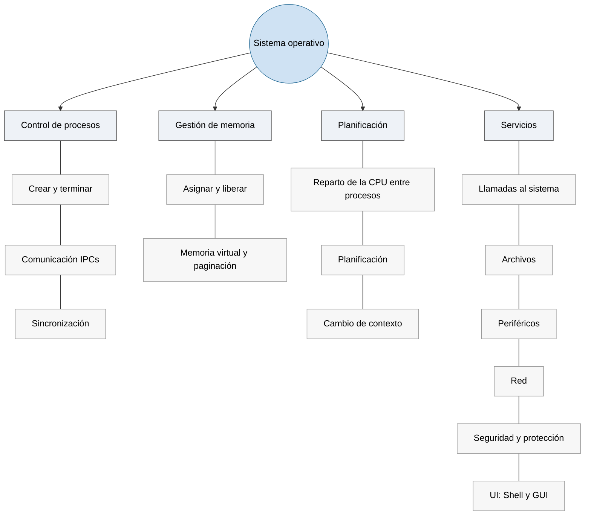
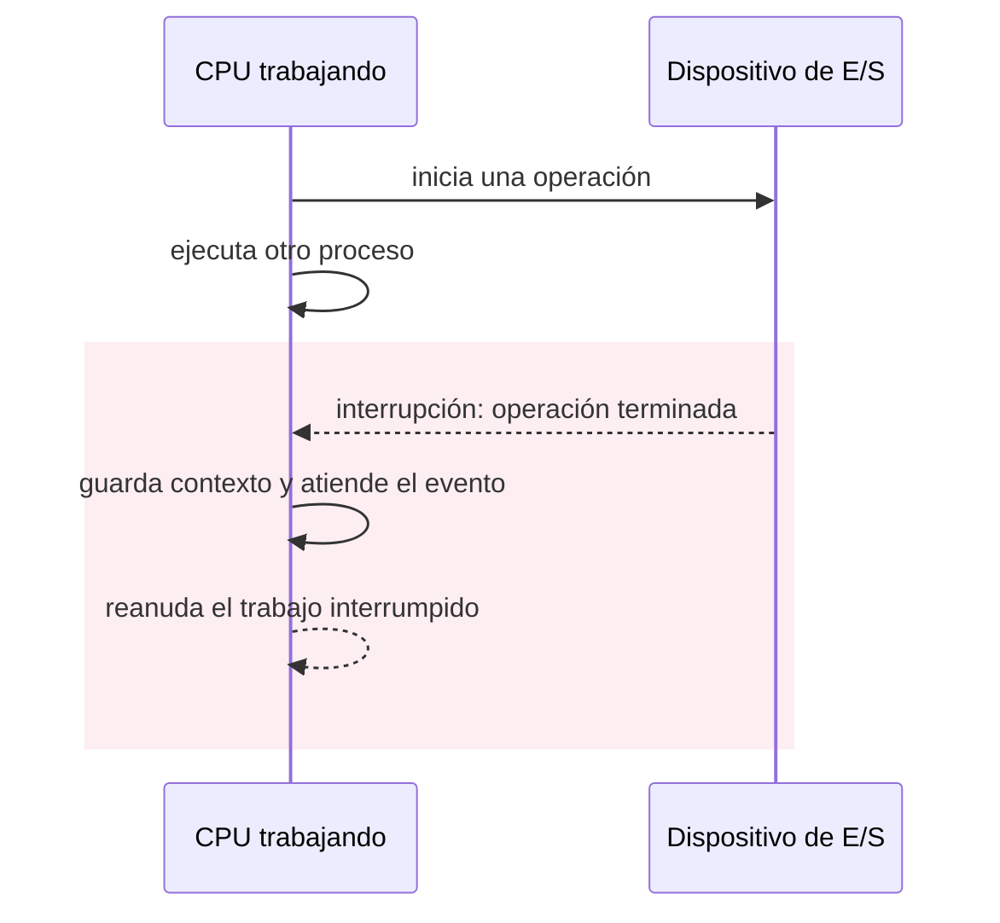
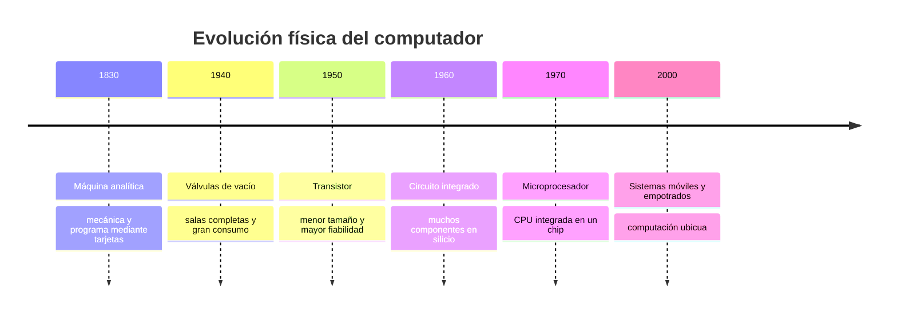

# Tema 1: Introducción a los sistemas operativos y conceptos básicos

## 1.1 Definición de sistema operativo

- **H. M. Deitel**: un programa que controla la ejecución de los programas de aplicación y actúa como interfaz entre el usuario de un ordenador y el hardware del mismo *(Deitel, Deitel y Choffnes,* Operating Systems*, 3.ª ed., 2004, §1.2)*.
- **W. Stallings**: un programa que controla la ejecución de los programas de aplicación y actúa como interfaz entre las aplicaciones y el hardware del ordenador *(Stallings,* Operating Systems: Internals and Design Principles*, 8.ª ed., 2015, cap. 2)*.
- **Silberschatz, Galvin y Gagne**: un programa que gestiona el hardware del ordenador; sirve de base a los programas de aplicación y actúa como intermediario entre el usuario y el hardware *(*Operating System Concepts*, 10.ª ed., 2018, cap. 1)*.
- **A. Tanenbaum** — como máquina extendida: el sistema operativo presenta al usuario el equivalente de una máquina extendida (o virtual), más fácil de programar que el hardware subyacente *(Tanenbaum y Bos,* Modern Operating Systems*, 4.ª ed., 2014, §1.1.1)*.
- **A. Tanenbaum** — como administrador de recursos: su tarea es proporcionar una asignación ordenada y controlada de los procesadores, la memoria y los dispositivos de E/S entre los programas que compiten por ellos *(ibid., §1.1.2)*.
- **Arpaci-Dusseau** *(OSTEP)*: los sistemas operativos cogen un recurso físico (el procesador, la memoria, un disco) y lo transforman en una versión virtual de sí mismo — más general, potente y fácil de usar *(*Operating Systems: Three Easy Pieces*, cap. "Introduction", ostep.org, gratuito)*.

**Mi definición:** Uno de los códigos más complejos del mundo (junto con un motor de videojuegos, un compilador, una base de datos o un navegador). Gestiona el hardware del ordenador (procesador, memoria, gráficos, disco, red y otros dispositivos) para que el usuario pueda ejecutar sus programas (compiladores, editores, navegadores, reproductor multimedia o videojuegos) de forma eficiente, segura e intuitiva. El sistema operativo se encarga de compartir y coordinar los recursos para hacer creer a los procesos que tienen todos el ordenador para ellos, facilitando su programación, depuración y distribución.


El sistema operativo se ocupa de:



Aunque tengan tamaño físico y función diferentes, un smartwatch, un móvil, un servidor, un automóvil, un robot industrial, un avión o un satélite son dispositivos que tienen un software base para que administre sus recursos y conecte las aplicaciones con el hardware. Tienen un Sistema Operativo.


*Aunque cambien radicalmente de tamaño y función, todos estos dispositivos necesitan software que administre sus recursos y conecte las aplicaciones con el hardware. Ilustración generada para estos apuntes.*

## 1.2 Componentes del sistema operativo

El software de un computador se organiza en capas sobre el hardware. El sistema operativo se sitúa entre el hardware y el resto del software (compiladores, ensambladores, utilidades y aplicaciones):


Por debajo del sistema operativo hay una máquina física que sigue la **arquitectura de Von Neumann**.

### Arquitectura de Von Neumann

En ella se basan los ordenadores actuales: la máquina tiene un conjunto **fijo** de componentes electrónicos cuyas acciones están determinadas por un **programa variable**.

La alternativa es la **arquitectura Harvard**, que separa físicamente la memoria de instrucciones de la de datos, con buses independientes. No se suele considerar en sistemas operativos porque casi todos los ordenadores de propósito general son Von Neumann (memoria única para código y datos, lo que permite cargar programas como simples datos); Harvard queda relegada a microcontroladores y a las cachés internas de la CPU, transparentes para el sistema operativo.


### Unidad Central de Proceso (CPU)

Es el componente que **ejecuta las instrucciones** de un programa cargado en la memoria principal. Dentro de ella se distinguen:

- **Unidad de control (CU)**: dirige la ejecución. En cada paso *obtiene* (fetch) la siguiente instrucción de memoria, la *decodifica* y activa al resto de unidades para *ejecutarla*. Se apoya en dos registros propios:
  - **contador de programa (PC)**: dirección de la siguiente instrucción a ejecutar;
  - **registro de instrucción (IR)**: instrucción que se está ejecutando en este momento.
- **Unidad funcional o aritmético‑lógica (ALU)**: realiza las operaciones (sumar, restar, comparar, AND, OR…).
- **Registros de propósito general** (`R1`, `R2`, …, `Rn`): almacenamiento muy rápido dentro de la CPU donde se colocan los operandos y los resultados.
- **Registros de estado** (*flags*): bits estado de la última operación de la ALU (*cero*, *acarreo*, *signo*, *desbordamiento*) las instrucciones de salto condicional los consultan.


Un fragmento de código de alto nivel se traduce a una secuencia de instrucciones máquina de unos pocos tipos —transferencia, aritmético‑lógicas y de salto— que mueven datos entre la memoria y los registros y operan sobre ellos:

```asm
; a = b + c;
load  R1, b      ; transferencia:  R1 <- memoria[b]
load  R2, c      ; transferencia:  R2 <- memoria[c]
add   R1, R2     ; aritmética:     R1 <- R1 + R2   (y actualiza los flags)
store R1, a      ; transferencia:  memoria[a] <- R1

; d = a - 100;
load  R2, =100   ; carga la constante 100 en R2
sub   R1, R2     ; R1 <- R1 - 100
store R1, d      ; memoria[d] <- R1
```

Set de instrucciones abstracta para razonar sobre la ruta de datos. Un compilador real genera instrucciones equivalentes para una CPU concreta, ver en Compiler Explorer, está en el [material extra](material-extra/material_extra.md#3-del-código-c-al-código-máquina).

**Ruta de datos**: los registros aportan a la unidad funcional el operando izquierdo y el derecho; ésta calcula el resultado, lo deja en un registro y actualiza los registros de estado. Los registros intercambian datos con la memoria primaria.

**Saltos**: las instrucciones de salto cargan en el PC la dirección de otra instrucción de la memoria para seguir la ejecución ahí, en lugar de continuar con la siguiente. El salto condicional solo salta si se cumple una condición sobre los flags (p. ej. que el resultado anterior fuera cero); es la base de los `if` y de los bucles.

### Memoria Principal (PM)

- Contiene los programas (conjuntos de instrucciones) y sus datos (variables) que la CPU manipula.
- La unidad de acceso es la **palabra**, formada por celdas de 8 bits (**bytes**).
- Los ordenadores actuales tienen longitudes de palabra de 64 bits, frente a los más antiguos de 8, 16 o 32 bits.


### Dispositivos de E/S

- **Operación de entrada**: transfieren información de entrada, a través del bus de datos, a los registros de la CPU, para que ésta la almacene en la memoria principal.
  - *Teclado*: al pulsar una tecla, su controlador deja el código de la tecla en un registro; ese código viaja por el bus de datos a un registro de la CPU, que lo escribe en el buffer de teclado en la memoria principal para que lo lea el proceso.
  - *Sensor de temperatura (sistema empotrado)*: el conversor analógico‑digital del sensor deja el valor medido en un registro de su controlador; la CPU lo lee por el bus de datos y lo guarda en la memoria principal para procesarlo.
- **Operación de salida**: la CPU obtiene información de la memoria principal y la coloca en sus registros para volcarla sobre un dispositivo de salida con ayuda del bus de datos.
  - *Pantalla*: la CPU toma de la memoria principal los datos del framebuffer, los pasa a sus registros y los vuelca por el bus de datos al controlador gráfico, que los envía al monitor.
  - *Impresora*: la CPU lee de la memoria principal el texto o la imagen a imprimir, lo coloca en sus registros y lo transfiere por el bus de datos al controlador de la impresora.

## 1.3 Conceptos básicos de los sistemas operativos


### Interrupciones

Las interrupciones permiten **detener el orden normal de ejecución** para atender un evento y luego reanudarlo. Sus finalidades principales son:

- **Evitar la espera activa**: la CPU lanza una operación de E/S al disco duro y sigue trabajando; el disco duro avisa con una interrupción cuando termina, en lugar de que la CPU lo espere en bucle hasta que encuentra la información.
- **Devolver el control al sistema operativo**: permite al SO recuperar la CPU periódicamente para repartirla entre procesos (multiprogramación) y evitar que un proceso la monopolice.
- **Atender errores y eventos urgentes**: excepciones como la división por cero o un fallo de hardware se tratan de inmediato, sin esperar a que el programa las compruebe.

**Clases de interrupciones:**

| Clase | Ejemplos |
|-------|----------|
| Programa | desbordamiento (*overflow*), división por cero, instrucción ilegal, referencia de programa fuera de límites… |
| Tiempo | *timer* del procesador |
| E/S | al completarse una operación de E/S |
| Fallos de hardware | error de paridad de memoria |

**Procesamiento de una interrupción:**

1. Una fuente de interrupción activa una señal de interrupción hacia la CPU (poner un pin en HIGH).
2. La CPU termina la ejecución de la instrucción en curso.
3. La CPU comprueba qué interrupción está activada (máscaras) y si debe atenderla (prioridades).
4. La CPU guarda el contexto del programa interrumpido (registros, incluido el PC) en la pila.
5. Carga en el PC la dirección de comienzo de la rutina de servicio de la interrupción.
6. Se ejecuta la rutina de servicio, que atiende la causa concreta de la interrupción (por ejemplo, leer el estado de un dispositivo de E/S y completar la operación, o tratar el error).
7. Se recupera el contexto del programa desde la pila.
8. Se retoma la ejecución del programa en el punto en el que se había detenido.

Las interrupciones permiten que un proceso inicie una operación en un dispositivo, el sistema operativo ponga en ejecución otro trabajo mientras el primero espera, y vuelva al primero cuando el dispositivo anuncia que ha terminado:



*Una interrupción permite que el procesador haga otro trabajo mientras espera a un dispositivo y recupere la operación cuando este anuncia que ha terminado.*

**Interrupciones simultáneas.** Cuando se producen varias interrupciones a la vez se puede:

- **Deshabilitar interrupciones**: se manejan una detrás de otra. Puede no ser suficiente para sistemas que requieran tiempo real (RTOS).
- **Niveles de prioridad**: permiten el procesamiento anidado de interrupciones.

### Jerarquía de memoria y Cachés

De más rápida y pequeña (arriba) a más lenta y grande (abajo):


*Cuanto más cerca está la memoria de la CPU, más rápida es, pero menor es su capacidad.*

Esta pirámide existe por **coste**: la memoria rápida (SRAM de registros y cachés) usa 6 transistores por bit y ocupa mucho silicio. Como no se puede tener toda la memoria rápida, se pone poca cerca de la CPU y mucha lejos. Las **cachés** funcionan porque los accesos a memoria siguen patrones predecibles (**localidad**): si se usa un dato, es muy probable que se vuelva a usar pronto (temporal) y que se usen los datos vecinos (espacial). La caché guarda automáticamente esas zonas «calientes», de modo que la mayoría de accesos se resuelven en L1/L2 sin bajar a la RAM.

| Nivel | Latencia típica | Capacidad | Precio aprox. |
|-------|-----------------|-----------|---------------|
| Registros | < 1 ns (acceso inmediato) | ~1–2 KB por núcleo | carísima por byte |
| Caché L1 | ~1 ns (~4 ciclos) | 32–64 KB por núcleo | ~1000 €/GB (estimado, SRAM) |
| Caché L2 | ~3–5 ns (~12–15 ciclos) | 256 KB–2 MB por núcleo | ~1000 €/GB (estimado, SRAM) |
| RAM DDR4 | ~60–90 ns (~200–300 ciclos) | 8–128 GB | ~2–4 €/GB |

## 1.5 Estructuras de los sistemas operativos

En su forma más básica, el sistema operativo es un **conjunto de funciones** que implementan sus tareas: `fork()` para crear un proceso, `read()` para leer de un fichero, `kmalloc()` para reservar memoria del núcleo, `schedule()` para elegir el siguiente proceso, etc.

- Una función del núcleo puede llamar directamente a cualquier otra: `sys_read` llama al gestor del sistema de archivos, que a su vez llama al *driver* del disco.
- Los programas de usuario no llaman a esas funciones del sistema operativo directamente: usan **llamadas al sistema**, primero colocan los parámetros en registros o en la pila y provocan una interrupción software para entrar al núcleo. La CPU pasa a **modo privilegiado** y ejecuta el gestor de interrupciones (que es código del propio sistema operativo), el gestor consulta el número de llamada en una tabla y salta a la función del núcleo correspondiente, que la ejecuta. Al terminar, se vuelve a modo usuario y el control regresa al programa. Así el sistema operativo puede controlar cada llamada al sistema y hace imposible (en teoría) que un proceso de usuario acceda a recursos de forma incorrecta.

Comparativa de estructuras (usuario / núcleo):


### Sistemas monolíticos

Todo el sistema operativo es **un único binario que se ejecuta en espacio de núcleo**. El programa de usuario solo interviene al principio: hace una llamada al sistema (`read()`, `fork()`…) que salta al núcleo. Dentro del núcleo, el código se organiza en 3 capas (todas son código del núcleo, no del usuario):

- Una **rutina despachadora** (*dispatcher*): recibe la llamada al sistema, mira su número y salta a la función de servicio correspondiente.
- Un conjunto de **funciones de servicio**: una por cada llamada al sistema (`sys_read`, `sys_fork`…); son las que hacen el trabajo.
- Un conjunto de **funciones de utilidad**: código auxiliar compartido que usan las funciones de servicio (copiar datos entre usuario y núcleo, manejar listas de procesos, bloques de disco…).

- **Ventaja**: **eficiencia**. Todos los módulos comparten el mismo espacio de memoria y se llaman entre sí con una simple llamada a función (unos pocos nanosegundos); no hay cambios de contexto ni copias de datos entre servicios.
- **Desventaja**: **fragilidad y complejidad**. Todo corre con máximos privilegios y sin aislamiento, un fallo en cualquier módulo (por ejemplo un *driver*) tumba el sistema entero: *kernel panic* en Linux, pantallazo azul en Windows. El código fuente de Linux ronda los **30 millones de líneas de código** (la mayoría, controladores de dispositivos), lo que hace muy difícil garantizar que todo funcione bien junto.

Ejemplos: núcleos tipo Unix (Linux, Syllable, Unix, BSD —FreeBSD, NetBSD, OpenBSD—, Solaris), núcleos tipo DOS (DR‑DOS, MS‑DOS, familia Microsoft Windows 9x —95, 98, 98SE, Me—), núcleos de Mac OS hasta Mac OS 8.6, OpenVMS.

### Sistemas de microkernels

Un **microkernel** es un tipo de núcleo que provee un conjunto de llamadas al sistema **mínimas** para implementar servicios básicos: espacios de direcciones, comunicación entre procesos y planificación básica. El resto de servicios (gestión de memoria, sistema de archivos, operaciones de E/S…) se ejecutan como **procesos servidores en el espacio de usuario**. 

- **Ventaja**: **robustez**. Cada servicio corre en su propio proceso aislado, con privilegios mínimos; si el *driver* de red o el sistema de archivos se cuelga, el microkernel puede reiniciar ese servidor sin arrastrar al resto del sistema. También reduce la complejidad de cada pieza, mejora la portabilidad y facilita el desarrollo de *drivers*.
- **Desventaja**: **rendimiento** (al menos históricamente). Lo que en un monolítico es una llamada a función, aquí es un mensaje entre procesos (IPC): cambio de contexto, copia de datos y vuelta. Una operación sencilla puede cruzar varias veces la frontera usuario/núcleo. Los microkernels modernos (L4, seL4) han recortado esa penalización.

Ejemplos: AIX, AmigaOS, Amoeba, Minix, Hurd, L4, Netkernel, RaOS, RadiOS, ChorusOS, QNX (BlackBerry), SO3, Symbian.

### Sistemas híbridos

Hay microkernels que meten código **no esencial** en espacio de núcleo para que se ejecute más rápido. Por ejemplo, meter los gráficos en espacio kernel para tener siempre una respuesta fluida al usuario.

Linux, aunque es monolítico, soporta **módulos cargables** (`insmod`/`rmmod`, `modprobe`) que añaden o quitan código al núcleo en caliente; así se instala el *driver* de una tarjeta wifi nueva sin tener que reconstruir el resto del kernel.

## 1.6 Clases de sistemas operativos

Dos bloques: primero una **evolución histórica**, cada paso resolviendo el desperdicio de CPU del anterior; luego una **clasificación** de los sistemas actuales según su arquitectura y su uso.

### Evolución: del operador manual al tiempo compartido

1. **Primeros sistemas**: un operador prepara y carga cada programa a mano, instrucción a instrucción. La CPU pasa la mayor parte del tiempo parada esperando a que el humano monte cintas, cargue tarjetas o retire resultados; un solo error obliga a repetir toda la preparación.

   

   <sub>Jean Bartik y Frances Spence preparan ENIAC, 1946. Fuente: U.S. Army, dominio público. [Wikimedia Commons](https://commons.wikimedia.org/wiki/File:Two_women_operating_ENIAC_(full_resolution).jpg).</sub>

2. **Sistemas por lotes**: se agrupan trabajos en un mazo de tarjetas que un pequeño **monitor residente** (siempre en memoria) va encadenando autónomamente programas, sin operador de por medio. Sigue habiendo cuello de botella: leer una tarjeta o imprimir una línea es miles de veces más lento que ejecutar instrucciones. Se alivia con **búferes** (leer por adelantado) y ***spooling*** (usar el disco como búfer enorme para solapar la E/S de unos trabajos con el cálculo de otros) — el mismo principio que usa hoy una cola de impresión.

   

   <sub>Perforadora de tarjetas, censo de EE.UU., años 1950. Fuente: U.S. Census Bureau, dominio público. [Wikimedia Commons](https://commons.wikimedia.org/wiki/File:Keypunch_operator_1950_census_IBM_016.jpg).</sub>

3. **Sistemas multiprogramados**: en vez de esperar a que un trabajo termine su E/S, el sistema operativo mantiene varios trabajos en memoria y ejecuta otro mientras el primero espera. La CPU casi nunca queda ociosa, a cambio de más complejidad (planificación, gestión de memoria, interbloqueos).

   

4. **Sistemas de tiempo compartido**: además, el usuario interactúa con su trabajo mientras se ejecuta — antes había que anticipar todo el flujo en el mazo de tarjetas y esperar horas para ver el primer error. El sistema operativo reparte la CPU en turnos muy cortos entre varios usuarios a la vez, dando a cada uno la sensación de tener el ordenador para sí, a costa de bajar el rendimiento bruto de la CPU.

### Según su arquitectura: uno, varios o muchos procesadores

- **Paralelos** — varios procesadores **fuertemente acoplados**: comparten memoria y reloj dentro de la misma máquina (cualquier PC o móvil actual, un servidor con varios zócalos, una GPU). Más rendimiento y tolerancia a fallos, a cambio de sincronizar los accesos a los mismos datos. Lo normal hoy es **SMP**: todos los procesadores son iguales y ejecutan la misma copia del sistema operativo.
- **Distribuidos** — varios ordenadores **débilmente acoplados**: cada uno con su memoria y su reloj, comunicados solo por red (un clúster, la nube, una red *peer-to-peer*, internet). Escalan mucho y toleran que caiga un nodo, a cambio de que la red puede fallar o ir lenta y no hay memoria común para coordinarse.

### Según su uso: tiempo real, empotrados, virtualizados

- **Tiempo real**: el resultado tiene que llegar **antes de un plazo**, no basta con que sea correcto — un airbag debe dispararse en 15–30 ms, el control de un dron recalcula cada 1–2 ms. Según la exigencia se construyen sin sistema operativo (*bare metal*, lo más simple y predecible), con un RTOS ligero (FreeRTOS) o con un RTOS certificado (QNX) para aviónica o automoción.

  

- **Empotrados**: un ordenador escondido dentro de un aparato, dedicado a una única tarea fija grabada de fábrica (el termostato de una caldera, la centralita de un motor, un router doméstico). Prioriza precio y consumo mínimo — pasa casi todo el tiempo dormido y solo despierta ante un evento.

- **Máquinas virtuales y contenedores**: varios entornos aislados sobre una misma máquina física. Las máquinas virtuales emulan un ordenador completo, cada una con su propio SO invitado sobre un hipervisor; los contenedores comparten el núcleo del anfitrión y solo aíslan la aplicación y sus dependencias.

  

### Resumen

| Tipo | Qué resuelve o distingue | Ejemplo |
|---|---|---|
| Primeros sistemas | Automatiza lo que hacía un operador a mano | ENIAC |
| Por lotes | Encadena trabajos sin esperar al operador | FMS, IBSYS |
| Multiprogramado | La CPU no espera a la E/S de un solo trabajo | Unix temprano |
| Tiempo compartido | El usuario interactúa mientras el trabajo corre | Unix con terminales |
| Paralelo | Varios procesadores, memoria compartida | PC multinúcleo, GPU |
| Distribuido | Varios ordenadores, comunicados por red | Clúster, internet |
| Tiempo real | El plazo importa tanto como el resultado | Airbag, dron |
| Empotrado | Una sola tarea fija, consumo mínimo | Termostato, router |
| VM / contenedor | Varios entornos aislados en una máquina | Hipervisor, Docker |

---

## Material extra

Tres demostraciones para ejecutar en una máquina Linux y ver en vivo varios procesos en ejecución y aislamiento de memoria, ciclo de compilación y código máquina: [`material-extra/material_extra.md`](material-extra/material_extra.md).

---

## Anexo: introducción histórica de los computadores

### Charles Babbage

- Máquina de Diferencias (1822).
- Primera referencia al concepto de programa almacenado en el computador (1836).
- Primera máquina de propósito general (máquina analítica).

Muchos historiadores consideran a Babbage y a su socia, la matemática británica **Augusta Ada Byron** (siglo XIX), los verdaderos inventores de la computadora digital moderna. La tecnología de la época no permitía llevar a la práctica sus conceptos, pero la **máquina analítica** ya tenía muchas características de un ordenador moderno: flujo de entrada mediante tarjetas perforadas, memoria para los datos, procesador para las operaciones matemáticas e impresora para el registro permanente. Era automática, no precisaba operador.

### De los analógicos a los electrónicos

- Los primeros **ordenadores analógicos** se construyeron a principios del siglo XX; hacían los cálculos mediante ejes y engranajes giratorios y evaluaban aproximaciones numéricas de ecuaciones difíciles. En las guerras mundiales se usaron para predecir trayectorias de torpedos y para el manejo a distancia de bombas.
- En **1939** John Atanasoff y Clifford Berry construyeron un prototipo de máquina electrónica en el Iowa State College (el **ABC**, Atanasoff‑Berry Computer).
- El **ENIAC** (*Electronic Numerical Integrator And Computer*, 1945) se basaba en gran medida en el ABC; contenía 18.000 válvulas de vacío y procesaba varios cientos de multiplicaciones por minuto, pero su programa estaba conectado al procesador y debía modificarse manualmente.
- Durante la II Guerra Mundial, un equipo de Bletchley Park (norte de Londres) creó el **Colossus**, considerado el primer ordenador digital totalmente electrónico. En diciembre de 1943 era operativo (incorporaba 1.500 válvulas) y el equipo dirigido por **Alan Turing** lo usó para descodificar los mensajes cifrados por la máquina **Enigma** alemana.
- La mayoría de los computadores actuales siguen la **arquitectura de Von Neumann**. El sucesor del ENIAC, el **EDVAC**, incorporaba almacenamiento de programa en memoria, lo que liberaba al ordenador de la velocidad del lector de cinta de papel y permitía resolver problemas sin volver a cablear la máquina. **John von Neumann** (Budapest 1903 – Washington D.C. 1957).

### Generaciones

- **Transistor** (finales de la década de 1950): elementos lógicos más pequeños, rápidos y versátiles que las válvulas, con menos consumo y mayor vida útil ⇒ ordenadores de **segunda generación**; fabricación más barata. **UNIVAC** (*Universal Automatic Computer*): línea de ordenadores de programa almacenado; el **UNIVAC I** fue la primera computadora electrónica de propósito general vendida comercialmente en EE. UU.
- **Circuito integrado (CI)** (finales de la década de 1960): varios transistores en un único sustrato de silicio; reducción de precio, tamaño y porcentajes de error.
- **Microprocesador** (mediados de la década de 1970): integración a gran escala (**LSI**, *Large Scale Integrated*) y muy gran escala (**VLSI**, *Very Large Scale Integrated*), con miles de transistores en un único sustrato. Inicio de la multiprogramación.
- **Cuarta generación** (actual): sustitución de las memorias de núcleos magnéticos por chips de silicio; microminiaturización de los circuitos; el tamaño reducido del microprocesador hizo posible el **ordenador personal (PC)**; integración del ordenador en las telecomunicaciones.



*La reducción del tamaño y del consumo transformó computadores que ocupaban salas enteras en sistemas empotrados presentes en objetos cotidianos.*

### Cronología de los sistemas operativos

| Periodo | Tipo de sistema | Novedades técnicas | Problemas / limitaciones | Sistemas representativos |
|---------|-----------------|--------------------|--------------------------|--------------------------|
| **1940‑1950** | Sin sistema operativo; procesamiento en serie | El programador maneja el hardware directamente desde el panel de programación (interruptores y displays) y con lector de tarjetas e impresora | Reserva manual de la máquina, CPU muy desaprovechada, trabajos abortados sin control, mucho **tiempo de preparación** (montar cintas/tarjetas, cargar el compilador y el programa) | ENIAC, EDSAC, IAS |
| **1950‑1960** | Por lotes (*batch*) | Programa **monitor** residente que encadena trabajos automáticamente; **protección de memoria**, **instrucciones privilegiadas**, **interrupciones**, temporizador. Luego: multiprogramación, interrupciones de E/S, **DMA** | Sin interacción con el trabajo en ejecución; depuración estática (a partir de vuelcos de memoria); un trabajo largo bloquea a los demás | FMS, IBSYS (IBM 7090/7094); OS/360 |
| **1960‑1970** | Tiempo compartido | Varios usuarios comparten la CPU por turnos (*time slice*); terminales interactivos; memoria virtual; sistema de archivos en línea | Menor rendimiento de CPU por los cambios de contexto; mayor complejidad (protección entre usuarios, planificación, sincronización) | **CTSS** y **Multics** (MIT), **UNIX** (Bell, 1970) |
| **1970‑1980** | Distribuidos y en red | Varios ordenadores conectados por red que cooperan mediante **paso de mensajes**; reparto de carga, recursos compartidos, redundancia | Programar la comunicación es complejo al no haber memoria común; la red es lenta y poco fiable; nodos heterogéneos | ARPANET, Xerox PARC (Ethernet); más tarde Novell NetWare, redes UNIX (TCP/IP) |
| **1980‑1990** | Tiempo real y empotrados | La corrección depende también del **instante** de entrega: determinismo, responsividad, tolerancia a fallos. Empotrados: hardware mínimo, ensamblador o C, bajo consumo | Recursos muy escasos; difícil garantizar los plazos; poca portabilidad; herramientas de desarrollo limitadas | VxWorks, QNX, VRTX, pSOS |
| **1990‑2000** | Ordenador personal y software libre | GUI de uso masivo; redes domésticas; **Linux** (Torvalds, 1991) = núcleo tipo Unix + herramientas **GNU** (Stallman, 1983): código abierto, portable, sin dependencia de un fabricante | Fragmentación y problemas de compatibilidad de controladores; curva de aprendizaje | **Windows 3.x/9x/NT**, **Mac OS**, **Linux**, distintos UNIX comerciales (Solaris, AIX, HP‑UX) |
| **2000‑** | Dispositivos móviles y computación ubicua | Diseño para batería y conectividad inalámbrica; pantalla táctil; tiendas de aplicaciones; organización en capas (**kernel**, ***middleware***, entorno de ejecución con APIs, interfaz de usuario) | Autonomía de la batería, seguridad y privacidad, diversidad de dispositivos | **Android** (núcleo Linux), **iOS** (núcleo Darwin/XNU); antes Symbian, BlackBerry OS, Windows Phone |

---

## Material gráfico

Las figuras de este tema están integradas en el texto y catalogadas en [`TEORIA/IMAGENES.md`](../IMAGENES.md). Queda como **material fotográfico** adicional (no reproducible), a criterio del profesor: retratos y fotos históricas (Charles Babbage, ENIAC, Colossus, John von Neumann, UNIVAC I) y las cronologías (*timelines*) de familias de sistemas operativos, enlazadas a Wikipedia en la sección «Cronologías».

