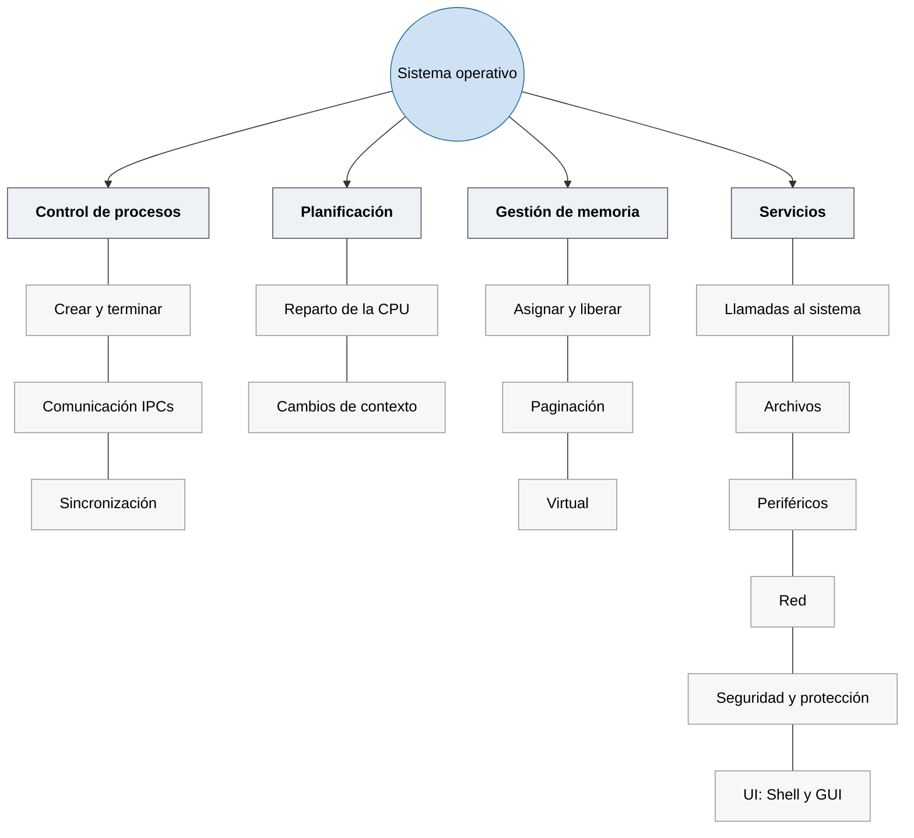
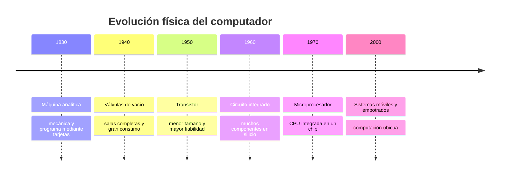

# Tema 1: Introducción a los sistemas operativos y conceptos básicos

## Definición de sistema operativo

- **<abbr title="Deitel, Deitel y Choffnes, Operating Systems, 3.ª ed., 2004, §1.2">H. M. Deitel</abbr>**: un programa que controla la ejecución de los programas de aplicación y actúa como interfaz entre el usuario de un ordenador y el hardware del mismo.
- **<abbr title="Stallings, Operating Systems: Internals and Design Principles, 8.ª ed., 2015, cap. 2">W. Stallings</abbr>**: un programa que controla la ejecución de los programas de aplicación y actúa como interfaz entre las aplicaciones y el hardware del ordenador.
- **<abbr title="Operating System Concepts, 10.ª ed., 2018, cap. 1">Silberschatz, Galvin y Gagne</abbr>**: un programa que gestiona el hardware del ordenador; sirve de base a los programas de aplicación y actúa como intermediario entre el usuario y el hardware.
- **<abbr title="Tanenbaum y Bos, Modern Operating Systems, 4.ª ed., 2014, §1.1.1">A. Tanenbaum</abbr>** — como máquina extendida: el sistema operativo presenta al usuario el equivalente de una máquina extendida (o virtual), más fácil de programar que el hardware subyacente.
- **<abbr title="Tanenbaum y Bos, Modern Operating Systems, 4.ª ed., 2014, §1.1.2">A. Tanenbaum</abbr>** — como administrador de recursos: su tarea es proporcionar una asignación ordenada y controlada de los procesadores, la memoria y los dispositivos de E/S entre los programas que compiten por ellos.

**Mi definición:** Uno de los códigos más complejos del mundo (junto con un motor de videojuegos, un compilador, una base de datos o un navegador). Gestiona el hardware del ordenador (cpu, memoria, gráficos, disco, red y dispositivos) para que el usuario pueda ejecutar sus programas (compiladores, editores, navegadores, reproductor multimedia o videojuegos) de forma eficiente, segura e intuitiva. El sistema operativo se encarga de compartir y coordinar los recursos para hacer creer a los procesos que tienen todos el ordenador para ellos, facilitando su programación, depuración y distribución.


El sistema operativo se ocupa de:



Aunque tengan tamaño físico y función diferentes, un smartwatch, un móvil, un servidor, un automóvil, un robot industrial, un avión o un satélite son dispositivos que tienen un software base para administrar sus recursos y conectar las aplicaciones con el hardware. Tienen un Sistema Operativo.


## Conceptos básicos

No hace falta haber visto arquitectura de computadores para seguir esta parte: basta con imaginar la CPU como una máquina que ejecuta instrucciones muy simples una detrás de otra, guardando los valores con los que trabaja en un puñado de "cajones" ultrarrápidos dentro de la propia CPU llamados registros.

Estos son solo los cinco conceptos mínimos que hacen falta para entender el resto de la asignatura: qué es un proceso, cómo el Sistema Operativo le puede quitar la CPU a un proceso para dársela a otro, qué hace la CPU por dentro para ejecutar instrucciones, cómo un proceso le pide ayuda al sistema operativo, y por qué la CPU no trabaja directamente contra la memoria. Todos se retoman con mucho más detalle en los próximos temas; aquí solo se fija el vocabulario.

### Procesos

Un **programa** es un archivo guardado en disco: solo código, no hace nada mientras nadie lo ejecuta. Un **proceso** aparece cuando el sistema operativo pone ese programa en ejecución: le reserva una zona de memoria para su código y sus variables, y le va dando turnos de CPU para que sus instrucciones se ejecuten. Dos procesos pueden venir del mismo programa —dos terminales abiertos a la vez ejecutan el mismo `bash`— y aun así cada uno tiene su propia memoria y su propio turno de CPU, sin verse entre sí.

<!-- TODO: diagrama "programa en disco" -> "proceso en memoria con su turno de CPU" -->

### Cambio de contexto

Un núcleo de CPU solo ejecuta un proceso realmente; el resto esperan su turno. Aun con un sólo núcleo, el sistema operativo rota tan rápido entre los procesos que quieren ejercución que da la impresión de que se ejecutan en paralelo.

El sistema operativo realiza un **cambio de contexto** al quitar el proceso en ejecución y poner a otro, aprovechando estos momentos: el proceso se queda dormido voluntariamente (`sleep`), cede el turno explícitamente (`yield`), hace una llamada al sistema que le va a bloquear (por ejemplo, esperar un dato de teclado o de disco), o salta una interrupción de reloj (*timer*) que le recuerda al SO que ya ha pasado el tiempo asignado al proceso actual. En cualquiera de estos casos el SO guarda dónde se había quedado el proceso saliente y carga el turno del entrante.

<!-- TODO: diagrama de línea temporal con dos procesos alternándose en la CPU -->

### Arquitectura básica del ordenador

La CPU ejecuta instrucciones guardadas en la memoria principal, una detrás de otra, apoyándose en unos pocos registros internos:

- **PC (contador de programa)**: dirección de la siguiente instrucción a ejecutar.
- **SP (puntero de pila)**: dirección de la cima de la pila, usada en llamadas a función y variables locales.
- **Registros de datos** (`R1`, `R2`, …): almacenamiento rapidísimo donde la CPU coloca los operandos y los resultados; no calcula directamente sobre la memoria, primero trae los datos registros, calcula y mueve registros a memoria.
- **Flags**: bits con el resultado de la última operación (cero, signo, desbordamiento…), que consultan los saltos condicionales.

<!-- TODO: diagrama de la CPU con PC, SP, registros de datos y flags -->

Con unas pocas instrucciones básicas se construye cualquier programa: mover datos entre memoria y registros (`mov`), operar sobre ellos (`add`, `sub`, `cmp` y otras ariméticas), saltar a otra instrucción (`jump`) o saltar solo si se cumple una condición sobre los flags (`jump if zero`…) —esto último es lo que hay debajo de cada `if` y de cada bucle—. Existe además una instrucción para invocar al sistema operativo (`syscall`), que se ve en detalle en el tema de espacio de usuario y espacio de kernel.

```asm
; a = b + c;
mov  R1, b      ; R1 <- memoria[b]
mov  R2, c      ; R2 <- memoria[c]
add  R1, R2     ; R1 <- R1 + R2   (actualiza los flags)
mov  a, R1      ; memoria[a] <- R1
```
CompilerExplorer permite generar código ASM de un programa C, en el [material extra](material-extra/material_extra.md#del-código-c-al-código-máquina).

### Llamadas al sistema

Un proceso de usuario no puede tocar el hardware directamente (disco, red, memoria de otros procesos…); para eso le pide un servicio al sistema operativo con una **llamada al sistema** (`syscall`), como `read()` para leer un fichero o `fork()` para crear un proceso nuevo. Al hacerla, la CPU pasa a modo privilegiado, el sistema operativo atiende la petición, y al terminar, el control vuelve al programa en modo usuario. El mecanismo completo —modo usuario/kernel, tabla de llamadas, cómo se hace la transición— se ve en detalle en el tema de espacio de usuario y espacio de kernel.

### Jerarquía de memoria

La CPU opera sobre registros y no directamente sobre la memoria: los registros están dentro de la propia CPU y se leen en un ciclo de reloj, mientras que la memoria principal, cientos de veces más lenta, obligaría a la CPU a esperar en cada instrucción si trabajara siempre contra ella.

Entre registros y memeoria, hay más escalones: **registros ↔ caché ↔ RAM ↔ disco**, cada uno más lejos de la CPU, más lento y con más capacidad que el anterior. ¿Por qué esta jerarquía y no un único tipo de memoria? Por **coste**: la memoria rápida de registros y cachés usa 6 transistores por bit y ocupa mucho silicio, así que no se puede tener toda la memoria rápida; se pone poca cerca de la CPU.

Las **cachés** (el escalón entre los registros y la RAM) funcionan porque los accesos a memoria siguen patrones predecibles (**localidad**): si se usa un dato, es muy probable que se vuelva a usar pronto (temporal) y que se usen los datos vecinos (espacial). Por eso la caché no trae de la RAM datos sueltos, sino **bloques** enteros de memoria, apostando a que lo de alrededor también se va a necesitar pronto.

De más rápida y pequeña (arriba) a más lenta y grande (abajo):


*Cuanto más cerca está la memoria de la CPU, más rápida es, pero menor es su capacidad.*

| Nivel | Latencia típica | Capacidad | Precio aprox. |
|-------|-----------------|-----------|---------------|
| Registros | < 1 ns (acceso inmediato) | ~1–2 KB por núcleo | carísima por byte |
| Caché L1 | ~1 ns (~4 ciclos) | 32–64 KB por núcleo | ~1000 €/GB (estimado, SRAM) |
| Caché L2 | ~3–5 ns (~12–15 ciclos) | 256 KB–2 MB por núcleo | ~1000 €/GB (estimado, SRAM) |
| RAM DDR4 | ~60–90 ns (~200–300 ciclos) | 8–128 GB | ~2–4 €/GB |
| Disco SSD | ~10–100 µs | 256 GB–4 TB | ~0,05–0,1 €/GB |

## Estructuras de los sistemas operativos

El sistema operativo es, en el fondo, un conjunto de funciones del kernel a las que un proceso de usuario solo llega a través de una llamada al sistema (visto en conceptos básicos). Lo que distingue a unas arquitecturas de otras es **cuánto de ese código corre en espacio de kernel** y cuánto en espacio de usuario.

Comparativa de estructuras:


### Sistemas monolíticos

Todo el sistema operativo es **un único binario que se ejecuta en espacio de kernel**. El programa de usuario solo interviene al principio: hace una llamada al sistema (`read()`, `fork()`…) que salta al kernel, y allí el propio kernel se encarga de todo el trabajo.

- **Ventaja**: **eficiencia**. Todos los módulos comparten el mismo espacio de memoria y se llaman entre sí con una simple llamada a función (unos pocos nanosegundos); no hay cambios de contexto ni copias de datos entre servicios.
- **Desventaja**: **fragilidad y complejidad**. Todo corre con máximos privilegios y sin aislamiento, un fallo en cualquier módulo (por ejemplo un *driver*) tumba el sistema entero: *kernel panic* en Linux, pantallazo azul en Windows. El código fuente de Linux ronda los **30 millones de líneas de código** (la mayoría, controladores de dispositivos), lo que hace muy difícil garantizar que todo funcione bien junto.

Ejemplos: kernels tipo Unix (Linux, Syllable, Unix, BSD —FreeBSD, NetBSD, OpenBSD—, Solaris), kernels tipo DOS (DR‑DOS, MS‑DOS, familia Microsoft Windows 9x —95, 98, 98SE, Me—), kernels de Mac OS hasta Mac OS 8.6, OpenVMS.

### Sistemas de microkernels

Un **microkernel** es un tipo de kernel que provee un conjunto de llamadas al sistema **mínimas** para implementar servicios básicos: espacios de direcciones, comunicación entre procesos y planificación básica. El resto de servicios (gestión de memoria, sistema de archivos, operaciones de E/S…) se ejecutan como **procesos servidores en el espacio de usuario**. 

- **Ventaja**: **robustez**. Cada servicio corre en su propio proceso aislado, con privilegios mínimos; si el *driver* de red o el sistema de archivos se cuelga, el microkernel puede reiniciar ese servidor sin arrastrar al resto del sistema. También reduce la complejidad de cada pieza, mejora la portabilidad y facilita el desarrollo de *drivers*.
- **Desventaja**: **rendimiento** (al menos históricamente). Lo que en un monolítico es una llamada a función, aquí es un mensaje entre procesos (IPC): cambio de contexto, copia de datos y vuelta. Una operación sencilla puede cruzar varias veces la frontera usuario/kernel. Los microkernels modernos (L4, seL4) han recortado esa penalización.

Ejemplos: AIX, AmigaOS, Amoeba, Minix, Hurd, L4, Netkernel, RaOS, RadiOS, ChorusOS, QNX (BlackBerry), SO3, Symbian.

### Sistemas híbridos

Hay microkernels que meten código **no esencial** en espacio de kernel para que se ejecute más rápido. Por ejemplo, meter los gráficos en espacio kernel para tener una respuesta fluida al usuario.

Linux, aunque es monolítico, soporta **módulos cargables** (`insmod`/`rmmod`, `modprobe`) que añaden o quitan código al kernel en caliente; así se instala el *driver* de una tarjeta wifi nueva sin tener que recompilar el kernel entero.

## Clases de sistemas operativos

Dos bloques: primero una **evolución histórica**, cada paso resolviendo el desperdicio de CPU del anterior; luego una **clasificación** de los sistemas actuales según su arquitectura y su uso.

### Evolución: del operador manual al tiempo compartido

1. **Primeros sistemas**: un operador prepara y carga cada programa a mano, instrucción a instrucción. La CPU pasa la mayor parte del tiempo parada esperando a que el humano monte cintas, cargue tarjetas o retire resultados; un solo error obliga a repetir toda la preparación.

   

   <sub>Jean Bartik y Frances Spence preparan ENIAC, 1946. Fuente: U.S. Army, dominio público. [Wikimedia Commons](https://commons.wikimedia.org/wiki/File:Two_women_operating_ENIAC_(full_resolution).jpg).</sub>

2. **Sistemas por lotes**: se agrupan trabajos en un mazo de tarjetas que un pequeño **monitor residente** (siempre en memoria) va encadenando autónomamente programas, sin operador de por medio. Sigue habiendo cuello de botella: leer una tarjeta o imprimir una línea es miles de veces más lento que ejecutar instrucciones. Se alivia con **búferes** (leer por adelantado) y ***spooling*** (usar el disco como búfer enorme para solapar la E/S de unos trabajos con el cálculo de otros) — el mismo principio que usa hoy una cola de impresión.

   

   <sub>Perforadora de tarjetas, censo de EE.UU., años 1950. Fuente: U.S. Census Bureau, dominio público. [Wikimedia Commons](https://commons.wikimedia.org/wiki/File:Keypunch_operator_1950_census_IBM_016.jpg).</sub>

3. **Sistemas multiprogramados**: en vez de esperar a que un trabajo termine su E/S, el sistema operativo mantiene varios trabajos en memoria y ejecuta otro mientras el primero espera. La CPU casi nunca queda ociosa, a cambio de más complejidad (planificación, gestión de memoria, interbloqueos).

   

4. **Sistemas de tiempo compartido**: además, el usuario interactúa con su trabajo mientras se ejecuta — antes había que anticipar todo el flujo en el mazo de tarjetas y esperar horas para ver el primer error. El sistema operativo reparte la CPU en turnos muy cortos entre varios usuarios a la vez, dando a cada uno la sensación de tener el ordenador para sí, a costa de bajar el rendimiento bruto de la CPU.

<!-- 
### Según su arquitectura: uno, varios o muchos procesadores

- **Paralelos** — varios procesadores **fuertemente acoplados**: comparten memoria y reloj dentro de la misma máquina (cualquier PC o móvil actual, un servidor con varios zócalos, una GPU). Más rendimiento y tolerancia a fallos, a cambio de sincronizar los accesos a los mismos datos. Lo normal hoy es **SMP**: todos los procesadores son iguales y ejecutan la misma copia del sistema operativo.
- **Distribuidos** — varios ordenadores **débilmente acoplados**: cada uno con su memoria y su reloj, comunicados solo por red (un clúster, la nube, una red *peer-to-peer*, internet). Escalan mucho y toleran que caiga un nodo, a cambio de que la red puede fallar o ir lenta y no hay memoria común para coordinarse.
-->

### Según su uso: tiempo real, empotrados, virtualizados

- **Tiempo real**: el resultado tiene que llegar **antes de un plazo**, no basta con que sea correcto — un airbag debe dispararse en 15–30 ms, el control de un dron recalcula cada 1–2 ms. Según la exigencia se construyen sin sistema operativo (*bare metal*, lo más simple y predecible), con un RTOS ligero (FreeRTOS) o con un RTOS certificado (QNX) para aviónica o automoción.

  

- **Empotrados**: un ordenador escondido dentro de un aparato, dedicado a una única tarea fija grabada de fábrica (el termostato de una caldera, la centralita de un motor, un router doméstico). Prioriza precio y consumo mínimo — pasa casi todo el tiempo dormido y solo despierta ante un evento.

- **Máquinas virtuales y contenedores**: varios entornos aislados sobre una misma máquina física. Las máquinas virtuales emulan un ordenador completo, cada una con su propio SO invitado sobre un hipervisor; los contenedores comparten el kernel del anfitrión y solo aíslan la aplicación y sus dependencias.

  
<!-- 
---

## Material extra

Tres demostraciones para ejecutar en una máquina Linux y ver en vivo varios procesos en ejecución y aislamiento de memoria, ciclo de compilación y código máquina: [`material-extra/material_extra.md`](material-extra/material_extra.md).

---

## Anexo: introducción histórica de los computadores

### Charles Babbage

- Máquina de Diferencias (1822).
- Primera referencia al concepto de programa almacenado en el computador (1836).
- Primera máquina de propósito general (máquina analítica).

Muchos historiadores consideran a Babbage y a su socia, la matemática británica **Augusta Ada Byron** (siglo XIX), los verdaderos inventores de la computadora digital moderna. La tecnología de la época no permitía llevar a la práctica sus conceptos, pero la **máquina analítica** ya tenía muchas características de un ordenador moderno: flujo de entrada mediante tarjetas perforadas, memoria para los datos, procesador para las operaciones matemáticas e impresora para el registro permanente. Era automática, no precisaba operador.

### De los analógicos a los electrónicos

- Los primeros **ordenadores analógicos** se construyeron a principios del siglo XX; hacían los cálculos mediante ejes y engranajes giratorios y evaluaban aproximaciones numéricas de ecuaciones difíciles. En las guerras mundiales se usaron para predecir trayectorias de torpedos y para el manejo a distancia de bombas.
- En **1939** John Atanasoff y Clifford Berry construyeron un prototipo de máquina electrónica en el Iowa State College (el **ABC**, Atanasoff‑Berry Computer).
- El **ENIAC** (*Electronic Numerical Integrator And Computer*, 1945) se basaba en gran medida en el ABC; contenía 18.000 válvulas de vacío y procesaba varios cientos de multiplicaciones por minuto, pero su programa estaba conectado al procesador y debía modificarse manualmente.
- Durante la II Guerra Mundial, un equipo de Bletchley Park (norte de Londres) creó el **Colossus**, considerado el primer ordenador digital totalmente electrónico. En diciembre de 1943 era operativo (incorporaba 1.500 válvulas) y el equipo dirigido por **Alan Turing** lo usó para descodificar los mensajes cifrados por la máquina **Enigma** alemana.
- La mayoría de los computadores actuales siguen la **arquitectura de Von Neumann**. El sucesor del ENIAC, el **EDVAC**, incorporaba almacenamiento de programa en memoria, lo que liberaba al ordenador de la velocidad del lector de cinta de papel y permitía resolver problemas sin volver a cablear la máquina. **John von Neumann** (Budapest 1903 – Washington D.C. 1957).

### Generaciones

- **Transistor** (finales de la década de 1950): elementos lógicos más pequeños, rápidos y versátiles que las válvulas, con menos consumo y mayor vida útil ⇒ ordenadores de **segunda generación**; fabricación más barata. **UNIVAC** (*Universal Automatic Computer*): línea de ordenadores de programa almacenado; el **UNIVAC I** fue la primera computadora electrónica de propósito general vendida comercialmente en EE. UU.
- **Circuito integrado (CI)** (finales de la década de 1960): varios transistores en un único sustrato de silicio; reducción de precio, tamaño y porcentajes de error.
- **Microprocesador** (mediados de la década de 1970): integración a gran escala (**LSI**, *Large Scale Integrated*) y muy gran escala (**VLSI**, *Very Large Scale Integrated*), con miles de transistores en un único sustrato. Inicio de la multiprogramación.
- **Cuarta generación** (actual): sustitución de las memorias de núcleos magnéticos por chips de silicio; microminiaturización de los circuitos; el tamaño reducido del microprocesador hizo posible el **ordenador personal (PC)**; integración del ordenador en las telecomunicaciones.



*La reducción del tamaño y del consumo transformó computadores que ocupaban salas enteras en sistemas empotrados presentes en objetos cotidianos.*

### Cronología de los sistemas operativos

| Periodo | Tipo de sistema | Novedades técnicas | Problemas / limitaciones | Sistemas representativos |
|---------|-----------------|--------------------|--------------------------|--------------------------|
| **1940‑1950** | Sin sistema operativo; procesamiento en serie | El programador maneja el hardware directamente desde el panel de programación (interruptores y displays) y con lector de tarjetas e impresora | Reserva manual de la máquina, CPU muy desaprovechada, trabajos abortados sin control, mucho **tiempo de preparación** (montar cintas/tarjetas, cargar el compilador y el programa) | ENIAC, EDSAC, IAS |
| **1950‑1960** | Por lotes (*batch*) | Programa **monitor** residente que encadena trabajos automáticamente; **protección de memoria**, **instrucciones privilegiadas**, **interrupciones**, temporizador. Luego: multiprogramación, interrupciones de E/S, **DMA** | Sin interacción con el trabajo en ejecución; depuración estática (a partir de vuelcos de memoria); un trabajo largo bloquea a los demás | FMS, IBSYS (IBM 7090/7094); OS/360 |
| **1960‑1970** | Tiempo compartido | Varios usuarios comparten la CPU por turnos (*time slice*); terminales interactivos; memoria virtual; sistema de archivos en línea | Menor rendimiento de CPU por los cambios de contexto; mayor complejidad (protección entre usuarios, planificación, sincronización) | **CTSS** y **Multics** (MIT), **UNIX** (Bell, 1970) |
| **1970‑1980** | Distribuidos y en red | Varios ordenadores conectados por red que cooperan mediante **paso de mensajes**; reparto de carga, recursos compartidos, redundancia | Programar la comunicación es complejo al no haber memoria común; la red es lenta y poco fiable; nodos heterogéneos | ARPANET, Xerox PARC (Ethernet); más tarde Novell NetWare, redes UNIX (TCP/IP) |
| **1980‑1990** | Tiempo real y empotrados | La corrección depende también del **instante** de entrega: determinismo, responsividad, tolerancia a fallos. Empotrados: hardware mínimo, ensamblador o C, bajo consumo | Recursos muy escasos; difícil garantizar los plazos; poca portabilidad; herramientas de desarrollo limitadas | VxWorks, QNX, VRTX, pSOS |
| **1990‑2000** | Ordenador personal y software libre | GUI de uso masivo; redes domésticas; **Linux** (Torvalds, 1991) = kernel tipo Unix + herramientas **GNU** (Stallman, 1983): código abierto, portable, sin dependencia de un fabricante | Fragmentación y problemas de compatibilidad de controladores; curva de aprendizaje | **Windows 3.x/9x/NT**, **Mac OS**, **Linux**, distintos UNIX comerciales (Solaris, AIX, HP‑UX) |
| **2000‑** | Dispositivos móviles y computación ubicua | Diseño para batería y conectividad inalámbrica; pantalla táctil; tiendas de aplicaciones; organización en capas (**kernel**, ***middleware***, entorno de ejecución con APIs, interfaz de usuario) | Autonomía de la batería, seguridad y privacidad, diversidad de dispositivos | **Android** (kernel Linux), **iOS** (kernel Darwin/XNU); antes Symbian, BlackBerry OS, Windows Phone |
-->