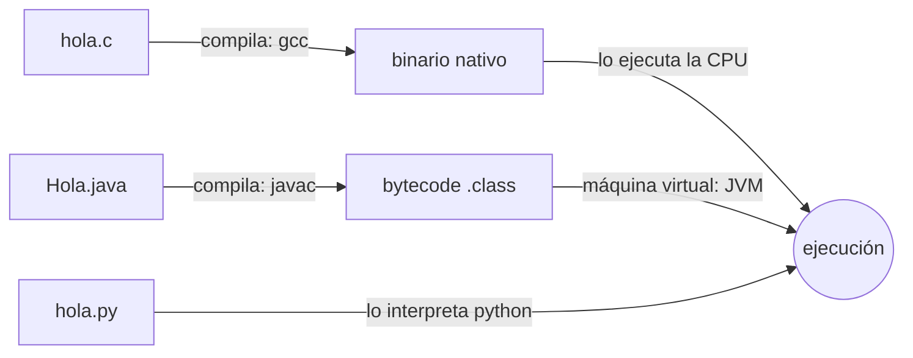

# Tema 1 · Material extra: tres demostraciones en máquina


## El sistema operativo gestiona varios procesos a la vez

Un proceso es un **programa en memoria**, con espacio reservado para su código y sus datos y con tiempo de CPU asignado. El SO tiene varios a la vez y los coordina.

### Ver tus procesos

```bash
top -u $USER          # procesos del usuario actual, en tiempo real
# también:
ps -u $USER -o pid,ppid,stat,%cpu,%mem,rss,comm
```

Cada línea es un proceso: tiene un **PID**, un padre (**PPID**), un estado, un porcentaje de CPU y una cantidad de memoria residente (`RSS`, KiB de RAM que ocupa ahora mismo). Solo con una sesión de escritorio ya hay decenas de procesos: el shell, el navegador, el gestor de ventanas, servicios del sistema… todos comparten una sola CPU física (o unos pocos núcleos) y una sola memoria.

### Un proceso que falla no tumba el sistema

Con un SO, la CPU genera una **interrupción de la clase «programa»** (Tema 1, tabla de clases de interrupciones), el SO la recoge, **mata solo al proceso culpable** y sigue funcionando.

```bash
./acceso_invalido      # -> "Segmentation fault (core dumped)"        SIGSEGV
./division_cero        # -> "Floating point exception (core dumped)"  SIGFPE
```

El shell imprime el motivo: la señal con la que el SO ha matado al proceso. Los dos programas cascan, pero el shell (y el resto del sistema) siguen vivos.

### El mapa de memoria de un proceso: código, pila y heap

`direcciones.c` declara **tres variables locales** (pila) y hace **tres reservas con `malloc`** (heap), e imprime la dirección de todas y la de `main` (código).

```bash
gcc -Wall -Wextra -O0 -o direcciones direcciones.c
./direcciones
```

Salida típica (x86-64 Linux):

```
codigo   &main = 0x5555555551a9

pila     &a    = 0x7fffffffe2ac
pila     &b    = 0x7fffffffe2a8
pila     &c    = 0x7fffffffe2a4

heap     h1    = 0x55555555a2a0
heap     h2    = 0x55555555a6b0
heap     h3    = 0x55555555aac0
```

- El **código** (`&main`) está en direcciones bajas.
- La **pila** está en la parte alta del espacio (`0x7fff…`), muy lejos del resto; crece **hacia direcciones bajas**.
- El **heap** justo detrás del código; cada `malloc` devuelve una dirección **mayor** que el anterior, así que crece **hacia direcciones altas**.
- Pila y heap arrancan en **extremos opuestos** y crecen **una hacia la otra**, con un hueco en medio.

Todas son **direcciones virtuales**: el SO y la MMU dan a cada proceso su propio mapa, así que dos procesos pueden ver la misma dirección sin pisarse.

### El planificador reparte la CPU

`primos_cpu.c` busca primos a tope durante ~3 s, imprime el último y espera un ENTER.

```bash
gcc -Wall -Wextra -O2 -o primos_cpu primos_cpu.c
```

ejecuta `htop` en una terminal y **dos o tres** copias de `./primos_cpu`

- El SO reparte la CPU entre los procesos que están calculando, si hay más procesos que cores CPU, se reparten.
- Cuando una copia se para en el `ENTER` el SO la pone en espera, las demás **suben** y ocupan el hueco.

Es la multiprogramación del Tema 1: la CPU nunca está ociosa si hay trabajo pendiente.

---

## Tres formas de llegar a la ejecución



```bash
# C: fuente -> binario -> ejecución
gcc -Wall -Wextra -o hola hola.c #crea hola binario nativo ELF
./hola

# Python: el intérprete lee el fuente y lo ejecuta
python hola.py

# Java: fuente -> bytecode -> lo ejecuta la máquina virtual
javac Hola.java      # genera Hola.class
java Hola   #se ejecuta en la máquina virtual
```

**Los límites son difusos**:

- **C también se puede interpretar**: `cling` (REPL de C/C++).
- **Python también se compila**: `python3` ya genera bytecode `.pyc` (en `__pycache__/`) que ejecuta su máquina virtual; además hay `Cython` (a C y luego nativo) y `PyPy` (JIT).
- **Java también se compila a nativo**: `native-image` de GraalVM produce un ejecutable sin JVM.

La constante: para que la CPU haga algo, **siempre** hay que acabar en código máquina; cambia *cuándo* se traduce (antes de ejecutar, al vuelo, o por trozos con un JIT).

---

## Del código C al código máquina

**Compiler Explorer** — <https://godbolt.org>. Pega el fuente a la izquierda, elige *x86-64 gcc* y en el panel derecho aparece el ensamblador.

### Instrucciones y registros básicos

Con `a = b + c;` el compilador genera 3 o 4 instrucciones de los tipos vistos en el Tema 1 (transferencia y aritmético-lógicas):

```asm
mov     eax, DWORD PTR [rbp-8]     ; transferencia: carga b en el registro eax
add     eax, DWORD PTR [rbp-12]    ; aritmética:    eax = b + c
mov     DWORD PTR [rbp-4], eax     ; transferencia: guarda el resultado en a
```

- **Registros** de propósito general (x86-64, 64 bits): `rax`, `rbx`, `rcx`, `rdx`, `rsi`, `rdi`, `rbp`, `rsp`, `r8`…`r15`. `eax` es la mitad baja (32 bits) de `rax`.
- **Registros especiales**: `rip` = contador de programa (**PC**), `rsp` = puntero de la cima de la pila, `rbp` = puntero al marco de pila actual (*base pointer*, referencia fija desde la que se accede a variables locales y argumentos), `rflags` = registros de estado (bit *zero*, *carry*, *sign*, *overflow*…).
- `cmp a, b` + `je etiqueta` (*jump if equal*) es el salto condicional: `cmp` fija los flags y `je` salta según el bit *zero*. Así se construyen `if` y bucles.

### Subrutinas — `cuadrado.c`

```c
int cuadrado(int x) { return x * x; }
int main(void)      { return cuadrado(7); }
```

```asm
main:
        ...
        mov     edi, 7          ; 1er argumento -> registro edi (convención de llamada)
        call    cuadrado        ; apila la dirección de retorno (rip) y salta

cuadrado:
        push    rbp             ; prólogo: guarda el marco de pila del llamante
        mov     rbp, rsp
        mov     DWORD PTR [rbp-4], edi
        mov     eax, DWORD PTR [rbp-4]
        imul    eax, eax        ; eax = x * x
        pop     rbp             ; epílogo: restaura el marco
        ret                     ; desapila la dirección de retorno y salta a ella
```

- `call` **apila** en la pila la dirección de la instrucción siguiente y salta a la subrutina.
- La subrutina recibe los argumentos en registros (`rdi`, `rsi`, `rdx`, `rcx`, `r8`, `r9`; los demás en la pila) y devuelve el resultado en `rax`.
- Cada llamada crea un **marco de pila** (variables locales + dirección de retorno). Las llamadas anidadas apilan marcos; cada `ret` desapila el suyo. Es el mismo mecanismo que usa la CPU para guardar el contexto al atender una interrupción.

### Interrupciones y llamadas al sistema — `escribe.c`

```c
#include <unistd.h>
int main(void) { if (write(1, "hola\n", 5) != 5) return 1; return 0; }
```

tu llamada `write` no puede tocar el hardware por su cuenta: prepara los argumentos y ejecuta una **interrupción software** para entrar en el núcleo.

```asm
        mov     edi, 1              ; fd 1 = salida estándar
        lea     rsi, [rip+.LC0]    ; puntero al texto "hola\n"
        mov     edx, 5             ; longitud
        mov     eax, 1             ; número de la llamada al sistema (write = 1)
        syscall                    ; INTERRUPCIÓN SW: la CPU pasa a modo núcleo
```

Al ejecutar `syscall` (antiguamente `int 0x80`):

1. La CPU cambia a **modo núcleo** y salta a una dirección fija: la rutina de servicio que instaló el SO al arrancar.
2. El SO mira `eax` (número de llamada), valida los argumentos y hace la E/S real sobre el dispositivo.
3. Devuelve el resultado en `rax` y ejecuta `sysret`: la CPU vuelve a **modo usuario** y a la instrucción siguiente al `syscall`.

Es exactamente el «procesamiento de una interrupción» del Tema 1 (guardar contexto → rutina de servicio → restaurar contexto → continuar), y es la única puerta por la que un proceso de usuario obtiene servicios del sistema operativo.

```bash
strace -e trace=write ./escribe     # ver la llamada al sistema desde fuera
```
