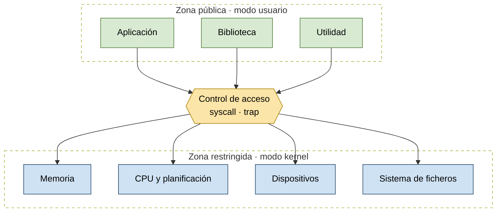
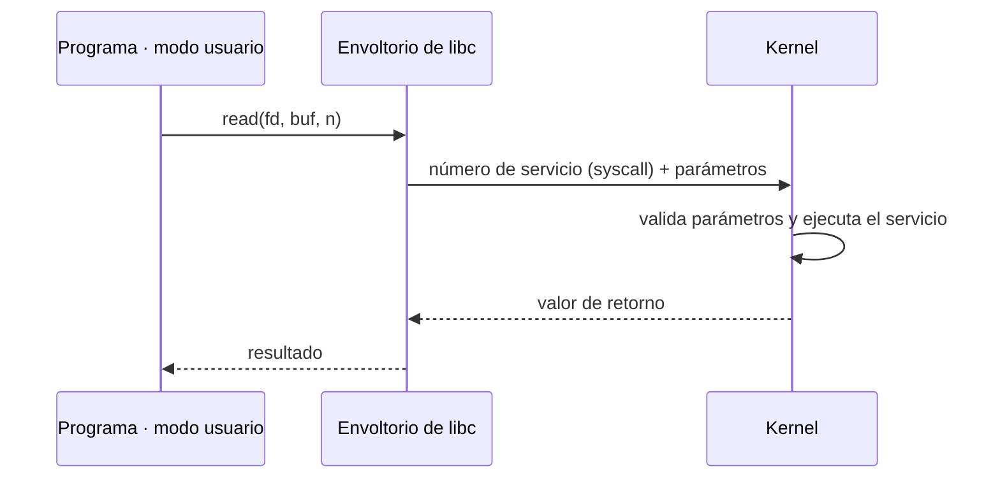

# Espacio usuario y espacio kernel. Llamadas al sistema

## Modo usuario y modo kernel

Los programas ordinarios se ejecutan con privilegios limitados. Para acceder a recursos protegidos (memoria, CPU, dispositivos, sistema de ficheros) deben solicitar un servicio al kernel a través de un único punto de control: la llamada al sistema.

*Los programas ordinarios se ejecutan con privilegios limitados. Para acceder a recursos protegidos deben solicitar un servicio al kernel.*

## Mecanismos de transferencia de control

| Mecanismo | Causa | Uso | Ejemplo |
|-----------|-------|-----|---------|
| **Interrupción** | Externa a la ejecución de la instrucción en curso | Reacción a un suceso asíncrono externo | Interrupción de reloj, interrupción de E/S |
| **Cepo** (*trap*) | Asociada a la ejecución de la instrucción en curso | Tratamiento de un error o condición de excepción | Intento ilegal de acceso a un archivo |
| **Llamada al sistema** | Solicitud explícita | Llamada a una función del SO | Un proceso de usuario llega a una instrucción que solicita abrir un archivo |

- En una **interrupción**, el control se transfiere primero a un **gestor de interrupciones** que realiza tareas básicas y luego salta a una rutina del SO específica del tipo de interrupción.
- En los **cepos**, el SO determina si el error es **fatal** (el proceso termina) o **no fatal** (se intenta recuperación o se notifica al usuario).
- Una **llamada al sistema** transfiere el control a una rutina que forma parte del código del SO (ver flujo detallado abajo).

Antes de leer la siguiente instrucción, el procesador **siempre comprueba si se ha producido alguna interrupción**:

1. Si no hay ninguna pendiente, continúa con la siguiente instrucción del proceso actual.
2. Si hay alguna pendiente: guarda el contexto del programa en ejecución, asigna al PC la dirección de comienzo del programa de tratamiento de la interrupción y lee su primera instrucción.

## Flujo de una llamada al sistema

La llamada al sistema se comporta como una ventanilla segura: la aplicación entrega una petición y unos parámetros, el kernel comprueba permisos y direcciones, ejecuta el servicio y devuelve el resultado, sin ceder nunca a la aplicación el control directo del hardware.

*Una llamada al sistema cruza temporalmente la frontera entre modo usuario y modo kernel sin entregar a la aplicación el control directo del hardware.*

## Estructuras: monolítico frente a microkernel

Un kernel monolítico reúne muchos servicios en un mismo espacio privilegiado; un microkernel conserva solo los mecanismos esenciales y delega el resto a procesos aislados que se comunican por mensajes.

