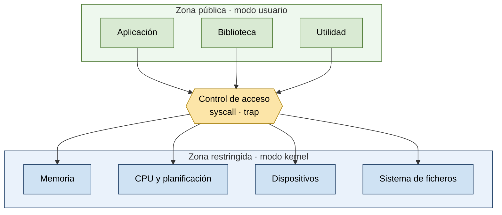
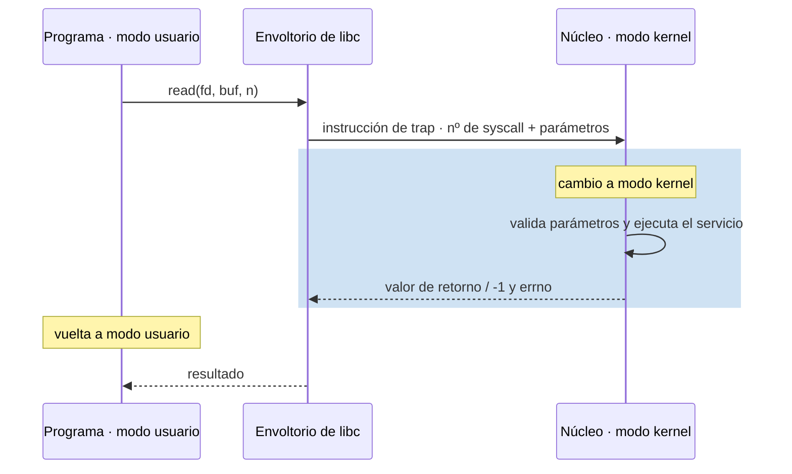
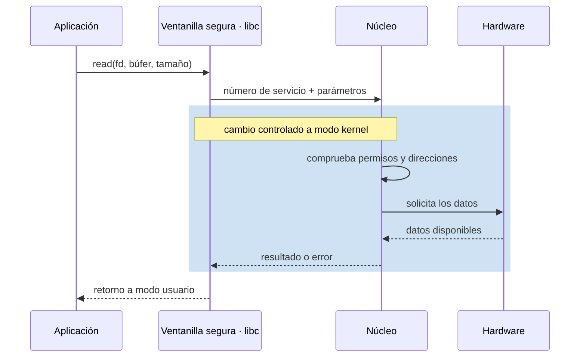
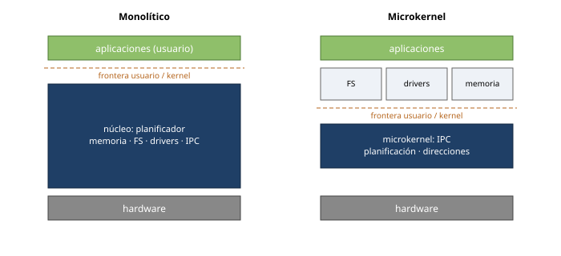
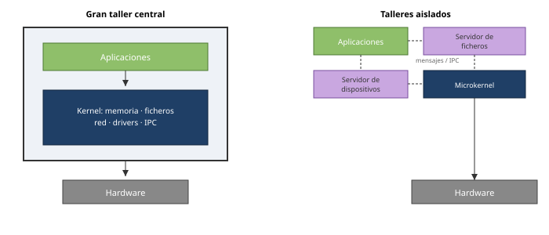

# Espacio usuario y espacio kernel. Llamadas al sistema

## Contenidos

- Modo usuario y modo núcleo (kernel). Bit de modo y protección.
- El SO como colección de procedimientos con interfaz de entrada/salida definida.
- Llamadas al sistema: paso de parámetros en lugares bien definidos, cambio de modo, ejecución del servicio y retorno al programa de usuario.
- Estructuras de los sistemas operativos:
  - Sistemas monolíticos (programa principal, procedimientos de servicio, utilidades). Núcleos tipo Unix (Linux, BSD, Solaris), tipo DOS, etc.
  - Microkernels: primitivas mínimas (espacios de direcciones, IPC, planificación básica); el resto de servicios como procesos servidores en espacio de usuario. Ventajas (complejidad, aislamiento de fallos, portabilidad, drivers) e inconvenientes (sincronización entre módulos).
  - Sistemas por capas, máquinas virtuales, exokernels.

## Modo usuario y modo kernel

Los programas ordinarios se ejecutan con privilegios limitados. Para acceder a recursos protegidos (memoria, CPU, dispositivos, sistema de ficheros) deben solicitar un servicio al núcleo a través de un único punto de control: la llamada al sistema.

*Los programas ordinarios se ejecutan con privilegios limitados. Para acceder a recursos protegidos deben solicitar un servicio al núcleo.*

## Flujo de una llamada al sistema

La llamada al sistema se comporta como una ventanilla segura: la aplicación entrega una petición y unos parámetros, el núcleo comprueba permisos y direcciones, ejecuta el servicio y devuelve el resultado, sin ceder nunca a la aplicación el control directo del hardware.

*Una llamada al sistema cruza temporalmente la frontera entre modo usuario y modo kernel sin entregar a la aplicación el control directo del hardware.*

## Estructuras: monolítico frente a microkernel

Un núcleo monolítico reúne muchos servicios en un mismo espacio privilegiado; un microkernel conserva solo los mecanismos esenciales y delega el resto a procesos aislados que se comunican por mensajes, como talleres separados apoyados sobre el mismo hardware.

*Un núcleo monolítico reúne muchos servicios en un mismo espacio privilegiado. Un microkernel conserva solo los mecanismos esenciales y delega otros servicios a procesos aislados.*

---

Figuras catalogadas en [`TEORIA/IMAGENES.md`](../IMAGENES.md).
