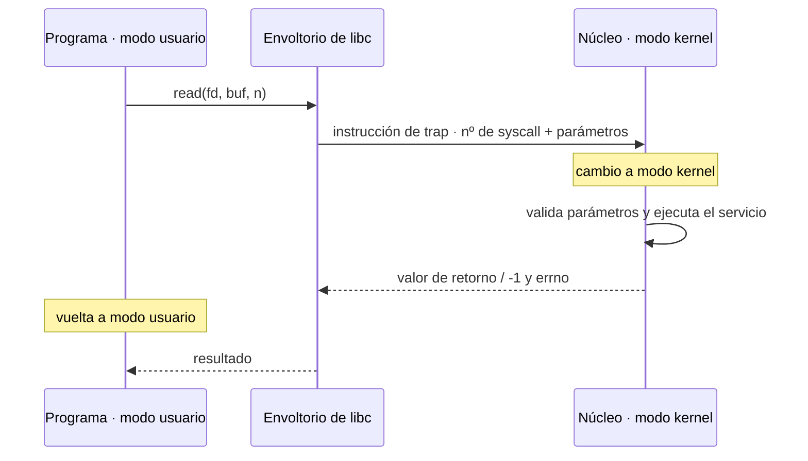
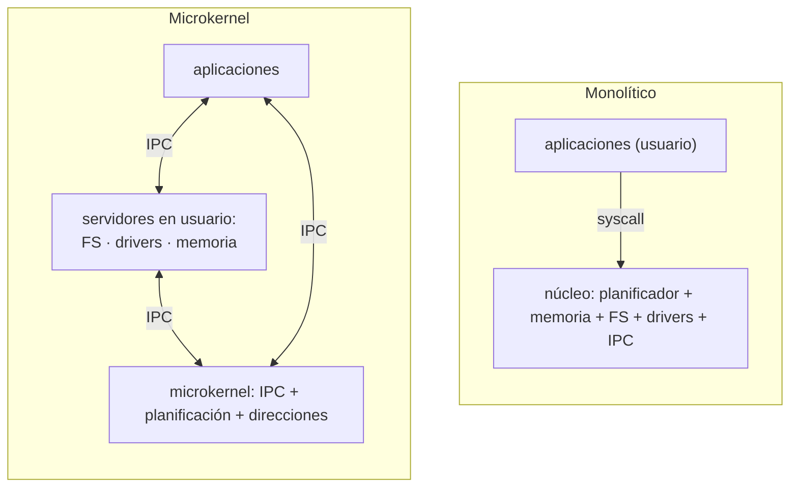

# Espacio usuario y espacio kernel. Llamadas al sistema

## Contenidos

- Modo usuario y modo núcleo (kernel). Bit de modo y protección.
- El SO como colección de procedimientos con interfaz de entrada/salida definida.
- Llamadas al sistema: paso de parámetros en lugares bien definidos, cambio de modo,
  ejecución del servicio y retorno al programa de usuario.
- Estructuras de los sistemas operativos:
  - Sistemas monolíticos (programa principal, procedimientos de servicio, utilidades).
    Núcleos tipo Unix (Linux, BSD, Solaris), tipo DOS, etc.
  - Microkernels: primitivas mínimas (espacios de direcciones, IPC, planificación básica);
    el resto de servicios como procesos servidores en espacio de usuario. Ventajas
    (complejidad, aislamiento de fallos, portabilidad, drivers) e inconvenientes
    (sincronización entre módulos).
  - Sistemas por capas, máquinas virtuales, exokernels.

## Flujo de una llamada al sistema

## Estructuras: monolítico frente a microkernel

## Material

_(pendiente de añadir)_
