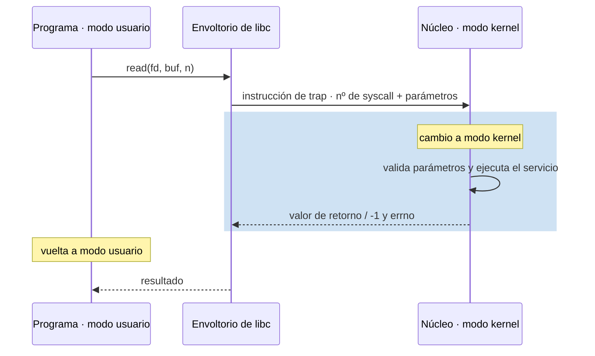
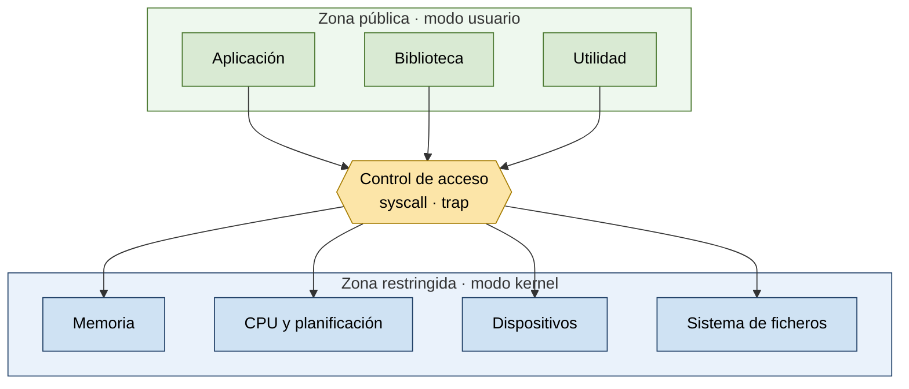
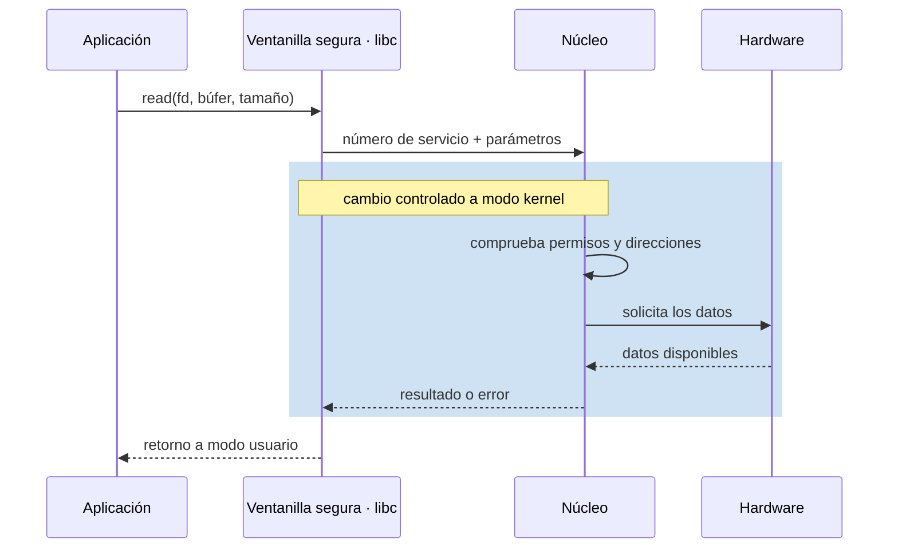

# Espacio usuario y espacio kernel. Llamadas al sistema

## Contenidos

- Modo usuario y modo núcleo (kernel). Bit de modo y protección.
- El SO como colección de procedimientos con interfaz de entrada/salida definida.
- Llamadas al sistema: paso de parámetros en lugares bien definidos, cambio de modo, ejecución del servicio y retorno al programa de usuario.
- Estructuras de los sistemas operativos:
  - Sistemas monolíticos (programa principal, procedimientos de servicio, utilidades). Núcleos tipo Unix (Linux, BSD, Solaris), tipo DOS, etc.
  - Microkernels: primitivas mínimas (espacios de direcciones, IPC, planificación básica); el resto de servicios como procesos servidores en espacio de usuario. Ventajas (complejidad, aislamiento de fallos, portabilidad, drivers) e inconvenientes (sincronización entre módulos).
  - Sistemas por capas, máquinas virtuales, exokernels.

## Flujo de una llamada al sistema

## Estructuras: monolítico frente a microkernel

<svg xmlns="http://www.w3.org/2000/svg" viewBox="0 0 700 320" font-family="sans-serif" font-size="12" role="img" aria-label="Comparación en capas de un núcleo monolítico y un microkernel, con la frontera entre espacio de usuario y espacio de kernel marcada en cada caso">
  <rect width="700" height="320" fill="#ffffff"/>
  <text x="180" y="25" text-anchor="middle" font-weight="bold">Monolítico</text>
  <text x="520" y="25" text-anchor="middle" font-weight="bold">Microkernel</text>
  <rect x="60" y="45" width="240" height="30" fill="#8fbf6a" stroke="#4d7a33"/><text x="180" y="65" text-anchor="middle" fill="#fff">aplicaciones (usuario)</text>
  <line x1="55" y1="85" x2="305" y2="85" stroke="#b5651d" stroke-dasharray="5 3"/>
  <text x="180" y="98" text-anchor="middle" font-size="10" fill="#b5651d">frontera usuario / kernel</text>
  <rect x="60" y="105" width="240" height="130" fill="#1f3f66" stroke="#132840"/>
  <text x="180" y="165" text-anchor="middle" fill="#fff" font-size="11">núcleo: planificador</text>
  <text x="180" y="180" text-anchor="middle" fill="#fff" font-size="11">memoria · FS · drivers · IPC</text>
  <rect x="60" y="245" width="240" height="30" fill="#888" stroke="#444"/><text x="180" y="265" text-anchor="middle" fill="#fff">hardware</text>
  <rect x="400" y="45" width="240" height="30" fill="#8fbf6a" stroke="#4d7a33"/><text x="520" y="65" text-anchor="middle" fill="#fff">aplicaciones</text>
  <rect x="400" y="85" width="76" height="40" fill="#eef2f7" stroke="#666"/><text x="438" y="108" text-anchor="middle" font-size="10">FS</text>
  <rect x="482" y="85" width="76" height="40" fill="#eef2f7" stroke="#666"/><text x="520" y="108" text-anchor="middle" font-size="10">drivers</text>
  <rect x="564" y="85" width="76" height="40" fill="#eef2f7" stroke="#666"/><text x="602" y="108" text-anchor="middle" font-size="10">memoria</text>
  <line x1="395" y1="135" x2="645" y2="135" stroke="#b5651d" stroke-dasharray="5 3"/>
  <text x="520" y="148" text-anchor="middle" font-size="10" fill="#b5651d">frontera usuario / kernel</text>
  <rect x="400" y="155" width="240" height="55" fill="#1f3f66" stroke="#132840"/>
  <text x="520" y="178" text-anchor="middle" fill="#fff" font-size="11">microkernel: IPC</text>
  <text x="520" y="193" text-anchor="middle" fill="#fff" font-size="11">planificación · direcciones</text>
  <rect x="400" y="245" width="240" height="30" fill="#888" stroke="#444"/><text x="520" y="265" text-anchor="middle" fill="#fff">hardware</text>
</svg>

## Galería visual complementaria

### T02.1 · El kernel como zona restringida

*Los programas ordinarios se ejecutan con privilegios limitados. Para acceder a recursos protegidos deben solicitar un servicio al núcleo.*

### T02.2 · La llamada al sistema como ventanilla

*Una llamada al sistema cruza temporalmente la frontera entre modo usuario y modo kernel sin entregar a la aplicación el control directo del hardware.*

### T02.3 · Núcleo monolítico y microkernel como talleres

<svg xmlns="http://www.w3.org/2000/svg" viewBox="0 0 700 300" font-family="sans-serif" font-size="11" role="img" aria-label="Un gran taller único frente a varios talleres aislados que se comunican por mensajes, ambos apoyados sobre el mismo hardware">
  <rect width="700" height="300" fill="#ffffff"/>
  <text x="160" y="22" text-anchor="middle" font-weight="bold">Gran taller central</text>
  <rect x="30" y="35" width="260" height="170" fill="#eef2f7" stroke="#333" stroke-width="2"/>
  <rect x="55" y="55" width="210" height="35" fill="#8fbf6a" stroke="#4d7a33"/><text x="160" y="77" text-anchor="middle" fill="#fff">Aplicaciones</text>
  <line x1="160" y1="90" x2="160" y2="110" stroke="#333"/><path d="M160 110 l-4 -8 l8 0 z" fill="#333"/>
  <rect x="55" y="115" width="210" height="70" fill="#1f3f66" stroke="#132840"/>
  <text x="160" y="145" text-anchor="middle" fill="#fff" font-size="10">Kernel: memoria · ficheros</text>
  <text x="160" y="160" text-anchor="middle" fill="#fff" font-size="10">red · drivers · IPC</text>
  <line x1="160" y1="205" x2="160" y2="225" stroke="#333"/><path d="M160 225 l-4 -8 l8 0 z" fill="#333"/>
  <rect x="80" y="230" width="160" height="30" fill="#888" stroke="#444"/><text x="160" y="250" text-anchor="middle" fill="#fff">Hardware</text>
  <text x="530" y="22" text-anchor="middle" font-weight="bold">Talleres aislados</text>
  <rect x="400" y="35" width="120" height="35" fill="#8fbf6a" stroke="#4d7a33"/><text x="460" y="57" text-anchor="middle" fill="#fff" font-size="10">Aplicaciones</text>
  <rect x="540" y="35" width="130" height="35" fill="#c9a7e0" stroke="#7a4fa0"/><text x="605" y="50" text-anchor="middle" fill="#333" font-size="9">Servidor de</text><text x="605" y="62" text-anchor="middle" fill="#333" font-size="9">ficheros</text>
  <rect x="400" y="90" width="120" height="35" fill="#c9a7e0" stroke="#7a4fa0"/><text x="460" y="105" text-anchor="middle" fill="#333" font-size="9">Servidor de</text><text x="460" y="117" text-anchor="middle" fill="#333" font-size="9">dispositivos</text>
  <rect x="540" y="90" width="130" height="35" fill="#1f3f66" stroke="#132840"/><text x="605" y="112" text-anchor="middle" fill="#fff" font-size="9">Microkernel</text>
  <line x1="460" y1="70" x2="460" y2="90" stroke="#333" stroke-dasharray="3 2"/>
  <line x1="520" y1="52" x2="540" y2="52" stroke="#333" stroke-dasharray="3 2"/>
  <line x1="520" y1="107" x2="540" y2="107" stroke="#333" stroke-dasharray="3 2"/>
  <line x1="605" y1="70" x2="605" y2="90" stroke="#333" stroke-dasharray="3 2"/>
  <text x="530" y="80" font-size="8" fill="#666">mensajes / IPC</text>
  <line x1="605" y1="125" x2="605" y2="230" stroke="#333"/><path d="M605 230 l-4 -8 l8 0 z" fill="#333"/>
  <rect x="525" y="230" width="160" height="30" fill="#888" stroke="#444"/><text x="605" y="250" text-anchor="middle" fill="#fff">Hardware</text>
</svg>

*Un núcleo monolítico reúne muchos servicios en un mismo espacio privilegiado. Un microkernel conserva solo los mecanismos esenciales y delega otros servicios a procesos aislados.*

## Material

Las figuras complementarias de este tema están incluidas en la galería anterior y catalogadas en [`TEORIA/IMAGENES.md`](../IMAGENES.md).
