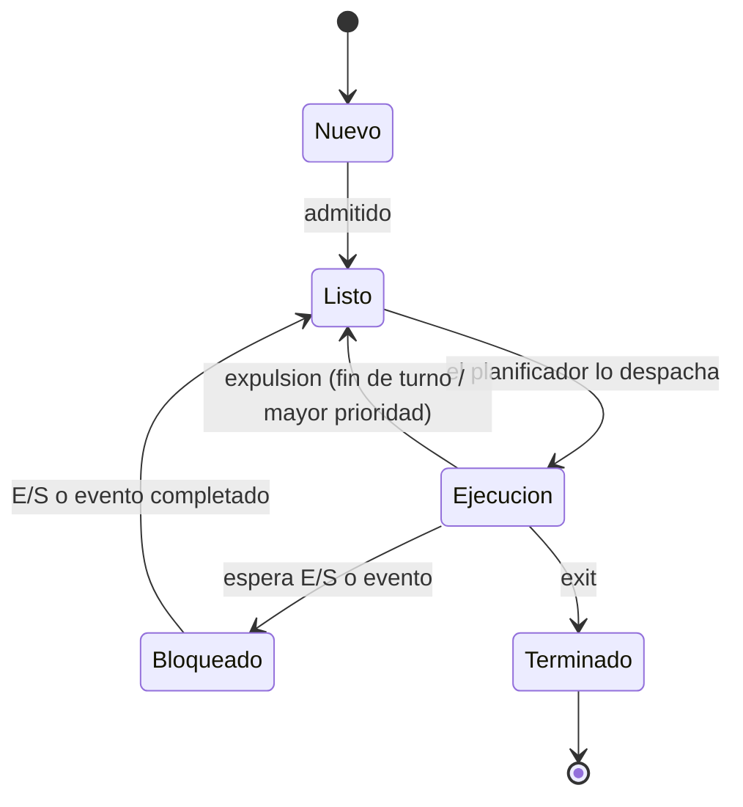

# Procesos e hilos

## Contenidos

- Concepto de proceso: código, pila, datos e información de contexto del procesador.
  Programa (entidad pasiva) frente a proceso (entidad activa).
- Concepto de hilo. Diferencias entre proceso e hilo (coste de creación, terminación y
  cambio de contexto).
- Operaciones sobre los procesos: creación, terminación, bloqueo, desbloqueo.
- Estados de un proceso y transiciones. Bloque de control de proceso (PCB).
- Cambio de contexto: guardar contexto, actualizar y mover el PCB de cola, seleccionar
  otro proceso, restaurar contexto.
- Mecanismos de comunicación entre procesos (visión general): pipes y fifos, señales,
  colas de mensajes, memoria compartida. → ver [`TEORIA/07`](../07-ipc-pipes-y-fifos/) …
  [`TEORIA/10`](../10-memoria-compartida-y-mutex/).

## Diagrama de estados de un proceso

## Material

_(pendiente de añadir)_
