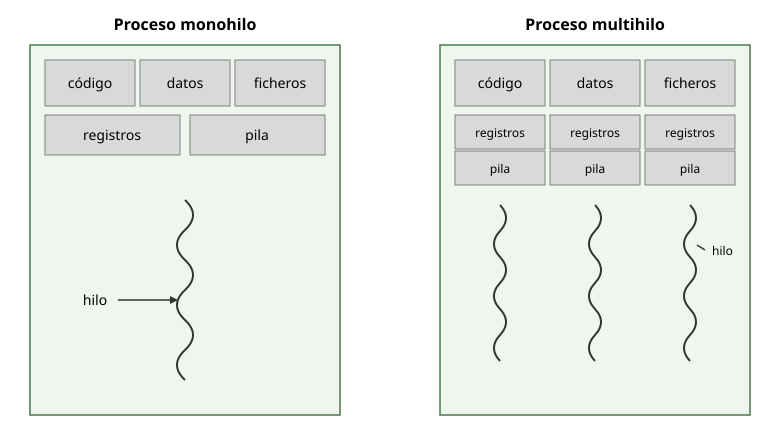
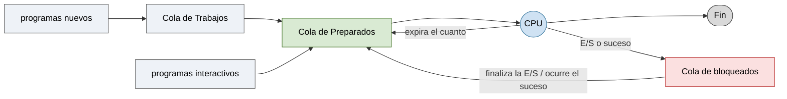
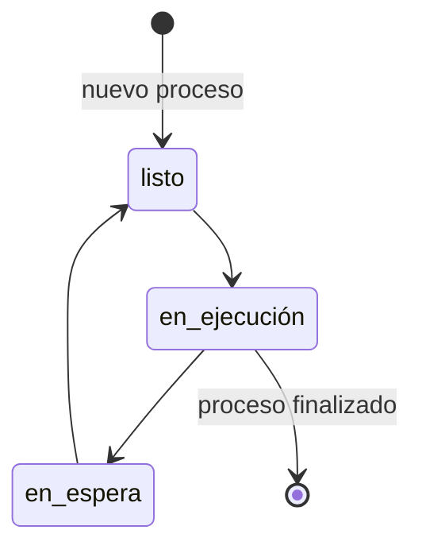

# Tema 2: Procesos e hilos

## Concepto de proceso

Un **proceso** es la ejecución de un programa sobre un computador. Un proceso incluye:

- el código del programa,
- una **pila** (para el paso de parámetros, direcciones, etc.),
- los datos del programa,
- la información de contexto del procesador.

Un **programa por sí mismo NO es un proceso**: un programa es una entidad **pasiva** y un proceso es una entidad **activa**.

*Un programa es código almacenado. Un proceso aparece cuando este código se pone ejecución junto con sus datos, pila, recursos y contexto del procesador.*

### Multiprogramación 

Para lograr la multiprogramación se hace creer a los programas que están solos en la máquina:

- Cada proceso se ejecuta en su propio **espacio de direcciones** y no puede acceder directamente al espacio de direcciones de otros procesos.
- La ejecución de un proceso está confinada a su espacio, y también lo están sus errores.
- **Desventaja**: compartir información entre procesos es complicado.

El sistema operativo realiza una **multiplexación espacial** de la memoria principal y una **multiplexación temporal** de los procesos en ejecución proporcionando:

- **Protección de la memoria**: en los sistemas multiusuario y/o multitarea, el SO asigna una zona de memoria a cada proceso para evitar que un proceso de usuario acceda al espacio de direcciones de otro. 
- **Protección de la CPU**: los sistemas multitarea deben evitar que un proceso se apodere de la CPU. Un timer se decrementa en cada *tick*; al llegar a cero se genera una **interrupción de reloj** y el SO recupera el control.

### ¿Por qué usar procesos?

- **Simplicidad**: hay muchas operaciones independientes que pueden ejecutarse en procesos independientes.
- **Eficiencia**: si un proceso se interrumpe (esperando disco, teclado, red…), otro proceso puede utilizar la CPU.
- **Seguridad**: se limitan los efectos de un error, aislando el problema.

## Concepto de hilo

Un **hilo** es un flujo de ejecución independiente dentro de un proceso: tiene su propia pila y su propio contexto de procesador, pero comparte con los demás hilos del proceso el código, los datos y los recursos.

**Beneficios de los hilos** (rendimiento):

1. Se tarda menos en crear un nuevo hilo en un proceso existente que en crear un proceso nuevo.
2. Se tarda menos en terminar un hilo.
3. Se tarda menos en cambiar entre dos hilos de un mismo proceso.

Además, la comunicación entre hilos de un mismo proceso es más eficiente, y son útiles incluso en monoprocesadores para simplificar la estructura de programas que llevan a cabo diversas funciones.

- Dentro de un proceso puede haber varios hilos de ejecución; un proceso podría estar haciendo varias cosas "a la vez".
- Los hilos de un proceso **comparten la misma memoria**: si un hilo modifica una variable, todos los demás ven el nuevo valor; si un hilo corrompe una zona de memoria, todos la ven corrompida; un fallo en un hilo puede hacer fallar a todos los demás hilos del proceso.

<!-- 
### Estados de un hilo en UNIX

| Estado | Descripción |
|--------|-------------|
| **Listo** | El hilo puede ser elegido para su ejecución. |
| **Standby** | El hilo ha sido elegido para ser el siguiente en ejecutarse en el procesador. |
| **Ejecución** | El hilo está siendo ejecutado. |
| **Espera** | El hilo se ha bloqueado por un suceso. |
| **(E/S)** | Espera voluntaria de sincronización, o alguien suspende al hilo. |
| **Transición** | Tras una espera, el hilo está listo para ejecutar pero alguno de sus recursos no está disponible aún. |
| **Terminado** | El hilo termina normalmente o su proceso padre ha terminado. |

-->

## Diferencias entre proceso e hilo

Los procesos son como cocinas independientes, cada una con su mesa de trabajo y su receta; los hilos de un mismo proceso son varios cocineros que comparten la misma cocina, aunque cada uno lleve su tabla de preparación personal (su pila y su estado de ejecución).

*Los procesos poseen espacios de memoria independientes. Los hilos de un mismo proceso comparten código, datos y recursos, pero cada uno mantiene su propia pila y estado de ejecución.*

<!-- 
### Procesos vs hilos

**Semejanzas** — los hilos operan en muchos sentidos como los procesos:

- Pueden estar en uno o varios estados: listo, bloqueado, en ejecución o terminado.
- Comparten la CPU.
- Solo hay un hilo activo (en ejecución) en un instante dado.
- Un hilo dentro de un proceso se ejecuta secuencialmente.
- Cada hilo tiene su propia **pila** y su propio **contador de programa**.
- Pueden crear sus propios hilos hijos.

**Diferencias** — los hilos, a diferencia de los procesos, **no son independientes** entre sí:

- Los hilos pueden acceder a todas las direcciones de su proceso, un hilo puede leer o escribir sobre la pila de otro hilo.
- La **protección queda en manos del programador** de los hilos.

### Coexistencia de procesos e hilos

En un proceso **monohilo**, el código, los datos y los ficheros, junto con los registros y la pila, pertenecen al único hilo. En un proceso **multihilo**, el código, los datos y los ficheros se **comparten**, mientras que cada hilo tiene sus propios **registros** y su propia **pila**.

Las cuatro combinaciones posibles son:

| | Un hilo por proceso | Múltiples hilos por proceso |
|---|---|---|
| **Un proceso** | Un proceso, un hilo | Un proceso, múltiples hilos |
| **Múltiples procesos** | Múltiples procesos, un hilo por proceso | Múltiples procesos, múltiples hilos por proceso |

-->

## Gestión de procesos

### Descripción de procesos

- Todo proceso posee un identificador único, el **descriptor de proceso** (`pid`).
- La **creación** de un proceso se realiza con la llamada al sistema `fork()`.
- La **finalización** de un proceso se lleva a cabo con la llamada al sistema `kill()`.
- En Linux se puede obtener información sobre el estado de los procesos en ejecución en el directorio `/proc`, o mediante comandos `ps` y `top` (ver [`PRACTICA/00`](../../PRACTICA/00-shell-y-herramientas/) y [`PRACTICA/02`](../../PRACTICA/02-procesos-e-hilos/)).

El sistema operativo representa cada proceso mediante su **Bloque de Control de Proceso (PCB)**. La **tabla de procesos** es una lista de PCBs, con una entrada por cada proceso ejecutandose.

Un PCB contiene:

- **Estado**: nuevo, listo, en ejecución, en espera o finalizado.
- **Contador de programa**: siguiente instrucción a ejecutar.
- **Registros de la CPU**: valor de los registros (contexto) del proceso.
- **Planificación**: prioridad y colas de planificación.
- **Contabilidad**: `pid`, tiempo de CPU consumido, última ejecución.
- **Memoria**: registros límite y tabla de páginas.
- **E/S**: dispositivos asignados y ficheros abiertos.

Las direcciones que maneja el proceso son **virtuales**: la MMU (Hardware Memory management unit) las traduce a direcciones físicas de RAM usando la tabla de páginas guardada en su PCB (**enlazado de direcciones**). Se ve en detalle en [`TEORIA/06`](../06-gestion-de-memoria/).

### Control de procesos

El cambio de estado de un proceso lo dispara el sistema operativo al tomar el control mediante interrupciones, cepos o llamadas al sistema. Se ve en detalle en [`TEORIA/02`](../02-espacio-usuario-espacio-kernel/).

### Ámbito de proceso y cambio de contexto

- Cuando un proceso se ejecuta, su PC, puntero a pila, registros, etc., están cargados en la CPU.
- Cuando el SO detiene un proceso en ejecución, guarda los valores actuales de esos registros (el **contexto**) en el PCB de ese proceso.
- Conmutar la CPU de un proceso a otro se denomina **cambio de contexto**. En los sistemas de tiempo compartido, el tiempo invertido en esta tarea se llama **tiempo de sobrecarga**.

**Pasos de un cambio de proceso:**

1. Guardar el contexto: el valor de los registros de la CPU del proceso saliente se copia a la pila (su PCB).
2. Cambiar el estado del PCB saliente, de Ejecución a Listo o a Espera
3. Mover ese PCB a la cola correspondiente (listo, bloqueado…).
4. Elegir el siguiente proceso a ejecutar: lo decide el planificador (ver [`TEORIA/04`](../04-planificacion-de-procesos/)).
5. Cambiar el estado del PCB elegido a Ejecución.
6. Actualizar la tabla de páginas para que apunten al espacio de direcciones del proceso elegido.
7. Restaurar el contexto: cargar en los registros de la CPU los valores guardados en el PCB del proceso elegido, tal y como estaban la última vez que dejó de ejecutarse.

### Colas de estado

El SO mantiene una colección de **colas, una por estado**, que representan el estado de todos los procesos del sistema. Cada PCB está encolado en la cola correspondiente a su estado actual; conforme un proceso cambia de estado, su PCB se retira de una cola y se encola en otra.

## Estados de un proceso

Diagrama de estados básico:

*Un proceso alterna entre esperar su turno, usar la CPU y quedar bloqueado por sucesos o recursos.*

## Hilos y procesos en Linux

Detalle de implementación (estados de un proceso en UNIX, `task_struct`, estados en Linux, `fork()`/`wait()`, hilos POSIX): [`material_adicional.md`](material_adicional.md).

Figuras catalogadas en [`TEORIA/IMAGENES.md`](../IMAGENES.md).
