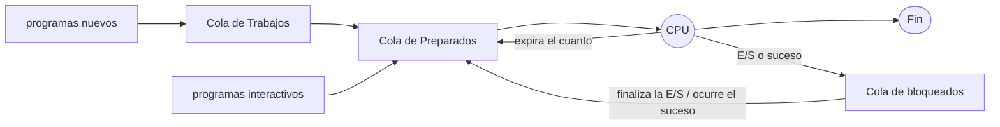
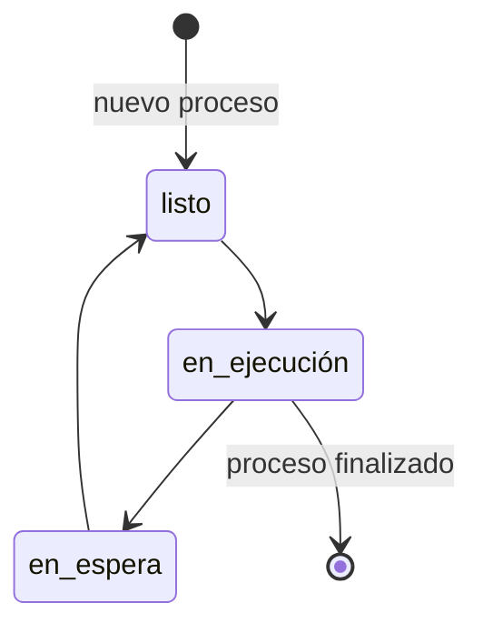
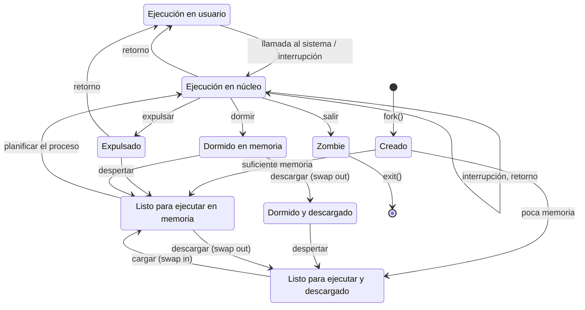
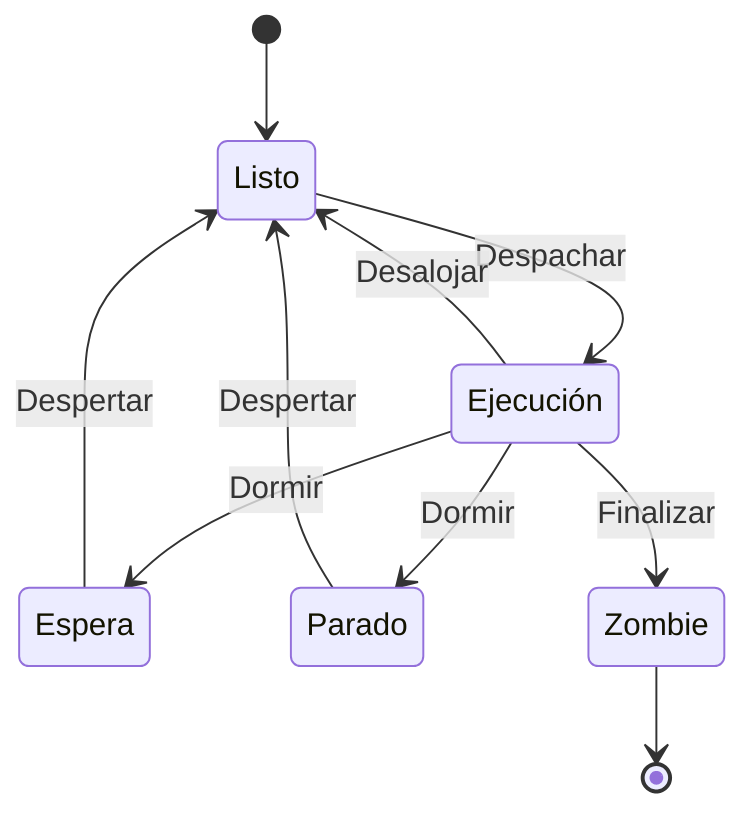
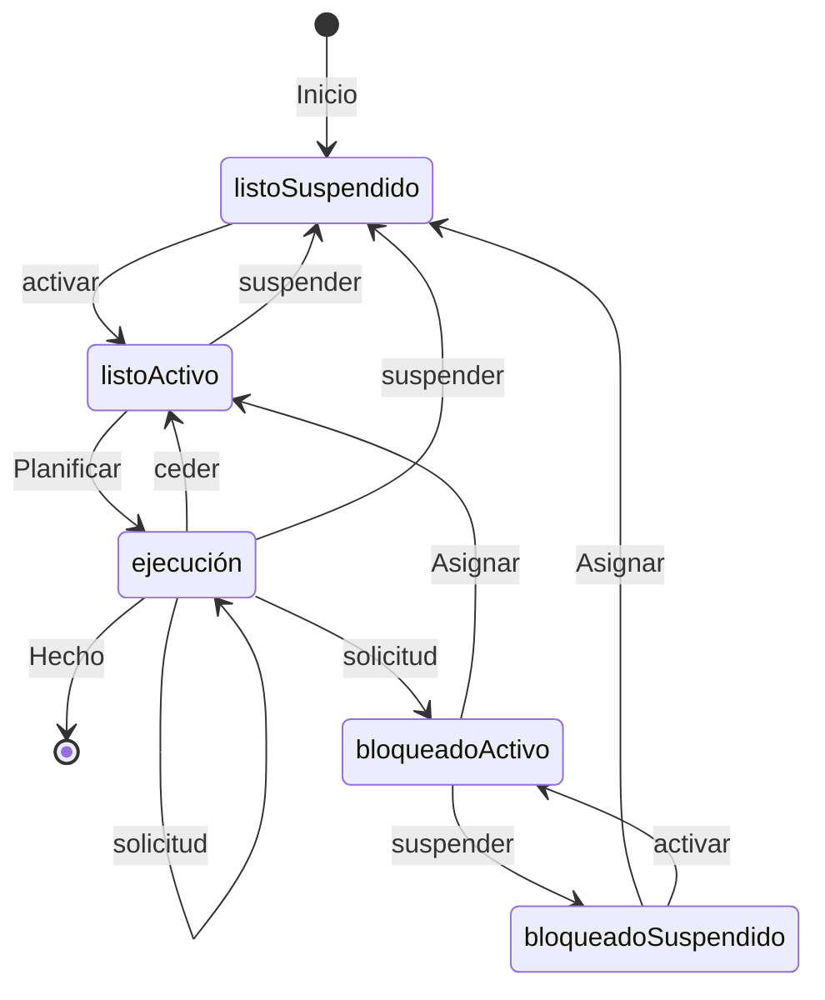
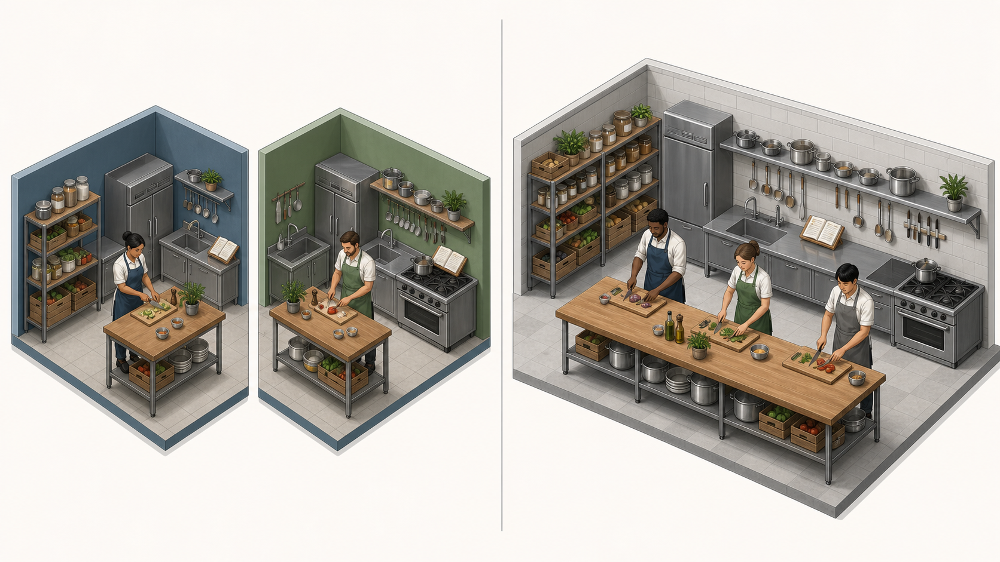
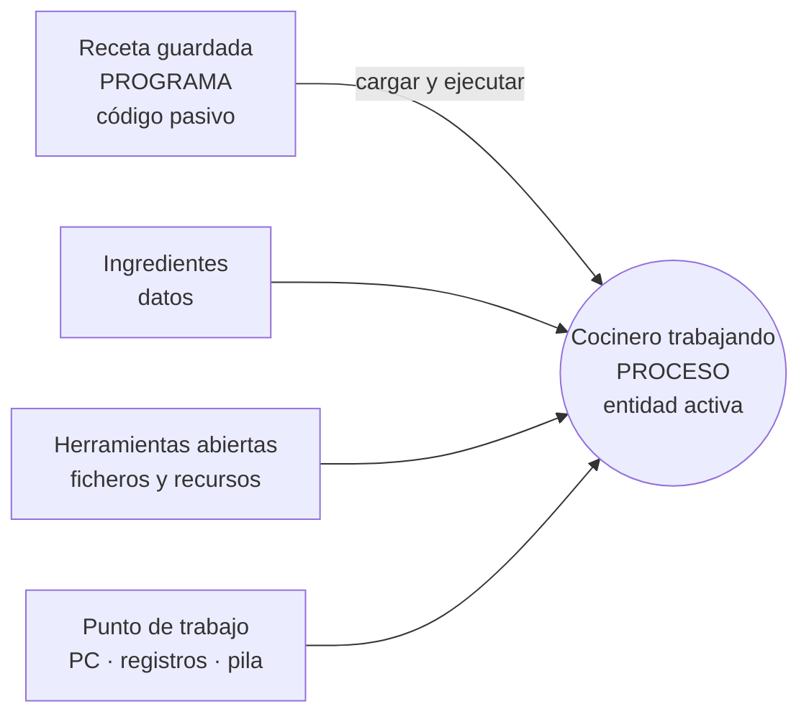
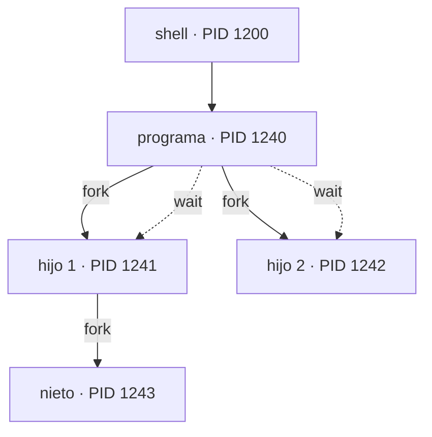
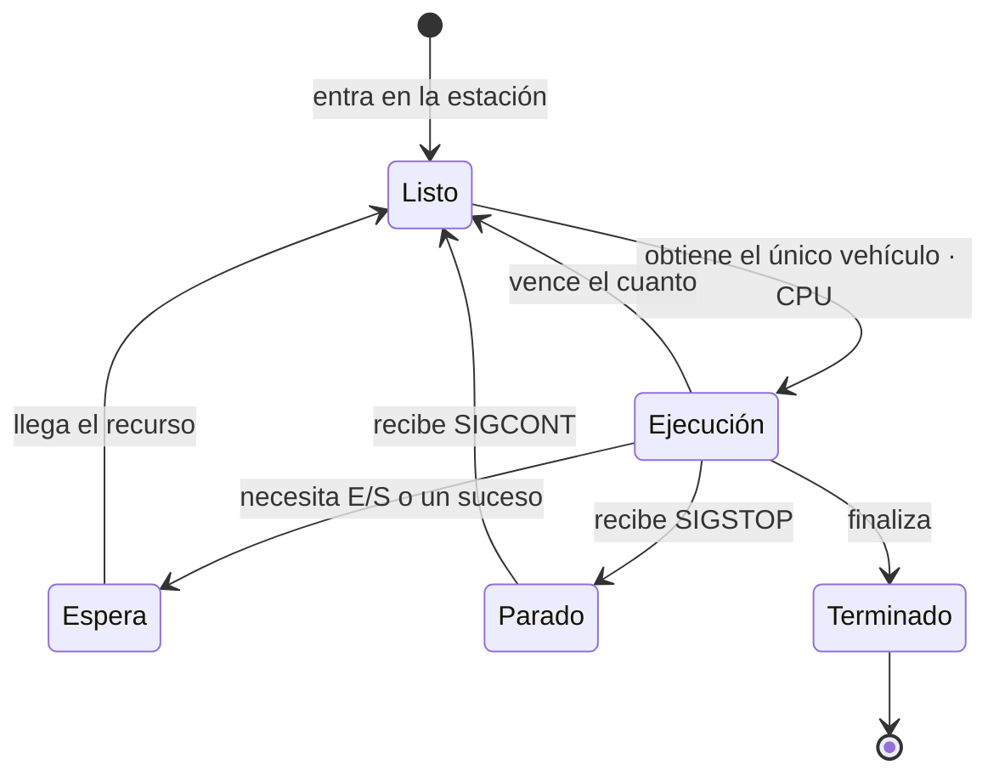
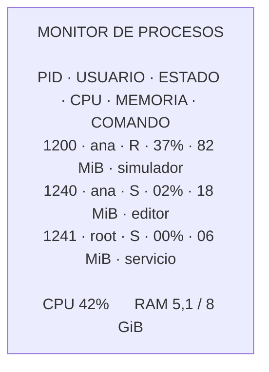

# Tema 2: Procesos e hilos

2.1 Concepto de proceso · 2.2 Concepto de hilo · 2.3 Diferencias entre proceso e hilo ·
2.4 Operaciones de los procesos · 2.5 Estados de un proceso · 2.6 Mecanismos de comunicación
entre procesos.

---

## 2.1 Concepto de proceso

Un **proceso** es la ejecución de una aplicación o programa sobre un computador de Von
Neumann. Un proceso incluye:

- el código del programa,
- una **pila** (para el paso de parámetros, direcciones, etc.),
- los datos del programa,
- la información de contexto del procesador.

Un **programa por sí mismo NO es un proceso**: un programa es una entidad **pasiva** y un
proceso es una entidad **activa**.

### Multiprogramación y máquina virtual

Para lograr la multiprogramación se hace creer a los programas que están solos en la máquina
⇒ **máquina virtual**:

- Cada proceso se ejecuta en su propio **espacio de direcciones** y no puede acceder
  directamente al espacio de direcciones de otros procesos.
- La ejecución de un proceso está confinada a su espacio, y también lo están sus errores.
- **Desventaja**: compartir información entre procesos es complicado.

El sistema operativo realiza una **multiplexación espacial** de la memoria principal y una
**multiplexación temporal** de los procesos en ejecución, mediante el concepto de **máquina
abstracta**. La máquina abstracta proporciona:

- **Protección de la memoria**: en los sistemas multiusuario y/o multitarea, el SO asigna una
  zona de memoria a cada proceso para evitar que un proceso de usuario acceda al espacio de
  direcciones de otro. Se protege, al menos, el vector de interrupción y las rutinas de
  servicio de interrupción.
- **Protección de la CPU**: los sistemas multiprogramados‑multitarea deben evitar que un
  proceso se apodere de la CPU. Un contador de reloj se decrementa en cada *tick*; al llegar a
  cero se genera una **interrupción de reloj**. El SO asigna fracciones de tiempo (**cuanto**)
  a los procesos; al expirar el plazo, la interrupción de reloj devuelve el control al SO.

### ¿Por qué usar procesos?

- **Simplicidad**: hay muchas operaciones independientes que pueden ejecutarse en procesos
  independientes.
- **Velocidad**: si un proceso se interrumpe (esperando disco, teclado, red…) se cambia a
  otro, como si se dispusiera de más de una CPU.
- **Seguridad**: se limitan los efectos de un error, aislando el problema.

En la literatura se usan indistintamente **proceso** (*process*), **tarea** (*task*) y
**trabajo** (*job*).

## 2.2 Concepto de hilo

Un **hilo** es la parte del proceso relacionada con la ejecución del código dentro del entorno
computacional protegido definido por el proceso.

**Beneficios de los hilos** (rendimiento):

1. Se tarda mucho menos en crear un nuevo hilo en un proceso existente que en crear un proceso
   nuevo.
2. Se tarda menos en terminar un hilo.
3. Se tarda menos en cambiar entre dos hilos de un mismo proceso.

Además, aportan eficiencia en la comunicación entre programas en ejecución y son útiles
incluso en monoprocesadores para simplificar la estructura de programas que llevan a cabo
diversas funciones.

- Dentro de un proceso puede haber varios hilos de ejecución; un proceso podría estar haciendo
  varias cosas "a la vez".
- Los hilos de un proceso **comparten toda la misma memoria**: si un hilo modifica una
  variable, todos los demás ven el nuevo valor; si un hilo corrompe una zona de memoria, todos
  la ven corrompida; un fallo en un hilo puede hacer fallar a todos los demás del proceso.
- Lanzar un proceso es más costoso (hay que copiar toda la memoria del programa); los hilos
  son más **ligeros**. Los hilos son una buena elección cuando hay que compartir y actualizar
  datos.

### Estados de un hilo en UNIX

| Estado | Descripción |
|--------|-------------|
| **Listo** | El hilo puede ser elegido para su ejecución. |
| **Standby** | El hilo ha sido elegido para ser el siguiente en ejecutarse en el procesador. |
| **Ejecución** | El hilo está siendo ejecutado. |
| **Espera** | El hilo se ha bloqueado por un suceso. |
| **(E/S)** | Espera voluntaria de sincronización, o alguien suspende al hilo. |
| **Transición** | Tras una espera, el hilo está listo para ejecutar pero alguno de sus recursos no está disponible aún. |
| **Terminado** | El hilo termina normalmente o su proceso padre ha terminado. |

## 2.3 Diferencias entre proceso e hilo

- Los hilos de un mismo proceso **comparten la memoria** del proceso; para compartir memoria
  entre procesos se requieren mecanismos de comunicación entre procesos como la memoria
  compartida (`shm`).
- Los hilos de un mismo proceso **se reparten el tiempo de CPU** asignado al proceso.

### Procesos vs hilos

**Semejanzas** — los hilos operan en muchos sentidos como los procesos:

- Pueden estar en uno o varios estados: listo, bloqueado, en ejecución o terminado.
- Comparten la CPU.
- Solo hay un hilo activo (en ejecución) en un instante dado.
- Un hilo dentro de un proceso se ejecuta secuencialmente.
- Cada hilo tiene su propia **pila** y su propio **contador de programa**.
- Pueden crear sus propios hilos hijos.

**Diferencias** — los hilos, a diferencia de los procesos, **no son independientes** entre sí:

- Como todos los hilos pueden acceder a todas las direcciones de la tarea, un hilo puede leer
  o escribir sobre la pila de cualquier otro hilo.
- La **protección queda en manos del programador** de los hilos.

**Ventajas de los hilos sobre los procesos:**

- Se tarda mucho menos en crear un hilo en un proceso existente que en crear un proceso.
- Se tarda mucho menos en terminar un hilo que un proceso.
- Se tarda mucho menos en conmutar entre hilos de un mismo proceso que entre procesos.
- Los hilos hacen más rápida la comunicación: al compartir memoria y recursos, se comunican
  entre sí sin invocar el núcleo del SO.

### Coexistencia de procesos e hilos

En un proceso **monohilo**, el código, los datos y los ficheros, junto con los registros y la
pila, pertenecen al único hilo. En un proceso **multihilo**, el código, los datos y los
ficheros se **comparten**, mientras que cada hilo tiene sus propios **registros** y su propia
**pila**.

<svg xmlns="http://www.w3.org/2000/svg" viewBox="0 0 780 440" font-family="sans-serif" font-size="14" role="img" aria-label="Disposición de memoria de un proceso monohilo frente a un proceso multihilo">
  <rect width="780" height="440" fill="#ffffff"/>
  <text x="185" y="30" text-anchor="middle" font-size="16" font-weight="bold">Proceso monohilo</text>
  <rect x="30" y="45" width="310" height="370" fill="#eef6ee" stroke="#4a7a4a" stroke-width="1.5"/>
  <rect x="45"  y="60" width="90" height="46" fill="#d9d9d9" stroke="#7f7f7f"/><text x="90"  y="88" text-anchor="middle">código</text>
  <rect x="140" y="60" width="90" height="46" fill="#d9d9d9" stroke="#7f7f7f"/><text x="185" y="88" text-anchor="middle">datos</text>
  <rect x="235" y="60" width="90" height="46" fill="#d9d9d9" stroke="#7f7f7f"/><text x="280" y="88" text-anchor="middle">ficheros</text>
  <rect x="45"  y="115" width="135" height="40" fill="#d9d9d9" stroke="#7f7f7f"/><text x="112" y="140" text-anchor="middle">registros</text>
  <rect x="190" y="115" width="135" height="40" fill="#d9d9d9" stroke="#7f7f7f"/><text x="257" y="140" text-anchor="middle">pila</text>
  <path d="M 185 200 q 16 15 0 30 q -16 15 0 30 q 16 15 0 30 q -16 15 0 30 q 16 15 0 30 q -16 15 0 30" fill="none" stroke="#333" stroke-width="2"/>
  <text x="95" y="305" text-anchor="middle">hilo</text>
  <line x1="118" y1="300" x2="170" y2="300" stroke="#333" stroke-width="1.5"/>
  <path d="M 170 296 L 178 300 L 170 304 z" fill="#333"/>

  <text x="595" y="30" text-anchor="middle" font-size="16" font-weight="bold">Proceso multihilo</text>
  <rect x="440" y="45" width="310" height="370" fill="#eef6ee" stroke="#4a7a4a" stroke-width="1.5"/>
  <rect x="455" y="60" width="90" height="46" fill="#d9d9d9" stroke="#7f7f7f"/><text x="500" y="88" text-anchor="middle">código</text>
  <rect x="550" y="60" width="90" height="46" fill="#d9d9d9" stroke="#7f7f7f"/><text x="595" y="88" text-anchor="middle">datos</text>
  <rect x="645" y="60" width="90" height="46" fill="#d9d9d9" stroke="#7f7f7f"/><text x="690" y="88" text-anchor="middle">ficheros</text>
  <g>
    <rect x="455" y="115" width="90" height="34" fill="#d9d9d9" stroke="#7f7f7f"/><text x="500" y="137" text-anchor="middle" font-size="12">registros</text>
    <rect x="455" y="151" width="90" height="34" fill="#d9d9d9" stroke="#7f7f7f"/><text x="500" y="173" text-anchor="middle" font-size="12">pila</text>
    <path d="M 500 205 q 12 13 0 26 q -12 13 0 26 q 12 13 0 26 q -12 13 0 26 q 12 13 0 26 q -12 13 0 26" fill="none" stroke="#333" stroke-width="2"/>
  </g>
  <g>
    <rect x="550" y="115" width="90" height="34" fill="#d9d9d9" stroke="#7f7f7f"/><text x="595" y="137" text-anchor="middle" font-size="12">registros</text>
    <rect x="550" y="151" width="90" height="34" fill="#d9d9d9" stroke="#7f7f7f"/><text x="595" y="173" text-anchor="middle" font-size="12">pila</text>
    <path d="M 595 205 q 12 13 0 26 q -12 13 0 26 q 12 13 0 26 q -12 13 0 26 q 12 13 0 26 q -12 13 0 26" fill="none" stroke="#333" stroke-width="2"/>
  </g>
  <g>
    <rect x="645" y="115" width="90" height="34" fill="#d9d9d9" stroke="#7f7f7f"/><text x="690" y="137" text-anchor="middle" font-size="12">registros</text>
    <rect x="645" y="151" width="90" height="34" fill="#d9d9d9" stroke="#7f7f7f"/><text x="690" y="173" text-anchor="middle" font-size="12">pila</text>
    <path d="M 690 205 q 12 13 0 26 q -12 13 0 26 q 12 13 0 26 q -12 13 0 26 q 12 13 0 26 q -12 13 0 26" fill="none" stroke="#333" stroke-width="2"/>
  </g>
  <text x="712" y="255" font-size="12">hilo</text>
  <line x1="705" y1="250" x2="697" y2="245" stroke="#333" stroke-width="1.5"/>
</svg>

Las cuatro combinaciones posibles son:

| | Un hilo por proceso | Múltiples hilos por proceso |
|---|---|---|
| **Un proceso** | Un proceso, un hilo | Un proceso, múltiples hilos |
| **Múltiples procesos** | Múltiples procesos, un hilo por proceso | Múltiples procesos, múltiples hilos por proceso |

## 2.4 Operaciones de los procesos

### Descripción de procesos

- Todo proceso posee un identificador único, el **descriptor de proceso** (`pid`).
- La **creación** de un proceso se realiza con la llamada al sistema `fork()`.
- La **finalización** de un proceso se lleva a cabo con la llamada al sistema `kill()`.
- En Linux se puede obtener información sobre el estado de los procesos en ejecución en el
  directorio `/proc`.

Desde el punto de vista del sistema operativo, cada proceso se representa mediante su **Bloque
de Control de Proceso (PCB)**. La **tabla de procesos** es la matriz o lista enlazada de PCBs,
con una entrada por cada proceso existente en el sistema.

Un PCB es un registro de datos con la siguiente información:

- **Estado del proceso**: nuevo, listo, en ejecución, en espera o finalizado.
- **Contador de programa**: dirección de la siguiente instrucción a ejecutar.
- **Registros de la CPU** que utiliza el proceso.
- **Información de planificación de la CPU**: prioridad, apuntadores a las colas de
  planificación, etc.
- **Información de administración de memoria**: registros límite y tabla de páginas.
- **Información contable**: medidas temporales de consumo de recursos, `pid`s…
- **Información del estado de la E/S**: solicitudes de E/S pendientes, dispositivos asignados y
  lista de descriptores de ficheros abiertos.

El **espacio de direcciones** del proceso se traduce (enlazado de direcciones) a la memoria de
ejecución, y a otros objetos como archivos.

### Control de procesos

Para proteger al sistema operativo, los procesadores soportan dos modos de funcionamiento:
**modo usuario** y **modo maestro** (supervisor). El **supervisor** es quien realiza los
cambios en el modo de funcionamiento.

**Mecanismos de control de procesos:**

| Mecanismo | Causa | Uso | Ejemplo |
|-----------|-------|-----|---------|
| **Interrupción** | Externa a la ejecución de la instrucción en curso | Reacción a un suceso asíncrono externo | Interrupción de reloj, interrupción de E/S |
| **Cepo** (*trap*) | Asociada a la ejecución de la instrucción en curso | Tratamiento de un error o condición de excepción | Intento ilegal de acceso a un archivo |
| **Llamada del supervisor** | Solicitud explícita | Llamada a una función del SO | Un proceso de usuario llega a una instrucción que solicita abrir un archivo |

- En una **interrupción**, el control se transfiere primero a un **gestor de interrupciones**
  que realiza tareas básicas y luego salta a una rutina del SO específica del tipo de
  interrupción.
- En los **cepos**, el SO determina si el error es **fatal** (el proceso pasa a Terminado y se
  produce un cambio de proceso) o **no fatal** (se intenta recuperación o se notifica al
  usuario).
- Una **llamada del supervisor** transfiere el control a una rutina que forma parte del código
  del SO.

Antes de leer la siguiente instrucción, el procesador **siempre comprueba si se ha producido
alguna interrupción**:

1. Si no hay ninguna pendiente, continúa con la siguiente instrucción del proceso actual.
2. Si hay alguna pendiente: guarda el contexto del programa en ejecución, asigna al PC la
   dirección de comienzo del programa de tratamiento de la interrupción y lee su primera
   instrucción.

### Ámbito de proceso y cambio de contexto

- Cuando un proceso se ejecuta, su PC, puntero a pila, registros, etc., están cargados en la
  CPU.
- Cuando el SO detiene un proceso en ejecución, guarda los valores actuales de esos registros
  (el **contexto**) en el PCB de ese proceso.
- Conmutar la CPU de un proceso a otro se denomina **cambio de contexto**. En los sistemas de
  tiempo compartido, el tiempo invertido en esta tarea se llama **tiempo de sobrecarga**.

**Pasos de un cambio de proceso:**

1. Guardar el contexto del procesador.
2. Actualizar el PCB que estaba en Ejecución, cambiando su estado.
3. Mover el PCB a la cola apropiada (listo, bloqueado…).
4. Seleccionar otro proceso para su ejecución.
5. Actualizar el PCB seleccionado, cambiando su estado a Ejecución.
6. Actualizar las estructuras de datos de gestión de memoria.
7. Restaurar el contexto del procesador al que existía cuando el proceso seleccionado dejó por
   última vez el estado de Ejecución.

### Colas de estado

El SO mantiene una colección de **colas, una por estado**, que representan el estado de todos
los procesos del sistema. Cada PCB está encolado en la cola correspondiente a su estado
actual; conforme un proceso cambia de estado, su PCB se retira de una cola y se encola en
otra.



## 2.5 Estados de un proceso

Diagrama de estados básico:



### Estados de un proceso en UNIX

| Estado | Descripción |
|--------|-------------|
| **Preparado (R)** | Listo para ejecutarse; espera a que el SO le asigne tiempo de CPU. |
| **Ejecutando (O)** | Solo uno de los procesos preparados se ejecuta en cada momento (monoprocesador). |
| **Suspendido (S)** | No entra en el reparto de CPU: espera algún evento (por ejemplo, una señal software o hardware). Cuando el evento se produce, pasa a preparado. |
| **Parado (T)** | Tampoco entra en el reparto de CPU. No espera un evento; solo pasará a preparado cuando reciba una señal determinada que le permita continuar. |
| **Zombie (Z)** | Al finalizar, todo proceso avisa a su padre para que elimine su entrada de la tabla de procesos. Si el padre no recibe esa comunicación, el hijo queda en estado zombie: no consume CPU, pero sí sigue consumiendo recursos del sistema. |

El diagrama completo de estados de un proceso en UNIX refleja las transiciones provocadas por
`fork()`, `exit()`, las llamadas al sistema, las interrupciones, la expulsión y la
carga/descarga (*swapping*) de memoria:



## 2.6 Mecanismos de comunicación entre procesos

- **Tuberías** (*pipe*).
- **Memoria compartida** (SHM) y **semáforos** (SEM).
- **Sockets**.
- **Colas de mensajes**.
- **Señales**.

---

## Hilos y procesos en Linux

- En Linux, el PCB es la estructura `struct task_struct`. Forma parte de una `union
  task_union` que contiene el PCB y la **pila del núcleo** del proceso; ocupa **8 KB**. Con
  esta estructura el núcleo puede determinar el puntero al PCB de un proceso a partir de su
  puntero de la pila de núcleo.
- El conjunto de procesos se representa como una colección de `struct task_struct` enlazadas:
  - como **tabla hash** ordenada por `pid` (para localizar rápidamente una tarea por su `pid`
    con `find_task_by_pid()`),
  - como **lista circular doblemente enlazada** mediante los punteros `p->next_task` y
    `p->prev_task` (para navegar por todas las tareas del sistema).

  ```c
  static inline struct task_struct *find_task_by_pid(int pid)
  ```

- Linux usa **la misma estructura** (`task_struct`) para representar un proceso y un hilo.
  - **Ventaja**: se planifica cada hilo como si fuera un proceso.
  - La estructura tiene campos que son punteros al espacio de direcciones del proceso.
  - **Diferencia**: al crear un proceso hijo se copia la memoria del padre en otra dirección y
    esos punteros apuntan a la nueva; al crear un hilo se **copian los punteros**, de modo que
    todos los hilos de un proceso comparten exactamente el mismo espacio de direcciones.
  - La sincronización y exclusión mutua del acceso concurrente de los hilos a la memoria del
    proceso es **responsabilidad del programador**.

Estados de un proceso/hilo en Linux (visión simplificada):



Y el modelo de estados con suspensión (carga/descarga de memoria):



### Creación de procesos: `fork()` / `wait()`

```c
#include <stdio.h>

main() {
    int pid;
    /* creación de un proceso hijo concurrente con el padre */
    pid = fork();
    if (pid == -1) {
        printf("error en creacion de proceso hijo\n");
        exit(1);
    } else if (pid == 0) {          /* proceso hijo */
        printf("Proceso hijo 1\n");
        /* Resto de instrucciones del hijo */
    } else {                        /* proceso padre */
        printf("Proceso padre\n");
        /* Resto de instrucciones del padre */
        wait(0);
    }
}
```

Un proceso puede obtener su `pid` y el de su padre con:

```c
#include <sys/types.h>
#include <unistd.h>

pid_t getpid(void);
pid_t getppid(void);
```

### Hilos POSIX (*Portable Operating System Interface for uniX*)

Los hilos permiten la ejecución concurrente de varias secuencias de instrucciones asociadas a
diferentes funciones dentro de un mismo proceso, compartiendo el espacio de direcciones y las
estructuras de datos del núcleo.

| Llamada | Función |
|---------|---------|
| `pthread_create` | Crear un hilo |
| `pthread_exit` | Terminar el hilo actual |
| `pthread_kill` | Enviar una señal a un hilo |
| `pthread_join` | Esperar la finalización de un hilo |
| `pthread_self` | Obtener el identificador del hilo actual |

```c
#include <stdio.h>
#include <pthread.h>

main() {
    pthread_t tid;
    int misargs[2];
    void *mifuncion(void *arg);

    printf("Creando hilo...\n");
    misargs[0] = -5;
    misargs[1] = -6;
    pthread_create(&tid, NULL, mifuncion, (void *) misargs);
    printf("Hilo creado. Esperando su finalización...\n");
}
```

```bash
gcc -o prog prog.c -lpthread
```

### Herramientas de gestión de procesos

En Linux, los comandos `ps`, `top`, `jobs`, `fg`, `bg`, `kill` y `killall` permiten obtener
información sobre el estado de ejecución de los procesos y modificarlo.

---

## Galería visual complementaria

### T03.1 · Procesos e hilos como cocinas



*Los procesos poseen espacios de memoria independientes. Los hilos de un mismo proceso comparten
código, datos y recursos, pero cada uno mantiene su propia pila y estado de ejecución. Ilustración
generada para estos apuntes.*

### T03.2 · Programa pasivo y proceso activo



*Un programa es código almacenado. Un proceso aparece cuando ese código se ejecuta junto con sus
datos, pila, recursos y contexto del procesador.*

### T03.3 · Árbol de procesos creado con `fork()`



*La llamada `fork()` crea un nuevo proceso a partir del proceso actual. Desde ese punto, padre e
hijo continúan como ejecuciones independientes.*

### T03.4 · Estados como estaciones de un recorrido



*Un proceso no permanece siempre ejecutándose: alterna entre esperar su turno, usar la CPU y
quedar bloqueado por sucesos o recursos.*

### T03.5 · El sistema visto desde un monitor de procesos



*Las abstracciones del sistema operativo pueden observarse en tiempo real: cada fila representa
una tarea cuyo estado y consumo controla el núcleo.*

---

## Material gráfico

Todos los diagramas del Tema 2 están replicados como mermaid o SVG dentro de este documento
(disposición de memoria monohilo/multihilo, diagrama básico de estados, diagrama completo de
estados en UNIX, colas de estado, estados en Linux). No queda material fotográfico pendiente.
