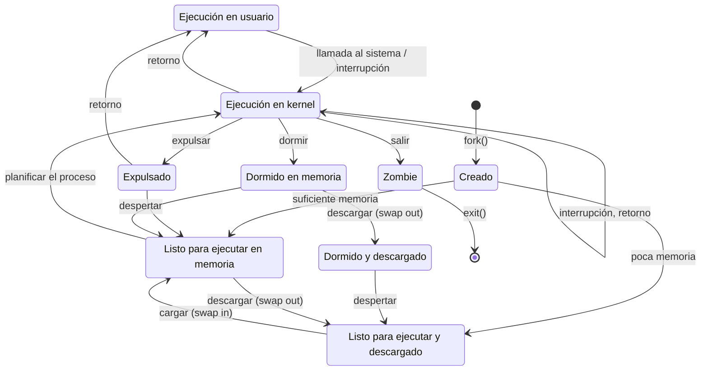
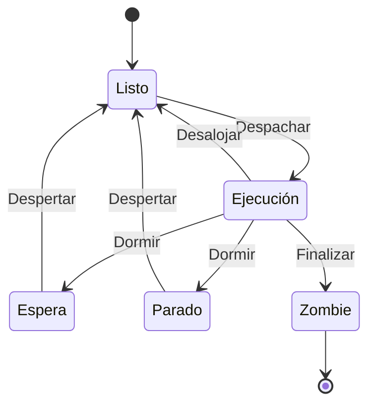
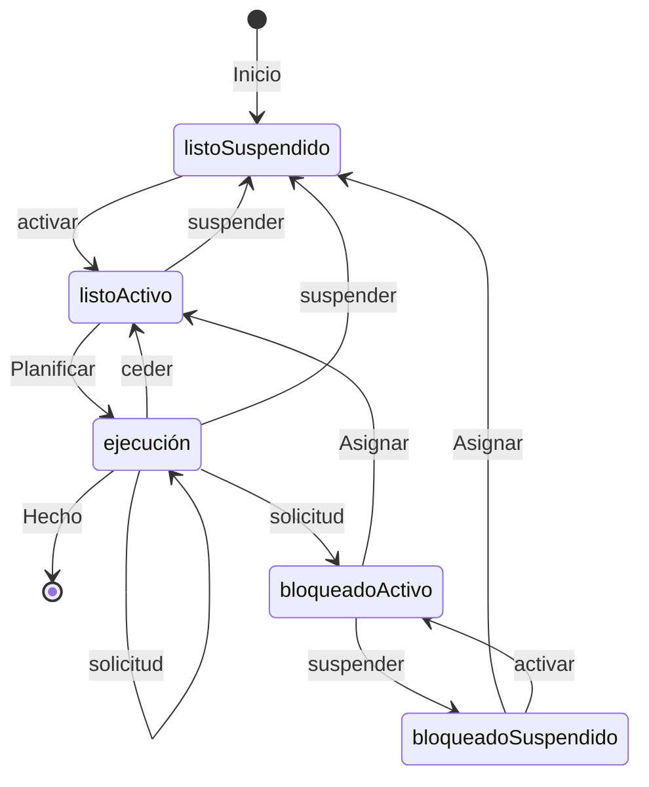
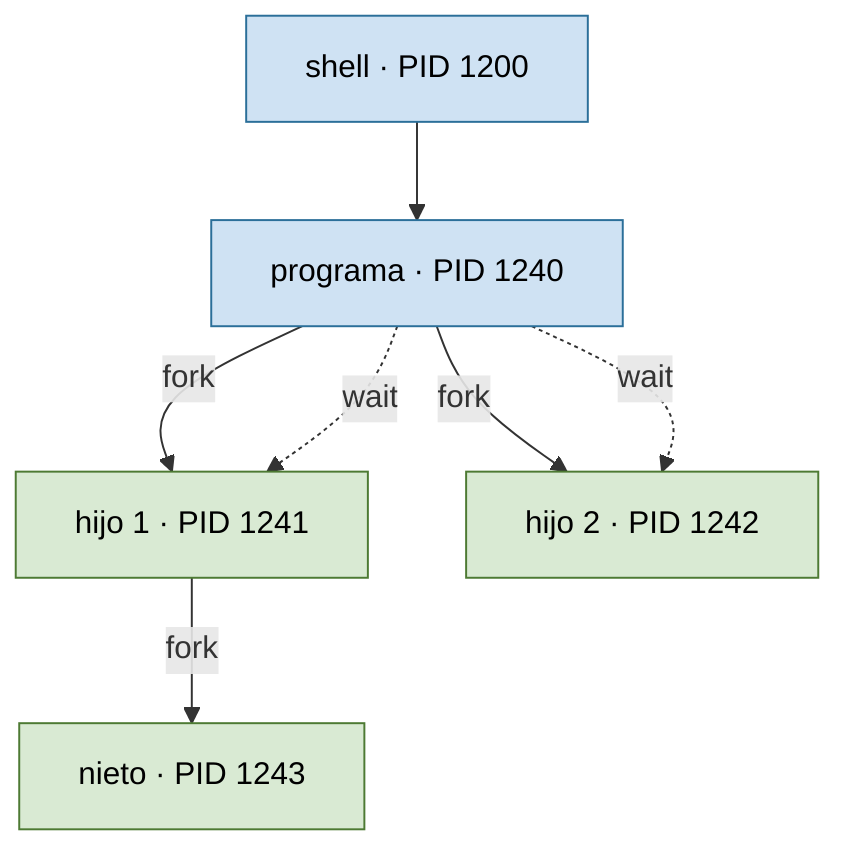

# Tema 3 material adicional

## Estados de un proceso en UNIX

| Estado | Descripción |
|--------|-------------|
| **Preparado (R)** | Listo para ejecutarse; espera a que el SO le asigne tiempo de CPU. |
| **Ejecutando (O)** | Solo uno de los procesos preparados se ejecuta en cada momento (monoprocesador). |
| **Suspendido (S)** | No entra en el reparto de CPU: espera algún evento (por ejemplo, una señal software o hardware). Cuando el evento se produce, pasa a preparado. |
| **Parado (T)** | Tampoco entra en el reparto de CPU. No espera un evento; solo pasará a preparado cuando reciba una señal determinada que le permita continuar. |
| **Zombie (Z)** | Al finalizar, todo proceso avisa a su padre para que elimine su entrada de la tabla de procesos. Si el padre no recibe esa comunicación, el hijo queda en estado zombie: no consume CPU, pero sí sigue consumiendo recursos del sistema. |

El diagrama completo de estados de un proceso en UNIX refleja las transiciones provocadas por `fork()`, `exit()`, las llamadas al sistema, las interrupciones, la expulsión y la carga/descarga (*swapping*) de memoria:



## Hilos y procesos en Linux

- En Linux, el PCB es la estructura `struct task_struct`. Forma parte de una `union task_union` que contiene el PCB y la **pila del kernel** del proceso; ocupa **8 KB**. Con esta estructura el kernel puede determinar el puntero al PCB de un proceso a partir de su puntero de la pila de kernel.
- El conjunto de procesos se representa como una colección de `struct task_struct` enlazadas:
  - como **tabla hash** ordenada por `pid` (para localizar rápidamente una tarea por su `pid` con `find_task_by_pid()`),
  - como **lista circular doblemente enlazada** mediante los punteros `p->next_task` y `p->prev_task` (para navegar por todas las tareas del sistema).

  ```c
  static inline struct task_struct *find_task_by_pid(int pid)
  ```

- Linux usa **la misma estructura** (`task_struct`) para representar un proceso y un hilo.
  - **Ventaja**: se planifica cada hilo como si fuera un proceso.
  - La estructura tiene campos que son punteros al espacio de direcciones del proceso.
  - **Diferencia**: al crear un proceso hijo se copia la memoria del padre en otra dirección y esos punteros apuntan a la nueva; al crear un hilo se **copian los punteros**, de modo que todos los hilos de un proceso comparten exactamente el mismo espacio de direcciones.
  - La sincronización y exclusión mutua del acceso concurrente de los hilos a la memoria del proceso es **responsabilidad del programador**.

Estados de un proceso/hilo en Linux (visión simplificada):



Y el modelo de estados con suspensión (carga/descarga de memoria):



### Creación de procesos: `fork()` / `wait()`

La llamada `fork()` crea un nuevo proceso a partir del actual; desde ese punto, padre e hijo continúan como ejecuciones independientes y pueden a su vez crear más hijos, formando un árbol de procesos.



*La llamada `fork()` crea un nuevo proceso a partir del proceso actual. Desde ese punto, padre e hijo continúan como ejecuciones independientes.*

```c
#include <stdio.h>

main() {
    int pid;
    /* creación de un proceso hijo concurrente con el padre */
    pid = fork();
    if (pid == -1) {
        printf("error en creacion de proceso hijo\n");
        exit(1);
    } else if (pid == 0) {          /* proceso hijo */
        printf("Proceso hijo 1\n");
        /* Resto de instrucciones del hijo */
    } else {                        /* proceso padre */
        printf("Proceso padre\n");
        /* Resto de instrucciones del padre */
        wait(0);
    }
}
```

Un proceso puede obtener su `pid` y el de su padre con:

```c
#include <sys/types.h>
#include <unistd.h>

pid_t getpid(void);
pid_t getppid(void);
```

### Hilos POSIX (*Portable Operating System Interface for uniX*)

Los hilos permiten la ejecución concurrente de varias secuencias de instrucciones asociadas a diferentes funciones dentro de un mismo proceso, compartiendo el espacio de direcciones y las estructuras de datos del kernel.

| Llamada | Función |
|---------|---------|
| `pthread_create` | Crear un hilo |
| `pthread_exit` | Terminar el hilo actual |
| `pthread_kill` | Enviar una señal a un hilo |
| `pthread_join` | Esperar la finalización de un hilo |
| `pthread_self` | Obtener el identificador del hilo actual |

```c
#include <stdio.h>
#include <pthread.h>

main() {
    pthread_t tid;
    int misargs[2];
    void *mifuncion(void *arg);

    printf("Creando hilo...\n");
    misargs[0] = -5;
    misargs[1] = -6;
    pthread_create(&tid, NULL, mifuncion, (void *) misargs);
    printf("Hilo creado. Esperando su finalización...\n");
}
```

```bash
gcc prog.c -lpthread -o prog
```
