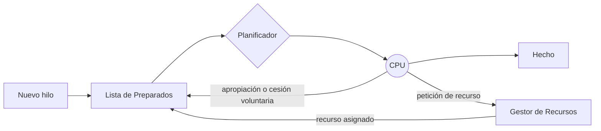
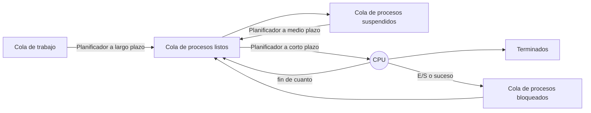
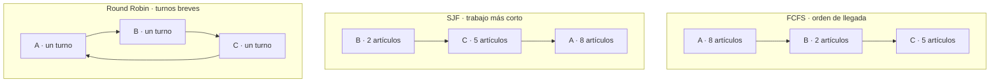
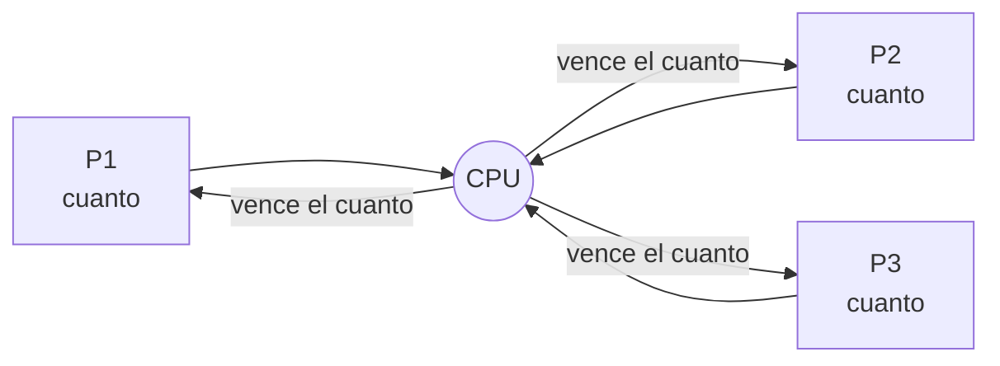
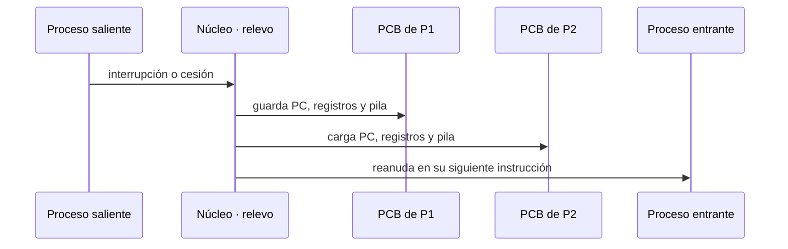
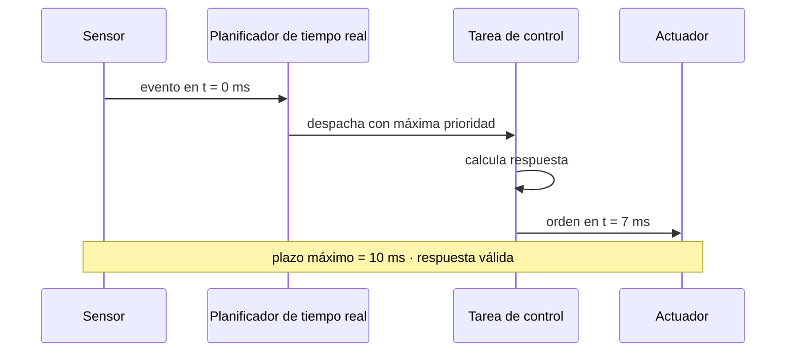

# Tema 3: Planificación de procesos

3.1 Conceptos básicos · 3.2 Criterios de planificación · 3.3 Algoritmos de planificación.

---

## 3.1 Conceptos básicos

Un sistema operativo multiusuario puede cargar en memoria principal varios procesos
simultáneamente (**multiplexación espacial**), con sus hilos, y compartir la CPU mediante
**multiplexación en el tiempo**. Las máquinas abstractas parecen ejecutarse a la vez,
produciéndose un funcionamiento **concurrente** gracias a altas tasas de multiplexación en MP
y CPU. Los sistemas multiprogramados permiten que, mientras un hilo espera por una operación
de E/S, otro hilo ocupe su CPU.

- Se denomina **planificador** (*scheduler*) al mecanismo que elige qué hilos se ejecutan en
  cada instante. Determina las transiciones entre los estados **listo** y **en ejecución**.
- La **política de planificación** determina el instante en el que se debe desalojar a un hilo
  de la CPU y el hilo que lo reemplaza.
- El **mecanismo de planificación** determina cómo el gestor de procesos multiplexa la CPU,
  cómo se asigna la CPU a un hilo y cómo un hilo es desalojado de la CPU.

Las decisiones de planificación pueden producirse en las transiciones:

1. ejecutándose → bloqueado,
2. ejecutándose → preparado,
3. bloqueado → preparado,
4. ejecutándose → finalizado.

La planificación se produce **siempre que un proceso abandona la CPU** o **se inserta un
proceso en la cola de preparados**.



Sucesos que disparan la planificación: solicitud de E/S (el proceso pasa a la cola de E/S),
fin de la porción de tiempo, creación de un hijo, fin del hijo, o una interrupción.

### Cesión de la CPU

Un proceso puede **ceder voluntariamente** el control de la CPU, o **verse obligado** por el
planificador a cederlo a otro proceso.

- Si cede voluntariamente, es él quien invoca explícita y periódicamente al planificador.
- Si el planificador obliga, se emplea un **temporizador de intervalo**.
- Un **planificador apropiativo** (*preemptivo*) es aquel que puede obligar a un proceso a
  ceder el control de la CPU a otro.

La selección del proceso a ejecutar se realiza en función de **prioridades**: cada nivel de
prioridad da lugar a una jerarquía de colas. Los procesos de tiempo real tienen prioridad
frente al resto; los procesos de sistema tienen preferencia sobre los de usuario. Es posible
establecer la prioridad de un proceso e incluso modificarla durante su ejecución.

### Cambio de contexto

- **Causas**: invocación de una llamada al sistema (paso de modo usuario a modo supervisor);
  una interrupción hardware, error en el bus, error de segmentación, excepción de coma
  flotante o de división por cero; un proceso pasa voluntariamente a suspendido porque espera
  un recurso; el kernel interrumpe el proceso actual por exigencia del planificador.
- En un cambio de contexto se debe: almacenar el estado del proceso saliente, cargar el estado
  del entrante y acceder a los registros generales y de estado. Implica una **doble operación
  de cambio** (procesos entrante y saliente).

<svg xmlns="http://www.w3.org/2000/svg" viewBox="0 0 760 400" font-family="sans-serif" font-size="14" role="img" aria-label="La CPU guarda sus registros en el descriptor del hilo saliente y carga los del hilo entrante">
  <rect width="760" height="400" fill="#ffffff"/>
  <rect x="40" y="90" width="240" height="220" fill="#dbeafe" stroke="#2563a6" stroke-width="1.5"/>
  <text x="160" y="115" text-anchor="middle" font-size="16" font-weight="bold">CPU</text>
  <g fill="#eff6ff" stroke="#2563a6">
    <rect x="110" y="135" width="100" height="30"/>
    <rect x="110" y="165" width="100" height="30"/>
    <rect x="110" y="195" width="100" height="30"/>
    <rect x="110" y="225" width="100" height="30"/>
  </g>
  <text x="160" y="285" text-anchor="middle" font-size="12">registros (PC, SP, …)</text>
  <rect x="470" y="40" width="250" height="140" fill="#f1f5f9" stroke="#475569" stroke-width="1.5"/>
  <text x="595" y="62" text-anchor="middle" font-weight="bold">Descriptor del hilo viejo</text>
  <g fill="#ffffff" stroke="#475569">
    <rect x="520" y="75" width="150" height="22"/><rect x="520" y="97" width="150" height="22"/>
    <rect x="520" y="119" width="150" height="22"/><rect x="520" y="141" width="150" height="22"/>
  </g>
  <rect x="470" y="220" width="250" height="140" fill="#f1f5f9" stroke="#475569" stroke-width="1.5"/>
  <text x="595" y="242" text-anchor="middle" font-weight="bold">Descriptor del hilo nuevo</text>
  <g fill="#ffffff" stroke="#475569">
    <rect x="520" y="255" width="150" height="22"/><rect x="520" y="277" width="150" height="22"/>
    <rect x="520" y="299" width="150" height="22"/><rect x="520" y="321" width="150" height="22"/>
  </g>
  <path d="M 215 150 C 350 90, 380 90, 512 105" fill="none" stroke="#2563a6" stroke-width="3"/>
  <path d="M 512 105 l -12 -3 l 4 9 z" fill="#2563a6"/>
  <text x="360" y="80" text-anchor="middle" fill="#2563a6" font-size="13">guardar contexto</text>
  <path d="M 512 300 C 380 320, 350 320, 215 245" fill="none" stroke="#1d7a3c" stroke-width="3"/>
  <path d="M 215 245 l 12 2 l -5 -9 z" fill="#1d7a3c"/>
  <text x="360" y="345" text-anchor="middle" fill="#1d7a3c" font-size="13">restaurar contexto</text>
  <text x="160" y="345" text-anchor="middle" font-size="15" font-weight="bold">Cambio de contexto</text>
</svg>

El tiempo de cambio de contexto se puede modelar como:

```text
t_camCont ≈ 2 · (#regGen + #regEst) · #almReg · t_insAlm
```

- `t_camCont`: tiempo de cambio de contexto.
- `#regGen`: número de registros de tipo general.
- `#regEst`: número de registros de estado.
- `#almReg`: número de operaciones de almacenamiento para guardar un registro.
- `t_insAlm`: tiempo empleado en una instrucción de almacenamiento.

## 3.2 Criterios de planificación

En los sistemas de tiempo compartido a veces es necesario desalojar procesos de la CPU e
introducir otros (**intercambio**).

### Niveles de planificación

| Planificador | Función | Frecuencia |
|--------------|---------|------------|
| **A corto plazo** (planificador de la CPU / *dispatcher*) | Selecciona un proceso de la cola de preparados y le asigna la CPU. Trabaja con la cola de preparados. | Muy frecuente ⇒ debe ser rápido. |
| **A medio plazo** | Libera temporalmente la MP y rebaja el grado de multiprogramación; se encarga de devolver los procesos a memoria. | Intermedia. |
| **A largo plazo** (planificador de trabajos) | Selecciona nuevos procesos y los carga en MP para su ejecución. Controla el grado de multiprogramación, de modo que la tasa promedio de procesos entrantes sea igual a la de salientes (equilibrio en las colas). | Poco frecuente ⇒ puede ser más lento. |



### El dispatcher

El **despachador** (*dispatcher*) es el módulo del SO que cede el control de la CPU al proceso
seleccionado por el planificador a corto plazo. Implica: **cambio de contexto** (en modo
supervisor), **conmutación a modo usuario** y **salto** a la posición de memoria adecuada del
programa para su reanudación.

Las decisiones de planificación a corto plazo se deben a: (1) un proceso finaliza, (2) un
proceso se bloquea, (3) un proceso agota su cuanto (ejecutándose → ejecutable), (4) un suceso
cambia un proceso de bloqueado a ejecutable, (5) se crea un proceso.

### Tipos de planificación

**Según el tipo de proceso:**

- **Limitados por E/S / procesos cortos**: dedican más tiempo a E/S que a cómputo; muchas
  ráfagas de CPU cortas y largos periodos de espera; la cola de preparados estará casi siempre
  vacía y el planificador a corto plazo tendrá poco que hacer.
- **Limitados por CPU / procesos largos**: dedican más tiempo a cómputo que a E/S; pocas
  ráfagas de CPU pero largas; la cola de E/S estará casi siempre vacía y el sistema estará
  desequilibrado.

**Según la apropiación:**

- **No apropiativa (sin desplazamiento)**: una vez asignado el procesador a un proceso, no se
  le puede retirar hasta que voluntariamente lo deje, finalice o se bloquee.
- **Apropiativa (con desplazamiento)**: el SO puede apropiarse del procesador cuando lo
  decida.

## 3.3 Algoritmos de planificación

### Criterios de evaluación

- **Utilización**: mantener la CPU tan ocupada como sea posible.
- **Productividad**: maximizar el número de procesos que completan su ejecución por unidad de
  tiempo.
- **Tiempo de retorno**: minimizar el tiempo necesario para ejecutar un proceso dado.
- **Tiempo de espera**: minimizar el tiempo que un proceso ha estado esperando en la cola de
  preparados.
- **Tiempo de respuesta**: minimizar el tiempo desde que se remite una solicitud hasta que se
  produce la primera respuesta (no confundir con su finalización).

### FCFS — *first come, first served* (primero en llegar, primero en ser atendido)

- La CPU se asigna en el orden en el que llegan las solicitudes de los hilos/procesos.
- No suele usarse por sus bajas prestaciones para hilos con prioridad.
- Fácil de implementar.

### SJN / SJF — *shortest job next / first* (primero el trabajo más corto)

- La CPU se asigna al hilo/proceso que requiere un menor tiempo de servicio.
- Requiere conocer de antemano la duración de un proceso.
- Minimiza el tiempo medio de espera (sirve primero los procesos más cortos); **es óptimo**:
  proporciona el mínimo tiempo medio de espera. Alto rendimiento.
- **No es apropiativo**. No es válido para tiempo compartido.
- Penaliza a los procesos de mayor tiempo de servicio y puede provocarles **inanición**.

### SRJF — *shortest remaining job first* (el trabajo al que menos resta para concluir)

- La CPU se asigna al hilo/proceso al que le resta menos tiempo de servicio para concluir.
- Requiere conocer de antemano la duración de un proceso.
- Minimiza el tiempo medio de espera. **Es apropiativo**. Alto rendimiento.
- Penaliza a los procesos con mayor tiempo de servicio restante y puede provocarles inanición.

### Planificación por prioridad

- Se asigna la CPU a los hilos/procesos en función de su **prioridad** (mayor cuanto menor es
  el valor asignado).
- Las prioridades pueden ser **estáticas** o **dinámicas**.
- Se asigna la CPU al proceso con mayor prioridad. Puede ser apropiativo o no apropiativo.
- Se puede emplear para evitar la **inanición** de SJF. Solución: **envejecimiento**
  (*aging*): a medida que avanza el tiempo se incrementa la prioridad del proceso. Se pueden
  emplear **colas de niveles múltiples**.

### Planificación por tiempo límite

- Propia de los sistemas de tiempo real: ciertos hilos/procesos deben completarse antes de un
  tiempo límite.
- Un proceso se admite en la cola de preparados si, y solo si, el planificador puede
  **garantizar la ejecución** de todos los procesos preparados en el tiempo límite fijado.
- Se emplea para evitar latencias en aplicaciones de audio y vídeo y prevenir cortes de
  servicio (VoIP, sensores, grabación de CD). Se usan hilos/procesos en primer y segundo
  plano.

### Round Robin (RR) o turno rotatorio

- Es la planificación más empleada para **tiempo compartido**; busca la asignación equitativa
  de la CPU. Es la típica de un sistema multiprogramado interactivo.
- El rendimiento puede ser bajo si el cuanto es extremadamente pequeño.
- **No hay posibilidad de inanición.**
- Según la implementación: al finalizar un proceso sin agotar su cuanto, el siguiente lo añade
  a su tiempo de ejecución o simplemente se corre el turno; los procesos nuevos se introducen
  en una **cola** o en un **anillo**, lo que hace que se ejecuten antes o después que el
  resto.

### Colas múltiples con y sin realimentación

- Es la planificación **más completa**.
- La asignación de cola se realiza en función de la prioridad.
- Se evita la inanición promocionando de nivel por **envejecimiento**.
- La cola de preparados se divide en varias colas y cada proceso se asigna **permanentemente**
  a una cola concreta.
- Cada cola puede tener su propio algoritmo de planificación.
- Requiere una **planificación entre colas**.

### Planificación en sistemas multiprocesador

- **Distribución de carga**: se reparte la carga entre CPUs para no tener ninguna ociosa.
- **Equilibrio de carga**: se reparte uniformemente la carga entre las CPUs.

### Métricas de planificación

Máxima utilización · máxima productividad · mínimo tiempo de retorno · mínimo tiempo de
respuesta · mínimo tiempo de espera.

Las políticas se comportan de distinta manera según la clase de procesos: **ninguna política
es completamente satisfactoria**; cualquier mejora en una clase de procesos es a expensas de
perder eficiencia en otra.

---

## Planificación clásica en UNIX

- **Prioridades**: solo están en las colas los procesos cargados en memoria. Los procesos en
  modo usuario tienen prioridades **positivas**; los procesos en modo kernel, prioridades
  **negativas** (más prioritarios).
- **Algoritmo a corto plazo**: múltiples colas, cada una con su prioridad; se busca el primer
  proceso de la cola más prioritaria y se le da un cuanto (100 ms); si lo agota, se pone al
  final de la misma cola; si se bloquea antes, se pone en otra cola (de espera, no de
  planificación).
- **Algoritmo a largo plazo**: cada *tick* de reloj se anota quién está en la CPU; cada
  segundo se recalculan las prioridades; las cantidades de CPU acumuladas se dividen por dos;
  nueva prioridad = antigua + cantidad de CPU acumulada.
- Basada en **colas multinivel realimentadas**. Prioridades en el rango **−64 a 63** (menor
  número ⇒ mayor prioridad); las negativas se reservan para procesos a la espera en modo
  supervisor (recién despertados por una interrupción de sus manejadores).
- Duración del cuanto: **0,1 s**, valor empírico que es la mayor duración sin afectar al
  tiempo de respuesta de tareas interactivas. A menor cuanto, mejor respuesta interactiva; a
  mayor cuanto, mejor aprovechamiento de la CPU (menos cambios de contexto y menos accesos a
  la caché).
- Dos valores en el PCB: **`p_cpu`** (estimación del uso más reciente de la CPU; se incrementa
  cada ciclo de reloj en que el proceso está funcionando; se ajusta una vez por segundo) y
  **`p_nice`** (margen de modificación de la prioridad de que dispone el usuario, entre −20 y
  20; por defecto 0; valores negativos incrementan la prioridad, positivos la decrementan).
- La prioridad se calcula periódicamente: `prioridad = base + p_cpu + p_nice`, y el proceso se
  traslada a la cola de listos correspondiente.

## Planificación clásica en Linux

- Algoritmo basado en **prioridad simple**.
- Dos tipos de procesos: **normal** y **real time**. Los *real time* se ejecutan antes que los
  normales y suelen usar disciplinas *round robin* o FIFO.
- Planificación **preemptiva**. Cada proceso tiene asignada una ventana temporal de **200 ms**.

### Herramientas para la gestión de procesos

`accton` (activa/desactiva la contabilidad de procesos) · `kill` (mata un proceso por su pid)
· `killall` (envía una señal a un proceso por nombre) · `lastcomm` (información de comandos
previos, en orden inverso; requiere contabilidad activada) · `nice` (fija la prioridad de los
procesos nuevos) · `ps` (estado de uno o más procesos) · `pstree` (árbol de procesos en
ejecución) · `renice` (cambia la prioridad de un proceso en ejecución) · `sa` (resumen de
información) · `skill` / `snice` (informan del estado de procesos) · `top` (procesos que más
CPU consumen).

## Planificación clásica en Windows

- Duración estándar de un cuanto en Windows NT: **2 ciclos de reloj**; en NT Server: **12**.
  Si un proceso de prioridad normal alcanza la ventana de ejecución, sus hilos pueden obtener
  un cuanto de mayor duración. En Windows 2000 se puede modificar el tamaño del cuanto tanto
  en Workstation como en Server.
- **Thread scheduling**: **32 colas** (listas FIFO) de hilos listos, una por nivel de
  prioridad, comunes a todas las CPUs. Cuando un hilo pasa a listo, se ejecuta inmediatamente
  o se introduce en la cola según su prioridad. En monoprocesador, los hilos listos de mayor
  prioridad se ejecutan con *round robin*.
- Los procesos reciben su prioridad al crearse (**Normal** por defecto). Tipos: **Idle, Below
  Normal, Normal, Above Normal, High, Realtime**. En Windows 2000 el planificador trabaja con
  **hilos**, no con procesos; los hilos tienen prioridades entre **0 y 31**.

**Estados de los hilos en Windows:**

| Estado | Descripción |
|--------|-------------|
| **Init** | Hilo en creación. |
| **Ready** | Hilo seleccionable por el planificador para su ejecución. |
| **Running** | Hilo en ejecución. |
| **Standby** | Hilo seleccionado para su ejecución en la CPU. |
| **Terminate** | El hilo ha concluido su código pero debe esperar a que se cierren todas las referencias a él. |
| **Waiting** | El hilo espera por uno o más recursos tras un cambio voluntario. |
| **Transition** | El hilo estaba a la espera, alcanzada desde el modo usuario, desde hace más de 12 segundos. |

**Prioridades de Windows 2000** (valor de prioridad del hilo según la clase de prioridad del
proceso y el nivel de prioridad relativo del hilo):

| Nivel del hilo | real-time | high | above normal | normal | below normal | idle priority |
|---|---|---|---|---|---|---|
| time-critical | 31 | 15 | 15 | 15 | 15 | 15 |
| highest | 26 | 15 | 12 | 10 | 8 | 6 |
| above normal | 25 | 14 | 11 | 9 | 7 | 5 |
| normal | 24 | 13 | 10 | 8 | 6 | 4 |
| below normal | 23 | 12 | 9 | 7 | 5 | 3 |
| lowest | 22 | 11 | 8 | 6 | 4 | 2 |
| idle | 16 | 1 | 1 | 1 | 1 | 1 |

El estado del sistema se puede observar con el **Administrador de tareas** (pestañas
*Procesos*, *Rendimiento*, *Detalles*) y el **Monitor de recursos**.

## Planificación en macOS X

Utiliza una **cola realimentada de múltiples niveles** con cuatro niveles de prioridad:
*normal*, *system high priority*, *kernel mode only* y *real-time*.

---

## Galería visual complementaria

### T04.1 · La CPU como una única pista de aterrizaje


*El planificador decide qué proceso preparado recibe la CPU. La política elegida afecta al
rendimiento, la espera y el tiempo de respuesta. Ilustración generada para estos apuntes.*

### T04.2 · Tres políticas en la cola de una tienda



*FCFS respeta el orden de llegada, SJF favorece los trabajos cortos y Round Robin reparte la CPU
en cuantos de tiempo.*

### T04.3 · Round Robin como carrusel



*Round Robin evita que un proceso monopolice la CPU. Cada proceso dispone de un intervalo
limitado antes de ceder el turno.*

### T04.4 · Cambio de contexto como relevo



*Para sustituir un proceso, el núcleo guarda su contexto y restaura el de otro. Durante ese
tiempo la CPU administra la ejecución, pero no avanza en el trabajo de las aplicaciones.*

### T04.5 · Planificación con fecha límite



*En aplicaciones de tiempo real, una respuesta correcta que llega después del plazo puede resultar
inútil o peligrosa.*

---

## Material gráfico

Todos los diagramas del Tema 3 están replicados como mermaid, SVG o tabla dentro de este
documento (flujo de planificación, niveles de planificador, cambio de contexto, tabla de
prioridades de Windows 2000). Las capturas de pantalla del Administrador de tareas y del
Monitor de recursos de Windows se omiten. No queda material fotográfico pendiente.
