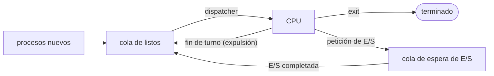

# Planificación de procesos

## Contenidos

- Conceptos básicos: multiplexación espacial (varios procesos en MP) y temporal (CPU).
  Concurrencia. Ráfagas de CPU y de E/S.
- Planificador a corto, medio y largo plazo. Despachador (*dispatcher*).
- Criterios de planificación: uso de CPU, productividad (*throughput*), tiempo de retorno,
  tiempo de espera, tiempo de respuesta.
- Planificación apropiativa y no apropiativa.
- Algoritmos de planificación: FCFS, SJF/SRTF, Round Robin, por prioridades,
  colas multinivel y colas multinivel con realimentación.

## Colas de planificación

Colas multinivel con realimentación: un proceso que agota su turno baja de nivel (turnos
más largos, menor prioridad); uno que se bloquea por E/S sube.

## Material

_(pendiente de añadir)_
