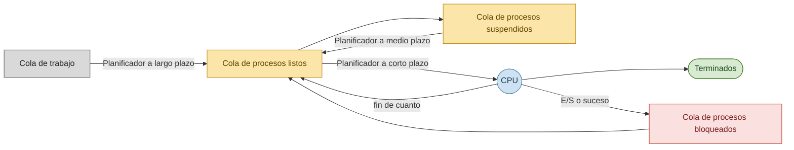

# Tema 3 material adicional

## Criterios de planificación

En los sistemas de tiempo compartido a veces es necesario desalojar procesos de la CPU e introducir otros (**intercambio**).

### Niveles de planificación

| Planificador | Función | Frecuencia |
|--------------|---------|------------|
| **A corto plazo** (planificador de la CPU / *dispatcher*) | Selecciona un proceso de la cola de preparados y le asigna la CPU. Trabaja con la cola de preparados. | Muy frecuente ⇒ debe ser rápido. |
| **A medio plazo** | Libera temporalmente la MP y rebaja el grado de multiprogramación; se encarga de devolver los procesos a memoria. | Intermedia. |
| **A largo plazo** (planificador de trabajos) | Selecciona nuevos procesos y los carga en MP para su ejecución. Controla el grado de multiprogramación, de modo que la tasa promedio de procesos entrantes sea igual a la de salientes (equilibrio en las colas). | Poco frecuente ⇒ puede ser más lento. |

### El dispatcher

El **despachador** (*dispatcher*) es el módulo del SO que cede el control de la CPU al proceso seleccionado por el planificador a corto plazo. Implica: **cambio de contexto** (en modo supervisor), **conmutación a modo usuario** y **salto** a la posición de memoria adecuada del programa para su reanudación.

Las decisiones de planificación a corto plazo se deben a: (1) un proceso finaliza, (2) un proceso se bloquea, (3) un proceso agota su cuanto (ejecutándose → ejecutable), (4) un suceso cambia un proceso de bloqueado a ejecutable, (5) se crea un proceso.

### Tipos de planificación

**Según el tipo de proceso:**

- **Limitados por E/S / procesos cortos**: dedican más tiempo a E/S que a cómputo; muchas ráfagas de CPU cortas y largos periodos de espera; la cola de preparados estará casi siempre vacía y el planificador a corto plazo tendrá poco que hacer.
- **Limitados por CPU / procesos largos**: dedican más tiempo a cómputo que a E/S; pocas ráfagas de CPU pero largas; la cola de E/S estará casi siempre vacía y el sistema estará desequilibrado.

**Según la apropiación:**

- **No apropiativa (sin desplazamiento)**: una vez asignado el procesador a un proceso, no se le puede retirar hasta que voluntariamente lo deje, finalice o se bloquee.
- **Apropiativa (con desplazamiento)**: el SO puede apropiarse del procesador cuando lo decida.

## Otros criterios y algoritmos

### Criterios de evaluación

- **Utilización**: mantener la CPU tan ocupada como sea posible.
- **Productividad**: maximizar el número de procesos que completan su ejecución por unidad de tiempo.
- **Tiempo de retorno**: minimizar el tiempo necesario para ejecutar un proceso dado.
- **Tiempo de espera**: minimizar el tiempo que un proceso ha estado esperando en la cola de preparados.
- **Tiempo de respuesta**: minimizar el tiempo desde que se remite una solicitud hasta que se produce la primera respuesta (no confundir con su finalización).

Como en la cola de una tienda: FCFS respeta el orden de llegada, SJF deja pasar primero al que lleva menos artículos y Round Robin atiende a todos por turnos breves.

```mermaid
flowchart TB
    subgraph F["FCFS · orden de llegada"]
        F1["A · 8 artículos"] --> F2["B · 2 artículos"] --> F3["C · 5 artículos"]
    end
    subgraph S["SJF · trabajo más corto"]
        S1["B · 2 artículos"] --> S2["C · 5 artículos"] --> S3["A · 8 artículos"]
    end
    subgraph R["Round Robin · turnos breves"]
        R1["A · un turno"] --> R2["B · un turno"] --> R3["C · un turno"] --> R1
    end

    classDef clienteA fill:#cfe2f3,stroke:#2b6f99,color:#1b3a4b;
    classDef clienteB fill:#d9ead3,stroke:#38761d,color:#1b4d1b;
    classDef clienteC fill:#fce5a8,stroke:#b8860b,color:#5c4600;
    class F1,S3,R1 clienteA;
    class F2,S1,R2 clienteB;
    class F3,S2,R3 clienteC;
    style F fill:none,stroke-dasharray: 5 5;
    style S fill:none,stroke-dasharray: 5 5;
    style R fill:none,stroke-dasharray: 5 5;
```

*FCFS respeta el orden de llegada, SJF favorece los trabajos cortos y Round Robin reparte la CPU en cuantos de tiempo.*

### FCFS — *first come, first served* (primero en llegar, primero en ser atendido)

- La CPU se asigna en el orden en el que llegan las solicitudes de los hilos/procesos.
- No suele usarse por sus bajas prestaciones para hilos con prioridad.
- Fácil de implementar.

### SJN / SJF — *shortest job next / first* (primero el trabajo más corto)

- La CPU se asigna al hilo/proceso que requiere un menor tiempo de servicio.
- Requiere conocer de antemano la duración de un proceso.
- Minimiza el tiempo medio de espera (sirve primero los procesos más cortos); **es óptimo**: proporciona el mínimo tiempo medio de espera. Alto rendimiento.
- **No es apropiativo**. No es válido para tiempo compartido.
- Penaliza a los procesos de mayor tiempo de servicio y puede provocarles **inanición**.

### SRJF — *shortest remaining job first* (el trabajo al que menos resta para concluir)

- La CPU se asigna al hilo/proceso al que le resta menos tiempo de servicio para concluir.
- Requiere conocer de antemano la duración de un proceso.
- Minimiza el tiempo medio de espera. **Es apropiativo**. Alto rendimiento.
- Penaliza a los procesos con mayor tiempo de servicio restante y puede provocarles inanición.

## Colas múltiples y multiprocesador

### Colas múltiples con y sin realimentación

- Es la planificación **más completa**.
- La asignación de cola se realiza en función de la prioridad.
- Se evita la inanición promocionando de nivel por **envejecimiento**.
- La cola de preparados se divide en varias colas y cada proceso se asigna **permanentemente** a una cola concreta.
- Cada cola puede tener su propio algoritmo de planificación.
- Requiere una **planificación entre colas**.

### Planificación en sistemas multiprocesador

- **Distribución de carga**: se reparte la carga entre CPUs para no tener ninguna ociosa.
- **Equilibrio de carga**: se reparte uniformemente la carga entre las CPUs.

### Métricas de planificación

Máxima utilización · máxima productividad · mínimo tiempo de retorno · mínimo tiempo de respuesta · mínimo tiempo de espera.

Las políticas se comportan de distinta manera según la clase de procesos: **ninguna política es completamente satisfactoria**; cualquier mejora en una clase de procesos es a expensas de perder eficiencia en otra.

## Planificación clásica en UNIX

- **Prioridades**: solo están en las colas los procesos cargados en memoria. Los procesos en modo usuario tienen prioridades **positivas**; los procesos en modo kernel, prioridades **negativas** (más prioritarios).
- **Algoritmo a corto plazo**: múltiples colas, cada una con su prioridad; se busca el primer proceso de la cola más prioritaria y se le da un cuanto (100 ms); si lo agota, se pone al final de la misma cola; si se bloquea antes, se pone en otra cola (de espera, no de planificación).
- **Algoritmo a largo plazo**: cada *tick* de reloj se anota quién está en la CPU; cada segundo se recalculan las prioridades; las cantidades de CPU acumuladas se dividen por dos; nueva prioridad = antigua + cantidad de CPU acumulada.
- Basada en **colas multinivel realimentadas**. Prioridades en el rango **−64 a 63** (menor número ⇒ mayor prioridad); las negativas se reservan para procesos a la espera en modo supervisor (recién despertados por una interrupción de sus manejadores).
- Duración del cuanto: **0,1 s**, valor empírico que es la mayor duración sin afectar al tiempo de respuesta de tareas interactivas. A menor cuanto, mejor respuesta interactiva; a mayor cuanto, mejor aprovechamiento de la CPU (menos cambios de contexto y menos accesos a la caché).
- Dos valores en el PCB: **`p_cpu`** (estimación del uso más reciente de la CPU; se incrementa cada ciclo de reloj en que el proceso está funcionando; se ajusta una vez por segundo) y **`p_nice`** (margen de modificación de la prioridad de que dispone el usuario, entre −20 y 20; por defecto 0; valores negativos incrementan la prioridad, positivos la decrementan).
- La prioridad se calcula periódicamente: `prioridad = base + p_cpu + p_nice`, y el proceso se traslada a la cola de listos correspondiente.

## Planificación clásica en Linux

- Algoritmo basado en **prioridad simple**.
- Dos tipos de procesos: **normal** y **real time**. Los *real time* se ejecutan antes que los normales y suelen usar disciplinas *round robin* o FIFO.
- Planificación **preemptiva**. Cada proceso tiene asignada una ventana temporal de **200 ms**.

### Herramientas para la gestión de procesos

`accton` (activa/desactiva la contabilidad de procesos) · `kill` (mata un proceso por su pid) · `killall` (envía una señal a un proceso por nombre) · `lastcomm` (información de comandos previos, en orden inverso; requiere contabilidad activada) · `nice` (fija la prioridad de los procesos nuevos) · `ps` (estado de uno o más procesos) · `pstree` (árbol de procesos en ejecución) · `renice` (cambia la prioridad de un proceso en ejecución) · `sa` (resumen de información) · `skill` / `snice` (informan del estado de procesos) · `top` (procesos que más CPU consumen).

## Planificación clásica en Windows

- Duración estándar de un cuanto en Windows NT: **2 ciclos de reloj**; en NT Server: **12**. Si un proceso de prioridad normal alcanza la ventana de ejecución, sus hilos pueden obtener un cuanto de mayor duración. En Windows 2000 se puede modificar el tamaño del cuanto tanto en Workstation como en Server.
- **Thread scheduling**: **32 colas** (listas FIFO) de hilos listos, una por nivel de prioridad, comunes a todas las CPUs. Cuando un hilo pasa a listo, se ejecuta inmediatamente o se introduce en la cola según su prioridad. En monoprocesador, los hilos listos de mayor prioridad se ejecutan con *round robin*.
- Los procesos reciben su prioridad al crearse (**Normal** por defecto). Tipos: **Idle, Below Normal, Normal, Above Normal, High, Realtime**. En Windows 2000 el planificador trabaja con **hilos**, no con procesos; los hilos tienen prioridades entre **0 y 31**.

**Estados de los hilos en Windows:**

| Estado | Descripción |
|--------|-------------|
| **Init** | Hilo en creación. |
| **Ready** | Hilo seleccionable por el planificador para su ejecución. |
| **Running** | Hilo en ejecución. |
| **Standby** | Hilo seleccionado para su ejecución en la CPU. |
| **Terminate** | El hilo ha concluido su código pero debe esperar a que se cierren todas las referencias a él. |
| **Waiting** | El hilo espera por uno o más recursos tras un cambio voluntario. |
| **Transition** | El hilo estaba a la espera, alcanzada desde el modo usuario, desde hace más de 12 segundos. |

**Prioridades de Windows 2000** (valor de prioridad del hilo según la clase de prioridad del proceso y el nivel de prioridad relativo del hilo):

| Nivel del hilo | real-time | high | above normal | normal | below normal | idle priority |
|---|---|---|---|---|---|---|
| time-critical | 31 | 15 | 15 | 15 | 15 | 15 |
| highest | 26 | 15 | 12 | 10 | 8 | 6 |
| above normal | 25 | 14 | 11 | 9 | 7 | 5 |
| normal | 24 | 13 | 10 | 8 | 6 | 4 |
| below normal | 23 | 12 | 9 | 7 | 5 | 3 |
| lowest | 22 | 11 | 8 | 6 | 4 | 2 |
| idle | 16 | 1 | 1 | 1 | 1 | 1 |

El estado del sistema se puede observar con el **Administrador de tareas** (pestañas *Procesos*, *Rendimiento*, *Detalles*) y el **Monitor de recursos**.

## Planificación en macOS X

Utiliza una **cola realimentada de múltiples niveles** con cuatro niveles de prioridad: *normal*, *system high priority*, *kernel mode only* y *real-time*.
