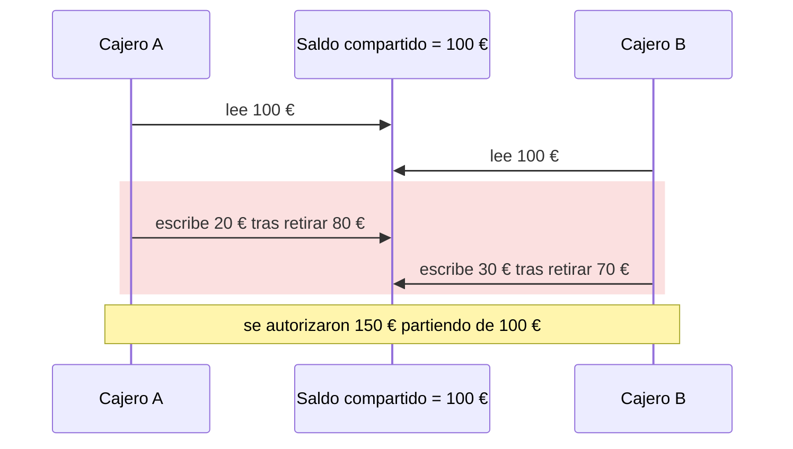
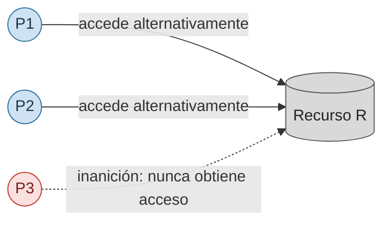
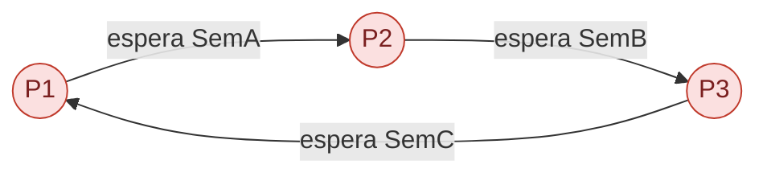

# Tema 4: Sincronización de procesos

4.1 Conceptos básicos · 4.2 Problema de la sección crítica · 4.3 Semáforos · 4.4 Problemas clásicos de sincronización · 4.5 Monitores · 4.6 Interbloqueo.

---

## 4.1 Conceptos básicos

### Recursos del sistema

- **Compartibles**: pueden ser utilizados por varios procesos de forma concurrente. Ejemplo: periféricos, ficheros de solo lectura, zonas de memoria con rutinas puras o datos no modificables.
- **No compartibles**: su uso se restringe a un único proceso en cada instante. Ejemplo: CPU, ficheros de escritura, zonas de memoria sujetas a modificación.

Causas de que un recurso no sea compartible: la naturaleza física del recurso lo hace imposible, o el uso concurrente por varios procesos haría que la acción de uno interfiriera con la de otro.

### Cooperación entre procesos

- La velocidad de un proceso respecto a otro es **impredecible**: depende de la frecuencia de la interrupción asociada a cada uno y de su planificación.
- Un proceso se ejecuta **asíncronamente** respecto a otro. Sin embargo, hay instantes en que los procesos deben **sincronizar** sus actividades: un proceso no puede progresar hasta que otro haya completado algún tipo de actividad. Los procesos también necesitan **comunicarse**.

### Mecanismos de comunicación entre procesos (IPC)

La comunicación entre procesos (*Inter‑Process Communication*) es una función básica de los sistemas operativos: archivo · señal · socket · tubería (*pipe*) · FIFO · memoria compartida · mensajes (MPI, Java RMI, CORBA…) · mapa de memoria · cola de mensajes · puertos.

### Concurrencia

La **concurrencia** o computación concurrente consiste en la ejecución simultánea de varias tareas. Hay que garantizar la correcta secuenciación de las interacciones entre procesos y del acceso a los recursos compartidos.

Se busca garantizar la concurrencia en sistemas operativos con:

- **Multiprogramación**: varios procesos en un sistema monoprocesador.
- **Multiprocesamiento**: varios procesos en un sistema multiprocesador.
- **Procesamiento distribuido**: varios procesos en sistemas de computadores múltiples y distribuidos (ejemplo: *clusters*).

La concurrencia comprende: comunicación entre procesos, compartición y competencia por los recursos, sincronización de la ejecución de varios procesos y asignación del tiempo de procesador.

Puede presentarse en tres contextos: **múltiples aplicaciones** (compartición dinámica del procesador), **aplicaciones estructuradas** (una aplicación como conjunto de procesos concurrentes) y **estructura del sistema operativo** (el propio SO implementado como conjunto de procesos o hilos).

En un sistema monoprocesador multiprogramado los procesos se **intercalan** en el tiempo aparentando ejecución simultánea; no hay procesamiento paralelo y se produce sobrecarga en los intercambios, pero la ejecución intercalada beneficia la estructuración de los programas y la eficiencia. El intercalado y la superposición suponen **procesamiento concurrente** en un monoprocesador.

**Problemas**: la velocidad de ejecución de los procesos no puede predecirse y depende de otros procesos; al SO le resulta difícil gestionar la asignación óptima y la compartición de recursos. Compartir recursos ocasiona problemas ⇒ hay que protegerlos.

**Tareas del SO referentes a la concurrencia**: seguimiento de los procesos activos; asignación y liberación de recursos (tiempo de procesador, memoria, archivos, dispositivos de E/S); protección de datos y recursos de cada proceso frente a injerencias de otros; garantía de la correcta ejecución de un proceso independientemente de la velocidad de los demás.

### Concurrencia vs paralelización

- **Concurrencia**: varios procesos progresan intercalándose en el tiempo sobre (al menos) un procesador.
- **Paralelización**: varios procesos se ejecutan literalmente a la vez, en distintos procesadores.

<svg xmlns="http://www.w3.org/2000/svg" width="560" viewBox="0 0 760 260" font-family="sans-serif" font-size="13" role="img" aria-label="Concurrencia: un procesador alternando dos procesos. Paralelismo: dos procesadores ejecutando un proceso cada uno.">
  <rect width="760" height="260" fill="#ffffff"/>
  <text x="30" y="30" font-size="15" font-weight="bold">Concurrencia (1 CPU)</text>
  <rect x="40"  y="50" width="90" height="34" fill="#57c78a" stroke="#2e7d4f"/><text x="85"  y="72" text-anchor="middle">Proc 1</text>
  <rect x="130" y="50" width="90" height="34" fill="#3f9dd6" stroke="#2b6f99"/><text x="175" y="72" text-anchor="middle" fill="#fff">Proc 2</text>
  <rect x="220" y="50" width="90" height="34" fill="#57c78a" stroke="#2e7d4f"/><text x="265" y="72" text-anchor="middle">Proc 1</text>
  <rect x="310" y="50" width="90" height="34" fill="#3f9dd6" stroke="#2b6f99"/><text x="355" y="72" text-anchor="middle" fill="#fff">Proc 2</text>
  <rect x="400" y="50" width="90" height="34" fill="#57c78a" stroke="#2e7d4f"/><text x="445" y="72" text-anchor="middle">Proc 1</text>
  <line x1="40" y1="100" x2="520" y2="100" stroke="#333"/><path d="M520 96 l8 4 l-8 4 z" fill="#333"/><text x="534" y="104">tiempo</text>
  <text x="30" y="160" font-size="15" font-weight="bold">Paralelismo (2 CPU)</text>
  <rect x="40" y="180" width="440" height="34" fill="#57c78a" stroke="#2e7d4f"/><text x="260" y="202" text-anchor="middle">Proc 1  (CPU A)</text>
  <rect x="40" y="220" width="440" height="34" fill="#3f9dd6" stroke="#2b6f99"/><text x="260" y="242" text-anchor="middle" fill="#fff">Proc 2  (CPU B)</text>
  <line x1="40" y1="264" x2="40" y2="264" stroke="#333"/>
</svg>

### Sincronización entre procesos

Los procesos cooperantes pueden compartir espacios de direcciones o datos a través de un archivo o de un mecanismo de IPC. Problemas a considerar: cómo **evitar la inconsistencia** de los datos compartidos y cómo **acceder a espacios críticos** de código compartido.

**Mecanismos de sincronización entre procesos**: semáforos · monitores · paso de mensajes.

## 4.2 Problema de la sección crítica

### Exclusión mutua

Una condición de carrera aparece cuando el resultado depende del orden imprevisible en que varias ejecuciones acceden a un dato compartido: si dos cajeros leen el mismo saldo de 100 € y cada uno autoriza una retirada, pueden llegar a autorizarse 150 € partiendo de 100 €.



*Una condición de carrera aparece cuando el resultado depende del orden imprevisible en que varias ejecuciones acceden a un dato compartido.*

Cuando un proceso ejecuta la sección crítica, **ningún otro** proceso puede ejecutarla: la ejecución de la sección crítica es **mutuamente exclusiva en el tiempo**. Los recursos no compartibles se protegen del acceso simultáneo evitando que los procesos ejecuten concurrentemente sus secciones críticas. Idear soluciones que garanticen la exclusión mutua es uno de los problemas fundamentales de la programación concurrente.

- Hacer cumplir la exclusión mutua puede provocar **interbloqueo** o **inanición**. Si tres procesos P₁, P₂ y P₃ necesitan un recurso R y el SO concede el acceso alternativamente a P₁ y P₂, puede **negar indefinidamente** el acceso a P₃.



- Los recursos no compartibles a los que dos o más procesos desean acceder simultáneamente se denominan **recursos críticos**. La parte del programa en la que se accede a los recursos críticos es la **sección crítica**.
- El **control de la competencia** involucra al SO, que es quien asigna los recursos. La cooperación puede darse **compartiendo** (procesos que interactúan sin conocerse explícitamente, p. ej. acceso a variables compartidas) o **por comunicación** (paso de mensajes; las primitivas para enviar y recibir las da el lenguaje o el SO).

### Sección crítica

Porción de código de un programa en la que se accede a un recurso compartido (estructura de datos o dispositivo) que **no debe ser accedido por más de un hilo** en ejecución. Se necesita un mecanismo de sincronización en la entrada y salida de la sección crítica; el acceso concurrente se controla vigilando las variables que se modifican dentro y fuera de ella. Solo **un proceso** puede estar en una sección crítica a la vez; el método más común es la **exclusión mutua**.

El mutex se comporta como una única llave: mientras un trabajador la tiene y está en la sección crítica, los demás esperan; cuando la libera, otro puede tomarla.

<svg xmlns="http://www.w3.org/2000/svg" width="560" viewBox="0 0 620 200" font-family="sans-serif" font-size="13" role="img" aria-label="Linea de tiempo: A y B se turnan la unica llave para entrar en la seccion critica">
  <rect width="620" height="200" fill="#ffffff"/>
  <text x="20" y="30" font-weight="bold">Trabajador A</text>
  <rect x="150" y="15" width="180" height="30" fill="#57c78a" stroke="#2e7d4f"/><text x="240" y="35" text-anchor="middle">tiene la llave · SC</text>
  <rect x="330" y="15" width="120" height="30" fill="#eeeeee" stroke="#999"/><text x="390" y="35" text-anchor="middle" fill="#777">espera</text>
  <text x="20" y="90" font-weight="bold">Trabajador B</text>
  <rect x="150" y="75" width="180" height="30" fill="#eeeeee" stroke="#999"/><text x="240" y="95" text-anchor="middle" fill="#777">espera la llave</text>
  <rect x="330" y="75" width="120" height="30" fill="#3f9dd6" stroke="#2b6f99"/><text x="390" y="95" text-anchor="middle" fill="#fff">tiene la llave · SC</text>
  <line x1="150" y1="130" x2="600" y2="130" stroke="#333"/><path d="M600 126 l8 4 l-8 4 z" fill="#333"/><text x="610" y="134" font-size="12">t</text>
  <line x1="330" y1="120" x2="330" y2="140" stroke="#333" stroke-dasharray="3 3"/>
  <text x="330" y="155" text-anchor="middle" font-size="12">A libera la llave</text>
  <text x="240" y="185" text-anchor="middle" font-size="12" fill="#555">la llave (mutex) solo puede estar en una mano: mientras A la tiene, B espera</text>
</svg>

*El mutex garantiza que solo una ejecución entre en la sección crítica. Las demás esperan hasta que el propietario libere el recurso.*

### Condiciones para resolver el problema de la sección crítica

| Condición | Significado |
|-----------|-------------|
| **Exclusión mutua** | Solo un proceso ejecuta la sección crítica en cada instante. |
| **Progresión** | Ordenadamente, todos los procesos pueden ejecutarse y entrar en la SC. |
| **Espera limitada** (viveza) | Una vez que un proceso solicita entrar en la SC, debe hacerlo en un plazo de tiempo determinado. |

La solución se implementa mediante distintos algoritmos; las instrucciones máquina se ejecutan **atómicamente**.

### Requisitos para la exclusión mutua

- Que no haya en ningún momento dos procesos dentro de sus respectivas secciones críticas.
- Que no se hagan suposiciones a priori sobre las velocidades relativas de los procesos ni el número de procesadores disponibles.
- Que ningún proceso fuera de su sección crítica pueda bloquear a otros.
- Que ningún proceso tenga que esperar un intervalo de tiempo arbitrariamente grande para entrar en su sección crítica.

### Conceptos de sincronización

| Concepto | Definición |
|----------|-----------|
| **Condiciones de competencia** | Se presentan cuando dos o más procesos compiten por acceder a un mismo recurso; sin sincronización, al interferirse los cambios puede haber serias inconsistencias. |
| **Exclusión mutua** | La ejecución de las secciones críticas de los procesos es mutuamente exclusiva en el tiempo. |
| **Operaciones atómicas** | Operación que no se interrumpe hasta que finaliza su ejecución. |
| **Sección crítica** | Mientras se ejecuta, hay garantía de que ningún proceso ejecutará a la vez ese código: se comporta como una operación atómica. |
| **Interbloqueo** | Dos o más procesos esperan la ocurrencia de un evento que solo uno de los procesos que esperan puede causar. |
| **Inanición** (bloqueo indefinido) | Los procesos interbloqueados esperan indefinidamente. |

## 4.3 Semáforos

Los **semáforos** son herramientas elementales de sincronización que evitan la **espera activa**. Un semáforo es una zona de memoria compartida que almacena un **entero no negativo** sobre el que solo puede actuarse con:

- **Inicialización**: un semáforo solo puede inicializarse una vez, normalmente al definirlo (`s := x`, con `x` entero no negativo).
- **`wait(s)` / `P()`**: si `s > 0`, decrementa `s` en una unidad; si `s` vale 0, **bloquea** el proceso hasta que otro realice un `signal` sobre `s`. Si hay varios procesos bloqueados, solo uno pasará a listo tras un `signal`, y no se sabe cuál.
- **`signal(s)` / `V()`**: si no hay procesos bloqueados en `s`, incrementa `s` en una unidad; si hay procesos bloqueados (`s` valdrá 0), provoca la transición a listo de uno de ellos.

Definición operacional (con contador con signo `e(s)` y fila de espera `f(s)`):

```text
P(s)                             V(s)
  e(s) = e(s) - 1;                 e(s) = e(s) + 1;
  si e(s) < 0 entonces             si e(s) <= 0 entonces
      estado(p) = bloqueado;           sale(q, f(s));
      entra(p, f(s));                  estado(q) = elegible;
                                       entra(q, f(elegibles));
```

Elementos: un entero `e(s)`, una fila de espera `f(s)` y las dos primitivas `P(s)` y `V(s)` (`wait` y `signal`). Las acciones de `wait` y `signal` son **atómicas**, se ejecutan indivisiblemente. Una zona compartida de memoria no puede ser accedida concurrentemente por más de un proceso si al menos uno la modifica.

### Semáforos de exclusión mutua

Objetivo: proteger el acceso a una fuente única (variable, impresora…). `e(s)` se inicializa a **1**. Todos los procesos deben seguir la misma regla:

```text
P(s)
    < Sección Crítica >
V(s)
```

### Semáforos de sincronización

Objetivo: un proceso debe esperar a otro para continuar (o comenzar) su ejecución. `e(s)` se inicializa a **0**:

```text
Proceso 1                     Proceso 2
    Primer trabajo                P(s)            // espera al proceso 1
    V(s)  // despierta al P2       Segundo trabajo
```

### Interbloqueo con semáforos

`SemA` y `SemB` son dos semáforos de exclusión mutua. Si cada proceso los pide en distinto orden, se produce interbloqueo:

```text
Proceso i                     Proceso j
    ...                           ...
    P(semA);                      P(semB);
    P(semB);                      P(semA);
    < Sección Crítica >           < Sección Crítica >
    V(semB);                      V(semA);
    V(semA);                      V(semB);
```

## 4.4 Problemas clásicos de sincronización

Filósofos comensales · productor‑consumidor · lectores‑escritores.

### Problema de los filósofos comensales

Cinco filósofos se sientan alrededor de una mesa. Cada filósofo alterna `Pensar()` y `Comer()`, y para comer necesita **dos cubiertos** (el de su izquierda y el de su derecha). Hay tantos cubiertos como filósofos y cada cubierto es un **recurso reutilizable**. Hay que modelar el comportamiento de cada filósofo evitando **inaniciones** e **interbloqueos**.

<svg xmlns="http://www.w3.org/2000/svg" viewBox="0 0 420 380" font-family="sans-serif" font-size="14" role="img" aria-label="Cinco filósofos alrededor de una mesa con un cubierto entre cada par de vecinos">
  <rect width="420" height="380" fill="#ffffff"/>
  <circle cx="210" cy="195" r="120" fill="#f4f4f4" stroke="#888"/>
  <!-- filosofos: angulos -90, -18, 54, 126, 198 -->
  <g>
    <circle cx="210" cy="75"  r="26" fill="#ffe14d" stroke="#b59a00"/><text x="210" y="80" text-anchor="middle">φ0</text>
    <circle cx="324" cy="158" r="26" fill="#ffe14d" stroke="#b59a00"/><text x="324" y="163" text-anchor="middle">φ1</text>
    <circle cx="280" cy="292" r="26" fill="#ffe14d" stroke="#b59a00"/><text x="280" y="297" text-anchor="middle">φ2</text>
    <circle cx="140" cy="292" r="26" fill="#ffe14d" stroke="#b59a00"/><text x="140" y="297" text-anchor="middle">φ3</text>
    <circle cx="96"  cy="158" r="26" fill="#ffe14d" stroke="#b59a00"/><text x="96"  y="163" text-anchor="middle">φ4</text>
  </g>
  <!-- cubiertos entre vecinos: angulos -54, 18, 90, 162, 234 -->
  <g stroke="#555" stroke-width="3">
    <line x1="272" y1="98"  x2="288" y2="82"/>
    <line x1="318" y1="222" x2="336" y2="230"/>
    <line x1="210" y1="278" x2="210" y2="300"/>
    <line x1="102" y1="230" x2="84"  y2="238"/>
    <line x1="148" y1="98"  x2="132" y2="82"/>
  </g>
  <text x="210" y="360" text-anchor="middle" font-size="12" fill="#555">— : cubierto compartido por dos filósofos vecinos</text>
</svg>

**Solución 1** (con un semáforo por cubierto):

```text
Filósofo i:
    Pensar();
    P(cubierto[i]);
    P(cubierto[(i + 1) mod 5]);
    Comer();
    V(cubierto[i]);
    V(cubierto[(i + 1) mod 5]);
```

Si **todos** los filósofos toman a la vez su cubierto `i`, hay **interbloqueo**.

<svg xmlns="http://www.w3.org/2000/svg" viewBox="0 0 340 340" font-family="sans-serif" font-size="13" role="img" aria-label="Cinco filosofos numerados en circulo, cada uno conectado al siguiente por el tenedor que comparten">
  <rect width="340" height="340" fill="#ffffff"/>
  <circle cx="170" cy="170" r="120" fill="none" stroke="#ccc" stroke-dasharray="2 4"/>
  <circle cx="170" cy="50"  r="26" fill="#ffe14d" stroke="#b59a00"/><text x="170" y="55" text-anchor="middle">F1</text>
  <circle cx="284" cy="133" r="26" fill="#ffe14d" stroke="#b59a00"/><text x="284" y="138" text-anchor="middle">F2</text>
  <circle cx="240" cy="267" r="26" fill="#ffe14d" stroke="#b59a00"/><text x="240" y="272" text-anchor="middle">F3</text>
  <circle cx="100" cy="267" r="26" fill="#ffe14d" stroke="#b59a00"/><text x="100" y="272" text-anchor="middle">F4</text>
  <circle cx="56"  cy="133" r="26" fill="#ffe14d" stroke="#b59a00"/><text x="56"  y="138" text-anchor="middle">F5</text>
  <g stroke="#555" stroke-width="3">
    <line x1="232" y1="73"  x2="248" y2="57"/>
    <line x1="278" y1="197" x2="296" y2="205"/>
    <line x1="170" y1="253" x2="170" y2="275"/>
    <line x1="62"  y1="205" x2="44"  y2="213"/>
    <line x1="108" y1="73"  x2="92"  y2="57"/>
  </g>
  <text x="170" y="320" text-anchor="middle" font-size="12" fill="#555">cada tenedor (—) es un recurso compartido por dos filósofos vecinos</text>
</svg>

*El problema de los filósofos muestra cómo competir por varios recursos puede causar bloqueo o inanición incluso cuando cada participante sigue una regla aparentemente razonable.*

**Solución 2** (estado por filósofo + `mutex` + un semáforo `s[i]` por filósofo):

```text
Filósofo i:
    Pensar();
    tomar_cubierto(i);
    Comer();
    dejar_cubierto(i);

tomar_cubierto(i):
    P(mutex);
    estado[i] = HAMBRE;
    test(i);
    V(mutex);
    P(s[i]);

dejar_cubierto(i):
    P(mutex);
    estado[i] = PIENSA;
    test(IZQUIERDA);
    test(DERECHA);
    V(mutex);

test(i):
    si (estado[i] == HAMBRE && estado[IZQUIERDA] != COMER && estado[DERECHA] != COMER) entonces
        estado[i] = COMER;
        V(s[i]);
```

### Problema del productor‑consumidor

Productor y consumidor deben coordinarse sobre un búfer circular: el productor espera cuando el búfer está lleno y el consumidor cuando está vacío.

<svg xmlns="http://www.w3.org/2000/svg" width="520" viewBox="0 0 560 220" font-family="sans-serif" font-size="13" role="img" aria-label="Productor deposita en un bufer circular de 4 casillas y el consumidor retira; el productor espera si esta lleno y el consumidor si esta vacio">
  <rect width="560" height="220" fill="#ffffff"/>
  <rect x="40" y="80" width="70" height="50" rx="6" fill="#e8f6ee" stroke="#2e7d4f"/><text x="75" y="108" text-anchor="middle">Productor</text>
  <rect x="180" y="85" width="42" height="42" fill="#57c78a" stroke="#2e7d4f"/>
  <rect x="224" y="85" width="42" height="42" fill="#57c78a" stroke="#2e7d4f"/>
  <rect x="268" y="85" width="42" height="42" fill="#57c78a" stroke="#2e7d4f"/>
  <rect x="312" y="85" width="42" height="42" fill="#ffffff" stroke="#999"/>
  <text x="267" y="70" text-anchor="middle" font-size="12">búfer circular (3 llenas, 1 vacía)</text>
  <rect x="450" y="80" width="70" height="50" rx="6" fill="#eaf2fa" stroke="#2b6f99"/><text x="485" y="108" text-anchor="middle">Consumidor</text>
  <line x1="112" y1="106" x2="178" y2="106" stroke="#2e7d4f" stroke-width="2"/><path d="M178 106 l-10 -4 l0 8 z" fill="#2e7d4f"/><text x="145" y="96" text-anchor="middle" font-size="11">deposita</text>
  <line x1="356" y1="106" x2="448" y2="106" stroke="#2b6f99" stroke-width="2"/><path d="M448 106 l-10 -4 l0 8 z" fill="#2b6f99"/><text x="400" y="96" text-anchor="middle" font-size="11">retira</text>
  <path d="M180 130 Q 110 175 60 132" fill="none" stroke="#b03030" stroke-width="1.6" stroke-dasharray="5 4"/><path d="M60 132 l4 12 l10 -6 z" fill="#b03030"/>
  <text x="120" y="185" text-anchor="middle" font-size="11" fill="#b03030">si está lleno, el productor espera</text>
  <path d="M354 130 Q 430 175 480 132" fill="none" stroke="#b03030" stroke-width="1.6" stroke-dasharray="5 4"/><path d="M480 132 l-13 -2 l3 -11 z" fill="#b03030"/>
  <text x="420" y="185" text-anchor="middle" font-size="11" fill="#b03030">si está vacío, el consumidor espera</text>
</svg>

*Productor y consumidor deben coordinarse: el productor espera cuando el búfer está lleno y el consumidor cuando está vacío.*

El productor y el consumidor son dos procesos **cíclicos**:

```text
Productor                        Consumidor
    ...                              ...
    producir(mensajeP);              retirar(casilla, mensajeC);
    depositar(casilla, mensajeP);    consumir(mensajeC);
    ...                              ...
```

Problemas: depositar un mensaje cuando el consumidor no ha retirado el anterior; retirar un mensaje cuando el productor no ha depositado nada.

**Solución para una variable** (semáforos `llena` y `vacía` inicializados a 0 y 1):

```text
Productor                        Consumidor
    producir(mensajeP);              P(llena);
    P(vacía);                        retirar(casilla, mensajeC);
    depositar(casilla, mensajeP);    V(vacía);
    V(llena);                        consumir(mensajeC);
```

**Solución para un búfer de N posiciones.** Hay que administrar el búfer: si está vacío, el consumidor no puede retirar; si está lleno, el productor no puede depositar; el búfer es circular y hay que impedir que los índices `cabeza` y `cola` se solapen. Semáforos `lleno` y `vacío` inicializados a 0 y N (indican el número de casillas llenas y vacías); índices `cabeza` y `cola` inicializados a 0:

```text
Productor                            Consumidor
    producir(mensajeP);                  P(lleno);
    P(vacío);                            mensajeC = buffer[cola];
    buffer[cabeza] = mensajeP;           cola = (cola + 1) mod n;
    cabeza = (cabeza + 1) mod n;         V(vacío);
    V(lleno);                            consumir(mensajeC);
```

**Con p productores y c consumidores** hay que proteger el uso de los índices con dos semáforos de exclusión mutua `mutexprod` y `mutexcons` inicializados a 1:

```text
Productor                            Consumidor
    producir(mensajeP);                  P(lleno);
    P(vacío);                            P(mutexcons);
    P(mutexprod);                        mensajeC = buffer[cola];
    buffer[cabeza] = mensajeP;           cola = (cola + 1) mod n;
    cabeza = (cabeza + 1) mod n;         V(mutexcons);
    V(mutexprod);                        V(vacío);
    V(lleno);                            consumir(mensajeC);
```

### Problema de los lectores‑escritores

`nlect` y `nesc` son el número de lectores y escritores accediendo simultáneamente a un archivo. Restricciones de integridad: `nesc = 0` y `nlect ≥ 0`, **o** `nesc = 1` y `nlect = 0`.

**Con monitor:**

```text
Lector_escritor : monitor;
    var escr : booleano;
        nl   : entero;
        c_escr, c_lect : condición;

    procedure empezar_lectura;
    inicio
        si escr entonces c_lect.esperar;
        nl := nl + 1;
        c_lect.marcar;
    fin;

    procedure fin_lectura;
    inicio
        nl := nl - 1;
        si nl = 0 entonces c_escr.marcar;
    fin;

    procedure empezar_escritura;
    inicio
        si escr o nl > 0 entonces c_escr.esperar;
        escr := true;
    fin;

    procedure fin_escritura;
    inicio
        escr := false;
        si nl > 0 entonces c_lect.marcar;
        si no c_escr.marcar;
    fin;

inicio
    nl := 0; escr := false;
fin lector_escritor.
```

**Con semáforos** (`mutex`, `sem_escritura` y el entero `num_lecturas`):

```text
Write_lock:                       Read_lock:
    wait(sem_escritura);              wait(mutex);
                                     num_lecturas++;
Write_unlock:                        if (num_lecturas == 1) wait(sem_escritura);
    signal(sem_escritura);            signal(mutex);

                                  Read_unlock:
                                     wait(mutex);
                                     num_lecturas--;
                                     if (num_lecturas == 0) signal(sem_escritura);
                                     signal(mutex);
```

## 4.5 Monitores

- El concepto de **monitor** fue definido por **Hoare (1974)**. Java emplea monitores para garantizar la exclusión mutua.
- Un monitor es una herramienta evolucionada de sincronización: un **tipo abstracto de datos** para el cual, en cada instante, un proceso/hilo puede estar ejecutando **cualquiera de sus procedimientos miembro**.
- Con semáforos, las llamadas a las funciones necesarias quedan repartidas por el código, lo que dificulta corregir errores y asegurar el buen funcionamiento; los monitores evitan estos inconvenientes.
- En programación paralela, los monitores son objetos pensados para usarse con seguridad por más de un hilo. Sus métodos se ejecutan en **exclusión mutua**: en cada instante solo un proceso/hilo ejecuta alguno de sus métodos.

Un monitor está formado por: **variables de estado**, **procesos internos**, **procesos externos** (puntos de entrada), **condiciones** y **primitivas de sincronización**. Las variables de estado solo son accesibles por los procesos externos (**encapsulación**).

**Funcionamiento**: solo los procedimientos del monitor acceden a las variables de datos locales; un proceso entra en el monitor invocando uno de sus procedimientos; solo un proceso puede estar ejecutándose dentro del monitor en un momento dado, y cualquier otro queda suspendido esperando su disponibilidad (salvo si un proceso ejecuta la primitiva `esperar`).

**Monitor `incr_dism`** (cada `procedure` se ejecuta en exclusión mutua):

```text
incr_dism : monitor;
    var i : entero;

    procedure incrementa;
    inicio
        i := i + 1;
    fin;

    procedure disminuye;
    inicio
        i := i - 1;
    fin;

inicio
    i := 0;
fin incr_dism.
```

**Monitor de reunión (*rendez‑vous*)** — cada proceso que llega espera hasta que han llegado los `N`:

```text
Reunión : monitor;
    var n : entero;
        llegaron_todos : condición;

    procedure llegar;
    inicio
        n := n + 1;
        si n < N entonces llegaron_todos.esperar;
        llegaron_todos.marcar;
    fin;

inicio
    n := 0;
fin reunión.
```

## Comunicación por paso de mensajes

Los requisitos básicos cuando dos o más procesos interactúan son **sincronización** y **comunicación**. El **paso de mensajes** permite realizar ambas funciones y es fácil de implementar en sistemas distribuidos y en sistemas mono y multiprocesador de memoria compartida. Se da mediante un par de primitivas:

```text
send(destino, mensaje)
receive(origen, mensaje)
```

En cuanto a la sincronización hay **tres combinaciones**:

| Envío | Recepción | Comentario |
|-------|-----------|-----------|
| Bloqueante | Bloqueante | Emisor y receptor se bloquean hasta que llega el mensaje. Se conoce como ***rendez‑vous***. |
| No bloqueante | Bloqueante | El emisor continúa; el receptor se bloquea hasta recibir el mensaje. **La combinación más útil.** |
| No bloqueante | No bloqueante | Nadie espera. |

- El `send` **no bloqueante** es lo más natural para muchas tareas concurrentes, pero por error puede llevar a generar mensajes repetidamente.
- El `receive` **bloqueante** es lo más natural: un proceso que solicita un mensaje suele necesitar la información antes de continuar.

## 4.6 Interbloqueo

El **interbloqueo**, bloqueo mutuo o *deadlock* es el bloqueo **permanente** de un conjunto de procesos/hilos en un sistema concurrente que compiten por recursos o se comunican entre ellos. **No existe una solución general.** Todos los interbloqueos surgen de necesidades que no pueden ser satisfechas por parte de dos o más procesos: varios procesos esperan acceder a recursos que nunca se liberarán porque los tienen ocupados los procesos implicados.

Como cuatro vehículos que entran a la vez en un cruce estrecho: cada uno conserva el espacio que ocupa mientras espera el que ocupa el siguiente, y la espera circular impide que cualquiera avance.


*En un interbloqueo, cada participante conserva un recurso mientras espera otro. La espera circular impide que cualquiera pueda continuar. Ilustración generada para estos apuntes.*

### Modelo de sistema

- Conjunto de procesos `P₁, P₂, …, Pₙ`.
- Conjunto de recursos (físicos o lógicos) `R₁, R₂, …, Rₘ`; de cada recurso puede haber **una o más instancias**.
- Consumo de recursos por parte de los procesos: **petición** (si no está disponible, el proceso queda suspendido hasta que lo esté) → **uso** → **liberación**.

### Condiciones de Coffman (1971)

Necesarias (aunque no suficientes) para que se produzca interbloqueo; deben cumplirse **simultáneamente** y no son totalmente independientes entre sí:

| Condición | Significado |
|-----------|-------------|
| **Exclusión mutua** | Existe al menos un recurso compartido al que solo puede acceder un proceso simultáneamente. |
| **Posesión y espera** | Al menos un proceso `Pᵢ` ha adquirido un recurso y lo retiene mientras espera al menos otro recurso `Rⱼ` ya asignado a otro proceso. |
| **No apropiación** | Los recursos no pueden ser expropiados; solo se liberan voluntariamente por sus propietarios. |
| **Espera circular** | `P₀` espera un recurso adquirido por `P₁`, que espera uno adquirido por `P₂`, …, que espera uno adquirido por `P₀`. Implica la condición de retención y espera. |



### Resolución del interbloqueo

- **Prevención**: ejecutar los `P()` siempre en el mismo orden; usar algoritmos seguros y declarar de antemano los recursos que se van a utilizar.
- **Evitación**: llevar control de la demanda y consumo de recursos.
- **Detección**: construir periódicamente el **grafo de los conflictos**; si hay un ciclo, hay interbloqueo; matar un proceso y efectuar los `V()` restantes.

### Evitando interbloqueos

Los bloqueos mutuos pueden evitarse si se conoce cierta información sobre los procesos antes de asignar recursos. Para cada petición, el sistema comprueba si, satisfaciéndola, entraría en un **estado inseguro** (donde puede producirse un bloqueo); solo satisface la petición si asegura quedar en un **estado seguro**. Se necesita conocer el número y tipo de todos los recursos existentes, disponibles y requeridos.

**Algoritmos para evitar interbloqueos**: algoritmo del banquero (Dijkstra) · algoritmo del grafo de asignación de recursos · algoritmo de seguridad · algoritmo de solicitud de recursos.

### Algoritmo del banquero

Analogía con un banco: los **clientes** son los procesos (con un crédito límite), el **dinero** son los recursos y el **banquero** es el SO. El banco confía en que no todos los clientes usarán todo su crédito a la vez, y asume que si un cliente maximiza su crédito podrá terminar sus negocios y devolver el dinero, permitiendo servir a otros.

- Un sistema está en **estado seguro** si existe una **secuencia segura**: una sucesión de procesos `<P₁, …, Pₙ>` tal que, para cada `Pᵢ`, su petición de recursos puede satisfacerse con los recursos disponibles más los que están usando los `Pⱼ` con `j < i` (que liberarán al terminar).
- Si no hay suficientes recursos para `Pᵢ`, este espera hasta que algún `Pⱼ` termine y libere sus recursos; entonces `Pᵢ` toma los necesarios, los usa y termina, y así sucesivamente. Si no existe tal secuencia, el sistema está en **estado inseguro**.
- **Restricciones**: se debe conocer a priori la demanda máxima de recursos; los procesos deben ser independientes (ejecutables en cualquier orden, sin sincronización forzada); debe haber un número fijo y conocido de recursos y de procesos; los procesos no pueden finalizar mientras retengan recursos.

### Grafo de asignación de recursos

Una asignación concreta de recursos a procesos se representa con un grafo en el que:

- Los **círculos** representan procesos y los **cuadrados** representan recursos.
- Cada cuadrado tiene tantos **puntos** en su interior como instancias haya de ese recurso.
- Los **arcos son dirigidos**: de proceso a recurso indican **petición**; de recurso a proceso indican **asignación**.

<svg xmlns="http://www.w3.org/2000/svg" viewBox="0 0 560 320" font-family="sans-serif" font-size="14" role="img" aria-label="Grafo de asignación de recursos con un ciclo P1, R1, P2, R2, P1 que indica interbloqueo">
  <rect width="560" height="320" fill="#ffffff"/>
  <!-- procesos -->
  <circle cx="70"  cy="70"  r="28" fill="#ffd0d0" stroke="#b03030"/><text x="70"  y="75"  text-anchor="middle">P1</text>
  <circle cx="330" cy="250" r="28" fill="#ffd0d0" stroke="#b03030"/><text x="330" y="255" text-anchor="middle">P2</text>
  <circle cx="500" cy="150" r="28" fill="#ffd0d0" stroke="#b03030"/><text x="500" y="155" text-anchor="middle">P3</text>
  <!-- recursos -->
  <rect x="300" y="45" width="60" height="50" fill="#bcd8f0" stroke="#3773a0"/><text x="330" y="35" text-anchor="middle" font-size="12">R1</text>
  <circle cx="330" cy="70" r="5" fill="#333"/>
  <rect x="40" y="225" width="60" height="50" fill="#bcd8f0" stroke="#3773a0"/><text x="70" y="215" text-anchor="middle" font-size="12">R2</text>
  <circle cx="60" cy="250" r="5" fill="#333"/><circle cx="80" cy="250" r="5" fill="#333"/>
  <!-- aristas -->
  <line x1="98"  y1="62"  x2="300" y2="60"  stroke="#333" stroke-width="1.6"/><path d="M300 60 l-12 -4 l2 9 z" fill="#333"/>
  <line x1="330" y1="95"  x2="330" y2="222" stroke="#333" stroke-width="1.6"/><path d="M330 222 l-4 -12 l9 3 z" fill="#333"/>
  <line x1="302" y1="250" x2="102" y2="250" stroke="#333" stroke-width="1.6"/><path d="M102 250 l12 -4 l-2 9 z" fill="#333"/>
  <line x1="72"  y1="222" x2="70"  y2="98"  stroke="#333" stroke-width="1.6"/><path d="M70 98 l-4 12 l9 -3 z" fill="#333"/>
  <line x1="98"  y1="248" x2="475" y2="160" stroke="#333" stroke-width="1.6"/><path d="M475 160 l-12 0 l6 8 z" fill="#333"/>
  <text x="200" y="300" text-anchor="middle" font-size="12" fill="#555">petición: proceso → recurso · asignación: recurso → proceso · ciclo P1→R1→P2→R2→P1 ⇒ interbloqueo</text>
</svg>

---

## Material gráfico

Las figuras de este tema están integradas en el texto y catalogadas en [`TEORIA/IMAGENES.md`](../IMAGENES.md). Queda como **material fotográfico** adicional (ilustrativo, no reproducible): la lámina de los filósofos monjes, los *clipart* de lectores‑escritores, las fotos de atascos de tráfico (interbloqueo) y las capturas del panel «Control de Aforo».
