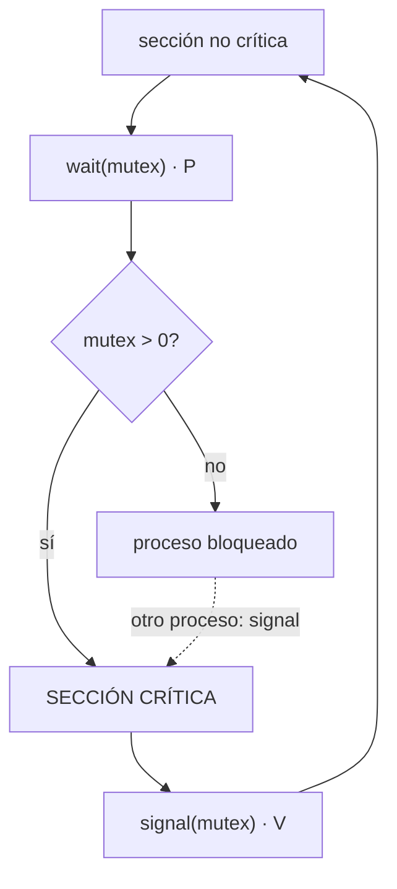
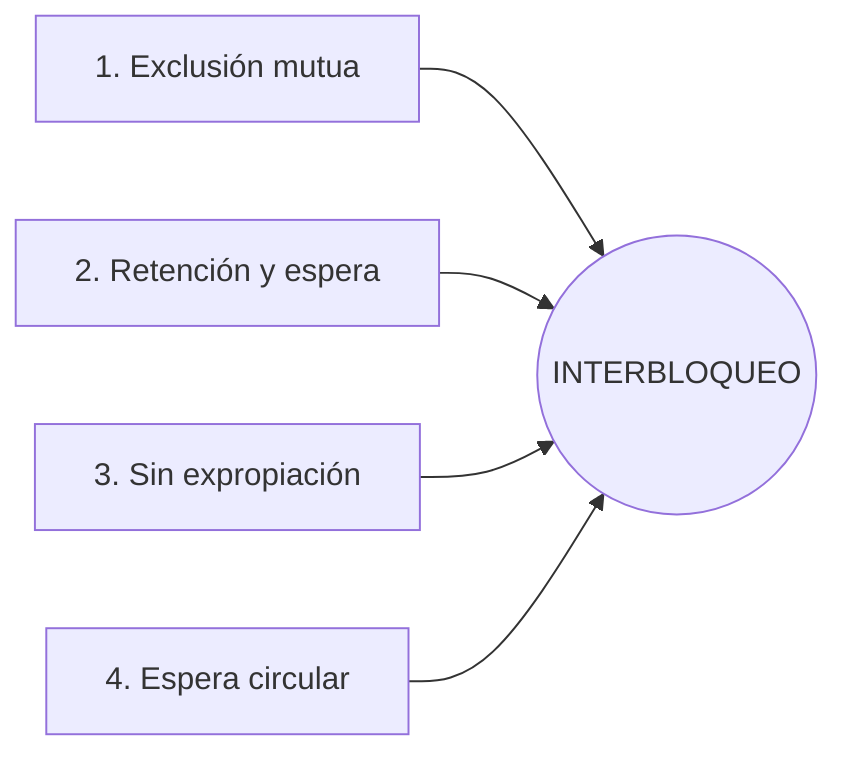
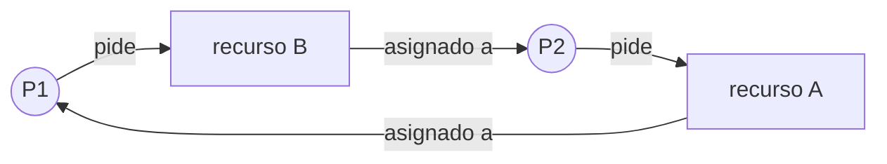

# Concurrencia y sincronización

## Contenidos

- Conceptos básicos: recursos compartibles y no compartibles; ejecución concurrente.
- Condiciones de carrera. Problema de la sección crítica y requisitos de una solución
  (exclusión mutua, progreso, espera limitada).
- Soluciones software (Peterson) y hardware (deshabilitar interrupciones, `test-and-set`,
  `compare-and-swap`).
- Semáforos: contadores y binarios; operaciones `wait`/`signal`. Semáforos POSIX.
- Problemas clásicos de sincronización: productor/consumidor, lectores/escritores,
  filósofos comensales.
- Monitores.
- Interbloqueo (*deadlock*): condiciones de Coffman, prevención, evitación (algoritmo del
  banquero), detección y recuperación.

## Sección crítica con semáforo

## Interbloqueo — condiciones de Coffman

Deben cumplirse las **cuatro** a la vez; romper cualquiera evita el interbloqueo.

Espera circular: P1 retiene A y pide B, mientras P2 retiene B y pide A.

## Material

_(pendiente de añadir)_
