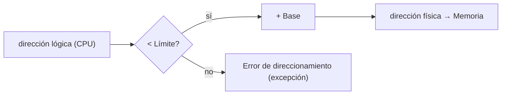
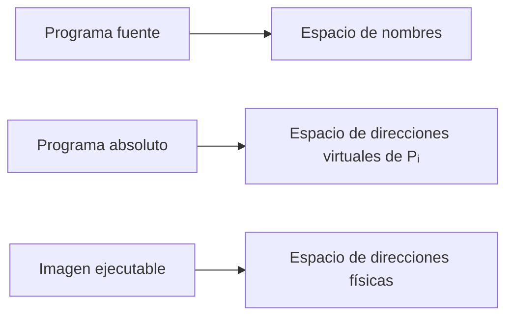
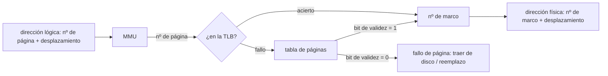
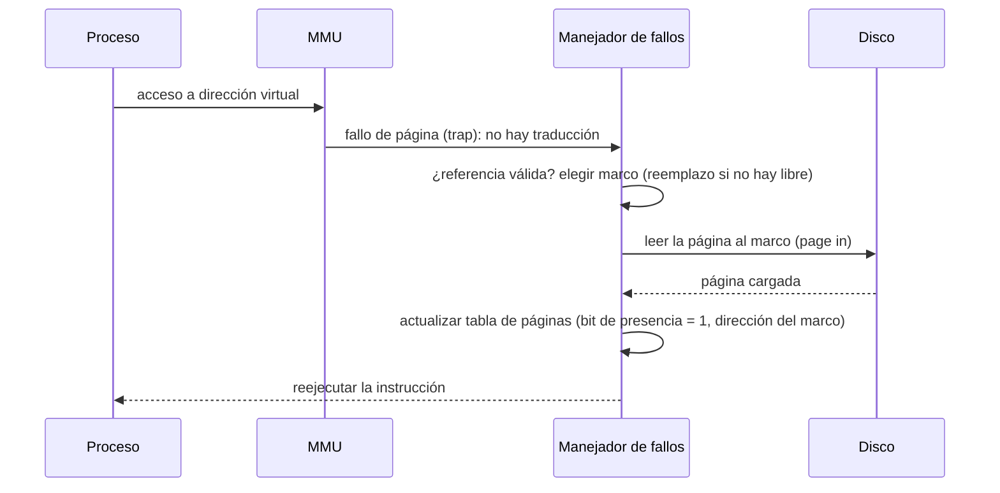
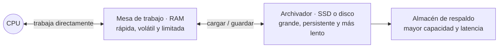
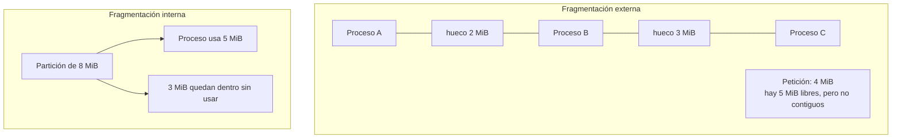
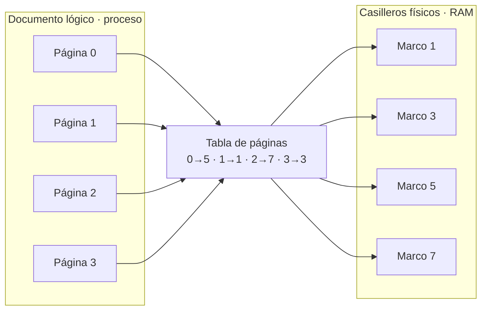
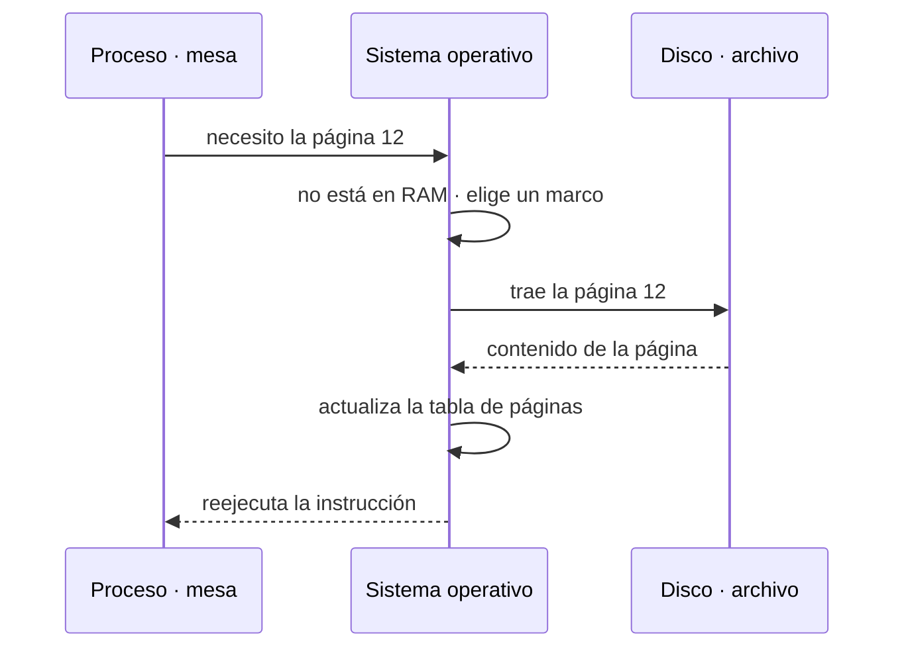
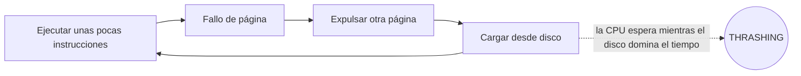

# Temas 5 y 6: Gestión de la memoria principal y memoria virtual

**Tema 5** — 5.1 Conceptos básicos · esquemas de gestión de memoria · asignación contigua
(registro base y límite) · memoria particionada (MFT, MVT) · fragmentación · paginación ·
segmentación · segmentación paginada.
**Tema 6** — 6.1 Concepto de memoria virtual · 6.2 Paginación bajo demanda · 6.3 Copy‑on‑write
· 6.4 Fallos de página · 6.5 Algoritmos de reemplazo.

---

# Tema 5 — Gestión de la memoria principal

## 5.1 Conceptos básicos

### Jerarquía de memoria

| Memoria principal | Memoria secundaria |
|-------------------|--------------------|
| Aloja la información empleada por la CPU | Información contenida en los sistemas de almacenamiento |
| Tiempo de acceso muy bajo | Tiempo de acceso mayor, dependiente del soporte |
| **Volátil** | **Persistente** |
| Capacidad de direccionamiento marcada por el bus | Mayor capacidad de almacenamiento |
| Memoria de acceso aleatorio (RAM) | |

Para que un programa se ejecute debe estar **cargado en memoria principal**. El sistema
operativo gestiona la memoria: carga y descarga bloques desde y hacia el almacenamiento
secundario minimizando el efecto de la E/S sobre el rendimiento. La información permanente se
guarda en almacenamiento secundario.

### Objetivos del sistema de gestión de memoria

- Ofrecer a cada proceso un **espacio lógico propio** (reubicar).
- Proporcionar **protección y aislamiento** entre procesos.
- Permitir que los procesos **compartan** memoria.
- Dar soporte a las distintas **regiones** del proceso.
- **Maximizar el rendimiento** del sistema.
- Proporcionar a los procesos **grandes mapas de memoria**.

### Modelos de gestión de la memoria

| Eje | Opciones |
|-----|----------|
| Uniprogramado / Multiprogramado | 1 / más de 1 programa en memoria a la vez |
| Residente / No residente | La información ha de estar en memoria toda la ejecución, o no |
| Inmóvil / Móvil | La traducción de dirección lógica a física es siempre la misma, o cambia |
| Contigua / No contigua | Las direcciones lógicas contiguas son físicas contiguas, o no |
| Entero / No entero | El programa ha de estar completo en memoria física para ejecutarse, o no |

### Ubicación y reubicación

En un sistema multiprogramado de propósito general **no se conoce a priori** la posición de
memoria que ocupará un programa; dependerá de la ocupación de la memoria y podrá variar entre
ejecuciones. Es necesario **reubicar** las direcciones a las que hacen referencia las
instrucciones (**direcciones lógicas**) para que se correspondan con las **direcciones
físicas** asignadas. La **MMU** (*Memory Management Unit*) realiza la reubicación.

| Reubicación estática | Reubicación dinámica |
|----------------------|----------------------|
| Se realiza antes o durante la carga del programa | Los programas pueden reubicarse en tiempo de ejecución |
| Direccionamiento indirecto a partir de la dirección de carga | El direccionamiento se resuelve dinámicamente según se producen las referencias |
| Los programas no pueden reubicarse una vez iniciados | La traducción lógica→física se hace en tiempo de ejecución; necesita hardware adicional (MMU) |

## Esquemas de gestión de memoria

Máquina desnuda · monitor monolítico o residente · asignación particionada contigua ·
asignación particionada no contigua · paginación · segmentación · segmentación paginada ·
paginación segmentada · memoria virtual.

- **Máquina desnuda**: la forma más sencilla; no existe gestor, el usuario controla toda la
  memoria.
- **Monitor monolítico o residente**: el SO ocupa una zona fija (RAM baja o ROM) y necesita
  **protección** frente a los programas de usuario.
- **Sistema monoprogramado**: memoria dividida entre el SO (parte en ROM, parte en RAM, a
  veces con los controladores de dispositivos) y un único programa de usuario.

## Asignación contigua: registro base y registro límite

Se asigna a cada proceso una **zona contigua** de memoria para su mapa. Elementos:

- **Registro límite**: el procesador comprueba que cada dirección generada por el proceso no
  sea mayor que su valor; si lo es, se genera una **excepción**.
- **Registro base**: comprobado el límite, el procesador **suma** el valor de este registro a
  la dirección lógica y obtiene la **dirección física**.



## Memoria particionada

El SO ocupa siempre una zona; el resto se reserva para procesos de usuario, dividido en
**particiones** de número **fijo (MFT)** o **variable (MVT)**. La asignación puede ser
contigua o no contigua. Se produce **fragmentación**.

### MFT — Multiprogramación con número Fijo de Tareas

- La memoria de usuario se divide en un **número fijo** de particiones, de tamaño posiblemente
  **heterogéneo**. Número y tamaño se establecen en el **arranque** y no varían.
- Asignación con particiones **homogéneas**: una única cola; se asigna la primera zona
  disponible. Problemas: **fragmentación interna** y programas demasiado grandes.
- Asignación con particiones **heterogéneas**: una única cola (primera zona en la que quepa el
  proceso) o varias colas (la zona en la que se desaproveche menos espacio).

### MVT — Multiprogramación con número Variable de Tareas

- Número **variable** de particiones; el tamaño de cada partición **coincide** con la memoria
  que precisa el proceso. Número y tamaño cambian **dinámicamente** conforme llegan los
  procesos. Al finalizar un proceso se libera su espacio.
- No presenta fragmentación interna, pero requiere **compactación** periódica para evitar la
  **fragmentación externa**.
- **Políticas de asignación**:
  - **Primer ajuste** (*first‑fit*): suele ser la mejor política; muy eficiente (basta
    encontrar una zona libre suficiente) y aprovechamiento aceptable.
  - **Mejor ajuste** (*best‑fit*): la zona libre más pequeña donde quepa el proceso; genera
    muchos espacios libres pequeños; comprobar cada hueco u ordenarlos por tamaño ⇒
    algoritmo ineficiente.
  - **Peor ajuste** (*worst‑fit*): el hueco más grande, para no generar huecos pequeños;
    exige recorrer u ordenar toda la lista de huecos.

### Fragmentación de memoria

- **Fragmentación interna**: particiones de tamaño **fijo** cuyo tamaño no coincide con la
  información que se almacena en ellas.
- **Fragmentación externa**: particiones de tamaño **variable**; desaprovechamiento del
  espacio **entre** particiones. Relacionada con la contigüidad entre espacios libres.

### Tabla de descripción de particiones

Ejemplo con el SO en `0K–100K` y 1000K de memoria:

| Nº de partición | Base | Tamaño | Estado |
|---|---|---|---|
| 0 | 0K | 100K | ASIGNADA |
| 1 | 100K | 300K | LIBRE |
| 2 | 400K | 100K | ASIGNADA |
| 3 | 500K | 250K | ASIGNADA |
| 4 | 700K | 150K | ASIGNADA |
| 5 | 900K | 100K | LIBRE |

## Paginación

Surge para solucionar los problemas de fragmentación del particionado. La memoria y los
procesos se dividen en trozos de **tamaño fijo e igual**:

- El trozo del proceso se denomina **página**; el de la memoria principal, **marco**.
- Al cargar un proceso, sus páginas se colocan en los marcos libres **aunque no estén
  contiguos**. Se elimina la **fragmentación externa** y la interna se limita a, como máximo,
  algo menos que el tamaño de una página.
- Se mantiene información sobre los marcos libres; para un programa de `n` páginas se necesitan
  `n` marcos.
- Se establece una **tabla de páginas** para traducir direcciones lógicas a físicas.

### Traducción de direcciones

La dirección se parte en dos campos. El **número de página / marco** se traduce con la tabla
de páginas; el **desplazamiento** dentro de la página/marco no cambia:

<svg xmlns="http://www.w3.org/2000/svg" viewBox="0 0 700 260" font-family="sans-serif" font-size="13" role="img" aria-label="La dirección lógica (página, desplazamiento) se traduce a dirección física (marco, desplazamiento) mediante la tabla de páginas">
  <rect width="700" height="260" fill="#ffffff"/>
  <text x="20" y="40" font-weight="bold">Dirección lógica</text>
  <rect x="150" y="22" width="300" height="34" fill="#6ba3d6" stroke="#2b6f99"/><text x="270" y="44" text-anchor="middle" fill="#fff">Página</text>
  <rect x="450" y="22" width="150" height="34" fill="#1f3f66" stroke="#132840"/><text x="525" y="44" text-anchor="middle" fill="#fff" font-size="11">Desplazamiento</text>
  <rect x="230" y="105" width="180" height="40" fill="#eef2f7" stroke="#666"/><text x="320" y="130" text-anchor="middle">Tabla de páginas</text>
  <line x1="300" y1="56" x2="300" y2="105" stroke="#333"/><path d="M300 105 l-4 -10 l8 0 z" fill="#333"/>
  <line x1="410" y1="125" x2="150" y2="200" stroke="#333"/><path d="M150 200 l10 -3 l-2 9 z" fill="#333"/>
  <text x="20" y="230" font-weight="bold">Dirección física</text>
  <rect x="150" y="212" width="300" height="34" fill="#6ba3d6" stroke="#2b6f99"/><text x="300" y="234" text-anchor="middle" fill="#fff">Marco</text>
  <rect x="450" y="212" width="150" height="34" fill="#1f3f66" stroke="#132840"/><text x="525" y="234" text-anchor="middle" fill="#fff" font-size="11">Desplazamiento</text>
  <line x1="525" y1="56" x2="525" y2="212" stroke="#999" stroke-dasharray="4 3"/>
  <text x="535" y="140" font-size="11" fill="#777">el desplazamiento</text>
  <text x="535" y="155" font-size="11" fill="#777">no cambia</text>
</svg>

El SO mantiene **una tabla de páginas por proceso**, que relaciona cada página con el marco en
el que se encuentra.

### Paginación: MMU

- La **MMU** (elemento **hardware**) traduce la dirección lógica a física con ayuda de la
  tabla de páginas, que rellena en la asignación de memoria. La **protección** se establece en
  la tabla de páginas mediante **bits de acceso**.
- Para gestionar la paginación se emplean **mapas de bits** o **listas enlazadas**.
- La MMU usa **dos** tablas de páginas: una de **usuario** (direcciones del espacio de
  usuario) y una del **sistema** (direcciones del espacio del sistema, usables solo en modo
  privilegiado).

### Ventajas de la paginación

- **Carga parcial**: se puede empezar a ejecutar cargando solo una parte del programa; el
  resto se carga bajo demanda.
- **Discontinuidad**: las páginas no necesitan estar contiguas ⇒ no hacen falta procesos de
  compactación.
- Fácil de controlar (todas las páginas tienen el mismo tamaño).
- **Inmune a la fragmentación externa.**
- El mecanismo de traducción de direcciones (**DAT**) separa los conceptos de espacio de
  direcciones y espacio de memoria: libera al programador del tamaño físico de memoria
  (mayor productividad) y permite aumentar el grado de multiprogramación.

### Desventajas de la paginación

- Se incrementa el coste de hardware y software (nueva información y mecanismo de traducción).
- Aparece la **fragmentación interna**: si un programa necesita 5 KB y las páginas son de
  4 KB, se le asignan 2 páginas (8 KB) y quedan 3 KB sin utilizar; la suma de estos espacios
  puede superar el tamaño de varias páginas, pero no se pueden usar.

### Tabla de páginas

Cada entrada contiene:

- **Número de marco** correspondiente a esa página.
- **Información de protección**: bits que especifican los accesos permitidos (lectura,
  ejecución, escritura).
- **Página válida**: bit que indica si la página tiene traducción asociada. En memoria virtual
  también indica si la página **no está residente** en memoria principal.
- **Página accedida**: la MMU lo activa al acceder a una dirección de esa página.
- **Página modificada** (*dirty bit*): la MMU lo activa al escribir en una dirección de esa
  página.
- **Desactivación de caché**: indica que no debe usarse la caché de MP para acelerar el acceso
  a esa página.

### Responsabilidades

| Hardware | Sistema operativo |
|----------|-------------------|
| Traducción de direcciones lógicas a físicas | Resolución de problemas |
| Detección de problemas: fallo de página, acceso inválido, falta de privilegios | Gestión del espacio libre/ocupado |

### Gestión de la memoria disponible

| Mapa de bits | Lista de libres |
|--------------|-----------------|
| Sencillo; ocupa poco espacio | Organizada por zonas libres y ocupadas |
| Difícil/costoso encontrar huecos | Fácil encontrar huecos, pero costosa de construir |

### Políticas de búsqueda

- **Bajo demanda**: cuando se pide una página y no está en MP, se va a buscar.
- **Prepaginación**: al cargar el programa se cargan varias páginas contiguas, para reducir el
  tiempo de arranque.

### Políticas de reemplazo (paginación)

Si toda la memoria está ocupada y hace falta desalojar una página: escoger una **víctima**,
paginarla (*page out*) si se ha modificado, y traer la nueva (*page in*) o crearla.

| Algoritmo | Comentario |
|-----------|-----------|
| **FIFO** | Fácil de implementar; no tiene en cuenta la localidad temporal |
| **LRU** (*Least Recently Used*) | Excelente algoritmo; difícil de implementar |
| **NRU** (*Non Recently Used*) | Se basa en los bits de modificado (M) y referencia (R); orden de preferencia para expulsar: `¬R,¬M > ¬R,M > R,¬M > R,M`; en empate, FIFO. Simple y bastante eficiente |
| **Segunda oportunidad** | Mejora sobre FIFO: si el bit R está a 1, la página se coloca al final de la cola en lugar de elegirla |
| **Envejecimiento** (*aging*) | Cada página tiene un número de `n` bits; se elige la de número más bajo. En cada ciclo de reloj: `valor = (R << n) + (valor_actual >> 1)`. Muy eficiente, se aproxima a LRU |

## Segmentación

Los procesos se dividen en **segmentos** de longitud distinta, nunca superior al **tamaño
máximo de segmento** de la arquitectura. Segmentos habituales: **código**, **datos**,
**pila**. Cada segmento se almacena en una zona cuyo tamaño coincide con el del segmento, y no
necesariamente de forma consecutiva. Se evita la fragmentación interna pero **no la externa**
(aunque menor que con MVT); requiere **compactación**.

- La **dirección lógica** = número de segmento + desplazamiento dentro del segmento.
- La **dirección física** = dirección de comienzo del segmento en MP + desplazamiento.
- Al cargar el proceso se le asignan tantas zonas como segmentos tenga y se rellena la **tabla
  de segmentos**. La **protección** se realiza según el **límite** del segmento.

<svg xmlns="http://www.w3.org/2000/svg" viewBox="0 0 640 200" font-family="sans-serif" font-size="13" role="img" aria-label="Traducción en segmentación: número de segmento más desplazamiento a dirección de comienzo del segmento más desplazamiento">
  <rect width="640" height="200" fill="#ffffff"/>
  <text x="20" y="40" font-weight="bold">Dirección lógica</text>
  <rect x="170" y="22" width="240" height="34" fill="#6ba3d6" stroke="#2b6f99"/><text x="290" y="44" text-anchor="middle" fill="#fff">Nº de segmento</text>
  <rect x="410" y="22" width="180" height="34" fill="#1f3f66" stroke="#132840"/><text x="500" y="44" text-anchor="middle" fill="#fff" font-size="11">Desplazamiento</text>
  <text x="20" y="130" font-weight="bold">Dirección física</text>
  <rect x="120" y="112" width="290" height="34" fill="#6ba3d6" stroke="#2b6f99"/><text x="265" y="134" text-anchor="middle" fill="#fff" font-size="11">Comienzo del segmento en MP</text>
  <rect x="410" y="112" width="180" height="34" fill="#1f3f66" stroke="#132840"/><text x="500" y="134" text-anchor="middle" fill="#fff" font-size="11">Desplazamiento</text>
  <line x1="290" y1="56" x2="265" y2="112" stroke="#333"/><path d="M265 112 l0 -10 l7 4 z" fill="#333"/>
  <text x="300" y="88" font-size="11" fill="#777">tabla de segmentos</text>
  <line x1="500" y1="56" x2="500" y2="112" stroke="#999" stroke-dasharray="4 3"/>
</svg>

Ventajas e inconvenientes: el control de acceso se realiza con **bits de acceso** en la tabla
de segmentos; **soporta el crecimiento dinámico** de los segmentos. Inconvenientes: requiere
**compactación**; algunos procesos pueden necesitar un segmento mayor que el límite.

Vista de la traducción por la MMU (segmentos dispersos en la memoria física, datos
compartidos):


## Segmentación paginada

Combina lo mejor de la paginación y la segmentación:

- **Segmentación**: soporte directo a las regiones del proceso.
- **Paginación**: mejor aprovechamiento de la memoria y base para la memoria virtual.

Un segmento está formado por un **conjunto de páginas** y no tiene que estar contiguo. La
dirección lógica = **número de segmento + número de página dentro del segmento + desplazamiento
dentro de la página**. La MMU usa una **tabla de segmentos** en la que cada entrada apunta a
una **tabla de páginas**.

<svg xmlns="http://www.w3.org/2000/svg" viewBox="0 0 700 230" font-family="sans-serif" font-size="12" role="img" aria-label="Segmentación paginada: la dirección segmento, página, desplazamiento se resuelve con la tabla de segmentos y luego la tabla de páginas para llegar a la memoria principal">
  <rect width="700" height="230" fill="#ffffff"/>
  <rect x="40"  y="20" width="150" height="30" fill="#6ba3d6" stroke="#2b6f99"/><text x="115" y="40" text-anchor="middle" fill="#fff">Segmento</text>
  <rect x="190" y="20" width="150" height="30" fill="#3f7fb5" stroke="#2b6f99"/><text x="265" y="40" text-anchor="middle" fill="#fff">Página</text>
  <rect x="340" y="20" width="180" height="30" fill="#1f3f66" stroke="#132840"/><text x="430" y="40" text-anchor="middle" fill="#fff">Desplazamiento</text>
  <rect x="60" y="95" width="200" height="55" fill="#eef2f7" stroke="#666"/><text x="160" y="118" text-anchor="middle">Tabla de segmentos</text><text x="160" y="136" text-anchor="middle" font-size="10">(segmento · longitud · base)</text>
  <rect x="300" y="95" width="180" height="55" fill="#eef2f7" stroke="#666"/><text x="390" y="118" text-anchor="middle">Tabla de páginas</text><text x="390" y="136" text-anchor="middle" font-size="10">(página · marco)</text>
  <rect x="540" y="70" width="120" height="130" fill="#cfe0f2" stroke="#3773a0"/><text x="600" y="215" text-anchor="middle" font-size="11">Memoria principal</text>
  <line x1="115" y1="50" x2="140" y2="95" stroke="#333"/><path d="M140 95 l-2 -10 l7 3 z" fill="#333"/>
  <line x1="260" y1="120" x2="300" y2="120" stroke="#333"/><path d="M300 120 l-10 -3 l0 6 z" fill="#333"/>
  <line x1="265" y1="50" x2="360" y2="95" stroke="#333"/><path d="M360 95 l-9 -1 l3 -6 z" fill="#333"/>
  <line x1="480" y1="122" x2="540" y2="130" stroke="#333"/><path d="M540 130 l-10 -1 l2 -6 z" fill="#333"/>
</svg>

**Paginación segmentada**: consiste en segmentar las tablas de páginas adecuándolas al tamaño
del programa; cada página se divide en segmentos. **No se emplea.**

## Casos prácticos

Windows y Linux usan **segmentación paginada** (Windows 10 incluido). El estado de la gestión
de memoria se observa con las herramientas del sistema. *(Ilustraciones de las herramientas de
Windows y Linux: material fotográfico, ver [`IMAGENES-PENDIENTES.md`](../IMAGENES-PENDIENTES.md).)*

### Bibliografía (Tema 5)

[Silb09] cap. 7 · [Silb12] cap. 8 · [Silb18] cap. 9 · [Tan15] cap. 3 · [Stal05] cap. 7 ·
[Stal97] cap. 6 · [Nutt04] cap. 11.

### Actividades complementarias

- Ejercicios de la Parte 3 (Memoria): 1‑13, 17, 19, 20, 22, 25, 26, 29, 32, 35, 36, 39, 40,
  44, 47, 48, 52, 53, 55, 57, 58, 62.
- Programación: desarrollar un simulador de las políticas de primer, mejor y peor ajuste para
  evaluar su bondad en distintos escenarios.

---

# Tema 6 — Memoria virtual

## 6.1 Concepto de memoria virtual

La **memoria virtual** es una técnica que permite **ejecutar procesos que no caben totalmente
en memoria principal** (programas más grandes que la memoria física) y ejecutar un **mayor
número de procesos**. Es la separación entre la memoria lógica disponible para el usuario y la
memoria principal: aunque los procesos se cargan en la **memoria real**, el usuario tiene la
sensación de trabajar con más memoria de la físicamente disponible (**memoria virtual**), que
se sitúa en **memoria secundaria**.

- Se basa en la **carga parcial** de un programa: se mantiene en MP solo la memoria que el
  proceso está usando y el resto en memoria secundaria, transfiriendo información entre ambas.
- Cuando escasea la memoria se crea un **espacio de intercambio (SWAP)** en disco (particiones
  dedicadas o ficheros de intercambio) que amplía la memoria auxiliar y permite simular más
  memoria principal de la real.
- Método **transparente** a los procesos. La memoria máxima simulable depende del **tamaño de
  palabra**: en un sistema de 32 bits el máximo es 2³² = **4 GB**.
- El programa se divide en **bloques** que no necesitan ocupar posiciones consecutivas. La
  traducción de direcciones es **dinámica**; es posible reubicar el proceso en memoria.
- Se implementa normalmente mediante **paginación bajo demanda** (también posible con
  segmentación). Los sistemas siguen un esquema de **segmentación paginada** con los segmentos
  divididos en páginas.


Correspondencia de espacios (programa fuente → programa absoluto → imagen ejecutable):



### Ventajas de la memoria virtual

- Ejecutar programas mayores que la memoria física disponible.
- Alojar en MP más procesos (mayor multiprogramación).
- Reducir la latencia de ejecución (no hay que cargar el programa completo para empezar).
- Gestionar más eficientemente la memoria física: cualquier espacio libre, incluso una única
  página, puede aprovecharse.
- Aumentar el grado de multiprogramación reduciendo el número de páginas cargadas de cada
  programa ⇒ mayor eficiencia de la CPU.
- Independencia completa de los programas respecto de la máquina.

### Soporte hardware

- Traducción de direcciones de los sistemas paginados.
- Espacio para paginación en un dispositivo de almacenamiento secundario.
- **Bit de validez (V)** en cada entrada de la tabla de páginas: indica si la página está
  cargada en memoria.
- **Trap de fallo de página**: cuando la página referenciada no está en MP, el mecanismo de
  interrupciones salta a la rutina de tratamiento del fallo (que promueve la carga). El fallo
  puede ocurrir en cualquier referencia a memoria durante la ejecución de la instrucción, así
  que la arquitectura debe poder dejar el procesador en un estado consistente antes de saltar.
- Información adicional para gestionar el fallo (bits de página modificada, referenciada…).

### Aspectos de diseño del gestor de memoria virtual

1. **Técnica**: paginación, segmentación o mezcla.
2. **Política de lectura** (cuándo cargar una página):
   - **Bajo demanda pura**: se carga solo al referenciar una dirección de esa página.
   - **Bajo demanda previa**: se carga antes de referenciarla.
3. **Política de ubicación** (dónde cargar el bloque): solo tiene sentido en segmentación (en
   paginación todos los bloques son iguales).
4. **Política de asignación**: número de marcos que se asigna a un proceso.
5. **Política de reemplazo**: qué página reemplazar cuando no hay marcos disponibles. La
   **cadena de referencia** (lista de referencias de un proceso) se usa para evaluar la
   calidad de los algoritmos:
   - **FIFO**: sustituye la primera página que entró.
   - **LRU**: sustituye la que hace más tiempo que no se utiliza; aproximación al óptimo.
   - **Óptimo**: sustituye la página que tardará más en ser utilizada; **no implementable**
     (no se conoce a priori).
6. **Conjunto de trabajo**: conjunto de páginas a las que el proceso ha hecho referencia en
   las últimas `N` unidades de tiempo (para un instante `T`).

### Hardware de la memoria virtual basada en paginación

- **Dispositivo de memoria auxiliar**: normalmente el disco duro, donde se almacenan las
  páginas.
- **MMU**: traduce dinámicamente las direcciones virtuales a reales consultando la tabla de
  páginas.
- **TLB** (*Translation Lookaside Buffer*, búfer de traducción adelantada): caché especial
  para las entradas de la tabla de páginas usadas más recientemente.

Dos estructuras de datos: la **tabla de páginas** (una entrada por página, con la dirección
del marco y los bits de acceso) y el **mapa de archivos** (dónde están almacenadas las páginas
en el dispositivo auxiliar).

### Funcionamiento

- Las páginas residentes en memoria secundaria se cargan en marcos conforme se necesitan. La
  MMU comprueba el **bit de presencia** en la tabla de páginas antes de traducir, para evitar
  traducciones innecesarias.
- Si la página está en un marco: se verifica que el acceso es a una dirección **permitida**;
  si es válido, se traduce y se accede a la dirección física.
- Si la página **no está** en memoria: se comprueba que la dirección está dentro del espacio
  del proceso y que hay un marco disponible.
  - Si hay **marco libre**: se consulta el mapa de archivos y se carga la página de la memoria
    auxiliar.
  - Si **no hay marcos libres**: el **algoritmo de reemplazo** elige una víctima; se comprueba
    su **bit sucio**; si está activado, se escribe la página en memoria auxiliar (E/S).
  - En ambos casos, una vez cargada, se activa el **bit de presencia** y se guarda la
    dirección del marco.



## Memoria de intercambio

El **intercambio** usa un disco o parte de un disco (**dispositivo de swap**) como respaldo de
la memoria principal.

- Cuando no caben todos los procesos activos, se elige un proceso residente y se copia su
  imagen a swap (*swap out*). El criterio de selección puede considerar la **prioridad**, el
  **tamaño de su mapa de memoria**, el **tiempo que lleva ejecutando** y su **estado**. Se
  intenta expulsar procesos **bloqueados**.
- Un proceso expulsado tarde o temprano vuelve a MP (*swap in*). Solo se recargan procesos
  **listos para ejecutar**, cuando hay memoria disponible o cuando llevan cierto tiempo
  expulsados. **No debe expulsarse** un proceso mientras realiza operaciones de E/S.
- Asignación de espacio en el dispositivo de swap: **preasignación** (se reserva espacio al
  crear el proceso) o **sin preasignación** (solo al expulsar el proceso).
- Al **desalojar** un proceso se copia toda su imagen ejecutable a memoria secundaria; al
  **realojar** en memoria primaria, la imagen se copia sobre el nuevo bloque asignado por el
  gestor de memoria.


- Sin hardware de reubicación, el intercambio sería difícil por el problema del enlazado de
  direcciones; con él, se copia la imagen a la nueva memoria y se carga el registro de
  reubicación.
- Los sistemas de tiempo compartido usan intercambio para dar servicio equitativo en un
  sistema sobrecargado: cuando el número de usuarios activos supera cierto umbral, el gestor
  de memoria empieza a intercambiar. El efecto lo percibe el usuario como un **incremento del
  tiempo de respuesta**.

## 6.2 Paginación bajo demanda

- Similar a un sistema de paginación con intercambios: los procesos residen en disco y, al
  ejecutar un proceso, se lleva a memoria — pero con un **intercambiador perezoso**
  (*lazy swapper*) que nunca incorpora una página a memoria a menos que se necesite.
- Un **intercambiador** manipula procesos enteros; un **paginador** trata individualmente las
  páginas de un proceso.
- Si una instrucción direcciona una página que no está en MP, no se puede ejecutar en ese
  momento: es un **fallo de página**. Al producirse hay tres aspectos:
  1. **Servicio a la interrupción de página**: el proceso se detiene.
  2. **Incorporación de la página**: mediante una instrucción de E/S se transfiere la página a
     un marco.
  3. **Reinicio del proceso**: se comunica a la CPU que la página ya está en MP y el proceso
     continuará cuando el *dispatcher* lo estime oportuno.

## 6.3 Copy‑on‑write

**Copy‑on‑write** (copiar al escribir, COW) es una política de optimización:

- Si múltiples procesos piden recursos inicialmente **iguales**, se les devuelven punteros al
  **mismo** recurso.
- Si un proceso intenta **modificar** su copia, se crea una **copia auténtica** para que sus
  cambios no sean visibles por los demás. Todo es transparente para los procesos.
- **Ventaja principal**: no se crea ninguna copia adicional si ningún proceso realiza
  modificaciones (escaso uso de memoria).

En memoria virtual: cuando un proceso crea una copia de sí mismo (`fork`), las páginas que
puedan modificarse se marcan **copy‑on‑write**. Cuando un proceso escribe, el núcleo
interviene y crea una copia. `calloc` puede aprovechar esta estrategia con una única página
física de ceros a la que refieren todas las páginas devueltas, marcadas COW; la memoria real
no aumenta hasta que se escribe.

Implementación: se marcan ciertas páginas como **solo lectura** en la MMU. Al intentar
escribir, la MMU lanza una **excepción** que captura el núcleo, que decide **emitir una señal
de violación de acceso** o **reservar nueva memoria** y escribir en ella la página modificada.
El principal problema a nivel de núcleo es su **complejidad**: al escribir en una página, debe
copiarla si está marcada COW.

**Ejemplo de reserva de memoria** (efecto de COW y de la reserva perezosa):

```c
#include <stdlib.h>
#define MEGABYTE (1024*1024)
#define USED_MEMORY 512
char *mem[USED_MEMORY];

int main(int argc, char *argv[]) {
    int i;
    /* (I)  solo malloc                          -> RSS mínimo (~316 KB) */
    for (i = 0; i < USED_MEMORY; i++) mem[i] = malloc(MEGABYTE);

    /* (II) malloc + tocar 1 byte por bloque     -> RSS medio (~2364 KB) */
    /* for (i = 0; i < USED_MEMORY; i++) { mem[i] = malloc(MEGABYTE); mem[i][0] = 0xff; } */

    /* (III) malloc + escribir todo el bloque    -> RSS completo (~524604 KB) */
    /* for (i = 0; i < USED_MEMORY; i++) { mem[i] = malloc(MEGABYTE);
           for (j = 0; j < MEGABYTE; j++) mem[i][j] = 0xff; } */

    for (;;) sleep(1);
    return 0;
}
```

```console
$ ps -a -ocomm,rssize | grep memalloc
./memalloc      316       # (I)  solo malloc
./memalloc     2364       # (II) tocando 1 byte por bloque
./memalloc   524604       # (III) escribiendo todo
```

## 6.4 Fallos de página

Un **fallo de página** es la secuencia de eventos que ocurre cuando un programa intenta
acceder a datos o código que están en su espacio de direcciones pero **no están en la memoria
principal**. El SO lo maneja haciendo residentes los datos accedidos, de modo que el programa
continúa como si el fallo nunca hubiera ocurrido.

Se produce al **obtener una instrucción**, al **leer los operandos** o al **escribir los
resultados**. Soluciones:

- Interrumpir la ejecución, guardar el estado, solucionar, restaurar el estado y continuar.
- Eliminar la instrucción, solucionar y reejecutarla.

Si se produce un fallo, la MMU **no tiene traducción** para la dirección: interrumpe a la CPU
y se ejecuta el **manejador de fallos de página**, que determina qué hacer:

- Encontrar dónde reside la página en disco y leerla (a menudo el fallo es por una página de
  **código**).
- Determinar que la página ya está en MP pero no asignada al proceso actual, y asignársela.
- Apuntar a una página especial de **ceros** y asignar una página nueva si el proceso intenta
  escribir (página COW para datos inicializados a cero).
- Obtener la página desde otro lugar.



## 6.5 Algoritmos de reemplazo

Ver la tabla de la sección de paginación (Tema 5): **FIFO**, **LRU**, **NRU**, **segunda
oportunidad**, **envejecimiento**.

### Anomalía de Belady

Muestra que, con **FIFO**, es posible tener **más fallos de página al aumentar el número de
marcos**. Referencia: L. A. Belady, R. A. Nelson, G. S. Shedler, «An anomaly in space‑time
characteristics of certain programs running in a paging machine», *Communications of the ACM*
12(6):349‑353, junio de 1969.

Secuencia de peticiones `1, 2, 3, 4, 1, 2, 5, 1, 2, 3, 4, 5` con FIFO:

| Nº de marcos | Fallos de página |
|--------------|------------------|
| **3** | **9** |
| **4** | **10** |

Con 3 marcos (`PF` = fallo, `X` = acierto):

| Ref | 1 | 2 | 3 | 4 | 1 | 2 | 5 | 1 | 2 | 3 | 4 | 5 |
|-----|---|---|---|---|---|---|---|---|---|---|---|---|
| m1 | 1 | 1 | 1 | 4 | 4 | 4 | 5 | 5 | 5 | 5 | 5 | 5 |
| m2 |   | 2 | 2 | 2 | 1 | 1 | 1 | 1 | 1 | 3 | 3 | 3 |
| m3 |   |   | 3 | 3 | 3 | 2 | 2 | 2 | 2 | 2 | 4 | 4 |
|    | PF | PF | PF | PF | PF | PF | PF | X | X | PF | PF | X |

Con 4 marcos:

| Ref | 1 | 2 | 3 | 4 | 1 | 2 | 5 | 1 | 2 | 3 | 4 | 5 |
|-----|---|---|---|---|---|---|---|---|---|---|---|---|
| m1 | 1 | 1 | 1 | 1 | 1 | 1 | 2 | 3 | 4 | 5 | 1 | 2 |
| m2 |   | 2 | 2 | 2 | 2 | 2 | 3 | 4 | 5 | 1 | 2 | 3 |
| m3 |   |   | 3 | 3 | 3 | 3 | 4 | 5 | 1 | 2 | 3 | 4 |
| m4 |   |   |   | 4 | 4 | 4 | 5 | 1 | 2 | 3 | 4 | 5 |
|    | PF | PF | PF | PF | X | X | PF | PF | PF | PF | PF | PF |

---

## Galería visual complementaria

### T06.1 · Memoria como mesa de trabajo y archivo



*La memoria principal es rápida pero limitada. El sistema operativo mueve información entre la
memoria y el almacenamiento para mantener activos los procesos.*

### T06.2 · Fragmentación como equipaje mal distribuido



*La fragmentación deja memoria libre en huecos que pueden resultar inutilizables aunque su suma
parezca suficiente.*

### T06.3 · Páginas distribuidas en marcos



*La paginación divide la memoria lógica y física en bloques del mismo tamaño. Las páginas de un
proceso pueden ocupar marcos no contiguos.*

### T06.4 · Fallo de página como petición al archivo



*Si una página necesaria no está en memoria, el núcleo detiene temporalmente el proceso, la carga
desde disco y reanuda la instrucción.*

### T06.5 · Hiperpaginación: mover carpetas sin trabajar



*Cuando faltan marcos, el sistema puede invertir más tiempo intercambiando páginas que ejecutando
instrucciones útiles.*

---

## Lecturas recomendadas (Tema 6)

- Capítulos 9, 21 y 22 de [Silb05].
- Capítulo 4 de [Tane03].
- Capítulo 7 de [Stal05].
- Capítulo 12 de [Nutt04].

---

## Material gráfico

Todos los diagramas de los Temas 5 y 6 están replicados como mermaid, SVG o tabla dentro de
este documento (base/límite, traducción en paginación y en segmentación, segmentación paginada,
esquema de memoria virtual, intercambio, tratamiento del fallo de página, anomalía de Belady).
Queda como **material fotográfico** (ilustrativo): el símil del aparcamiento (pp. 384‑385) y
las capturas de las herramientas de gestión de memoria de Windows y Linux (pp. 428‑430). Ver
[`TEORIA/IMAGENES-PENDIENTES.md`](../IMAGENES-PENDIENTES.md).
