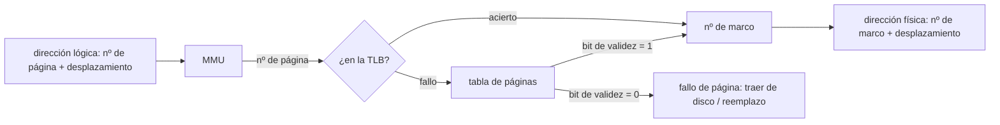
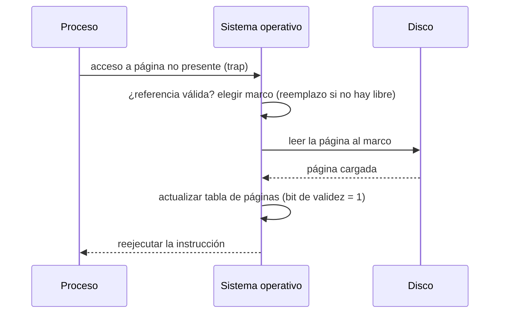

# Gestión de memoria

Incluye gestión de la memoria principal y memoria virtual.

## Contenidos

### Gestión de la memoria principal

- Jerarquía de memoria: memoria principal (volátil, acceso rápido) frente a secundaria
  (persistente, acceso lento).
- Conceptos básicos: espacio de direcciones lógico y físico, reubicación, protección,
  compartición. Ligadura de direcciones (compilación, carga, ejecución).
- Modelos de gestión de memoria:
  - Particionamiento fijo y dinámico. Fragmentación interna y externa.
  - Algoritmos de ubicación: primer ajuste, mejor ajuste, peor ajuste. Compactación.
- Memoria de intercambio (*swapping*).
- Paginación: marcos y páginas, tabla de páginas, MMU, TLB.
- Segmentación. Segmentación paginada.

### Memoria virtual

- Concepto de memoria virtual: ejecutar procesos que no caben enteros en memoria principal.
- Paginación bajo demanda. Bit de validez. Rendimiento.
- Copy-on-write.
- Fallos de página (*page faults*): tratamiento paso a paso.
- Algoritmos de reemplazo de página: FIFO (y anomalía de Belady), óptimo, LRU y
  aproximaciones (bit de referencia, segunda oportunidad, reloj).
- Asignación de marcos. Hiperpaginación (*thrashing*) y modelo del conjunto de trabajo.

## Traducción de dirección con paginación

## Tratamiento de un fallo de página

## Material

_(pendiente de añadir)_
