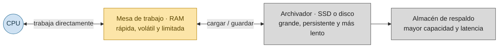
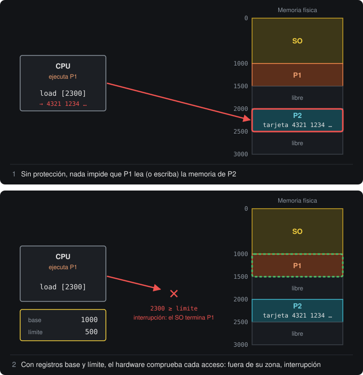
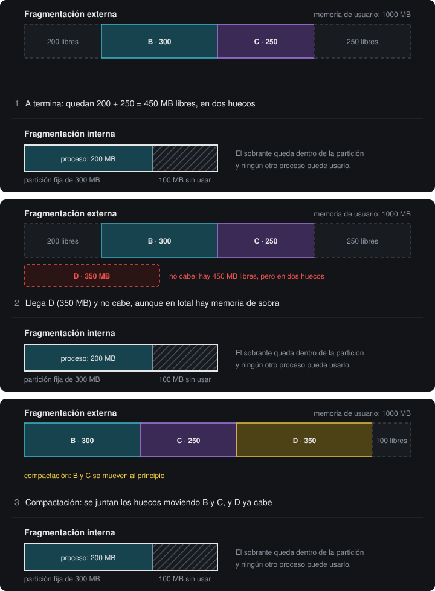
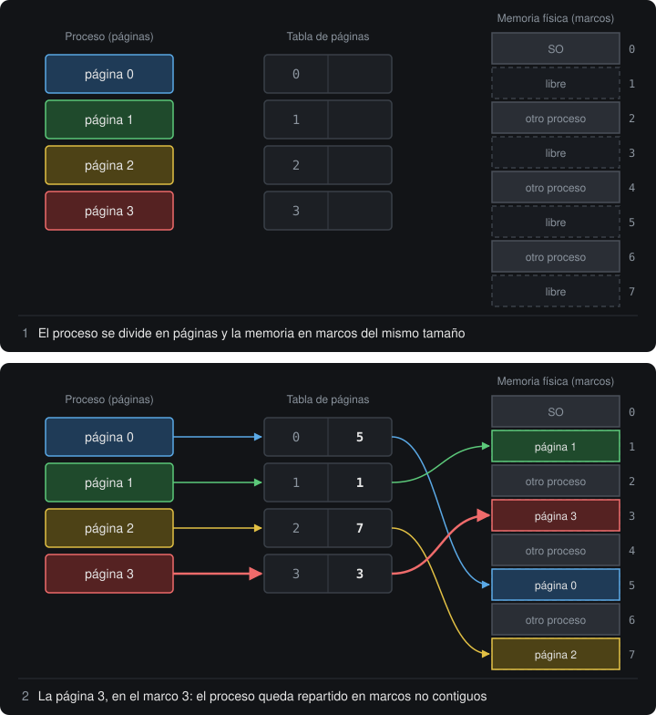
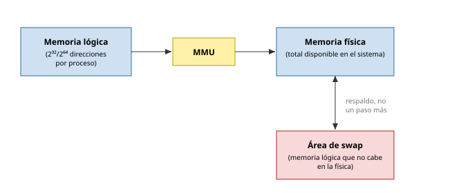
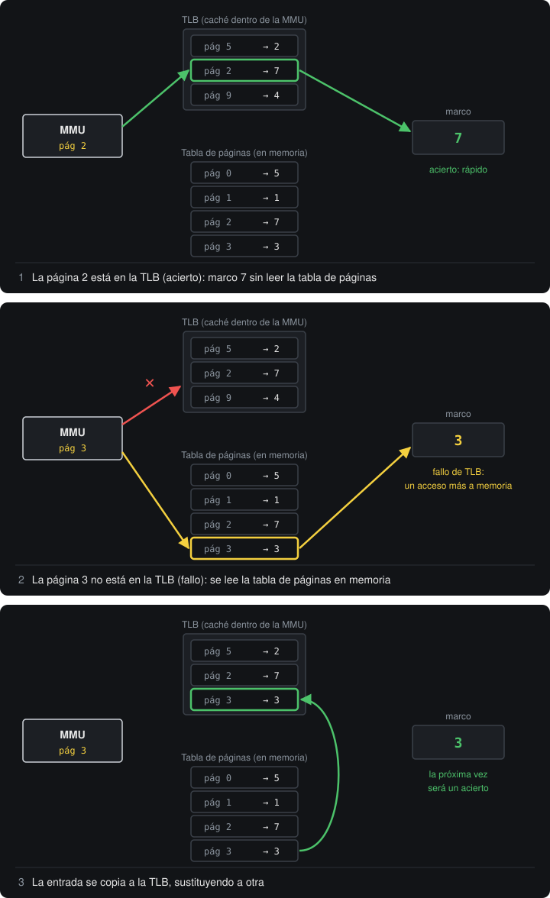
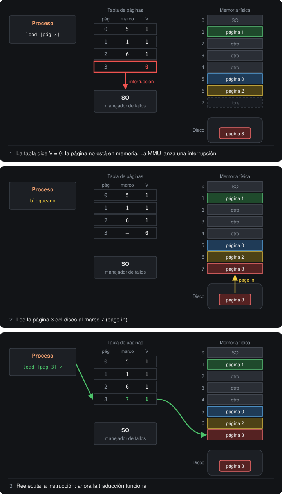
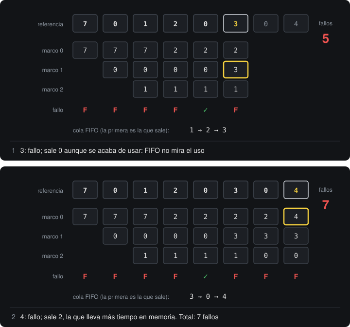
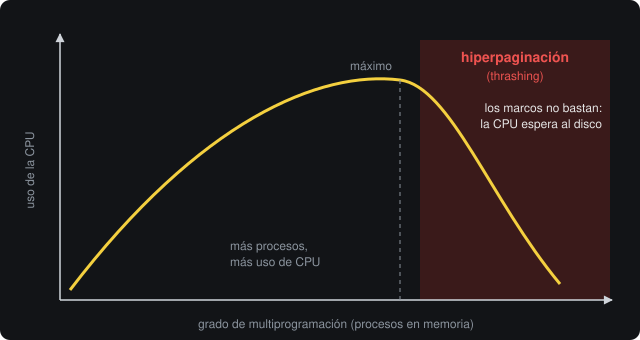

# Temas 5 y 6: Gestión de la memoria principal y memoria virtual

**Tema 5** — Conceptos básicos · asignación contigua (registro base y límite) · memoria particionada (MFT, MVT) · fragmentación · paginación · segmentación. **Tema 6** — Concepto de memoria virtual · paginación bajo demanda y fallos de página · memoria de intercambio · copy‑on‑write · lazy allocation · algoritmos de reemplazo · hiperpaginación.

---

# Tema 5 — Gestión de la memoria principal

## Conceptos básicos

### Jerarquía de memoria

| Memoria principal | Memoria secundaria |
|-------------------|--------------------|
| Aloja la información empleada por la CPU | Información contenida en los sistemas de almacenamiento |
| Tiempo de acceso muy bajo | Tiempo de acceso mayor, dependiente del soporte |
| **Volátil** | **Persistente** |
| Capacidad de direccionamiento marcada por el bus | Mayor capacidad de almacenamiento |
| Memoria de acceso aleatorio (RAM) | |


```mermaid
flowchart LR
    CPU((CPU)) <-->|trabaja directamente| RAM["Mesa de trabajo · RAM<br/>rápida, volátil y limitada"]
    RAM <-->|cargar / guardar| SSD["Archivador · SSD o disco<br/>grande, persistente y más lento"]
    SSD --> BK["Almacén de respaldo<br/>mayor capacidad y latencia"]

    classDef cpu fill:#cfe2f3,stroke:#2b6f99,color:#1b3a4b;
    classDef rapida fill:#fce5a8,stroke:#b8860b,color:#5c4600;
    classDef lenta fill:#d9d9d9,stroke:#555555,color:#222222;
    class CPU cpu;
    class RAM rapida;
    class SSD,BK lenta;
```

*La memoria principal es rápida pero limitada. El sistema operativo mueve información entre la memoria y el almacenamiento para mantener activos los procesos.*

Para que un programa se ejecute debe estar **cargado en memoria principal**. El sistema operativo gestiona la memoria: carga y descarga bloques desde y hacia el almacenamiento secundario minimizando el efecto de la E/S sobre el rendimiento. La información permanente se guarda en almacenamiento secundario.

### Ubicación y reubicación

En un sistema multiprogramado de propósito general **no se conoce a priori** la posición de memoria que ocupará un programa; dependerá de la ocupación de la memoria y podrá variar entre ejecuciones. Es necesario **reubicar** las direcciones a las que hacen referencia las instrucciones (**direcciones lógicas**) para que se correspondan con las **direcciones físicas** asignadas. La **MMU** (*Memory Management Unit*) realiza la reubicación.

| Reubicación estática | Reubicación dinámica |
|----------------------|----------------------|
| Se realiza antes o durante la carga del programa | Los programas pueden reubicarse en tiempo de ejecución |
| Direccionamiento indirecto a partir de la dirección de carga | El direccionamiento se resuelve dinámicamente según se producen las referencias |
| Los programas no pueden reubicarse una vez iniciados | La traducción lógica→física se hace en tiempo de ejecución; necesita hardware adicional (MMU) |

## Asignación contigua: registro base y registro límite

Se asigna a cada proceso una **zona contigua** de memoria para su mapa. Elementos:

- **Registro límite**: el procesador comprueba que cada dirección generada por el proceso no sea mayor que su valor; si lo es, se genera una **excepción**.
- **Registro base**: comprobado el límite, el procesador **suma** el valor de este registro a la dirección lógica y obtiene la **dirección física**.





## Memoria particionada

El SO ocupa siempre una zona; el resto se reserva para procesos de usuario, dividido en **particiones** de número **fijo (MFT)** o **variable (MVT)**. La asignación puede ser contigua o no contigua. Se produce **fragmentación**.

### MFT — Multiprogramación con número Fijo de Tareas

- La memoria de usuario se divide en un **número fijo** de particiones, de tamaño posiblemente **heterogéneo**. Número y tamaño se establecen en el **arranque** y no varían.

### MVT — Multiprogramación con número Variable de Tareas

- Número **variable** de particiones; el tamaño de cada partición **coincide** con la memoria que precisa el proceso. Número y tamaño cambian **dinámicamente** conforme llegan los procesos. Al finalizar un proceso se libera su espacio.
- No presenta fragmentación interna, pero requiere **compactación** periódica para evitar la **fragmentación externa**.
- **Políticas de asignación**:
  - **Primer ajuste** (*first‑fit*): suele ser la mejor política; muy eficiente (basta encontrar una zona libre suficiente) y aprovechamiento aceptable.
  - **Mejor ajuste** (*best‑fit*): la zona libre más pequeña donde quepa el proceso; genera muchos espacios libres pequeños; comprobar cada hueco u ordenarlos por tamaño ⇒ algoritmo ineficiente.
  - **Peor ajuste** (*worst‑fit*): el hueco más grande, para no generar huecos pequeños; exige recorrer u ordenar toda la lista de huecos.



### Fragmentación de memoria

- **Fragmentación interna**: particiones de tamaño **fijo** cuyo tamaño no coincide con la información que se almacena en ellas.
- **Fragmentación externa**: particiones de tamaño **variable**; desaprovechamiento del espacio **entre** particiones. Relacionada con la contigüidad entre espacios libres.



*La fragmentación deja memoria libre en huecos que pueden resultar inutilizables aunque su suma parezca suficiente.*

## Paginación

Surge para solucionar los problemas de fragmentación del particionado. La memoria y los procesos se dividen en trozos de **tamaño fijo e igual**:

- El trozo del proceso se denomina **página**; el de la memoria principal, **marco**.
- Al cargar un proceso, sus páginas se colocan en los marcos libres **aunque no estén contiguos**. Se elimina la **fragmentación externa** y la interna se limita a, como máximo, algo menos que el tamaño de una página.
- El SO lleva la cuenta de los marcos libres (con un mapa de bits o una lista); para un programa de `n` páginas se necesitan `n` marcos.
- Se establece una **tabla de páginas** para traducir direcciones lógicas a físicas.



*La paginación divide la memoria lógica y física en bloques del mismo tamaño. Las páginas de un proceso pueden ocupar marcos no contiguos.*

### Traducción de direcciones

La dirección se parte en dos campos. El **número de página / marco** se traduce con la tabla de páginas; el **desplazamiento** dentro de la página/marco no cambia:



El SO mantiene **una tabla de páginas por proceso**, que relaciona cada página con el marco en el que se encuentra.

### Paginación: MMU

La **MMU** (elemento **hardware**) traduce la dirección lógica a física con ayuda de la tabla de páginas, que el SO rellena al asignar memoria. La **protección** se establece en la tabla de páginas mediante **bits de acceso**.

### Ventajas e inconvenientes

- **Ventajas**: sin fragmentación externa ni compactación (las páginas no necesitan estar contiguas); permite la **carga parcial** del programa y es la base de la memoria virtual.
- **Inconvenientes**: más coste de hardware y software (tabla de páginas y traducción en cada acceso) y **fragmentación interna** en la última página: 5 KB con páginas de 4 KB ocupan 2 páginas (8 KB).

### Tabla de páginas

Cada entrada contiene:

- **Número de marco** correspondiente a esa página.
- **Información de protección**: bits que especifican los accesos permitidos (lectura, ejecución, escritura).
- **Página válida**: bit que indica si la página tiene traducción asociada. En memoria virtual también indica si la página **no está residente** en memoria principal.
- **Página accedida**: la MMU lo activa al acceder a una dirección de esa página.
- **Página modificada** (*dirty bit*): la MMU lo activa al escribir en una dirección de esa página.
- **Desactivación de caché**: indica que no debe usarse la caché de MP para acelerar el acceso a esa página.

## Segmentación

Los procesos se dividen en **segmentos** de longitud distinta, nunca superior al **tamaño máximo de segmento** de la arquitectura. Segmentos habituales: **código**, **datos**, **pila**. Cada segmento se almacena en una zona cuyo tamaño coincide con el del segmento, y no necesariamente de forma consecutiva. Se evita la fragmentación interna pero **no la externa** (aunque menor que con MVT); requiere **compactación**.

- La **dirección lógica** = número de segmento + desplazamiento dentro del segmento.
- La **dirección física** = dirección de comienzo del segmento en MP + desplazamiento.
- Al cargar el proceso se le asignan tantas zonas como segmentos tenga y se rellena la **tabla de segmentos**. La **protección** se realiza según el **límite** del segmento.


Ventajas e inconvenientes: el control de acceso se realiza con **bits de acceso** en la tabla de segmentos; **soporta el crecimiento dinámico** de los segmentos. Inconvenientes: requiere **compactación**; algunos procesos pueden necesitar un segmento mayor que el límite.

Vista de la traducción por la MMU (segmentos dispersos en la memoria física, datos compartidos):


---

# Tema 6 — Memoria virtual

## Concepto de memoria virtual

La **memoria virtual** es una técnica que permite **ejecutar procesos que no caben totalmente en memoria principal** (programas más grandes que la memoria física) y ejecutar un **mayor número de procesos**. Es la separación entre la memoria lógica disponible para el usuario y la memoria principal: aunque los procesos se cargan en la **memoria real**, el usuario tiene la sensación de trabajar con más memoria de la físicamente disponible (**memoria virtual**), que se sitúa en **memoria secundaria**.

- Se basa en la **carga parcial** de un programa: se mantiene en MP solo la memoria que el proceso está usando y el resto en memoria secundaria, transfiriendo información entre ambas.
- Cuando escasea la memoria se crea un **espacio de intercambio (SWAP)** en disco (particiones dedicadas o ficheros de intercambio) que amplía la memoria auxiliar y permite simular más memoria principal de la real.
- Método **transparente** a los procesos. La memoria máxima simulable depende del **tamaño de palabra**: en un sistema de 32 bits el máximo es 2³² = **4 GB**.
- El programa se divide en **bloques** que no necesitan ocupar posiciones consecutivas. La traducción de direcciones es **dinámica**; es posible reubicar el proceso en memoria.
- Se implementa normalmente mediante **paginación bajo demanda** (también posible con segmentación).



## Paginación bajo demanda y fallos de página

La memoria virtual se implementa normalmente con **paginación bajo demanda**: los procesos residen en disco y un **paginador perezoso** (*lazy swapper*) solo lleva una página a memoria cuando se hace referencia a ella. Un *intercambiador* maneja procesos enteros; un *paginador*, páginas sueltas. La alternativa es la **prepaginación**: cargar por adelantado varias páginas contiguas para reducir el tiempo de arranque.

Soporte hardware y estructuras de datos:

- **MMU**: traduce en cada acceso la dirección virtual a física consultando la tabla de páginas.
- **TLB** (*Translation Lookaside Buffer*): caché con las entradas de la tabla de páginas usadas más recientemente. Si acierta, la MMU no tiene que leer la tabla en memoria.
- En cada entrada de la tabla de páginas, el **bit de validez (V)** (o de presencia) indica si la página está en un marco; los bits de **referenciada (R)** y **modificada (M)** sirven para elegir víctima y para saber si hay que escribirla en disco.
- **Espacio de swap** en disco y un **mapa de archivos** que indica dónde está guardada cada página.



*La TLB evita leer la tabla de páginas en casi todos los accesos.*

Un **fallo de página** ocurre cuando el proceso accede a una dirección de su espacio cuya página no está en memoria principal (V = 0). La MMU no puede traducirla y lanza una excepción; el **manejador de fallos de página** del SO:

1. Comprueba que la dirección pertenece al espacio del proceso. Si no, es un acceso inválido y el proceso recibe una señal (`SIGSEGV`).
2. Busca un marco libre. Si no hay, el **algoritmo de reemplazo** elige una víctima y, si su bit M está activo, la escribe en disco (*page out*).
3. Lee la página del disco al marco (*page in*). Mientras dura la E/S, el proceso queda bloqueado.
4. Actualiza la tabla de páginas: V = 1 y número de marco.
5. Reejecuta la instrucción que falló. El proceso continúa como si el fallo no hubiera ocurrido.

El fallo puede darse al leer la instrucción, al leer sus operandos o al escribir el resultado, así que la CPU debe poder dejar la instrucción en un estado consistente y reiniciarla.

No todos los fallos van a disco. El manejador también puede encontrar la página ya en memoria (por ejemplo, compartida con otro proceso) y solo asignarla, o apuntar a una página especial de **ceros** y reservar una nueva cuando el proceso escriba (ver *Copy‑on‑write*, más abajo).



*Si una página necesaria no está en memoria, el kernel detiene el proceso, la carga desde disco y reejecuta la instrucción.*

## Memoria de intercambio

El **área de intercambio** (*swap*) es una partición o un fichero en disco que respalda la memoria principal. Cuando no quedan marcos libres, las páginas expulsadas se escriben en swap (*page out*) si se han modificado, y vuelven a memoria cuando se referencian (*page in*). El espacio en swap puede reservarse al crear el proceso (**preasignación**) o solo al expulsar páginas (**sin preasignación**).



## Copy‑on‑write

**Copy‑on‑write** (copiar al escribir, COW) es una política de optimización:

- Si múltiples procesos piden recursos inicialmente **iguales**, se les devuelven punteros al **mismo** recurso.
- Si un proceso intenta **modificar** su copia, se crea una **copia auténtica** para que sus cambios no sean visibles por los demás. Todo es transparente para los procesos.
- **Ventaja principal**: no se crea ninguna copia adicional si ningún proceso realiza modificaciones (escaso uso de memoria).

En memoria virtual: cuando un proceso crea una copia de sí mismo (`fork`), las páginas que puedan modificarse se marcan **copy‑on‑write**. Cuando un proceso escribe, el kernel interviene y crea una copia. `calloc` puede aprovechar esta estrategia con una única página física de ceros a la que refieren todas las páginas devueltas, marcadas COW; la memoria real no aumenta hasta que se escribe.



Implementación: se marcan ciertas páginas como **solo lectura** en la MMU. Al intentar escribir, la MMU lanza una **excepción** que captura el kernel, que decide **emitir una señal de violación de acceso** o **reservar nueva memoria** y escribir en ella la página modificada. El principal problema a nivel de kernel es su **complejidad**: al escribir en una página, debe copiarla si está marcada COW.

## Lazy allocation

**Reserva perezosa** (*lazy allocation*): `malloc` solo reserva direcciones virtuales; la memoria física (RSS) crece al escribir en las páginas. Ejemplo (`memalloc.c`):

```c
#include <stdio.h>
#include <stdlib.h>
#include <string.h>
#include <unistd.h>
#define MEGABYTE (1024*1024)
#define NUM_BLOQUES 512

int main(int argc, char *argv[]) {
    if (argc != 2) { fprintf(stderr, "Uso: %s <1|2|3>\n", argv[0]); return 1; }
    char *mem[NUM_BLOQUES];
    switch (argv[1][0]) {
    case '1': /* (I)   solo malloc                      -> RSS mínimo (~316 KB) */
        for (int i = 0; i < NUM_BLOQUES; i++) 
            mem[i] = malloc(MEGABYTE);
        break;
    case '2': /* (II)  malloc + tocar 1 byte por bloque -> RSS medio (~2364 KB) */
        for (int i = 0; i < NUM_BLOQUES; i++) { 
            mem[i] = malloc(MEGABYTE); 
            mem[i][MEGABYTE/2] = 0xff; 
        }
        break;
    case '3': /* (III) malloc + escribir todo el bloque -> RSS completo (~524604 KB) */
        for (int i = 0; i < NUM_BLOQUES; i++) { 
            mem[i] = malloc(MEGABYTE); 
            memset(mem[i], 0xff, MEGABYTE); 
        }
        break;
    }
    pause();
    return 0;
}
```

```console
$ gcc memalloc.c -Wall -o memalloc
$ ./memalloc 1 & ./memalloc 2 & ./memalloc 3 &
$ ps -C memalloc -o pid,vsz,rss,args
    PID    VSZ   RSS COMMAND
   4101 528876   316 ./memalloc 1        # (I)   solo malloc
   4102 528876  2364 ./memalloc 2        # (II)  tocando 1 byte por bloque
   4103 528876 524604 ./memalloc 3       # (III) escribiendo todo
$ pkill memalloc                  # mata de golpe los tres
```

Qué está pasando:

- **(I) solo `malloc`**: un bloque de 1 MB supera el umbral de glibc (128 KB), así que `malloc` pide al kernel una región nueva con `mmap`. El kernel solo anota las direcciones virtuales, sin asignar marcos. Lo único que se escribe es la cabecera de `malloc` (16 bytes al inicio del bloque), que ocupa una página por bloque: 512 × 4 KB ≈ 2 MB, más lo que ocupa el propio proceso (código, libc, pila).
- **(II) tocar 1 byte**: `mem[i][MEGABYTE/2]` cae en otra página del bloque, provoca un fallo de página y el kernel le asigna un marco: ≈ 2 MB más que (I). Si se tocase `mem[i][0]` no se notaría, porque cae en la misma página que la cabecera.
- **(III) escribir todo**: `memset` escribe las 256 páginas de cada bloque; cada primera escritura en una página provoca un fallo de página: ≈ 512 MB residentes.

Los tres procesos reservan el mismo espacio virtual (columna VSZ, ≈ 512 MB); la memoria física se asigna página a página, solo cuando se escribe.



## Algoritmos de reemplazo

Si no hay marcos libres hay que escoger una **víctima**, escribirla en disco (*page out*) si se ha modificado y traer la nueva página (*page in*). Los algoritmos se comparan contando los fallos que producen con una misma **cadena de referencia** (la secuencia de páginas a las que accede un proceso).

| Algoritmo | Comentario |
|-----------|-----------|
| **Óptimo** | Sustituye la página que tardará más en usarse. **No implementable** (no se conoce el futuro); sirve de referencia para comparar |
| **FIFO** | Sustituye la primera página que entró. Fácil de implementar; no tiene en cuenta la localidad temporal |
| **LRU** (*Least Recently Used*) | Sustituye la que hace más tiempo que no se usa; se aproxima al óptimo. Excelente algoritmo; difícil de implementar |
| **NRU** (*Non Recently Used*) | Se basa en los bits de modificado (M) y referencia (R); orden de preferencia para expulsar: `¬R,¬M > ¬R,M > R,¬M > R,M`; en empate, FIFO. Simple y bastante eficiente |
| **Segunda oportunidad** | Mejora sobre FIFO: si el bit R está a 1, la página se coloca al final de la cola en lugar de elegirla |
| **Envejecimiento** (*aging*) | Cada página tiene un número de `n` bits; se elige la de número más bajo. En cada ciclo de reloj: `valor = (R << n) + (valor_actual >> 1)`. Muy eficiente, se aproxima a LRU |



### Hiperpaginación (*thrashing*)

Cuando el número de marcos asignados a los procesos activos es insuficiente para su **conjunto de trabajo** (las páginas que han usado recientemente), cada pocas instrucciones provocan un fallo de página que expulsa otra página aún necesaria. El sistema entra en un ciclo en el que invierte más tiempo intercambiando páginas con el disco que ejecutando instrucciones útiles.



*Cuando faltan marcos, el sistema puede invertir más tiempo intercambiando páginas que ejecutando instrucciones útiles.*
