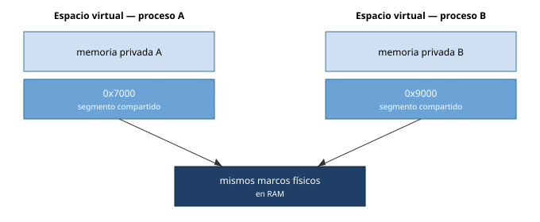

# Gestión de memoria

Para que un programa pueda ejecutarse debe estar **cargado en memoria**. El sistema operativo reparte la memoria entre los procesos, los **aísla** entre sí y mueve información entre la memoria y el almacenamiento secundario.

El tema sigue la evolución histórica: primero, cómo reubicar un programa en cualquier posición de memoria; después, cómo impedir que un proceso acceda a memoria que no le pertenece; por último, cómo la paginación resolvió los problemas de fragmentación.

## Reubicación y protección

Un programa está lleno de direcciones: destinos de saltos, llamadas a funciones, variables globales, punteros. Si se carga en una posición distinta de la prevista, esas direcciones dejan de ser correctas. Estas son las soluciones, de la más sencilla a la más flexible:

### Compilar para una dirección fija

El enlazador (o el ensamblador) genera **direcciones absolutas** suponiendo que el programa empieza siempre en una dirección concreta. Solo funciona si esa zona está libre: un único programa en memoria (monoprogramación).

Ejemplo: los cartuchos de la **Mega Drive** (Sega, 1988; CPU Motorola 68000). La ROM del cartucho aparece siempre a partir de la dirección `0x000000`, así que cada juego se ensambla sabiendo dónde estará cada instrucción y cada variable:

| Dirección | Contenido |
|---|---|
| `0x000000` | Vectores del 68000: pila inicial, dirección de arranque, excepciones |
| `0x000100` | Cabecera del cartucho (`SEGA MEGA DRIVE`, nombre del juego, tamaño de la ROM) |
| `0x000200` | Código del juego (la ROM puede llegar hasta `0x3FFFFF`, 4 MB) |
| `0xC00000` | Chip de vídeo (VDP) |
| `0xFF0000`–`0xFFFFFF` | RAM de trabajo (64 KB) |

Funciona porque solo hay un programa y siempre ocupa la misma posición. Con varios procesos a la vez, que empiezan y terminan, no se sabe qué dirección ocupará cada uno.

### Código independiente de la posición

Si todas las direcciones del programa son **relativas** al contador de programa (PC), el código funciona en cualquier posición: es **código independiente de la posición** (PIC, *Position Independent Code*). Un salto relativo no dice «salta a la dirección `0x1129`», sino «salta 39 bytes hacia atrás».

- El 68000 ya tenía saltos relativos (`bra`) y acceso a datos relativo al PC (`lea tabla(pc),a0`).
- En x86‑64, `call` y `jmp` son relativos, y las variables globales se acceden respecto a `rip``(program counter - PC).


### Reubicar al cargar el programa

Si el ejecutable contiene direcciones absolutas, el **cargador** del SO puede ajustarlas al cargarlo (**reubicación estática**). El ejecutable incluye una **tabla de reubicación** con la posición de cada dirección absoluta y el cargador les suma la dirección de carga:

Ejemplos: los `.EXE` de MS‑DOS (tabla de reubicación en la cabecera), la sección `.reloc` de los ejecutables de Windows y las reubicaciones de ELF en Linux ; incluso un ejecutable PIC (Position Independent Code) tiene tablas de reubicación para los punteros globales.

Una vez cargado, el proceso **no se puede mover**: durante la ejecución guarda direcciones absolutas en registros, en la pila y en variables.

### Reubicar con registros: el 8086

El **hardware** suma una dirección base en cada acceso a memoria (**reubicación dinámica**). El proceso trabaja con **direcciones lógicas**, que empiezan en 0, y el hardware las convierte en **direcciones físicas** sumando la dirección base. El hardware que hace esta traducción se denomina **MMU** (*Memory Management Unit*). En los siguientes apartados la MMU se irá volviendo más compleja.

La dirección base se guarda en el **registro base**, que el SO fija al cargar el proceso. Mover el proceso es fácil: el SO lo copia a la nueva posición y cambia el registro base.

El Intel 8086 (1978) tiene cuatro **registros de segmento**, que hacen de registro base: `CS` (código), `DS` (datos), `SS` (pila) y `ES` (extra).

Esto es **reubicación sin protección**: cualquier proceso puede cargar cualquier valor en un registro de segmento y leer o escribir toda la memoria, incluido el propio sistema operativo. Pensamos en un virus con intenciones malignas, pero también un programa mal implementando puede romper el sistema operativo o incluso nuestro ordenador.

### Proteger con base y límite: el 286

Para proteger el espacio de memoria de los procesos hacen falta dos cosas: (1) registros que indiquen donde empieza (base) su memoria y cuánto ocupa (limite), y (2) que **solo el SO** pueda modificar estos registros (con instrucciones privilegiadas). Cada proceso ocupa una **zona contigua** de memoria delimitada por dos registros:

- **Registro base**: dirección física donde empieza la zona de memoria del proceso. El procesador **suma** este registro a cada dirección lógica para obtener la **dirección física**.
- **Registro límite**: tamaño de la zona. Antes de sumar la base, el procesador comprueba que la dirección lógica sea **menor** que el límite.

El proceso ocupa desde `base` hasta `base + límite`. Por ejemplo, con base 1000 y límite 500 ocupa las direcciones físicas 1000 a 1499: la dirección lógica 200 se traduce a la 1200, pero la dirección lógica 700 supera el límite. Cualquier acceso fuera de su zona genera una **interrupción**; el SO toma el control y normalmente termina el proceso. En UNIX lo hace enviándole la señal `SIGSEGV` (*segmentation fault*), un nombre que viene precisamente de salirse del segmento.

En cada cambio de contexto, el SO carga la base y el límite del proceso que entra, guardados en su PCB (ver [`TEORIA/03`](../03-procesos-e-hilos/)).

<details> <summary> Figura: sin protección y con base y límite </summary>


</details>

<details> <summary> Figura: traducción con registro base y límite </summary>


</details>

El Intel 80286 (1982) lo implementa con el **modo protegido**: base y límite para cada segmento, comprobados por hardware. Los registros de segmento ya no contienen una dirección, sino un **selector**: un índice en una **tabla de descriptores** que solo el SO puede modificar. Cada descriptor guarda:

- **Base** (24 bits: 16 MB de memoria física) y **límite** (segmentos de hasta 64 KB).
- **Permisos**: código o datos, lectura/escritura y **nivel de privilegio** (0 = kernel … 3 = usuario).
- Bit de **presente**: el SO puede sacar un segmento a disco y volver a cargarlo cuando se use.

### El 386: segmentación y paginación

El Intel 80386 (1985) pasa a registros de segmento de 32 bits (segmentos de hasta 4 GB) y añade **paginación** por debajo de la segmentación:

En la práctica **ganó la paginación**: Linux y Windows usan el **modelo plano**, con todos los segmentos con base 0 y límite 4 GB, así que la segmentación no hace nada y toda la gestión se hace con páginas.

Las dos secciones siguientes explican la segmentación y sus problemas; y como la paginación los resuelve.

## Segmentación

Un **segmento** es una zona **contigua** de memoria con su base, su límite y sus permisos.

### Un segmento por proceso

Con registro base y límite en modo protegido, cada proceso es un único segmento. Para cargarlo, el SO necesita un **hueco** libre en el que quepa entero (**asignación contigua**). El SO elige el hueco con una de estas **políticas de asignación**:

- **Primer ajuste** (*first‑fit*): muy eficiente (basta encontrar una zona libre suficiente) y resulta en un aprovechamiento aceptable.
- **Mejor ajuste** (*best‑fit*): la zona libre más pequeña donde quepa el proceso; genera muchos espacios libres pequeños; comprobar cada hueco u ordenarlos por tamaño.
- **Peor ajuste** (*worst‑fit*): el hueco más grande, para no generar huecos pequeños; exige recorrer u ordenar toda la lista de huecos.

<details> <summary> Figura: primer, mejor y peor ajuste </summary>


</details>

#### Crecer y reubicar

Si el proceso necesita más memoria (más heap o más pila) y la zona siguiente está libre, basta con incrementar el registro límite. Pero si la zona está ocupada, el SO tiene que **reubicar** el proceso entero en un hueco donde quepa: lo copia y cambia el registro base. Gracias a la reubicación dinámica el proceso no se entera, pero copiar el proceso entero es lento. Además, el hueco entre el heap y la pila, reservado para que crezcan, ocupa memoria física aunque no se use.

Al entrar y salir procesos de distintos tamaños, la memoria se **fragmenta**:

- **Fragmentación externa**: segmentos de tamaño **variable**; desaprovechamiento del espacio **entre** segmentos. Requiere **compactación** periódica (mover los procesos para eliminar los huecos).
- **Fragmentación interna**: memoria reservada pero sin usar **dentro** de una zona asignada, como el hueco entre el heap y la pila. Aparece sobre todo cuando se asigna en bloques de tamaño fijo (paginación, se verá más adelante).

<details> <summary> Figura: fragmentación externa e interna </summary>


</details>

Debido a la fragmentación puede haber memoria libre suficiente y, aun así, no poder usarse: en la externa, porque ningún hueco contiguo es lo bastante grande; en la interna, porque está reservada dentro de otra zona.

### Código y datos

El proceso se separa en **dos segmentos**, cada uno con su base y su límite:

- **Código**: lectura y ejecución, sin escritura. Un error del programa no puede sobrescribir sus instrucciones.
- **Datos**: lectura y escritura. El (program counter) PC nunca puede saltar a esta zona.

**Ventajas**: Varios procesos que ejecutan el mismo programa pueden **compartir** el segmento de código. Además, cada segmento es más pequeño y es más fácil encontrarle hueco.

### Código, constantes, heap y pila

Con cuatro segmentos, cada parte del proceso tiene sus propios permisos y crece por separado:

| Segmento | Permisos | Crece |
|---|---|---|
| Código | lectura y ejecución | no |
| Constantes | solo lectura | no |
| Heap (datos) | lectura y escritura | hacia direcciones altas |
| Pila | lectura y escritura | hacia direcciones bajas |

El heap y la pila ya no comparten segmento: el hueco entre ambos deja de ocupar memoria física y cada uno puede crecer (o moverse) sin afectar al otro.

### Muchos segmentos

Generalizando, un proceso puede tener tantos segmentos como necesite. Es lo que hace el 286 con su tabla de descriptores de segmento.

La traducción la hace el hardware (la MMU) en cada acceso; el SO solo crea y mantiene las tablas, y en cada cambio de contexto indica a la MMU dónde está la tabla del proceso que entra.


Pero los segmentos siguen siendo **contiguos** y de **tamaño variable**: persiste la fragmentación externa, un segmento grande necesita un hueco grande y hacer crecer un segmento puede obligar a reubicarlo. La paginación resuelve estos problemas con trozos de **tamaño fijo** (páginas) e **indirección**: una tabla indica dónde está cada página en la memoria física.

## Paginación

La memoria lógica y la física se dividen en trozos del mismo **tamaño fijo**: páginas (lógicas) y marcos (físicos). Los apartados siguientes cubren: traducción básica, bits de la tabla de páginas, mejorar velocidad (TLB), reducir espacio (tablas multinivel), paginación bajo demanda, reemplazo de páginas y otros usos del mecanismo.

### Traducción básica

- El trozo de memoria lógica (la del proceso) se denomina **página**; el de memoria física, **marco** (*frame*).
- Al cargar un proceso, sus páginas se colocan en los marcos libres **aunque no estén contiguos**. Se elimina la **fragmentación externa** y la interna se limita al tamaño de página.
- El SO registra los marcos libres (con un mapa de bits o una lista).
- Una **tabla de páginas** por proceso relaciona cada página con el marco en el que se encuentra.

<details> <summary> Figura: páginas cargadas en marcos no contiguos </summary>


</details>

*La paginación divide la memoria lógica y física en trozos del mismo tamaño. Las páginas de un proceso pueden ocupar marcos no contiguos en memoria física.*

<!-- ToDo hablar de los problemas que esto causa en las cachés -->

Las direcciones a memoria se parte en dos campos. El **número de página** se traduce con la tabla de páginas; y el **desplazamiento** dentro de la página/marco no cambia. Con páginas de 2^d bytes, los d bits bajos son el desplazamiento y el resto, el número de página. En 32 bits con páginas de 4 KB: 20 de número de página y 12 bits de desplazamiento.

<details> <summary> Figura: traducción de una dirección con paginación </summary>


</details>

La CPU tiene un **registro base de la tabla de páginas** que apunta a la tabla de páginas del proceso en ejecución. Un cambio de contexto solo tiene que cambiar este registro.

- **Ventajas**: sin fragmentación externa (las páginas no necesitan estar contiguas); permite la **carga parcial** del proceso y es la base de la memoria virtual.
- **Inconvenientes**: más coste de hardware y software (tabla de páginas y traducción en cada acceso), puede tener **fragmentación interna** (páginas reservadas pero no usadas completamente).

### Bits de la tabla de páginas

Cada entrada contiene:

- **Número de marco** correspondiente a esa página.
- **Página válida** (V): si la página no tiene traducción, cualquier acceso genera una excepción (interrupción) y se suele mandar al proceso `SIGSEGV` (aunque se puede utilizar para otros mecanismos, ver más adelante COW y lazzy allocation). El hueco entre el heap y la pila son páginas con V = 0: no ocupan memoria y no hace falta ningún límite para protegerlo.
- **Protección**: bits que especifican los accesos permitidos (lectura, escritura, ejecución).
- **Usuario/kernel**: ¿son páginas del kernel? sólo accesibles en modo kernel
- **Página accedida** (R, referenciada): la MMU lo activa al acceder a una dirección de esa página.
- **Página modificada** (M, *dirty bit*): la MMU lo activa al escribir en una dirección de esa página. R y M se usan en el reemplazo de páginas.
- **Desactivación de caché**: indica que no debe usarse la caché para esa página (por ejemplo, para dispositivos E/S mapeados en memoria).

Las páginas en Linux se ven en `/proc/<pid>/maps`; `/proc/self/maps` muestra las del propio proceso que lo lee, en este caso el propio `cat`:

```console
$ cat /proc/self/maps
55d0c6a00000-55d0c6a02000 r--p 00000000 08:02 1835143   /usr/bin/cat    # cabeceras ELF
55d0c6a02000-55d0c6a07000 r-xp 00002000 08:02 1835143   /usr/bin/cat    # código
55d0c6a07000-55d0c6a09000 r--p 00007000 08:02 1835143   /usr/bin/cat    # constantes
55d0c6a0a000-55d0c6a0b000 rw-p 00009000 08:02 1835143   /usr/bin/cat    # datos
55d0c7b31000-55d0c7b52000 rw-p 00000000 00:00 0         [heap]
7f2e3d828000-7f2e3d9bd000 r-xp 00028000 08:02 1840367   /usr/lib/x86_64-linux-gnu/libc.so.6
...
7ffc1a2e1000-7ffc1a302000 rw-p 00000000 00:00 0         [stack]
```

<!-- 
Cada línea es una región; por ejemplo, la del código:

- `55d0c6a02000-55d0c6a07000`: rango de **direcciones virtuales** (`0x5000` = 5 páginas de 4 KB).
- `r-xp`: permisos de lectura, escritura y ejecución; `p` = privada (copia al escribir), `s` = compartida.
- `00002000`: desplazamiento dentro del fichero donde empieza la región.
- `08:02`: dispositivo que contiene el fichero (*major:minor*).
- `1835143`: número de inodo del fichero.
- `/usr/bin/cat`: fichero mapeado en la región (ver *Mapeo de ficheros*, más abajo). `[heap]` y `[stack]` son memoria **anónima**, sin fichero detrás: desplazamiento, dispositivo e inodo a 0.
-->

### Velocidad: la TLB

Con paginación, cada acceso a memoria necesita **otro acceso** previo para leer la entrada de la tabla de páginas: el programa iría el doble de lento. La **TLB** (*Translation Lookaside Buffer*) es una caché dentro de la MMU con las traducciones usadas más recientemente; si acierta, la MMU no tiene que leer la tabla en memoria.

<details> <summary> Figura: acierto y fallo en la TLB </summary>


</details>

*La TLB evita leer la tabla de páginas en casi todos los accesos.*

- **Tasa de aciertos** (*h*): fracción de accesos que encuentran la traducción página->marco en la TLB. Gracias a la localidad de los programas suele superar el 99 %.
- **Tiempo efectivo de acceso** (TEA), con `t_TLB` el tiempo de consulta de la TLB y `t_mem` el de un acceso a memoria: `TEA = h · (t_TLB + t_mem) + (1 − h) · (t_TLB + 2 · t_mem)`. Con una tasa de aciertos alta, el TEA se acerca a `t_mem`.
- **Cambio de contexto**: Si se **vacía** la TLB con cada cambio de contexto, el proceso que entra empieza con fallos. También se puede dejar la TBL como está y cada entrada se **etiqueta** con un identificador de su proceso, así no hace falta vaciarla y se evitan algunos fallos.

### Espacio: tablas de páginas multinivel

Hay un problema de espacio: con 20 bits de número de página, la tabla tiene 2^20 (1 M) entradas; con 4 bytes por entrada son **4 MB por proceso**, aunque el proceso use poca memoria. Se resuelve con las tablas multinivel.

El x86‑64 usa 48 bits de dirección, que con páginas de 4 KB y entradas de 8 bytes darían 2^36 entradas, la TBL ocuparía **512 GB por proceso**. Además, casi todas las entradas tendrían V = 0 (el hueco entre el heap y la pila).

La solución es partir el número de página en varios **índices** y convertir la tabla en un **árbol**: el primer índice selecciona una entrada del **directorio de páginas**, que apunta a una tabla del siguiente nivel, y así sucesivamente. Si una zona entera no tiene páginas válidas, su entrada en el nivel superior tiene V = 0 y los niveles inferiores **no existen**.

En 32 bits con dos niveles: 10 + 10 + 12 bits. El directorio y cada tabla tienen 1024 entradas de 4 bytes (4 KB, una página) y cada tabla cubre 4 MB de direcciones. Un proceso pequeño necesita el directorio, una tabla para el código y los datos y otra para la pila: 12 KB en lugar de 4 MB.

x86‑64 usa **cuatro niveles**: 9 + 9 + 9 + 9 + 12 = 48 bits; cada tabla tiene 512 entradas de 8 bytes (4 KB). El precio es que un fallo de TLB cuesta un acceso a memoria por nivel, lo que hace la TLB aún más importante.

### Paginación bajo demanda

La **memoria virtual** permite **ejecutar procesos que no caben enteros en memoria principal** y tener **más procesos** cargados. El proceso ve un espacio de direcciones completo (en 32 bits, 2³² = **4 GB**), pero en memoria principal solo están las páginas que usa; el resto está en **memoria secundaria** (disco). Este mecanismo es **transparente** a los procesos.

<!-- 
 -->

Se implementa con **paginación bajo demanda**: el bit V adquiere un segundo significado, la página existe pero **no está en memoria**, sino en disco. Un **paginador perezoso** (*lazy swapper*) solo lleva una página a memoria cuando se hace referencia a ella.

Un **fallo de página** ocurre cuando el proceso accede a una dirección de su espacio cuya página no está en memoria principal (V = 0). La MMU no puede traducirla y lanza una excepción; el **manejador de fallos de página** del SO hace lo siguiente:

1. Comprueba que la dirección pertenece al espacio del proceso. Si no, es un acceso inválido y el proceso recibe una señal (`SIGSEGV`).
2. Busca un marco libre. Si no hay, el **algoritmo de reemplazo** elige una víctima y, si su bit M está activo, la pasa a disco (*page out*).
3. Lee la página del disco al marco (*page in*). Mientras dura esta operación de leer de disco, el proceso queda bloqueado.
4. Actualiza la tabla de páginas: V = 1 y número de marco.
5. Reejecuta la instrucción que falló. El proceso continúa como si el fallo no hubiera ocurrido.

No todos los fallos van a disco. El manejador también puede encontrar la página ya en memoria (por ejemplo, compartida con otro proceso) y solo asignarla, o apuntar a una página especial de **ceros** y reservar una nueva cuando el proceso escriba (ver *Copy‑on‑write*, más abajo).

<details> <summary> Figura: pasos de un fallo de página </summary>


</details>

*Si una página necesaria no está en memoria, el kernel detiene el proceso, la carga desde disco y reejecuta la instrucción del proceso.*

### Reemplazo de páginas

Si no hay marcos libres hay que escoger una **víctima**, moverla a disco (*page out*) y traer la nueva página (*page in*). Los algoritmos se comparan contando los fallos que producen con una misma **secuencia de páginas** a las que accede un proceso.

El más sencillo es **FIFO**: se expulsa la página que lleva más tiempo en memoria (la primera que entró). Es fácil de implementar, pero no tiene en cuenta la localidad temporal: puede expulsar una página que se sigue usando mucho.

<details> <summary> Figura: reemplazo FIFO con 3 marcos </summary>


</details>

- **Óptimo**: expulsa la página que tardará más en volver a usarse. No es implementable (exige conocer el futuro), pero sirve de **referencia** para comparar los demás.
- **LRU** (*Least Recently Used*): expulsa la página que lleva más tiempo sin usarse. Implementarlo de forma exacta exige registrar el orden de **cada** acceso, demasiado caro.
- **Reloj** (segunda oportunidad): aproximación práctica de LRU con el bit R. Los marcos forman una lista circular que se recorre: si la página tiene R = 1, se pone R = 0 y se le da una segunda oportunidad; si tiene R = 0, es la víctima.

### Otros usos del fallo de página

Hasta aquí el fallo de página es un problema que hay que resolver. El SO también lo usa como **herramienta**: marca a propósito páginas como no válidas o de solo lectura y actúa cuando el proceso las toca y se genera una interrupción.

#### Copy‑on‑write

**Copy‑on‑write** (copiar al escribir, COW) :

- Si múltiples procesos piden recursos inicialmente **iguales**, se les devuelven punteros al **mismo** recurso.
- Si un proceso intenta **modificar** su copia, se crea una **copia auténtica** para que sus cambios no sean visibles por los demás. Todo es transparente para los procesos.
- **Ventaja principal**: no se crea ninguna copia adicional si ningún proceso realiza modificaciones.

Cuando un proceso crea una copia de sí mismo (`fork`), las páginas que puedan modificarse se marcan **copy‑on‑write**. Cuando un proceso escribe, el kernel interviene y crea una copia. 

`calloc` puede aprovechar esta estrategia con una única página física de ceros a la que refieren todas las páginas devueltas, marcadas COW; la memoria real no aumenta hasta que se escribe.

<details> <summary> Figura: copy-on-write tras fork </summary>


</details>

#### Mapeo de ficheros: `mmap`

**Mapear** un fichero en memoria es asociar un rango de páginas del proceso a ese **fichero**. Se hace con `mmap` (*memory map*). Así carga el SO el código de los ejecutables.

`mmap` no lee nada del fichero: el kernel solo anota la región en el espacio de direcciones del proceso, con sus páginas como no válidas (V = 0) y asociadas a la parte correspondiente del fichero. Cuando el proceso toca (lee o escribe) una de esas páginas se produce un **fallo de página**, y el SO carga ese trozo del fichero en un marco; con `MAP_SHARED`, las páginas modificadas se marcan como sucias y el SO las escribe de vuelta en el fichero más adelante.

```c
int fd = open("datos.bin", O_RDWR);
char *p = mmap(NULL, 100 * 4096, PROT_READ | PROT_WRITE, MAP_SHARED, fd, 0);
char c = p[8192];   // lee del fichero como si fuera memoria
p[8192] = 'x';      // y escribe en él
```

No solo los ficheros: los **dispositivos de E/S** también se pueden mapear en direcciones de memoria (**E/S mapeada en memoria**), como el chip de vídeo de la Mega Drive en `0xC00000`. Leer o escribir en esas direcciones es leer o escribir en los registros del dispositivo (se verá en [`TEORIA/11`](../11-dispositivos-de-es/)).

#### Memoria compartida

Compartir memoria son entradas de las tablas de páginas de varios procesos que apuntan al **mismo marco** físico: lo que escribe uno lo ve el otro al instante, sin copias ni llamadas al sistema. Cada proceso puede verla en una dirección virtual distinta. Así se comparten:

- **Bibliotecas** como la libc: están una sola vez en memoria física (normalmente como sólo lectura).
- El **código** de varios procesos que ejecutan el mismo programa.
- La **memoria compartida** entre procesos (`shm_open` + `mmap`, ver [`TEORIA/10`](../10-memoria-compartida-y-mutex/)).

<!-- 
 -->

#### Reserva perezosa (*lazy allocation*)

La memoria que pide un proceso no recibe directamente marcos (memoria física): `malloc` solo reserva direcciones virtuales. Pero la primera escritura en página provoca un fallo de página y el kernel le asigna un marco relleno de ceros. Por eso la memoria física del proceso (RSS, *Resident Set Size*) crece a medida que escribe. Ejemplo (`memalloc.c`):

```c
#include <stdio.h>
#include <stdlib.h>
#include <string.h>
#include <unistd.h>
#define MEGABYTE (1024*1024)
#define NUM_BLOQUES 512

int main(int argc, char *argv[]) {
    if (argc != 2) { fprintf(stderr, "Uso: %s <1|2|3>\n", argv[0]); return 1; }
    char *mem[NUM_BLOQUES];
    switch (argv[1][0]) {
    case '1': /* (I)   solo malloc                      -> RSS mínimo (~316 KB) */
        for (int i = 0; i < NUM_BLOQUES; i++) 
            mem[i] = malloc(MEGABYTE);
        break;
    case '2': /* (II)  malloc + tocar 1 byte por bloque -> RSS medio (~2364 KB) */
        for (int i = 0; i < NUM_BLOQUES; i++) { 
            mem[i] = malloc(MEGABYTE); 
            mem[i][MEGABYTE/2] = 0xff; 
        }
        break;
    case '3': /* (III) malloc + escribir todo el bloque -> RSS completo (~524604 KB) */
        for (int i = 0; i < NUM_BLOQUES; i++) { 
            mem[i] = malloc(MEGABYTE); 
            memset(mem[i], 0xff, MEGABYTE); 
        }
        break;
    }
    pause();
    return 0;
}
```

```console
$ gcc memalloc.c -Wall -o memalloc
$ ./memalloc 1 & ./memalloc 2 & ./memalloc 3 &
$ ps -C memalloc -o pid,vsz,rss,args
    PID    VSZ   RSS COMMAND
   4101 528876   316 ./memalloc 1        # (I)   solo malloc
   4102 528876  2364 ./memalloc 2        # (II)  tocando 1 byte por bloque
   4103 528876 524604 ./memalloc 3       # (III) escribiendo todo
$ pkill memalloc                  # mata de golpe los tres
```

Qué está pasando:

- **(I) solo `malloc`**: un bloque de 1 MB supera el umbral de glibc (128 KB), así que `malloc` pide al kernel una región nueva con `mmap`. El kernel solo anota las direcciones virtuales, sin asignar marcos. Lo único que se escribe es la cabecera de `malloc` (16 bytes al inicio del bloque), que ocupa una página por bloque: 512 × 4 KB ≈ 2 MB, más lo que ocupa el propio proceso (código, libc, pila).
- **(II) tocar 1 byte**: `mem[i][MEGABYTE/2]` cae en otra página del bloque, provoca un fallo de página y el kernel le asigna un marco: ≈ 2 MB más que (I). Si se tocase `mem[i][0]` no se notaría, porque cae en la misma página que la cabecera.
- **(III) escribir todo**: `memset` escribe las 256 páginas de cada bloque; cada primera escritura en una página provoca un fallo de página: ≈ 512 MB residentes.

Los tres procesos reservan el mismo espacio virtual (columna VSZ, ≈ 512 MB); la memoria física se asigna página a página, solo cuando se escribe.

<details> <summary> Figura: páginas físicas que usa memalloc </summary>


</details>

---

Más detalle (modelos y esquemas de gestión de memoria, particiones MFT, tablas de páginas, segmentación y segmentación paginada, intercambio de procesos completos, reinicio de la instrucción tras un fallo de página, otros algoritmos de reemplazo y anomalía de Belady): [`material_adicional.md`](material_adicional.md).
