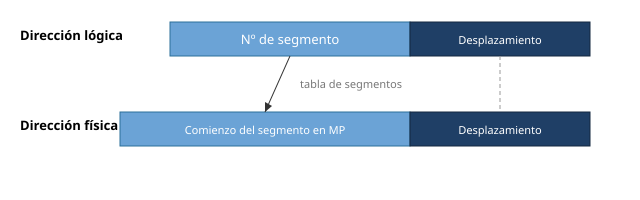
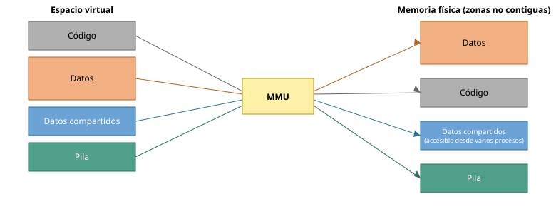
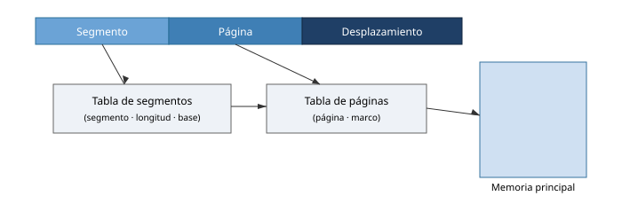

# Gestión de memoria: material adicional

## Modelos de gestión de la memoria

| Eje | Opciones |
|-----|----------|
| Uniprogramado / Multiprogramado | 1 / más de 1 programa en memoria a la vez |
| Residente / No residente | La información ha de estar en memoria toda la ejecución, o no |
| Inmóvil / Móvil | La traducción de dirección lógica a física es siempre la misma, o cambia |
| Contigua / No contigua | Las direcciones lógicas contiguas son físicas contiguas, o no |
| Entero / No entero | El programa ha de estar completo en memoria física para ejecutarse, o no |

## Esquemas de gestión de memoria

Máquina desnuda · monitor monolítico o residente · asignación particionada contigua · asignación particionada no contigua · paginación · segmentación · segmentación paginada · paginación segmentada · memoria virtual.

- **Máquina desnuda**: la forma más sencilla; no existe gestor, el usuario controla toda la memoria.
- **Monitor monolítico o residente**: el SO ocupa una zona fija (RAM baja o ROM) y necesita **protección** frente a los programas de usuario.
- **Sistema monoprogramado**: memoria dividida entre el SO (parte en ROM, parte en RAM, a veces con los controladores de dispositivos) y un único programa de usuario.

## MFT: asignación de particiones

- Asignación con particiones **homogéneas**: una única cola; se asigna la primera zona disponible. Problemas: **fragmentación interna** y programas demasiado grandes.
- Asignación con particiones **heterogéneas**: una única cola (primera zona en la que quepa el proceso) o varias colas (la zona en la que se desaproveche menos espacio).

## Tabla de descripción de particiones

Ejemplo con el SO en `0K–100K` y 1000K de memoria:

| Nº de partición | Base | Tamaño | Estado |
|---|---|---|---|
| 0 | 0K | 100K | ASIGNADA |
| 1 | 100K | 300K | LIBRE |
| 2 | 400K | 100K | ASIGNADA |
| 3 | 500K | 250K | ASIGNADA |
| 4 | 700K | 150K | ASIGNADA |
| 5 | 900K | 100K | LIBRE |

## Gestión de la memoria disponible

| Mapa de bits | Lista de libres |
|--------------|-----------------|
| Sencillo; ocupa poco espacio | Organizada por zonas libres y ocupadas |
| Difícil/costoso encontrar huecos | Fácil encontrar huecos, pero costosa de construir |

## Tablas de páginas de usuario y de sistema

La MMU usa **dos** tablas de páginas: una de **usuario** (direcciones del espacio de usuario) y una del **sistema** (direcciones del espacio del sistema, usables solo en modo privilegiado).

El mecanismo de traducción de direcciones (**DAT**, *Dynamic Address Translation*) es el nombre clásico de esta traducción hardware.

## Responsabilidades

| Hardware | Sistema operativo |
|----------|-------------------|
| Traducción de direcciones lógicas a físicas | Resolución de problemas |
| Detección de problemas: fallo de página, acceso inválido, falta de privilegios | Gestión del espacio libre/ocupado |

## Segmentación

Los procesos se dividen en **segmentos** de longitud distinta, nunca superior al **tamaño máximo de segmento** de la arquitectura. Segmentos habituales: **código**, **datos**, **pila**. Cada segmento se almacena en una zona cuyo tamaño coincide con el del segmento, y no necesariamente de forma consecutiva. Se evita la fragmentación interna pero **no la externa** (aunque menor que con MVT); requiere **compactación**.

- La **dirección lógica** = número de segmento + desplazamiento dentro del segmento.
- La **dirección física** = dirección de comienzo del segmento en MP + desplazamiento.
- Al cargar el proceso se le asignan tantas zonas como segmentos tenga y se rellena la **tabla de segmentos**. La **protección** se realiza según el **límite** del segmento.

Ventajas e inconvenientes: el control de acceso se realiza con **bits de acceso** en la tabla de segmentos; **soporta el crecimiento dinámico** de los segmentos. Inconvenientes: requiere **compactación**; algunos procesos pueden necesitar un segmento mayor que el límite.

Vista de la traducción por la MMU (segmentos dispersos en la memoria física, datos compartidos):

## Segmentación paginada

Combina lo mejor de la paginación y la segmentación:

- **Segmentación**: soporte directo a las regiones del proceso.
- **Paginación**: mejor aprovechamiento de la memoria y base para la memoria virtual.

Un segmento está formado por un **conjunto de páginas** y no tiene que estar contiguo. La dirección lógica = **número de segmento + número de página dentro del segmento + desplazamiento dentro de la página**. La MMU usa una **tabla de segmentos** en la que cada entrada apunta a una **tabla de páginas**.

## Paginación segmentada

Consiste en segmentar las tablas de páginas adecuándolas al tamaño del programa; cada página se divide en segmentos. **No se emplea.**

## Intercambio de procesos completos

Antes de la paginación, el **intercambio** (*swapping*) movía procesos enteros entre la memoria principal y el dispositivo de swap.

- Cuando no caben todos los procesos activos, se elige un proceso residente y se copia su imagen a swap (*swap out*). El criterio de selección puede considerar la **prioridad**, el **tamaño de su mapa de memoria**, el **tiempo que lleva ejecutando** y su **estado**. Se intenta expulsar procesos **bloqueados**.
- Un proceso expulsado tarde o temprano vuelve a MP (*swap in*). Solo se recargan procesos **listos para ejecutar**, cuando hay memoria disponible o cuando llevan cierto tiempo expulsados. **No debe expulsarse** un proceso mientras realiza operaciones de E/S.
- Al **desalojar** un proceso se copia toda su imagen ejecutable a memoria secundaria; al **realojar** en memoria primaria, la imagen se copia sobre el nuevo bloque asignado por el gestor de memoria.
- Sin hardware de reubicación, el intercambio sería difícil por el problema del enlazado de direcciones; con él, se copia la imagen a la nueva memoria y se carga el registro de reubicación.
- Los sistemas de tiempo compartido usan intercambio para dar servicio equitativo en un sistema sobrecargado: cuando el número de usuarios activos supera cierto umbral, el gestor de memoria empieza a intercambiar. El efecto lo percibe el usuario como un **incremento del tiempo de respuesta**.

## Reinicio de la instrucción tras un fallo de página

El fallo se produce al **obtener una instrucción**, al **leer los operandos** o al **escribir los resultados**. Soluciones:

- Interrumpir la ejecución, guardar el estado, solucionar, restaurar el estado y continuar.
- Eliminar la instrucción, solucionar y reejecutarla.

## Otros algoritmos de reemplazo

| Algoritmo | Comentario |
|-----------|-----------|
| **Óptimo** | Sustituye la página que tardará más en usarse. **No implementable** (no se conoce el futuro); sirve de referencia para comparar |
| **LRU** (*Least Recently Used*) | Sustituye la que hace más tiempo que no se usa; se aproxima al óptimo. Excelente algoritmo; difícil de implementar |
| **NRU** (*Non Recently Used*) | Se basa en los bits de modificado (M) y referencia (R); orden de preferencia para expulsar: `¬R,¬M > ¬R,M > R,¬M > R,M`; en empate, FIFO. Simple y bastante eficiente |
| **Segunda oportunidad** | Mejora sobre FIFO: si el bit R está a 1, la página se coloca al final de la cola en lugar de elegirla |
| **Envejecimiento** (*aging*) | Cada página tiene un número de `n` bits; se elige la de número más bajo. En cada ciclo de reloj: `valor = (R << n) + (valor_actual >> 1)`. Muy eficiente, se aproxima a LRU |

## Anomalía de Belady

Muestra que, con **FIFO**, es posible tener **más fallos de página al aumentar el número de marcos**. Referencia: L. A. Belady, R. A. Nelson, G. S. Shedler, «An anomaly in space‑time characteristics of certain programs running in a paging machine», *Communications of the ACM* 12(6):349‑353, junio de 1969.

Secuencia de peticiones `1, 2, 3, 4, 1, 2, 5, 1, 2, 3, 4, 5` con FIFO:

| Nº de marcos | Fallos de página |
|--------------|------------------|
| **3** | **9** |
| **4** | **10** |

Con 3 marcos (`PF` = fallo, `X` = acierto):

| Ref | 1 | 2 | 3 | 4 | 1 | 2 | 5 | 1 | 2 | 3 | 4 | 5 |
|-----|---|---|---|---|---|---|---|---|---|---|---|---|
| m1 | 1 | 1 | 1 | 4 | 4 | 4 | 5 | 5 | 5 | 5 | 5 | 5 |
| m2 |   | 2 | 2 | 2 | 1 | 1 | 1 | 1 | 1 | 3 | 3 | 3 |
| m3 |   |   | 3 | 3 | 3 | 2 | 2 | 2 | 2 | 2 | 4 | 4 |
|    | PF | PF | PF | PF | PF | PF | PF | X | X | PF | PF | X |

Con 4 marcos:

| Ref | 1 | 2 | 3 | 4 | 1 | 2 | 5 | 1 | 2 | 3 | 4 | 5 |
|-----|---|---|---|---|---|---|---|---|---|---|---|---|
| m1 | 1 | 1 | 1 | 1 | 1 | 1 | 2 | 3 | 4 | 5 | 1 | 2 |
| m2 |   | 2 | 2 | 2 | 2 | 2 | 3 | 4 | 5 | 1 | 2 | 3 |
| m3 |   |   | 3 | 3 | 3 | 3 | 4 | 5 | 1 | 2 | 3 | 4 |
| m4 |   |   |   | 4 | 4 | 4 | 5 | 1 | 2 | 3 | 4 | 5 |
|    | PF | PF | PF | PF | X | X | PF | PF | PF | PF | PF | PF |
