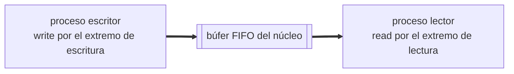

# IPC: pipes y fifos

Práctica asociada: [`PRACTICA/03`](../../PRACTICA/03-pipes-y-fifos/).

## Contenidos

- Comunicación entre procesos por tuberías.
- Pipes (tuberías sin nombre): `pipe()`, comunicación entre procesos emparentados,
  extremos de lectura y escritura.
- FIFOs (tuberías con nombre): `mkfifo()`, comunicación entre procesos no emparentados.
- Redirección de una pipe a la E/S estándar (`dup2`).
- Lecturas y escrituras bloqueantes y no bloqueantes.
- Atención a varios canales: `select()`.

## Esquema de una pipe

Detalle en la práctica: [`PRACTICA/03`](../../PRACTICA/03-pipes-y-fifos/).

## Material

_(pendiente de añadir)_
