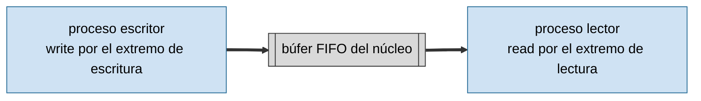
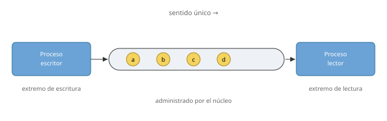
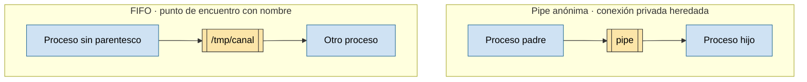

# IPC: pipes y fifos

Práctica asociada: [`PRACTICA/03`](../../PRACTICA/03-pipes-y-fifos/).

## Contenidos

- Comunicación entre procesos por tuberías.
- Pipes (tuberías sin nombre): `pipe()`, comunicación entre procesos emparentados, extremos de lectura y escritura.
- FIFOs (tuberías con nombre): `mkfifo()`, comunicación entre procesos no emparentados.
- Redirección de una pipe a la E/S estándar (`dup2`).
- Lecturas y escrituras bloqueantes y no bloqueantes.
- Atención a varios canales: `select()`.

## Esquema de una pipe

Una pipe funciona como un tubo neumático de sentido único administrado por el núcleo: un proceso introduce una secuencia de bytes por el extremo de escritura y otro la recibe, en el mismo orden, por el extremo de lectura.

*Una pipe es un canal unidireccional administrado por el núcleo: un proceso escribe una secuencia de bytes y otro la lee.*

## Pipelines de shell

La shell conecta la salida estándar de un programa con la entrada del siguiente (mediante `dup2` sobre los extremos de una pipe), formando herramientas complejas a partir de programas sencillos.

*La shell conecta la salida estándar de un programa con la entrada del siguiente, formando herramientas complejas a partir de programas sencillos.*

## Pipe anónima frente a FIFO con nombre

Las pipes anónimas conectan procesos emparentados que heredan los descriptores. Una FIFO posee un nombre en el sistema de ficheros y permite conectar procesos que no comparten parentesco.

*Las pipes se usan normalmente entre procesos emparentados. Una FIFO posee un nombre y permite conectar procesos que no comparten parentesco.*

Detalle en la práctica: [`PRACTICA/03`](../../PRACTICA/03-pipes-y-fifos/). Figuras catalogadas en [`TEORIA/IMAGENES.md`](../IMAGENES.md).
