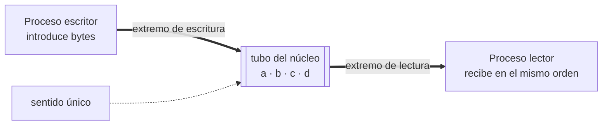

# IPC: pipes y fifos

Práctica asociada: [`PRACTICA/03`](../../PRACTICA/03-pipes-y-fifos/).

## Contenidos

- Comunicación entre procesos por tuberías.
- Pipes (tuberías sin nombre): `pipe()`, comunicación entre procesos emparentados,
  extremos de lectura y escritura.
- FIFOs (tuberías con nombre): `mkfifo()`, comunicación entre procesos no emparentados.
- Redirección de una pipe a la E/S estándar (`dup2`).
- Lecturas y escrituras bloqueantes y no bloqueantes.
- Atención a varios canales: `select()`.

## Esquema de una pipe

Detalle en la práctica: [`PRACTICA/03`](../../PRACTICA/03-pipes-y-fifos/).

## Galería visual complementaria

### T07.1 · Una pipe como tubo neumático

*Una pipe es un canal unidireccional administrado por el núcleo: un proceso escribe una secuencia
de bytes y otro la lee.*

### T07.2 · Una pipeline de shell

*La shell conecta la salida estándar de un programa con la entrada del siguiente, formando
herramientas complejas a partir de programas sencillos.*

### T07.3 · Pipe anónima frente a FIFO con nombre

*Las pipes se usan normalmente entre procesos emparentados. Una FIFO posee un nombre y permite
conectar procesos que no comparten parentesco.*

## Material

Las figuras complementarias de este tema están incluidas en la galería anterior y catalogadas en
[`TEORIA/IMAGENES.md`](../IMAGENES.md).
