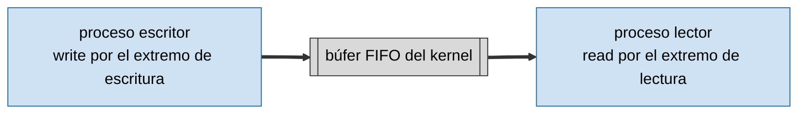
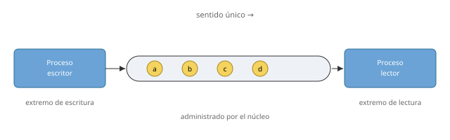
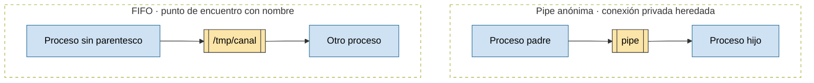
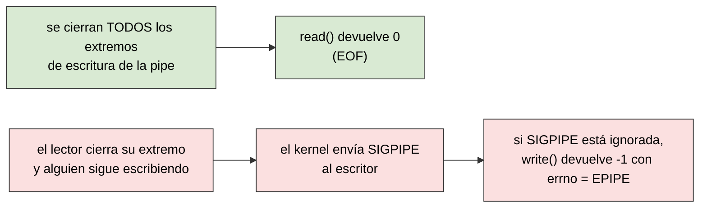
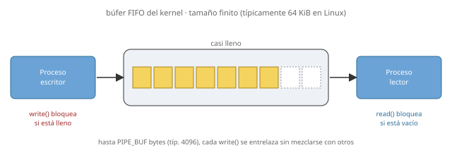
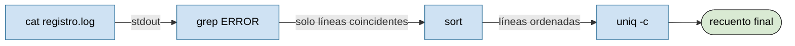
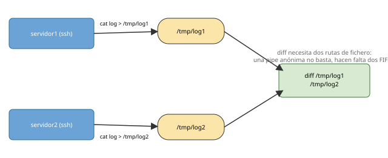

# IPC: pipes y fifos

## Contenidos

- Comunicación entre procesos como flujo de bytes, sin fronteras de mensaje.
- Pipes anónimas: `pipe()`, herencia de descriptores con `fork()`, cierre del extremo que no se usa.
- FIFOs con nombre: `mkfifo()`, un fichero especial persistente que conecta procesos sin parentesco.
- Fin de flujo (`EOF`) y ruptura de la tubería (`SIGPIPE` / `EPIPE`).
- Lectura y escritura bloqueantes; atomicidad garantizada por `PIPE_BUF`.
- E/S no bloqueante (`fcntl`, `O_NONBLOCK`) y atención a varios canales con `select`.
- Pipelines de la shell (`|`) y redirección de descriptores (`dup`, `dup2`).
- Casos reales: cuándo conviene una pipe y cuándo hace falta una FIFO.

## Esquema de una pipe



Una pipe funciona como un tubo de sentido único: un proceso introduce una secuencia de bytes por el extremo de escritura y otro proceso las puede leer  en el mismo orden por el extremo de lectura. Las pipes las crean los procesos y las administra el kernel.



## Pipe anónima frente a FIFO con nombre

Las pipes anónimas conectan procesos emparentados que heredan los descriptores: la pipe se crea **antes** del `fork()` para que padre e descendientes puedan comunicarse por la pipe. Por el contrario, una FIFO, posee un nombre en el sistema de ficheros (`mkfifo()`) y permite conectar procesos que no comparten parentesco ni se lanzaron desde el mismo programa: solo necesitan conocer la misma ruta.



*Las pipes se usan normalmente entre procesos emparentados. Por el contrario, una FIFO posee un nombre y permite conectar procesos que no comparten parentesco.*

`pipe()` crea el par de descriptores antes del `fork()`; cada proceso cierra el extremo que no usa y se comunica por el otro:

```c
#include <stdio.h>
#include <unistd.h>

int fds[2];
pipe(fds);                    /* fds[0] lectura, fds[1] escritura */
if (fork() == 0) {
    close(fds[1]);             /* el hijo no escribe */
    char mensaje[32];
    int n = read(fds[0], mensaje, sizeof(mensaje));
    mensaje[n] = '\0';
    printf("me llega: %s\n", mensaje);
    close(fds[0]);
    exit(0);
} else {
    close(fds[0]);              /* el padre no lee */
    char mensaje[] = "Hola Mundo";
    write(fds[1], mensaje, sizeof(mensaje));
    close(fds[1]);
    exit(0);
}
```

Una FIFO se manipula como un fichero (`open`, `read`, `write`, `close`), pero no almacena bytes en disco: `ls -l` la marca con el tipo `p` y su tamaño no refleja los datos en tránsito. Al ser persistente en el sistema de ficheros, hay que borrarla explícitamente (`unlink` / `rm`) cuando ya no se necesita.

El segundo argumento de `mkfifo`, `0660`, son los permisos habituales de Unix (como en `chmod`): tres cifras octales para propietario, grupo y resto, cada una suma de lectura (4), escritura (2) y ejecución (1). `0660` da lectura y escritura (`6` = 4+2) al propietario y al grupo, y nada (`0`) al resto; la ejecución no tiene sentido en una FIFO.

Proceso escritor:

```c
#include <stdio.h>
#include <fcntl.h>
#include <sys/stat.h>
#include <unistd.h>

mkfifo("/tmp/canal", 0660);
int fp = open("/tmp/canal", O_WRONLY);   /* bloquea hasta que alguien la abra a lectura */
char mensaje[] = "Hola Mundo";
write(fp, mensaje, sizeof(mensaje));     /* sizeof incluye el '\0' final */
close(fp);
```

Proceso lector:

```c
#include <stdio.h>
#include <fcntl.h>
#include <unistd.h>

int fp = open("/tmp/canal", O_RDONLY);   /* bloquea hasta que alguien la abra a escritura */
char mensaje[32];
int n = read(fp, mensaje, sizeof(mensaje));
mensaje[n] = '\0';
printf("%s\n", mensaje);
close(fp);
```

## Cierre de extremos, EOF y SIGPIPE

Cada proceso cierra el descriptor que no va a usar.



Un lector recibe **EOF** (`read()` devuelve `0`) cuando el kernel comprueba que ya no queda ningún extremo de escritura abierto. Es la única forma fiable de detectar que la comunicación ha terminado, y por eso cada proceso debe cerrar explícitamente el extremo que no usa: un extremo de escritura olvidado abierto (aunque nadie escriba por él) basta para que el lector nunca vea el EOF y se quede bloqueado en `read()`.

Si en cambio es el lector quien desaparece y alguien sigue escribiendo, el kernel envía al escritor la señal `SIGPIPE`. Por defecto esa señal termina el proceso que estaba escribiendo (más adelante en el curso veremos cómo cambiar el comportamiento ante una señal).

## Bloqueo y atomicidad: `PIPE_BUF`

El búfer del kernel es finito (típicamente 64 KiB en Linux). `read` y `write` son **bloqueantes** por defecto: leer de una pipe vacía bloquea hasta que haya datos; escribir en una pipe llena bloquea hasta que se libere espacio. `PIPE_BUF` (típicamente 4096 bytes) es el tamaño máximo que se escribe de forma **atómica**: si varios procesos escriben a la vez en la misma pipe y cada `write()` no supera `PIPE_BUF`, sus bytes no se entremezclan.




## Pipelines de shell

La shell conecta la salida estándar de un programa con la entrada del siguiente, formando herramientas complejas a partir de programas sencillos.



Este diagrama es literalmente el pipeline de un único comando de terminal:

```bash
cat registro.log | grep ERROR | sort | uniq -c
```

Cuatro procesos, tres pipes anónimas. La shell hace `fork()` una vez por cada comando y, en cada hijo, antes del `exec`, cierra la entrada estándar (descriptor 0) y la sustituye con `dup2()` por el extremo de lectura de la pipe que lo conecta con el proceso anterior; simétricamente redirige su salida estándar (descriptor 1) al extremo de escritura de la pipe que lo conecta con el siguiente. El primer y el último comando conservan su entrada o salida estándar originales (el teclado y la pantalla del terminal), salvo que además se usen `<` o `>`.

```c
#include <unistd.h>
int dup(int oldfd);             /* duplica oldfd sobre el descriptor libre más bajo */
int dup2(int oldfd, int newfd); /* duplica oldfd sobre newfd, cerrándolo antes si estaba abierto */
```

Ambas devuelven el nuevo descriptor, o `-1` si hay error. `dup2` es la que se usa para redirigir E/S estándar: a diferencia de `dup`, fija de antemano qué número de descriptor va a tener la copia (`STDIN_FILENO` o `STDOUT_FILENO` en este caso).

```c
if (fork() == 0) {                      /* hijo: por ejemplo "grep ERROR" */
    dup2(fd_entrada[0], STDIN_FILENO);  /* la entrada estándar viene de la pipe anterior */
    close(fd_entrada[0]);               /* dup2 ya cerró STDIN_FILENO antes de duplicar */
    execlp("grep", "grep", "ERROR", NULL);
}
```

## Pipelines de ejemplo

Son comandos que se pueden probar en un terminal Linux.

**1. Filtrar un listado**

```bash
ls -lh | grep '^d'
```

`ls -lh` produce una línea por entrada; `grep '^d'` deja solo las que empiezan por `d` en la columna de permisos, es decir, los directorios.

**2. Buscar el PID de un proceso**

```bash
ps -eo pid,comm | grep firefox
```

`ps -eo pid,comm` lista el PID y el nombre de cada proceso; `grep` se queda con las líneas de Firefox. Al pedirle a `ps` solo el nombre corto del programa (`comm`), en vez de la línea de comandos completa, el propio `grep` no aparece en el resultado: su nombre de proceso es `grep`, no `firefox`.

**3. Generar una contraseña al azar**

```bash
cat /dev/urandom | tr -dc 'A-Za-z0-9' | head -c 16
```

`/dev/urandom` es un flujo infinito de bytes aleatorios; `cat` lo vuelca a su salida estándar, `tr -dc` se queda solo con los caracteres alfanuméricos y `head -c 16` corta el flujo en cuanto tiene 16. 

**4. Preguntarle a una API y parsear JSON**

```bash
curl -s https://api.github.com/users/torvalds | jq '.name, .public_repos'
```

`curl` descarga el JSON del perfil público de Linus Torvalds en GitHub y `jq` extrae del JSON el nombre y los repositorios públicos.

**5. Ver el progreso de una copia grande**

```bash
tar cf - directorio_grande | pv | dd of=/mnt/usb/backup.tar bs=1M
```

`tar` empaqueta el directorio hacia su salida estándar; `pv`, intercalado en medio del pipeline, deja pasar los bytes sin tocarlos pero muestra la velocidad y el total transferido en tiempo real; `dd` recibe ese mismo flujo ya monitorizado y lo escribe en el disco de destino.

Se puede simplificar así:

```bash
tar cf - directorio_grande | pv > /mnt/usb/backup.tar
```

## Cuatro usos ejemplos con FIFO

**1. Un chat de juguete entre dos terminales**

```bash
# terminal A
mkfifo /tmp/chat
cat > /tmp/chat
# terminal B
cat < /tmp/chat
```

`cat > /tmp/chat` abre la FIFO para escritura y se queda esperando; en cuanto `cat < /tmp/chat` la abre para lectura en el otro terminal, ambas llamadas se desbloquean y lo que se teclee en A aparece en B. Es la versión mínima de "dos procesos sin parentesco hablando entre sí".

**2. Descomprimir sin tocar el disco**

```bash
mkfifo /tmp/datos
zcat archivo.csv.gz > /tmp/datos &
wc -l /tmp/datos
```

`zcat` descomprime en segundo plano hacia la FIFO; `wc -l` la abre como si fuera un fichero normal y cuenta las líneas del CSV ya descomprimido, sin que el contenido intermedio llegue a escribirse en disco. Útil con programas que solo aceptan una **ruta de fichero** como argumento y no saben leer de la entrada estándar: la FIFO les hace creer que existe un fichero real.

**3. Comparar log de 2 servidores sin descargarlos**

```bash
mkfifo /tmp/log1 /tmp/log2
ssh servidor1 cat /var/log/syslog > /tmp/log1 &
ssh servidor2 cat /var/log/syslog > /tmp/log2 &
diff /tmp/log1 /tmp/log2
```



*`diff` necesita dos rutas de fichero como argumentos: una pipe anónima solo tiene un extremo de lectura, así que hacen falta dos FIFOs para comparar dos flujos en directo.*

**4. Controlar un reproductor multimedia**

```bash
curl -LO https://download.blender.org/peach/bigbuckbunny_movies/BigBuckBunny_320x180.mp4

mkfifo /tmp/vlc
vlc --loop --control rc --rc-fifo=/tmp/vlc BigBuckBunny_320x180.mp4
```

Desde otra terminal podemos controlar el reproductor VLC

```bash
echo "rate 2"   > /tmp/vlc   # el doble de velocidad
echo "rate 1"   > /tmp/vlc   # velocidad normal
echo "rate 0.5" > /tmp/vlc   # a cámara lenta
```

`--rc-fifo` le dice a VLC que, además de reproducir el vídeo, abra esa FIFO y la lea como control remoto (`rc`); `rate X` es una de esas órdenes, y cambia la velocidad de reproducción.

<!--
**5. retransmisor TCP**

```bash
mkfifo /tmp/backpipe
nc -l 8080 < /tmp/backpipe | nc destino.ejemplo.com 80 > /tmp/backpipe
```

Un retransmisor TCP minimalista entre el puerto 8080 local y `destino.ejemplo.com:80`. Hay dos flujos que van en sentidos opuestos y solo un `|` disponible, así que uno de los dos viaja por la pipe normal y el otro necesita la FIFO:

- Lo que llega al `nc -l 8080` desde el cliente sale por su stdout y entra, por la pipe normal (`|`), en el stdin del segundo `nc`, que lo reenvía a `destino.ejemplo.com:80`.
- Lo que responde `destino.ejemplo.com:80` sale por el stdout del segundo `nc` y se redirige (`>`) a `/tmp/backpipe`; el primer `nc` la lee como su stdin (`<`) y la devuelve al cliente que sigue conectado en el puerto 8080.

La FIFO hace de "tubería de vuelta": una pipe anónima solo tiene un extremo de lectura y uno de escritura fijos, así que no le sirve a este segundo flujo en sentido contrario.

Para probarlo: con el túnel corriendo, `curl http://localhost:8080/` desde otra terminal debería devolver la respuesta de `destino.ejemplo.com`.
-->

## Pipe o FIFO: ¿cuál usar?

| | Pipe anónima | FIFO |
|---|---|---|
| Parentesco | Procesos emparentados (heredan descriptores tras `fork`) | Cualquier proceso, sin relación previa |
| Identificación | Ninguna, solo descriptores heredados | Ruta en el sistema de ficheros |
| Persistencia | Desaparece con el último proceso que la usa | Persiste hasta `unlink`/`rm`, aunque nadie la use |
| Uso típico | Pipelines de shell, comunicación padre-hijo | Demonios y clientes independientes, "fingir" un fichero ante un programa que lo exige |


<details> <summary> no bloqueantes y select (opcional) </summary>

## E/S no bloqueante: `fcntl` y `O_NONBLOCK`

```c
#include <fcntl.h>
int fcntl(int fd, int cmd, ...);
```

`fcntl` consulta o modifica las propiedades de un descriptor ya abierto. Con `F_GETFL` se leen las banderas actuales y con `F_SETFL` se fijan; entre ellas, `O_NONBLOCK` convierte las llamadas bloqueantes en no bloqueantes.

```c
int banderas = fcntl(fd, F_GETFL);
fcntl(fd, F_SETFL, banderas | O_NONBLOCK);
```

Con `O_NONBLOCK` activo, `read()` sobre una pipe vacía devuelve `-1` con `errno = EAGAIN` en lugar de bloquear, y `write()` hace lo mismo si no hay espacio (o si es una FIFO sin lector). Sirve para que un proceso vigile varias tuberías sin quedarse detenido esperando en una sola.

## Atender varios canales: `select`

```c
#include <sys/select.h>
int select(int nfds, fd_set *readfds, fd_set *writefds,
           fd_set *errorfds, struct timeval *timeout);
```

`select` bloquea hasta que al menos uno de los descriptores vigilados está listo (o vence `timeout`; con `NULL` espera indefinidamente), y así un solo proceso puede atender varias pipes o FIFOs sin recorrerlas una a una con lecturas no bloqueantes.

- `nfds`: el descriptor más alto a vigilar, más uno.
- `readfds` / `writefds` / `errorfds`: conjuntos de descriptores a vigilar para lectura, escritura y errores.
- Al retornar, `select` modifica los conjuntos dejando solo los descriptores con actividad: hay que reconstruirlos antes de cada llamada.

Macros para manejar `fd_set`: `FD_ZERO(&s)` vacía el conjunto, `FD_SET(fd, &s)` añade un descriptor, `FD_CLR(fd, &s)` lo quita, `FD_ISSET(fd, &s)` comprueba tras `select` si tuvo actividad.

```c
fd_set lectura;
FD_ZERO(&lectura);
FD_SET(fd1, &lectura);
FD_SET(fd2, &lectura);
select(maximo + 1, &lectura, NULL, NULL, NULL);
if (FD_ISSET(fd1, &lectura)) { /* fd1 tiene datos */ }
```
</details>