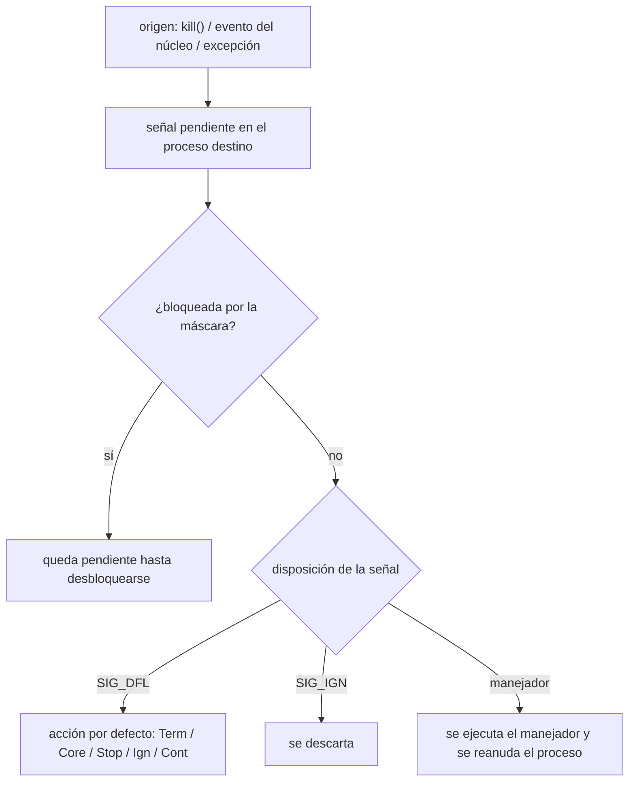

# IPC: señales

Práctica asociada: [`PRACTICA/04`](../../PRACTICA/04-senales/).

## Contenidos

- Concepto de señal: forma limitada de IPC en sistemas POSIX.
- Señales estándar y su significado (`SIGINT`, `SIGTERM`, `SIGKILL`, `SIGCHLD`,
  `SIGUSR1`/`SIGUSR2`, `SIGSTOP`/`SIGCONT`…).
- Envío de señales: `kill()`, `raise()`.
- Manejo de señales: `signal()` frente a `sigaction()`. Acción por defecto, ignorar,
  capturar.
- Máscara de señales, señales pendientes y bloqueadas.
- Espera de señales: `pause()`, `sleep()`, `sigsuspend()`.

## Entrega de una señal

Detalle y tabla de señales: [`PRACTICA/04`](../../PRACTICA/04-senales/).

## Material

_(pendiente de añadir)_
