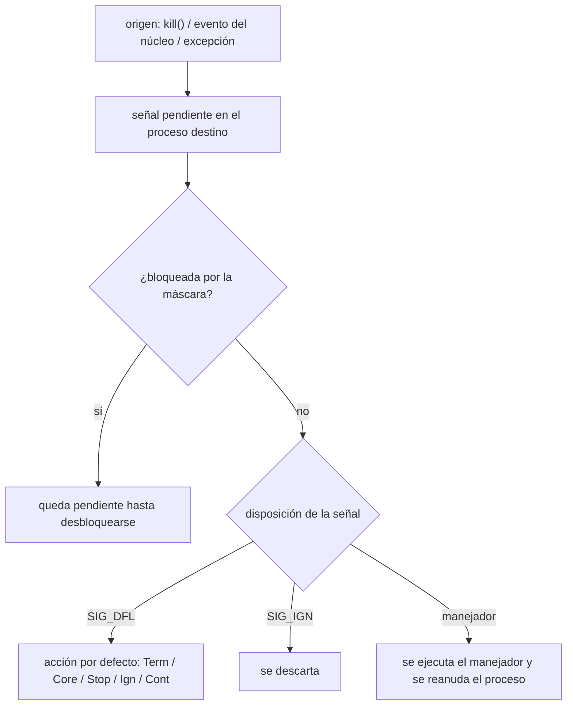
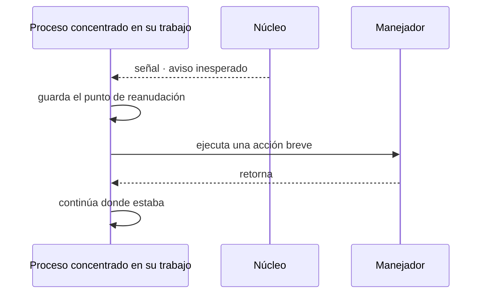
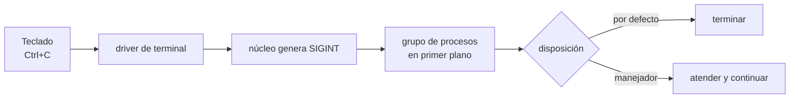
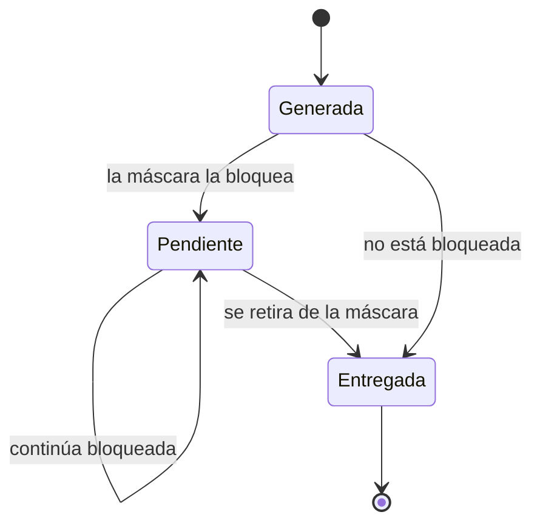
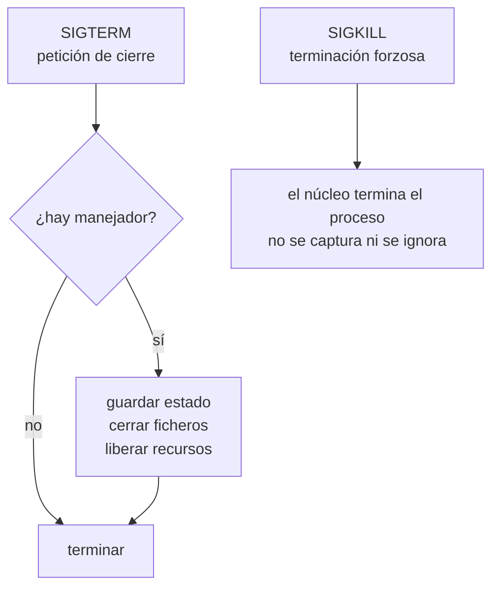

# IPC: señales

Práctica asociada: [`PRACTICA/04`](../../PRACTICA/04-senales/).

## Contenidos

- Concepto de señal: forma limitada de IPC en sistemas POSIX.
- Señales estándar y su significado (`SIGINT`, `SIGTERM`, `SIGKILL`, `SIGCHLD`,
  `SIGUSR1`/`SIGUSR2`, `SIGSTOP`/`SIGCONT`…).
- Envío de señales: `kill()`, `raise()`.
- Manejo de señales: `signal()` frente a `sigaction()`. Acción por defecto, ignorar,
  capturar.
- Máscara de señales, señales pendientes y bloqueadas.
- Espera de señales: `pause()`, `sleep()`, `sigsuspend()`.

## Entrega de una señal

Detalle y tabla de señales: [`PRACTICA/04`](../../PRACTICA/04-senales/).

## Galería visual complementaria

### T08.1 · Una señal como aviso asíncrono

*Una señal no transporta un flujo de datos: notifica de forma asíncrona que ha ocurrido un
determinado evento.*

### T08.2 · De `Ctrl+C` a `SIGINT`

*Al pulsar `Ctrl+C`, el terminal solicita al núcleo que envíe `SIGINT` al grupo de procesos en
primer plano.*

### T08.3 · Señal bloqueada y pendiente

*Bloquear una señal no implica necesariamente descartarla: puede permanecer pendiente hasta que
la máscara permita su entrega.*

### T08.4 · `SIGTERM` frente a `SIGKILL`

*`SIGTERM` permite que el proceso responda y libere recursos. `SIGKILL` no puede capturarse ni
ignorarse y provoca su terminación inmediata.*

## Material

Las figuras complementarias de este tema están incluidas en la galería anterior y catalogadas en
[`TEORIA/IMAGENES.md`](../IMAGENES.md).
