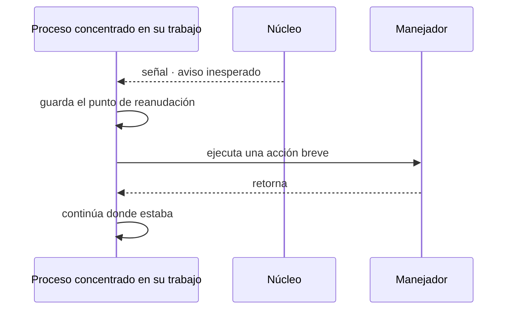
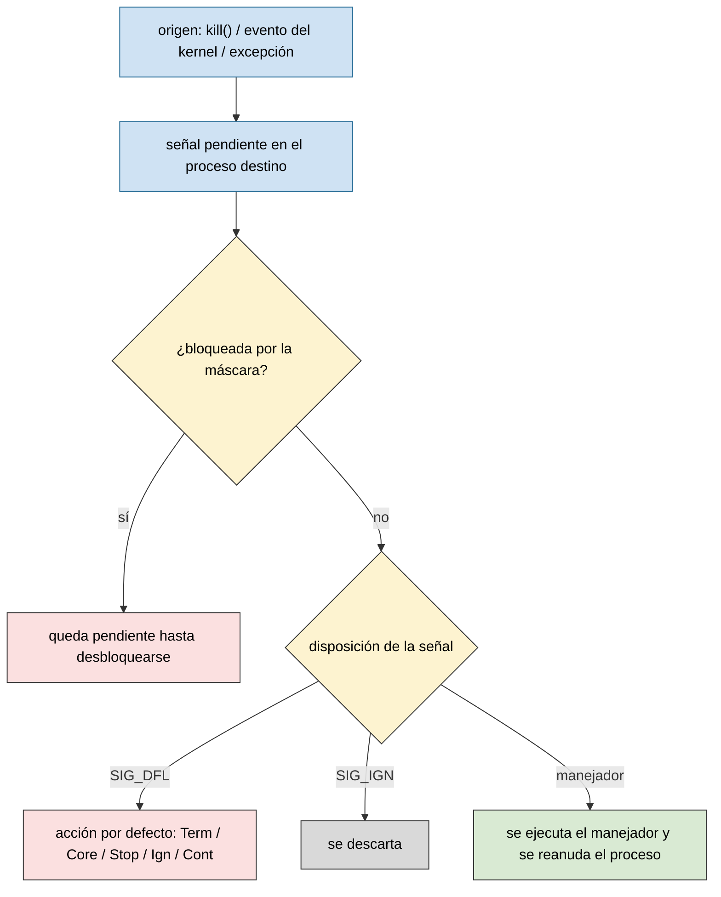
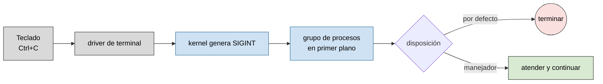
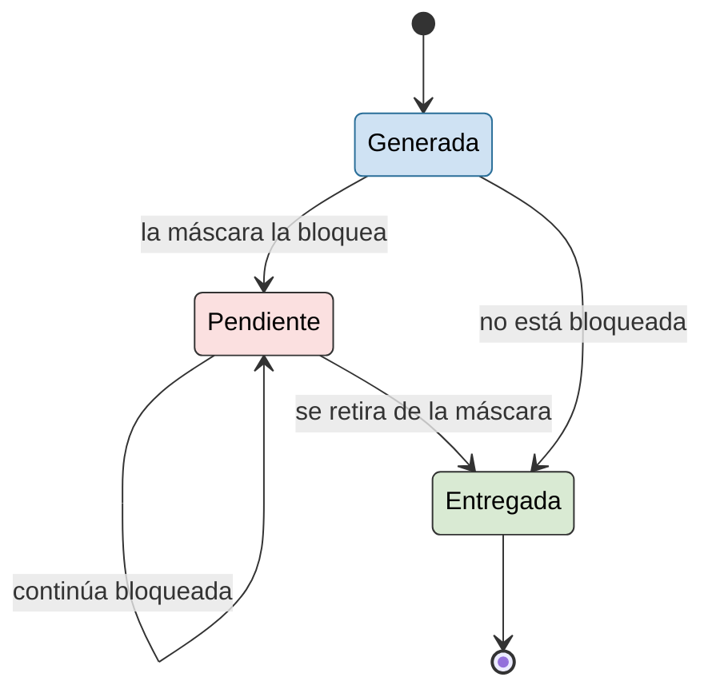
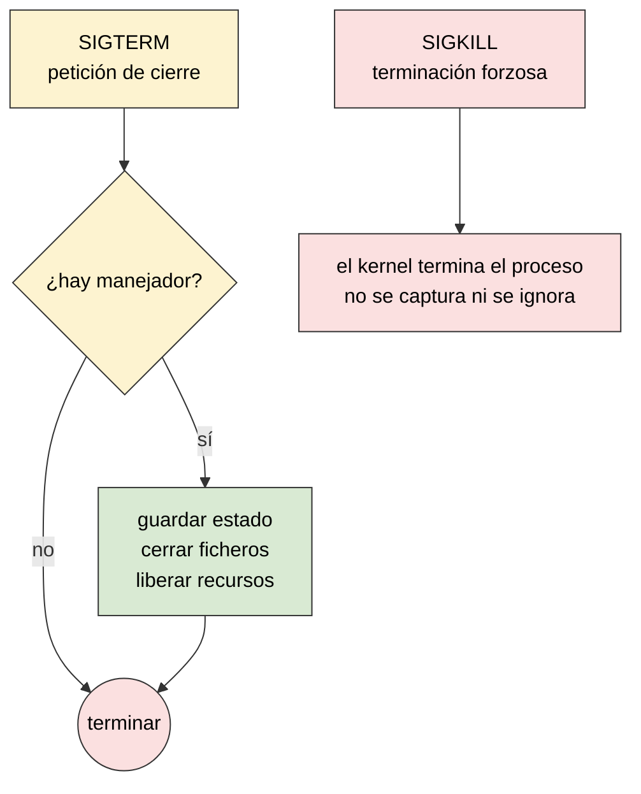
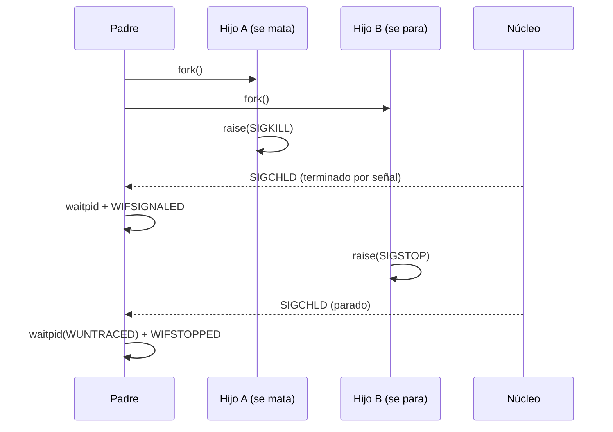

# IPC: señales

Práctica asociada: [`PRACTICA/04`](../../PRACTICA/04-senales/).

## Contenidos

- Concepto de señal: forma limitada de IPC en sistemas POSIX.
- Origen de una señal: excepción hardware, evento del kernel u otro proceso (`kill`).
- Señales estándar, su acción por defecto y cuáles se pueden capturar o ignorar.
- Envío de señales desde bash: `kill`, `killall`, `pkill`, `trap`.
- Envío de señales: `kill()`, `raise()`.
- Manejo de señales: `signal()` frente a `sigaction()`. Acción por defecto, ignorar, capturar.
- Máscara de señales, señales pendientes y bloqueadas.
- Espera de señales: `pause()`, `sleep()`, `sigsuspend()`.
- Ejemplo: distinguir con `SIGCHLD` si un hijo ha muerto o solo se ha parado.

## Concepto de señal

Una señal no transporta un flujo de datos: notifica de forma asíncrona que ha ocurrido un determinado evento. El proceso interrumpe lo que está haciendo, ejecuta una acción breve (el manejador) y continúa donde estaba.



*Una señal no transporta un flujo de datos: notifica de forma asíncrona que ha ocurrido un determinado evento.*

Una señal puede originarse en tres sitios distintos:

- **Una excepción del hardware**: la CPU detecta una división por cero o un acceso a memoria inválido y el kernel la traduce en `SIGFPE` o `SIGSEGV` para el proceso que la causó.
- **Un evento que detecta el kernel**: un hijo termina (`SIGCHLD`), se agota un temporizador (`SIGALRM`), se escribe en una tubería sin lectores (`SIGPIPE`).
- **Otro proceso, o el propio proceso**, mediante `kill()` o `raise()` — o el usuario, tecleando `Ctrl+C` o ejecutando `kill` desde la shell.

En los tres casos, el proceso destino la recibe de la misma forma: no distingue si el aviso viene del hardware, del kernel o de otro proceso.

## Tabla de señales

| Señal | Valor | Acción por defecto | ¿Capturable? |
|-------|-------|--------------------|--------------|
| `SIGHUP`  | 1  | Term | Sí |
| `SIGINT`  | 2  | Term | Sí |
| `SIGQUIT` | 3  | Core | Sí |
| `SIGILL`  | 4  | Core | Sí |
| `SIGFPE`  | 8  | Core | Sí |
| `SIGKILL` | 9  | Term | **No** |
| `SIGSEGV` | 11 | Core | Sí |
| `SIGPIPE` | 13 | Term | Sí |
| `SIGALRM` | 14 | Term | Sí |
| `SIGTERM` | 15 | Term | Sí |
| `SIGUSR1` | 10 | Term | Sí |
| `SIGUSR2` | 12 | Term | Sí |
| `SIGCHLD` | 17 | Ign  | Sí |
| `SIGCONT` | 18 | Cont | Sí |
| `SIGSTOP` | 19 | Stop | **No** |
| `SIGTSTP` | 20 | Stop | Sí |

Acciones por defecto: **Term** (terminar), **Ign** (ignorar), **Core** (terminar + volcado de memoria), **Stop** (detener), **Cont** (continuar si estaba parado). Más información: `man 7 signal`.

`SIGKILL` y `SIGSTOP` son las únicas señales que **no** se pueden capturar, bloquear ni ignorar: el kernel necesita un mecanismo que funcione siempre, incluso si el proceso tiene un manejador con errores, está en bucle infinito o simplemente decide ignorar todo lo demás. El resto de señales, aunque tengan una acción por defecto drástica (como `Core` o `Term`), admiten instalar un manejador propio — capturar `SIGSEGV` o `SIGFPE` es técnicamente posible, pero no hay garantía de poder continuar la ejecución con normalidad tras el fallo que las originó.

## Entrega de una señal



## De `Ctrl+C` a `SIGINT`

Al pulsar `Ctrl+C`, el *driver* de terminal solicita al kernel que envíe `SIGINT` al grupo de procesos en primer plano.



*Al pulsar `Ctrl+C`, el terminal solicita al kernel que envíe `SIGINT` al grupo de procesos en primer plano.*

## Señal bloqueada y pendiente

Bloquear una señal no implica necesariamente descartarla: puede permanecer pendiente hasta que la máscara permita su entrega.



*Bloquear una señal no implica necesariamente descartarla: puede permanecer pendiente hasta que la máscara permita su entrega.*

Las señales **no se acumulan**: si una señal ya está pendiente y llega otra igual antes de desbloquearse, solo queda registrada una vez. Por eso un manejador de `SIGCHLD` no puede asumir "una señal, un hijo": si terminan varios hijos casi a la vez, puede que solo llegue un único `SIGCHLD` para todos ellos, y el manejador debe recogerlos todos en un bucle en lugar de asumir que hay exactamente uno esperando.

## `SIGTERM` frente a `SIGKILL`

`SIGTERM` permite que el proceso responda y libere recursos. `SIGKILL` no puede capturarse ni ignorarse y provoca su terminación inmediata.



*`SIGTERM` permite que el proceso responda y libere recursos. `SIGKILL` no puede capturarse ni ignorarse y provoca su terminación inmediata.*

## Enviar señales desde bash

```bash
kill -l                       # lista los nombres de señal disponibles
kill -TERM 1234                # o kill -15 1234: pide un cierre ordenado
kill -9 1234                    # SIGKILL por número: terminación forzosa
kill -STOP 1234                  # lo detiene, como Ctrl+Z pero sin terminal
kill -CONT 1234                   # lo reanuda
killall firefox                    # a todas las instancias por nombre
pkill -f "python.*servidor"          # por patrón de línea de comandos
```

`kill` sin más opciones envía `SIGTERM`. El nombre puede darse con o sin el prefijo `SIG` (`kill -TERM` o `kill -SIGTERM`); el número es la alternativa cuando el nombre no está disponible en el script.

Un script de bash también puede instalar su propio "manejador" con `trap`:

```bash
#!/bin/bash
trap 'echo "interrumpido, limpiando..."; rm -f /tmp/lock; exit 1' SIGINT SIGTERM

touch /tmp/lock
sleep 100
rm -f /tmp/lock
```

`trap` funciona igual que instalar un manejador en C: al recibir `SIGINT` o `SIGTERM` mientras el script está en el `sleep`, se interrumpe, se ejecuta el bloque de limpieza y se sale con código `1`, en vez de dejar `/tmp/lock` huérfano.

## Capturar señales en C: `signal()`

```c
#include <stdio.h>
#include <signal.h>
#include <unistd.h>

void manejador(int senal) {
    printf("recibida la señal %d, sigo vivo\n", senal);
}

int main(void) {
    signal(SIGUSR1, manejador); //también vale signal(SIGUSR1, &manejador);
    for (;;) {
        pause();               /* duerme hasta que llegue cualquier señal */
    }
}
```

El manejador se instala **una sola vez**; no hace falta reinstalarlo tras cada señal recibida. Se prueba desde otra terminal con `kill -USR1 <pid>`.

## Captura avanzada: `sigaction()`

`signal()` basta para casos simples, pero su comportamiento exacto varía entre sistemas Unix (qué otras señales se bloquean mientras corre el manejador, si hay que reinstalarlo, etc.). `sigaction()` sustituye esa ambigüedad por un control explícito:

```c
struct sigaction {
    void     (*sa_handler)(int);
    sigset_t   sa_mask;      /* señales que se bloquean mientras se ejecuta el manejador */
    int        sa_flags;
};
```

- `sa_mask`: además de la propia señal, qué otras quedan bloqueadas durante el manejador.
- `sa_flags` (OR de las que interesen): `SA_RESTART` (reinicia automáticamente la llamada al sistema interrumpida por la señal), `SA_NOCLDSTOP` (con `SIGCHLD`, no generar la señal cuando un hijo se para o se reanuda, solo cuando termina), `SA_NODEFER` (no bloquear la propia señal mientras se atiende).

`SA_NOCLDSTOP` es la pieza clave para `SIGCHLD`: por defecto (sin ese flag) el kernel manda `SIGCHLD` tanto si un hijo **termina** como si se **para** (`SIGSTOP`) o se **reanuda** (`SIGCONT`); activando `SA_NOCLDSTOP`, solo se avisa de la terminación.

## Ejemplo: distinguir con `SIGCHLD` si un hijo ha muerto o se ha parado

Dos hijos, cada uno con un desenlace distinto: uno se mata a sí mismo y el otro se para a sí mismo. El padre instala un único manejador de `SIGCHLD` con `sigaction` y usa `waitpid` para averiguar, en cada aviso, cuál de las dos cosas ha pasado.



```c
#include <stdio.h>
#include <stdlib.h>
#include <unistd.h>
#include <signal.h>
#include <sys/wait.h>

void manejador_sigchld(int senal) {
    int estado;
    pid_t pid;
    while ((pid = waitpid(-1, &estado, WNOHANG | WUNTRACED)) > 0) {
        if (WIFEXITED(estado)) {
            printf("[padre] hijo %d terminó con código %d\n", pid, WEXITSTATUS(estado));
        } else if (WIFSIGNALED(estado)) {
            printf("[padre] hijo %d murió por la señal %d\n", pid, WTERMSIG(estado));
        } else if (WIFSTOPPED(estado)) {
            printf("[padre] hijo %d se ha parado por la señal %d\n", pid, WSTOPSIG(estado));
        }
    }
}

int main(void) {
    struct sigaction accion = {0};
    accion.sa_handler = manejador_sigchld;
    sigemptyset(&accion.sa_mask);
    accion.sa_flags = SA_RESTART;      /* sin SA_NOCLDSTOP: también avisa de paradas */
    sigaction(SIGCHLD, &accion, NULL);

    pid_t hijo_muere = fork();
    if (hijo_muere == 0) {
        sleep(1);
        raise(SIGKILL);                /* el hijo se mata a sí mismo */
    }

    pid_t hijo_para = fork();
    if (hijo_para == 0) {
        sleep(2);
        raise(SIGSTOP);                /* el hijo se para a sí mismo */
        pause();
        exit(0);
    }

    sleep(3);
    printf("[padre] termino; el hijo %d sigue parado, lo mato\n", hijo_para);
    kill(hijo_para, SIGKILL);
    sleep(1);
    return 0;
}
```

**Un error habitual, que parece un fallo del sistema y no lo es**: si el manejador llama a `waitpid(-1, &estado, WNOHANG)` sin `WUNTRACED`, el `SIGCHLD` de la parada **llega igualmente** (mientras no se active `SA_NOCLDSTOP`), pero `waitpid` no devuelve nada para el hijo parado — porque por defecto `waitpid` solo informa de terminaciones. Sin `WUNTRACED` parece que el programa no distingue muerte de parada; en realidad falta pedirlo explícitamente con ese flag.

## Espera de señales

```c
#include <unistd.h>
#include <signal.h>

unsigned int sleep(unsigned int segundos);   /* espera o hasta recibir una señal */
int pause(void);                             /* bloquea hasta recibir una señal */
int sigsuspend(const sigset_t *mask);        /* sustituye la máscara y espera, atómico */
```

`pause()` y `sigsuspend()` son la forma correcta de esperar una señal sin **espera activa** (sin hacer un bucle comprobando una variable una y otra vez). En variables compartidas con el manejador se usa `volatile sig_atomic_t`, el único tipo cuyo acceso está garantizado como atómico frente a una señal.

Figuras catalogadas en [`TEORIA/IMAGENES.md`](../IMAGENES.md).
